# 一. 认识小程序开发

---

## 1. 什么是小程序？

- 小程序是什么呢？
  - 小程序（`Mini Program`）是一种不需要下载安装即可使用的应用，它实现了“触手可及”的梦想，使用起来方便快捷，用完即走
  - 事实上，目前小程序在我们生活中已经随处可见（特别是这次疫情的推动，不管是什么岗位、什么年龄阶段的人，都哪都需要打开健康码）
  - 所以对于小程序的基本认识和特点，我们就不再赘述了
- 最初我们提到小程序时，往往指的是微信小程序：
  - 但是目前小程序技术本身已经被各个平台所实现和支持
  - 待会儿我们也会聊到它的技术特点以及为什么这些平台想要支持小程序技术
- 那么目前常见的小程序有哪些呢？
  - 微信小程序、支付宝小程序、淘宝小程序、抖音小程序、头条小程序、QQ小程序、美团小程序等等

## 2. 各个平台小程序的时间线

- 各个平台小程序大概的发布时间线：
  - **2017年1月 微信小程序上线**，依附于微信App
  - 2018年7月 百度小程序上线，依附于百度App
  - 2018年9月 支付宝程序上线，依附于支付宝App
  - 2018年10月 抖音小程序上线，依附于抖音App
  - 2018年11月 头条小程序上线，依附于头条App
  - 2019年5月 QQ小程序上线，依附于QQApp
  - 2019年10月 美团小程序上线，依附于美团App

## 3. 各个平台为什么都需要支持小程序呢？

- 第一：你有，我也得有
  - 大厂竞争格局中一个重要的一环
- 第二：小程序作为介于 `H5` 页面 和 `App` 之间的一项技术，它有自身很大的优势
  - 体验比传统 `H5` 页面要好很多
  - 相当于传统的 `App`，使用起来更加方便，不需要在应用商店中下载安装，甚至注册登录等麻烦的操作
- 第三：小程序可以间接的动态为 `App` 添加新功能
  - 传统的 `App` 更新需要先打包，上架到应用商店之后需要通过审核（`App Store`）
  - 但是小程序可以在 `App` 不更新的情况下，动态为自己的应用添加新的功能需求
- 那么目前在这么多小程序的竞争格局中，哪一个是使用最广泛的呢？ 
  - 显然是微信小程序，目前支付宝、抖音小程序也或多或少有人在使用
  - 其实我们透过小程序看本质，他们本身还是应用和平台之间的竞争，有最大流量入口的平台，对应的小程序也是用户更多一些
  - 目前在公司开发小程序主要开发的还是微信小程序，其他平台的小程序往往是平台本身的一些公司或者顺手开发的
- 所以重点学习的一定是微信小程序开发

## 4. 小程序由谁来开发？

- 首先，我们确定一下小程序的定位是怎么样的呢？
  - 介于原生 `App` 和手机 `H5` 页面之间的一个产品定位
  
- 那么，由此我们也会产生一个疑惑：小程序是由谁来开发呢？ 
  - 难道搞出一个《小程序开发工程师》？ 
  - 由谁开发事实上是由它的技术特点所决定的，比如微信小程序 `WXML`、`WXSS`、`js`
  - 它更接近于我们前端的开发技术栈，所以小程序都是由我们前端来开发的
  
- 也就是说呢，你想要成为一个前端工程师或者找一份前端的工作，小程序是你必须学会的

  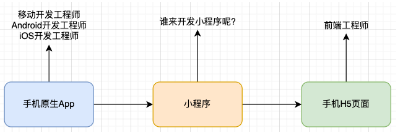

## 5. 小程序与普通网页开发的区别

- 小程序的主要开发语言是 `js` ，小程序的开发同普通的网页开发相比有很大的相似性。对于前端开发者而言，从网页开发迁移到小程序的开发成本并不高，但是二者还是有些许区别的

- **网页开发渲染线程 和 脚本线程是互斥的，这也是为什么长时间的脚本运行可能会导致页面失去响应**

- 而**在小程序中，二者是分开的，分别运行在不同的线程中**

- 网页开发者可以使用到各种浏览器暴露出来的 `DOM API`，进行  `DOM` 选中和操作

- 而如上文所述，**小程序的逻辑层和渲染层是分开的，逻辑层运行在 `JSCore` 中**，**小程序中并没有一个完整浏览器对象，因而缺少相关的 `DOM API` 和 `BOM API`**。这一区别导致了前端开发非常熟悉的一些库，例如  `jQuery`、`Zepto` 等，在小程序中是无法运行的

- **同时 `JSCore` 的环境同  `NodeJS` 环境也是不尽相同，所以一些 `NPM` 的包在小程序中也是无法运行的**

- 网页开发者需要面对的环境是各式各样的浏览器，`PC` 端需要面对 `IE`、`Chrome`、`QQ` 浏览器等，在移动端需要面对 `Safari`、`Chrome` 以及 `iOS`、`Android` 系统中的各式 `WebView`

- 而小程序开发过程中需要面对的是两大操作系统 `iOS` 和 `Android` 的微信客户端，以及用于辅助开发的小程序开发者工具，小程序中三大运行环境也是有所区别的，如下所示：

  | 运行环境         | 逻辑层   | 渲染层              |
  | ---------------- | -------- | ------------------- |
  | iOS              | `JSCore` | `WKWebVie`          |
  | 安卓             | `V8`     | `chromium` 定制内核 |
  | 小程序开发者工具 | `NWJS`   | `Chrome WebView`    |

- 网页开发者在开发网页的时候，只需要使用到浏览器，并且搭配上一些辅助工具或者编辑器即可。小程序的开发则有所不同，需要经过申请小程序帐号、安装小程序开发者工具、配置项目等等过程方可完成

# 二. 小程序开发选择

---

## 1.开发小程序的技术选型

- 原生小程序开发：
  - 微信小程序：https://developers.weixin.qq.com/miniprogram/dev/framework/
    - 主要技术包括：`WXML`、`WXSS`、`js`
  - 支付宝小程序：https://opendocs.alipay.com/mini/developer
    - 主要技术包括：`AXML`、`ACSS`、`js`
- 选择框架开发小程序：
  - `mpvue`（已不再维护和更新）
    - `mpvue` 是一个使用 `Vue` 开发小程序的前端框架，也是支持微信小程序、百度智能小程序，头条小程序和支付宝小程序
    - 该框架在2018年之后就不再维护和更新了，所以目前已经被放弃
  - `wepy`（低维护状态）
    - `wepy` (发音: /'wepi/)是由腾讯开源的，一款让小程序支持组件化开发的框架，通过预编译的手段让开发者可以选择自己喜欢的开发风格去开发小程序
    - 该框架目前维护的也较少，在前两年还有挺多的项目在使用，不推荐使用

## 2. uni-app  和 taro

- `uni-app`： 
  - 由 `DCloud团队` 开发和维护
  - `uni-app` 是一个使用 `Vue` 开发所有前端应用的框架，开发者编写一套代码，可发布到iOS、Android、Web（响应式）、以及各种小程序（微信/支付宝/百度/头条/飞书/QQ/快手/钉钉/淘宝）、快应用等多个平台
  - `uni-app` 目前是很多公司的技术选型，特别是希望适配移动端 `App` 的公司
- `taro`：
  - 由 `京东团队` 开发和维护
  - `taro` 是一个开放式 跨端 跨框架 解决方案，支持使用 `React/Vue/Nerv` 等框架来开发 微信/京东/百度/支付宝/字节跳动/QQ/飞书小程序/H5/RN等应用
  - `taro` 因为本身支持 `React`、`Vue` 的选择，给了我们更加灵活的选择空间
    - 特别是在 `Taro3.x` 之后，支持 `Vue3`、`React Hook` 写法等
  - `taro['tɑ:roʊ]`，泰罗·奥特曼，宇宙警备队总教官，实力最强的奥特曼
- `uni-app` 和 `taro` 开发原生 `App`：
  - 无论是适配原生小程序还是原生 `App`，都有较多的适配问题，所以你还是需要多了解原生的一些开发知识
  - 产品使用体验整体相较于原生 `App` 差很多
  - 也有其他的技术选项来开发原生 `App`：`ReactNative(RN)`、`Flutter`

# 三. 小程序开发前准备

---

## 1. 需要掌握的预备知识

- 小程序的核心技术主要是三个：
  - 页面布局：`WXML`，类似 `HTML`
  - 页面样式：`WXSS`，几乎就是 `CSS` （某些不支持，某些进行了增强如 `rpx`，但是基本是一致的）
  - 页面脚本：`js` + `WXS(WeixinScript) `
  
  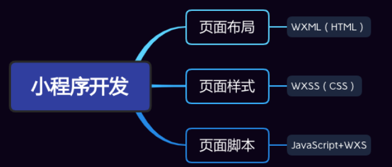

- 如果你之前已经掌握了 `Vue` 或者 `React` 等框架开发，那么学习小程序是更简单的
  - 因为里面的核心思想都是一致的（比如组件化开发、数据响应式、 `mustache` 语法、事件绑定等等）

## 2. 注册账号 – 申请AppID

- 注册账号：申请 `AppID`
  - 接入流程：https://mp.weixin.qq.com/cgi-bin/wx
  
  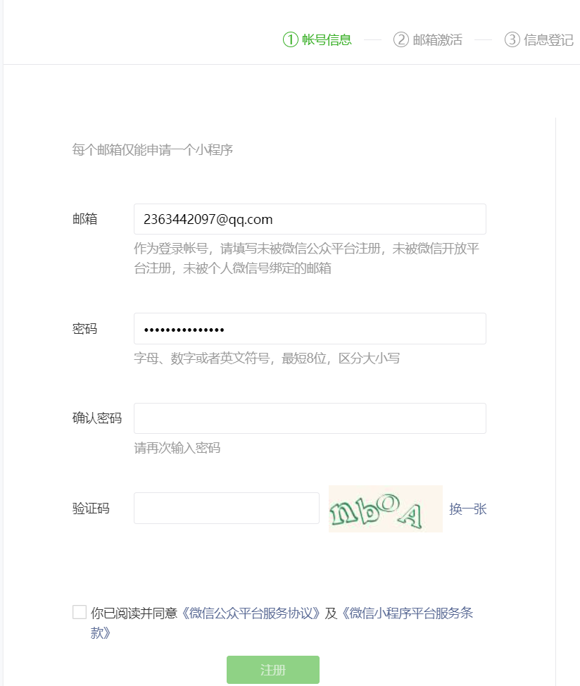

## 3. 下载小程序开发工具

- 小程序的开发工具：

  - 微信开发者工具：官方提供的开发工具，必须下载、安装
  - `VSCode`：很多人比较习惯使用 `VSCode` 来编写代码

- 微信开发者工具下载地址：

  - https://developers.weixin.qq.com/miniprogram/dev/devtools/download.html

  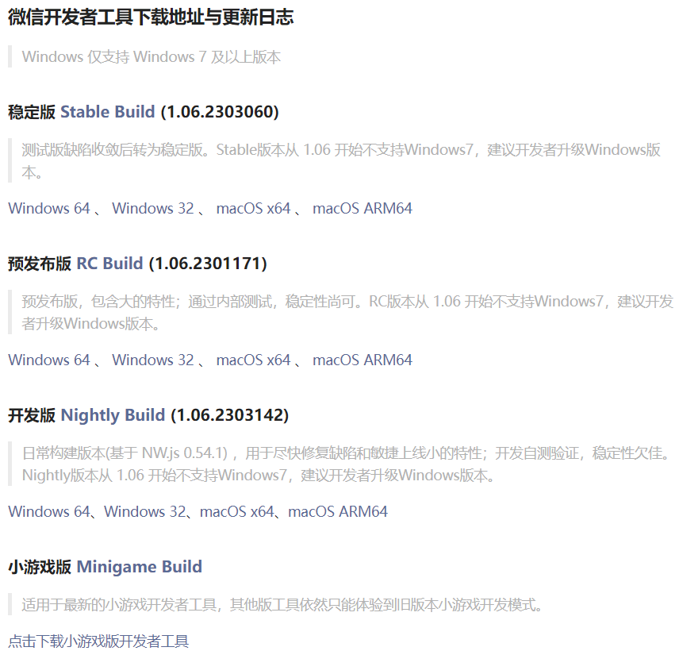

## 3. 使用 VSCode 开发

- 推荐一些插件：

  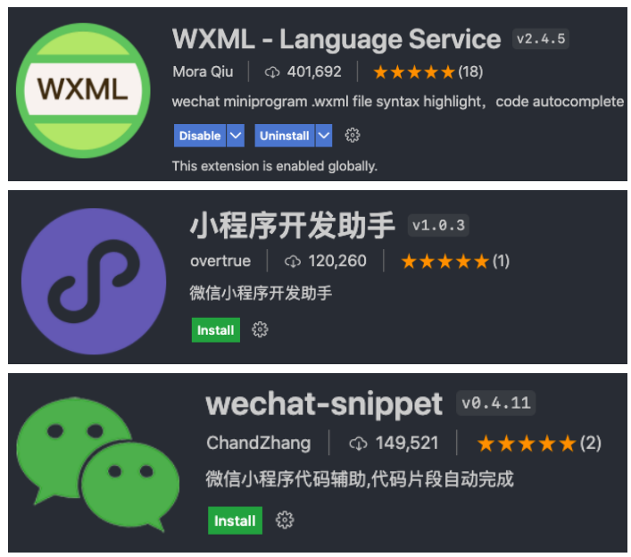

## 4. 创建小程序项目

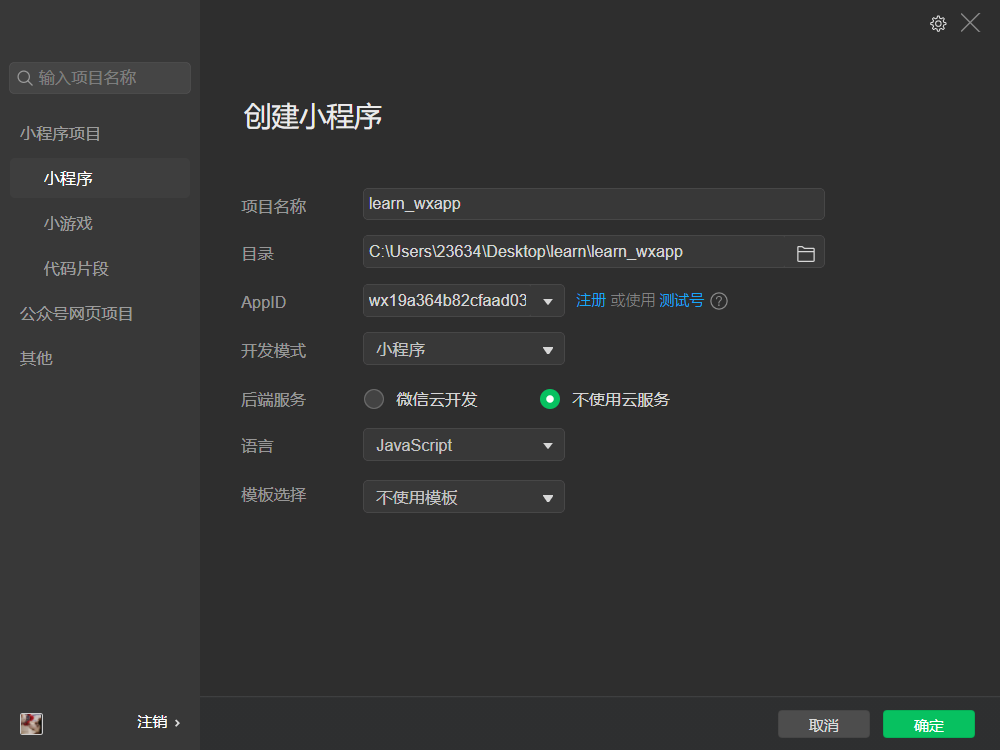

## 5. 开发工具的解析

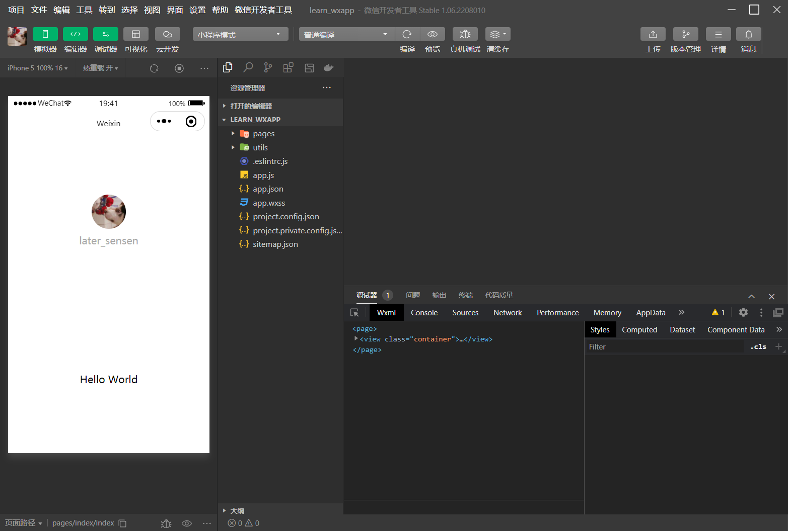

# 四. 小程序目录的结构

---

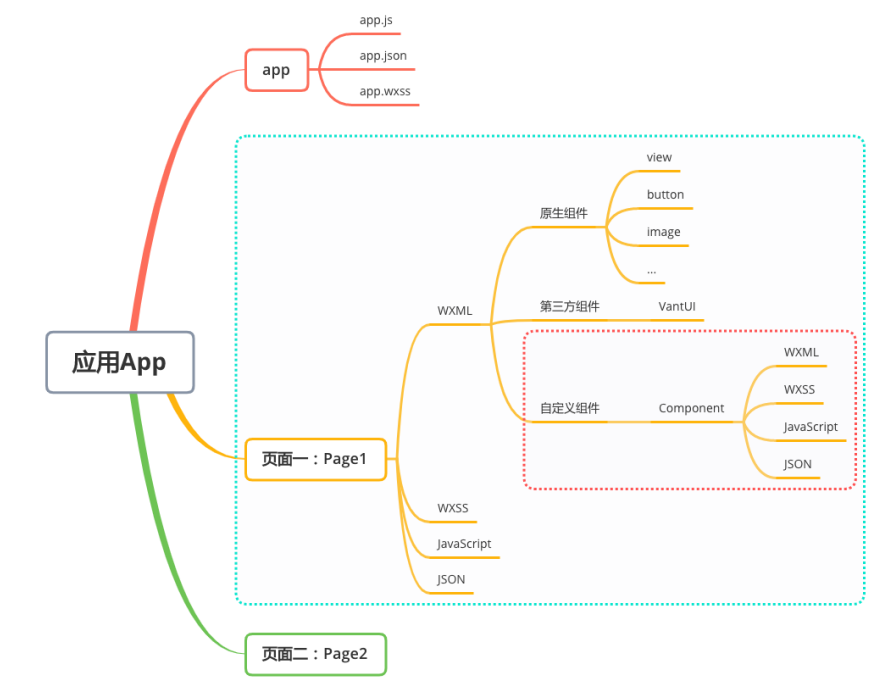

# 五. 小程序的开发体验

---

## 1. 阅读官方文档

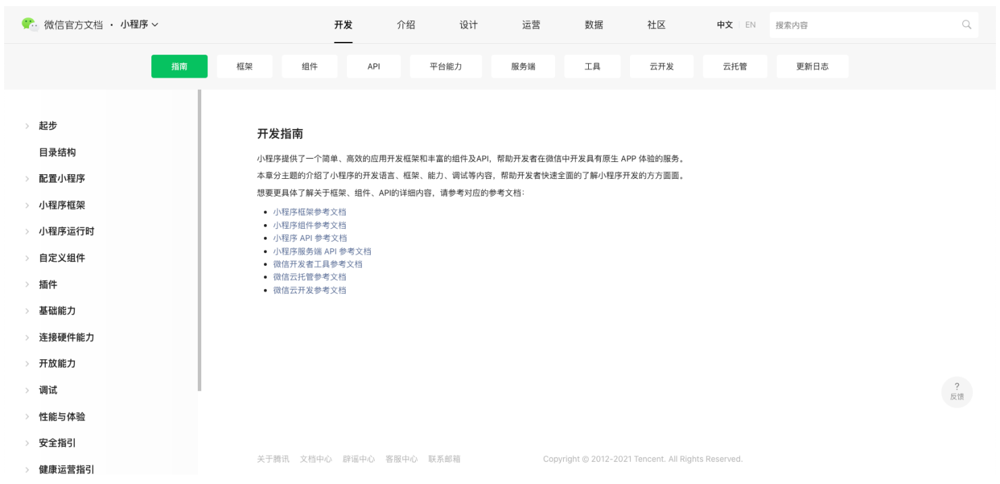

## 2. 小程序开发体验

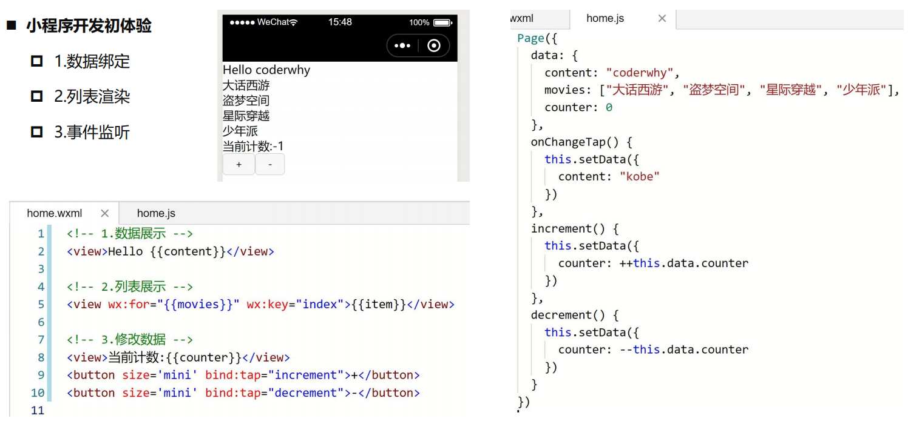

# 六. 小程序 MVVM 架构

---

- `Vue` 的 `MVVM` 和 小程序的 `MVVM` 对比

  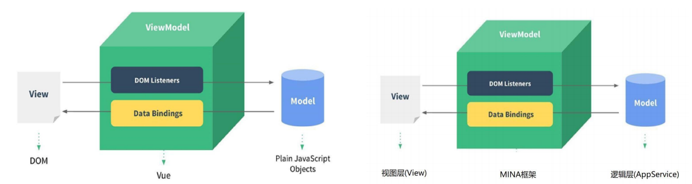

- `MVVM` 为什么好用呢? 
  - `DOM Listeners`：`ViewModel` 层可以将 `DOM` 的监听绑定到 `Model` 层 
  - `Data Bindings`：`ViewModel` 层可以将数据的变量，响应式的反应到 `View` 层 
- `MVVM` 架构将我们从 命令式编程 转移到 声明式编程

