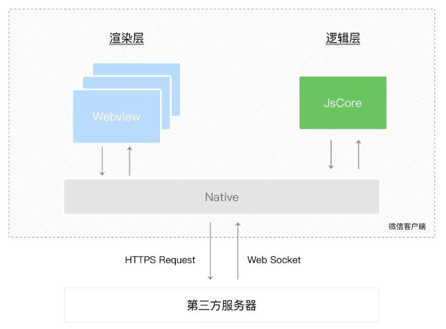
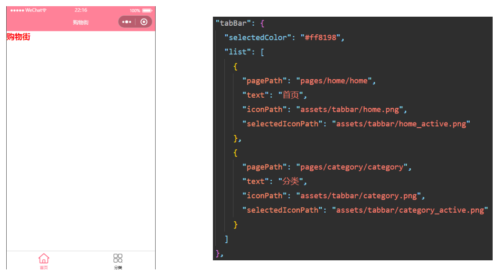
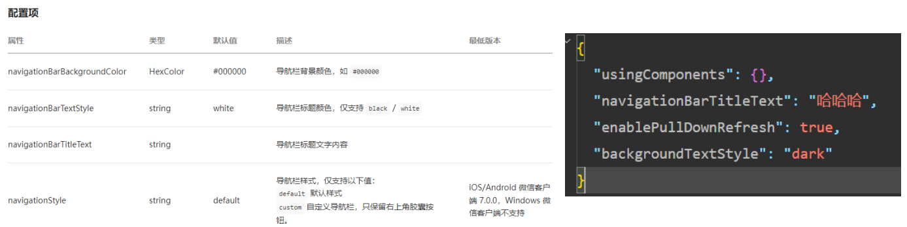
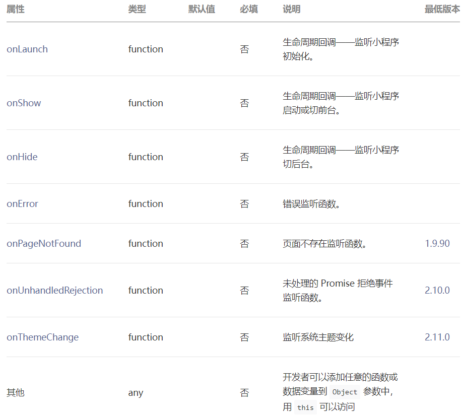
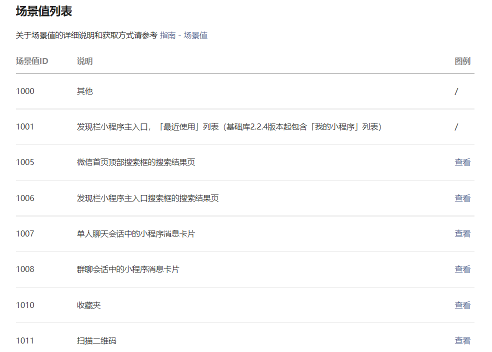
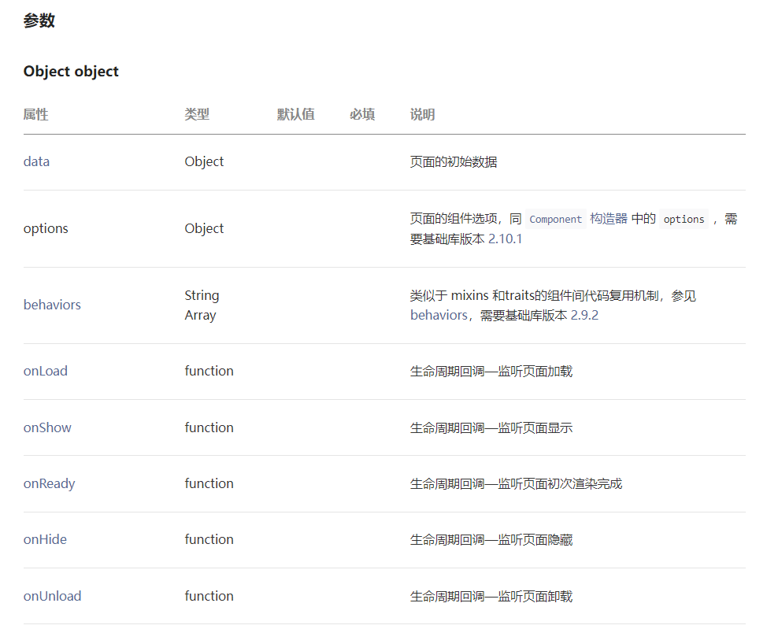
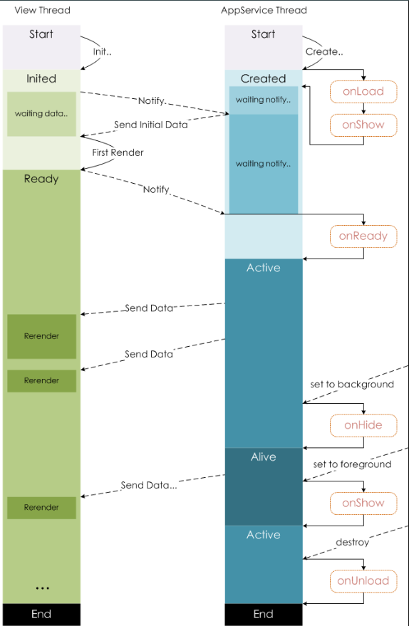
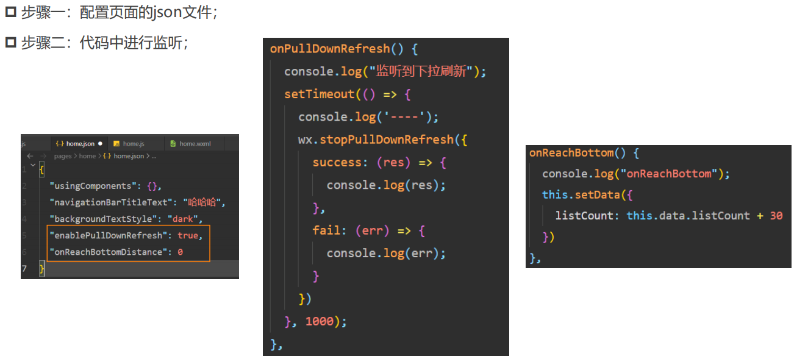

# 一. 小程序的双线程模型

---

- 谁是小程序的宿主环境呢？微信客户端

- 宿主环境为了执行小程序的各种文件：`wxml` 文件、`wxss` 文件、`js `文件

- 当小程序基于 `WebView` 环境下时，`WebView` 的 `JS` 逻辑、`DOM` 树创建、`CSS `解析、样式计算、`Layout`、`Paint`（`Composite`）都发生在同一线程，在 `WebView` 上执行过多的 `JS` 逻辑可能阻塞渲染，导致界面卡顿

- 以此为前提，小程序同时考虑了性能与安全，采用了目前称为双线程模型的架构

- **双线程模型**：
  
  - `WXML` 模块和 `WXSS` 样式运行于渲染层，**渲染层使用 `WebView` 线程渲染**（**一个程序有多个页面，会使用多个 `WebView` 的线程**）
  - `JS` 脚本（`app.js/home.js` 等）运行于逻辑层，**逻辑层使用 `JsCore` 运行 `js` 脚本**
  - 这两个线程都会经由微信客户端（`Native`）进行中转交互
  
  


# 二. 不同配置文件的区分

---

- 小程序的很多开发需求被规定在了配置文件中

- 为什么这样做呢?
  - 这样做可以更有利于我们的开发效率
  - 并且可以保证开发出来的小程序的某些风格是比较一致的
  - 比如导航栏 – 顶部 `TabBar`，以及页面路由等等
- 常见的配置文件有哪些呢?
  - `project.config.json`：
    - 项目配置文件，比如项目名称、`appid` 等
    - https://developers.weixin.qq.com/miniprogram/dev/devtools/projectconfig.html
  - `sitemap.json`：
    - 小程序搜索相关的
    - https://developers.weixin.qq.com/miniprogram/dev/framework/sitemap.html
  - `app.json`：
    - 小程序根目录下的 `app.json` 文件用来对微信小程序进行全局配置，决定页面文件的路径、窗口表现、设置网络超时时间、设置多 `tab` 等
    - https://developers.weixin.qq.com/miniprogram/dev/reference/configuration/app.html
  - `page.json`：
    - 每一个小程序页面也可以使用同名 `.json` 文件来对本页面的窗口表现进行配置，页面中配置项会覆盖 `app.json` 的 `window` 中相同的配置项
    - https://developers.weixin.qq.com/miniprogram/dev/reference/configuration/page.html


# 三. 全局配置文件 app.json

---

- 全局配置比较多，我们这里将几个比较重要的，完整的查看官方文档

- https://developers.weixin.qq.com/miniprogram/dev/reference/configuration/app.html

- `entryPagePath`：

  - 指定小程序的默认启动路径（首页）

  - 常见情景是从微信聊天列表页下拉启动、小程序列表启动等。如果不填，将默认为 `pages` 列表的第一项。**不支持带页面路径参数**

    ```json
    {
      "entryPagePath": "pages/index/index"
    }
    ```

- `pages`：

  - 页面路径列表

  - 用于指定小程序由哪些页面组成，每一项都对应一个页面的 路径（含文件名） 信息。文件名不需要写文件后缀，框架会自动去寻找对应位置的 `.json`, `.js`, `.wxml`, `.wxss` 四个文件进行处理小程序

  - 未指定 `entryPagePath` 时，数组的第一项代表小程序的初始页面（首页）

  - **小程序中新增/减少页面，都需要对 pages 数组进行修改**

  - 如开发目录为：

    ```
    ├── app.js
    ├── app.json
    ├── app.wxss
    ├── pages
    │   │── index
    │   │   ├── index.wxml
    │   │   ├── index.js
    │   │   ├── index.json
    │   │   └── index.wxss
    │   └── logs
    │       ├── logs.wxml
    │       └── logs.js
    └── utils
    ```

  - 则需要在 `app.json` 中写

    ```json
    {
      "pages": ["pages/index/index", "pages/logs/logs"]
    }
    ```

- `window`：

  - 全局的默认窗口展示
  - 用于设置小程序的状态栏、导航条、标题、窗口背景色

- `tabBar`：顶部 `tab` 栏的展示

  


# 四. 页面配置文件 page.json

---

- 每一个小程序页面也可以使用 `.json` 文件来对本页面的窗口表现进行配置
  - 页面中配置项在当前页面会覆盖 `app.json` 的 `window` 中相同的配置项
  - https://developers.weixin.qq.com/miniprogram/dev/reference/configuration/page.html
  
  


# 五. 注册 App 实例的操作

---

## 1. 注册小程序 – App函数

- 每个小程序都需要在 `app.js` 中调用 `App` 函数 注册小程序实例
  - 在注册时，可以绑定对应的生命周期函数
  - 在生命周期函数中，执行对应的代码
  - https://developers.weixin.qq.com/miniprogram/dev/reference/api/App.html
- 我们来思考：注册 `App` 时，我们一般会做什么呢？
  - 判断小程序的进入场景
  - 监听生命周期函数，在生命周期中执行对应的业务逻辑，比如在某个生命周期函数中进行登录操作或者请求网络数据
  - 因为 `App()` 实例只有一个，并且是全局共享的（单例对象），所以我们可以将一些共享数据放在这里

## 2. App 函数的参数

- `App(Object object)` 注册小程序。接受一个 `Object` 参数，其指定小程序的生命周期回调等

- **`App()` 必须在 `app.js` 中调用，必须调用且只能调用一次。不然会出现无法预期的后果**

  

  ```js
  // app.js
  App({
    onLaunch (options) {
      // Do something initial when launch.
    },
    onShow (options) {
      // Do something when show.
    },
    onHide () {
      // Do something when hide.
    },
    onError (msg) {
      console.log(msg)
    },
    globalData: 'I am global data',
    foo() {}
  })
  ```

- 整个小程序只有一个 `App` 实例，是全部页面共享的。开发者可以通过 `getApp()` 方法获取到全局唯一的 `App` 实例，获取 `App` 上的数据 或调 用开发者注册在 `App` 上的函数

  ```js
  // xxx.js
  const appInstance = getApp()
  console.log(appInstance.globalData) // I am global data
  appInstance.foo()
  ```

## 3. 作用一：判断打开场景

- 小程序的打开场景较多：
  - 常见的打开场景：群聊会话中打开、小程序列表中打开、微信扫一扫打开、另一个小程序打开
  - https://developers.weixin.qq.com/miniprogram/dev/reference/scene-list.html
  
- 如何确定场景? 
  - 在 `onLaunch` 和 `onShow` 生命周期回调函数中，会有 `options` 参数，其中有 `scene` 值
  
  

## 4. 作用二：定义全局 App 的数据

- 作用二：可以在 `app.js` 中定义全局 `App` 的数据

  ```js
  // app.js
  App({
    onLaunch (options) {
      // Do something initial when launch.
    },
    onShow (options) {
      // Do something when show.
    },
    // ...
    globalData: 'I am global data',
    foo() {}
  })
  ```

- 定义的数据可以在其他任何页面中访问：

  ```js
  // xxx.js
  const appInstance = getApp()
  console.log(appInstance.globalData) // I am global data
  appInstance.foo()
  ```

## 5. 作用三 – App生命周期函数

- 作用三：在生命周期函数中，完成应用程序启动后的初始化操作
  - 比如登录操作
  - 比如读取本地数据（类似于 `token`，然后保存在全局方便使用）
  - 比如请求整个应用程序需要的数据
  
  ```js
  // app.js
  App({
    globalData: {
      token: '',
      user: null
    },
    onLaunch() {
      // 读取本地数据
      const token = wx.getStorageSync('token')
      const user = wx.getStorageSync('user')
      this.globalData.token = token
      this.globalData.user = user
      
      // 登录逻辑
      wx.login({ success: res => {} })
      
      // 请求数据
      wx.request({ url: 'xxx/aa/bb' })
    }
  })
  ```


# 六. 注册 Page 实例的操作

---

## 1. 注册页面 – Page函数

- 小程序中的每个页面，都有一个对应的 `js` 文件，其中调用 `Page()` 函数注册页面实例
  - 在注册时，可以绑定初始化数据、生命周期回调、事件处理函数等
  - https://developers.weixin.qq.com/miniprogram/dev/reference/api/Page.html
- 我们来思考：注册一个 `Page` 页面时，我们一般需要做什么呢？
  1. 在生命周期函数中发送网络请求，从服务器获取数据
  2. 初始化一些数据，以方便被 `wxml` 引用展示
  3. 监听 `wxml` 中的事件，绑定对应的事件函数
  4. 其他一些监听（比如页面滚动、下拉刷新、上拉加载更多等）

## 2. Page 函数的参数

- `data`

  - `data` 是页面第一次渲染使用的**初始数据**

  - **页面加载时，`data` 将会以 `JSON` 字符串的形式由逻辑层传至渲染层，因此 `data` 中的数据必须是可以转成 `JSON` 的类型**：字符串，数字，布尔值，对象，数组

  - 渲染层可以通过 `WXML` 对数据进行绑定

    ```html
    <view>{{text}}</view>
    <view>{{array[0].msg}}</view>
    ```

    ```js
    Page({
      data: {
        text: 'init data',
        array: [{msg: '1'}, {msg: '2'}]
      }
    })
    ```

- **自定义属性**：
  - 开发者可以添加任意的函数 或 数据到 `Page` 函数的参数中，在页面的函数中用 `this` 可以访问。**这部分自定义属性会在页面实例创建时进行一次深拷贝**

- 页面生命周期函数

  

## 3. Page页面生命周期

- `onLoad`

  - 页面加载时触发。一个页面只会调用一次
  - 可以在 `onLoad` 的参数中获取打开当前页面路径中的参数

- `onShow` 

  - 页面显示/切入前台时触发，是在渲染之前调用的

- `onReady` 

  - 是在页面初次渲染完成时触发。一个页面只会调用一次
  - 代表页面已经准备妥当，可以和视图层进行交互，和视图层交互应该放在 `onReady` 函数之后
  - 注意：对界面内容进行设置的 `API` 如 `wx.setNavigationBarTitle`，请在 `onReady` 之后进行。详见生命周期

- `onHide`

  - 页面隐藏/切入后台时触发。 如 `wx.navigateTo` 或底部 `tab` 切换到其他页面，小程序切入后台等

- `onUnload`

  - 页面卸载时触发。如 `wx.redirectTo` 或 `wx.navigateBack` 到其他页面时

- `onRouteDone`

  - 路由动画完成时触发。如 `wx.navigateTo` 页面完全推入后 或 `wx.navigateBack` 页面完全恢复时

  

## 4. 页面事件处理函数

- `onPullDownRefresh()` 监听用户下拉刷新事件

  - 需要在 `app.json` 的 `window` 选项中 或 页面配置中开启 `enablePullDownRefresh`
  - 可以通过 `wx.startPullDownRefresh()` 触发下拉刷新，调用后触发下拉刷新动画，效果与用户手动下拉刷新一致
  - 当处理完数据刷新后，`wx.stopPullDownRefresh()` 可以停止当前页面的下拉刷新

- `onReachBottom()` 监听用户上拉触底事件

  - 可以在 `app.json` 的 `window` 选项中 或 页面配置中设置触发距离 `onReachBottomDistance`
  - 在触发距离内滑动期间，本事件只会被触发一次

- 监听页面的下拉刷新和上拉加载更多：

  

- `onPageScroll(Object object)` 监听用户滑动页面事件

- 参数 `Object object`

  | 属性        | 类型     | 说明                                    |
  | :---------- | :------- | :-------------------------------------- |
  | `scrollTop` | `Number` | 页面在垂直方向已滚动的距离（单位 `px`） |

  > **注意：**
  >
  > - **请只在需要的时候才在 `page` 中定义此方法，不要定义空方法。以减少不必要的事件派发对渲染层 - 逻辑层通信的影响**
  > - **请避免在  onPageScroll  中过于频繁的执行 `setData` 等引起[逻辑层-渲染层通信](https://developers.weixin.qq.com/miniprogram/dev/framework/performance/tips.html)的操作。尤其是每次传输大量数据，会影响通信耗时**

- `onAddToFavorites()` （暂只在安卓平台支持）

  - 监听用户点击右上角菜单“收藏”按钮的行为，并自定义收藏内容

- `onShareAppMessage()`

  - 监听用户点击页面内转发按钮（`button` 组件 `open-type="share"`）或右上角菜单“转发”按钮的行为，并自定义转发内容

  > **注意：**
  >
  > - **只有定义了此事件处理函数，右上角菜单才会显示“转发”按钮**
  > - **此事件处理函数需要 `return` 一个指定的 `Object`，用于自定义转发内容**

- `onShareTimeline()`（暂只在 `Android` 平台支持）

  - 监听右上角菜单“分享到朋友圈”按钮的行为，并自定义分享内容	
  - 基础库 2.11.3 开始支持，低版本需做[兼容处理](https://developers.weixin.qq.com/miniprogram/dev/framework/compatibility.html)

  > **注意：**
  >
  > - **只有定义了此事件处理函数，右上角菜单才会显示“分享到朋友圈”按钮**

- `onResize()`
  - 小程序屏幕旋转时触发
- `onTabItemTap()`
  - 点击 `tab` 时触发
- `onSaveExitState()`
  - 每当小程序可能被销毁之前，页面回调函数 `onSaveExitState` 会被调用，可以进行[退出状态](https://developers.weixin.qq.com/miniprogram/dev/framework/runtime/operating-mechanism.html#_4-退出状态)的保存


