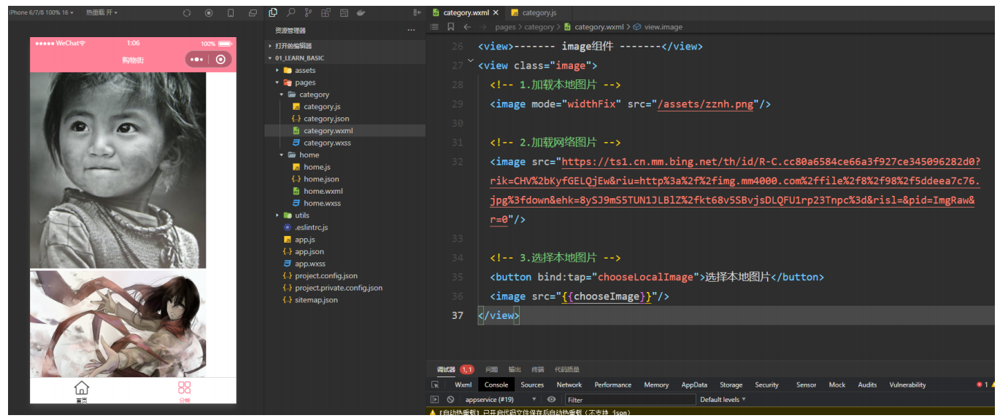

# 一. Text 文本组件

---

- `Text` 组件用于显示文本，类似于 `span` 标签，是行内元素

  

- `user-select` 属性决定文本内容是否可以让用户选中

- `decode` 可以解析的有 `< > & '   &emsp`

  ```html
  <view>
  	<!-- 文本是否可选中 -->
    <text user-select="{{true}}">这段文本用户是可选中的</text>
  </view>
  ```


# 二. Button 按钮组件

---

## 1. Button 组件属性

- `Button` 组件用于创建按钮，**默认块级元素**

- 常见属性：

  

  

## 3. open-type 属性

- `open-type` 用户获取一些特殊性的权限，可以绑定一些特殊的事件

  


# 三. View 视图组件

---

- 视图组件（块级元素，独占一行，通常用作容器组件）

  


# 四. image 图片组件

---

## 1. image 组件属性

- `Image` 组件用于显示图片，有如下常见属性

- 其中 `src` 可以是本地图片，也可以是网络图片

- `Mode` 属性使用也非常关键，详情查看官网：
  
  - https://developers.weixin.qq.com/miniprogram/dev/component/image.html
  
  > **注意：**
  >
  > - **`image` 组件默认宽度 `320px`、高度 `240px`**
  > - **`image` 组件中二维码 / 小程序码图片不支持长按识别。仅在 `wx.previewImage` 中支持长按识别**
  > - **`image` 组件进行缩放时，计算出来的宽高可能带有小数，在不同 `webview` 内核下渲染可能会被抹去小数部分**
  
  

## 2. 上传本地媒体文件 wx.chooseMedia

- 这里补充一个 `API：wx.chooseMedia`（具体用法查看文档）

- 拍摄或从手机相册中选择图片或视频

- https://developers.weixin.qq.com/miniprogram/dev/api/media/video/wx.chooseMedia.html

  


# 五. Scroll-View 滚动组件

---

## 1. scroll-view 组件解析

- `scroll-view` 可滚动视图区域，可以实现局部滚动

  > **注意：**
  >
  > - **实现滚动效果必须添加`scroll-x`或者`scroll-y`属性（只需要添加即可，属性值相当于为`true`了）**
  > - **垂直方向滚动必须设置`scroll-view`一个高度**
  > - **基础库 [2.4.0](https://developers.weixin.qq.com/miniprogram/dev/framework/compatibility.html)以下不支持嵌套`textarea`、`map`、`canvas`、`video` 组件**
  > - **`scroll-into-view` 的优先级高于 ``scroll-top`**
  > - **在滚动 `scroll-view` 时会阻止页面回弹，所以在 `scroll-view` 中滚动，是无法触发 `onPullDownRefresh`**
  > - **若要使用下拉刷新，请使用页面的滚动，而不是 `scroll-view` ，这样也能通过点击顶部状态栏回到页面顶部**
  > - **scroll-view 自定义下拉刷新可以结合 [WXS 事件响应](https://developers.weixin.qq.com/miniprogram/dev/framework/view/interactive-animation.html) 开发交互动画**

- 常见属性如下：

  

## 2. scroll-view 组件代码


# 六. 组件的共同属性

---


