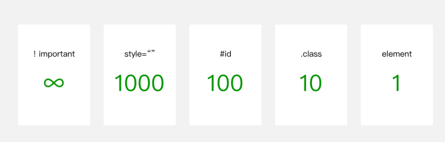

# 一. WXSS 编写程序样式

---

## 1. 小程序的样式写法

- 提供了全局的样式和局部样式。和前边 `app.json`, `page.json` 的概念相同，你可以写一个 `app.wxss` 作为全局样式，会作用于当前小程序的所有页面，局部页面样式 `page.wxss` 仅对当前页面生效

  

## 2. WXSS 支持的选择器

- **`WXSS` 仅支持部分 `CSS` 选择器**

  

## 3. WXSS 优先级与 CSS 类似，权重如图



## 4. wxss 的扩展 – 尺寸单位

- `WXSS` 具有 `CSS` 大部分的特性，小程序在 `WXSS` 也做了一些扩充和修改

  - 新增了尺寸单位。在写 `CSS` 样式时，开发者需要考虑到手机设备的屏幕会有不同的宽度和设备像素比，采用一些技巧来换算一些像素单位。**`WXSS` 在底层支持新的尺寸单位 `rpx` ，开发者可以免去换算的烦恼，只要交给小程序底层来换算即可，由于换算采用的浮点数运算，所以运算结果会和预期结果有一点点偏差**
  - https://developers.weixin.qq.com/miniprogram/dev/framework/view/wxss.html

- 尺寸单位
  
  - **`rpx`（responsive pixel）: 可以根据屏幕宽度进行自适应，规定屏幕宽为`750rpx`**
  - 如在 `iPhone6`上，屏幕宽度为 `375px`，共有 `750` 个物理像素，则 `750rpx = 375px = 750物理像素`，`1rpx = 0.5px = 1物理像素`
  
- 建议：开发微信小程序时设计师可以用 `iPhone6` 作为视觉稿的标准

  


# 二. Mustache 语法绑定

---

- `WXML` 基本格式：
  
  - 类似于 `HTML` 代码：比如可以写成单标签，也可以写成双标签
  - **必须有严格的闭合**：没有闭合会导致编译错误
  - **大小写敏感**：`class` 和 `Class` 是不同的属性
  
- 开发中，界面上展示的数据并不是写死的，而是会根据服务器返回的数据，或者用户的操作来进行改变
  - 如果使用原生 `JS` 或者 `jQuery` 的话, 我们需要通过操作 `DOM` 来进行界面的更新
  
  - 小程序和 `Vue` 一样, 提供了插值语法：`Mustache`语法（双大括号）
  
    ```html
    <!-- 内容 -->
    <view> {{ message }} </view>
    <!-- 组件属性 -->
    <view id="item-{{id}}"> </view>
    <!-- 控制属性(需要在双引号之内) -->
    <view wx:if="{{condition}}"> </view>
    <!-- 关键字(需要在双引号之内)，不要直接写 checked="false"，其计算结果是一个字符串 -->
    <checkbox checked="{{false}}"> </checkbox>
    <!-- 三元运算 -->
    <view hidden="{{flag ? true : false}}"> Hidden </view>
    <!-- 算数运算 -->
    <view> {{a + b}} + {{c}} + d </view>
    <!-- 逻辑判断 -->
    <view wx:if="{{length > 5}}"> </view>
    <!-- 字符串运算 -->
    <view>{{"hello" + name}}</view>
    <!-- 数据路径运算 -->
    <view>{{object.key}} {{array[0]}}</view>
    <!-- 组合，也可以在 Mustache内直接进行组合，构成新的对象或者数组 -->
    <view wx:for="{{[zero, 1, 2, 3, 4]}}"> {{item}} </view>
    <!-- 对象，也可以用扩展运算符 ... 来将一个对象展开 -->
    <template is="objectCombine" data="{{for: a, bar: b}}"></template>
    <template is="objectCombine" data="{{...obj1, ...obj2, e: 5}}"></template>
    <!-- 
    	如果对象的 key 和 value 相同，也可以间接地表达,
    	最终组合成的对象是 {foo: 'my-foo', bar:'my-bar'}
    -->
    <template is="objectCombine" data="{{foo, bar}}"></template>
    ```
  
    ```js
    Page({
      data: {
        message: 'Hello MINA!',
        id: 0,
        condition: true,
        a: 1,
        b: 2,
        c: 3,
        name: 'MINA',
        object: {
          key: 'Hello '
        },
        array: ['MINA'],
        zero: 0,
        obj1: {
          a: 1,
          b: 2
        },
        obj2: {
          c: 3,
          d: 4
        },
        foo: 'my-foo',
        bar: 'my-bar'
      }
    })
    ```
  
    > **注意：** 
    >
    > - **花括号和引号之间如果有空格，将最终被解析成为字符串**
    >
    >   ```html
    >   <view wx:for="{{[1,2,3]}} "></view>
    >   <!-- 等同于下面这种写法 -->
    >   <view wx:for="{{[1,2,3] + ' '}}"></view>
    >   ```


# 三. WXML 的条件渲染

---

## 1. wx-if

- 在框架中，使用 `wx:if=""` 来判断是否需要渲染该代码块：

  ```html
  <view wx:if="{{condition}}"> True </view>
  ```

- 也可以用 `wx:elif` 和 `wx:else` 来添加一个 `else` 块

  ```html
  <view wx:if="{{length > 5}}"> 1 </view>
  <view wx:elif="{{length > 2}}"> 2 </view>
  <view wx:else> 3 </view>
  ```

## 2. block wx:if

- 因为 `wx:if` 是一个控制属性，需要将它添加到一个标签上。如果要一次性判断多个组件标签，可以使用一个 `<block/>` 标签将多个组件包装起来，并在上边使用 `wx:if` 控制属性

  ```html
  <block wx:if="{{true}}">
    <view> view1 </view>
    <view> view2 </view>
  </block>
  ```

  > **注意：** 
  >
  > - **`<block/>` 并不是一个组件，它仅仅是一个包装元素，不会在页面中做任何渲染，只接受控制属性**

## 3. hidden 属性

- `hidden` 属性：
  
  - `hidden` 是所有的组件都默认拥有的属性
  
  - 当 `hidden` 属性为 `true` 时，组件会被隐藏
  
  - 当 `hidden` 属性为 `false` 时，组件会显示出来
  
    ```html
    <view hidden="{{false}}">哈哈</view>
    ```

## 4. wx:if 和 hidden 区别

- `hidden`：组件始终会被渲染，只是简单的控制显示与隐藏
- `wx:if`：为 `true` 时，才会渲染（改变 `display` 属性）
- 因为 `wx:if` 之中的模板也可能包含数据绑定，所以当 `wx:if` 的条件值切换时，框架有一个局部渲染的过程，因为它会确保条件块在切换时销毁或重新渲染
- 同时 `wx:if` 也是**惰性的**，如果在初始渲染条件为 `false`，框架什么也不做，在条件第一次变成真的时候才开始局部渲染
- 相比之下，`hidden` 就简单的多，组件始终会被渲染，只是简单的控制显示与隐藏
- 一般来说，`wx:if` 有更高的切换消耗而 `hidden` 有更高的初始渲染消耗。因此，**如果需要频繁切换的情景下，用 `hidden` 更好，如果在运行时条件不大可能改变则 `wx:if` 较好**


# 四. WXML 的列表渲染

---

## 1. wx:for

- 为什么使用 `wx:for` ？ 
  - 我们知道，在实际开发中，服务器经常返回各种列表数据，我们不可能一一从列表中取出数据进行展示
  - 需要通过 `for` 循环的方式，遍历所有的数据，一次性进行展示

- 在组件上使用 `wx:for` 控制属性绑定一个数组，即可使用数组中各项的数据重复渲染该组件
  - 默认数组的当前项的下标变量名默认为 `index`，数组当前项的变量名默认为 `item`

    ```html
    <view wx:for="{{array}}">
      {{index}}: {{item.message}}
    </view>
    ```

    ```js
    Page({
      data: {
        array: [{
          message: 'foo',
        }, {
          message: 'bar'
        }]
      }
    })
    ```

- 默认情况下，`item – index`的名字是固定的

  - 但是某些情况下，我们可能想使用其他名称
  - 或者当出现多层遍历时，名字会重复

  - 使用 `wx:for-item` 可以指定数组当前元素的变量名

  - 使用 `wx:for-index` 可以指定数组当前下标的变量名

    ```html
    <view wx:for="{{array}}" wx:for-index="idx" wx:for-item="itemName">
      {{idx}}: {{itemName.message}}
    </view>
    ```

  - `wx:for` 也可以嵌套，下边是一个九九乘法表

    ```html
    <view wx:for="{{[1, 2, 3, 4, 5, 6, 7, 8, 9]}}" wx:for-item="i">
      <view wx:for="{{[1, 2, 3, 4, 5, 6, 7, 8, 9]}}" wx:for-item="j">
        <view wx:if="{{i <= j}}">
          {{i}} * {{j}} = {{i * j}}
        </view>
      </view>
    </view>
    ```

- 除了绑定数组之外，还可以绑定字符串和数字

  ```html
  <!-- 遍历一个字符串 -->
  <view wx:for="{{'hello world'}}">{{item}}</view>
  <!-- 遍历一个数字 -->
  <view wx:for="{{10}}">{{item}}</view>
  ```

  >**注意：**
  >
  >- **当 `wx:for` 的值为字符串时，会将字符串解析成字符串数组**
  >
  >  ```html
  >  <view wx:for="array">{{item}}</view>
  >  <!-- 等同于下面写法 -->
  >  <view wx:for="{{['a','r','r','a','y']}}">{{item}}</view>
  >  ```
  >
  >- **花括号和引号之间如果有空格，将最终被解析成为字符串**
  >
  >  ```html
  >  <view wx:for="{{[1,2,3]}} ">{{item}}</view>
  >  <!-- 等同于下面写法 -->
  >  <view wx:for="{{[1,2,3] + ' '}}" >{{item}}</view>
  >  ```

## 2. block wx:for

- 类似 `block wx:if`，也可以将 `wx:for` 用在 `<block/>` 标签上，以渲染一个包含多节点的结构块

- 例如：

  ```html
  <block wx:for="{{[1, 2, 3]}}">
    <view> {{index}}: </view>
    <view> {{item}} </view>
  </block>
  ```

- 使用 `block` 有两个好处：
  
  1. 将需要进行遍历或者判断的内容进行包裹
  2. 将遍历和判断的属性放在 `block` 便签中，不影响普通属性的阅读，提高代码的可读性

## 3.  wx:key

- 我们看到，使用 `wx:for` 时，会报一个警告：
  - 这个提示告诉我们，可以添加一个 `key` 来提供性能
  - **如不提供 `wx:key`，会报一个 `warning`， 如果明确知道该列表是静态（不会变化），或不必关注其顺序，可以选择忽略**
  
- 为什么需要这个 `key` 属性呢？
  - 这个其实和小程序内部也使用了虚拟 `DOM` 有关系（和 `Vue`、`React` 很相似）
  - 当某一层有很多相同的节点时，也就是列表节点时，我们希望插入、删除一个新的节点，可以更好的复用节点
  - 当数据改变触发渲染层重新渲染的时候，会校正带有 `key` 的组件，框架会确保他们被重新排序，而不是重新创建，以确保使组件保持自身的状态，并且提高列表渲染时的效率
  
- `wx:key` 的值以两种形式提供
  
  1. 字符串，代表在 `for` 循环的 `array` 中 `item` 的某个 `property`，该 `property` 的值需要是列表中唯一的字符串或数字，且不能动态改变
  2. 保留关键字 `*this` 代表在 `for` 循环中的 `item` 本身，这种表示需要 `item` 本身是一个唯一的字符串或者数字，如果是对象形式的 `item`，用这种表示没有意义，因为每个 `item` 对象在比较的时候，本身就都不相等
  
  ```html
  <view>
  	<block wx:for="{{books}}" wx:key="id">
    	<view>{{item.name}}</view>
    </block>
  </view>
  ```
  
  ```js
  Page({
    data: {
      books: [
        {name: 'aaa', id: 1},
        {name: 'bbb', id: 2}
      ]
    }
  })
  ```


# 五. WXS 语法基本使用

---

## 1. 什么是 WXS？

- **`WXS（WeiXin Script）` 是小程序的一套脚本语言**，结合 ` WXML`，可以构建出页面的结构
  - 官方：`WXS` 与 `js` 是不同的语言，有自己的语法，并不和 `js` 一致（不过基本一致）
- 为什么要设计 `WXS` 语言呢？
  - **在 `WXML` 中是不能直接调用 `Page/Component` 中定义的函数的**
  - 小程序的架构设计是双线程，如果通过微信原生客户端来作为中间桥梁负责 `view` 和 `appService` 之间的通信，会消耗更多的性能，所以**架构层面不这样设计，所以设计了一套 `WXS` 的方案**
  - 但是某些情况，我们可以希望使用函数来处理 `WXML` 中的数据（类似于 `Vue` 中的过滤器），这个时候就使用 `WXS`了
- `WXS` 使用的限制和特点：
  - `WXS` 不依赖于运行时的基础库版本，可以在所有版本的小程序中运行
  - **`WXS` 的运行环境和其他 `js` 代码是隔离的，`WXS` 中不能调用其他 `js` 文件中定义的函数，也不能调用小程序提供的 `API`**
  - 由于运行环境的差异，在 `iOS` 设备上小程序内的 `WXS` 会比 `js` 代码快 2 ~ 20 倍。在 ` android` 设备上二者运行效率无差异

## 2. WXS 的写法

- `WXS` 有两种写法：
  - 写在 `<wxs>` 标签中
  - 或者写在以 `.wxs` 结尾的文件中
- 详见：https://developers.weixin.qq.com/miniprogram/dev/reference/wxs/01wxs-module.html

## 3. WXS 的练习

- 使用两种方式来计算一个数组的和：

  

- 案例练习题目：
  - 题目一：传入一个数字，格式化后进行展示（例如36456，展示结果3.6万）
  - 题目二：传入一个事件，格式化后进行展示（例如100秒，展示结果为01:40）
  
  


