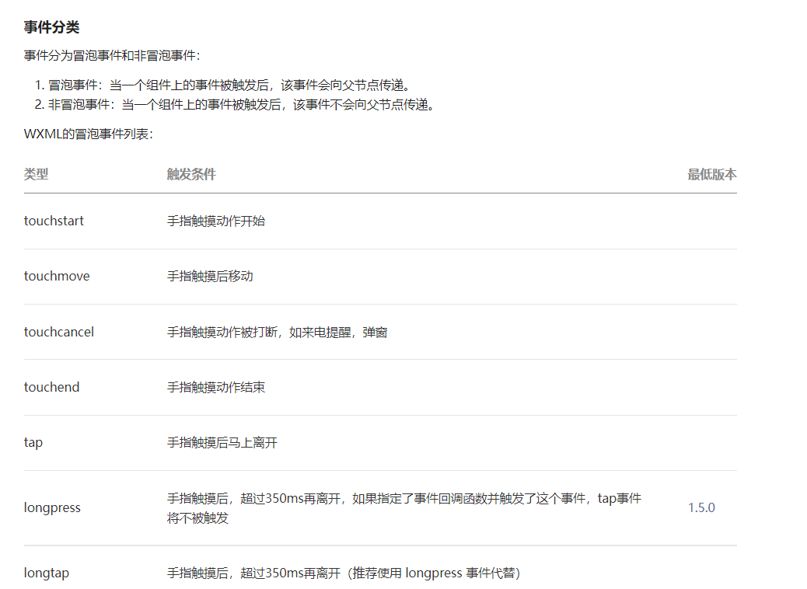
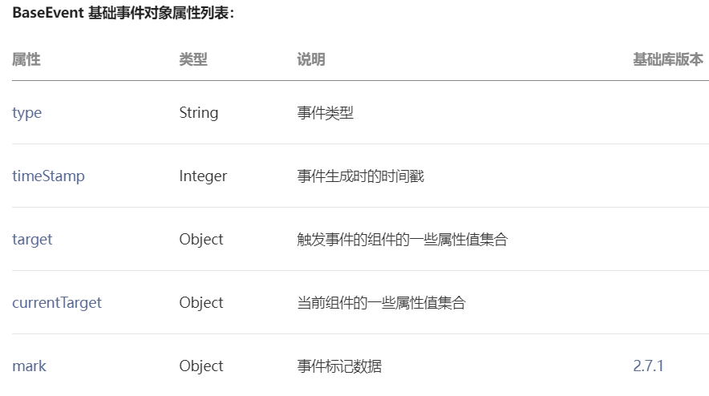
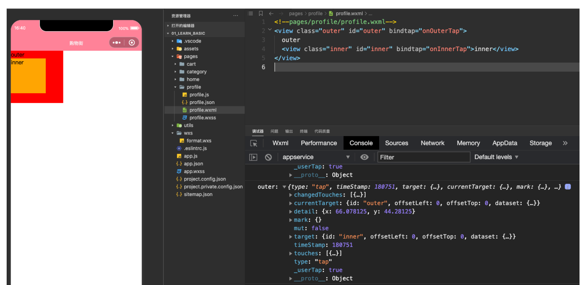
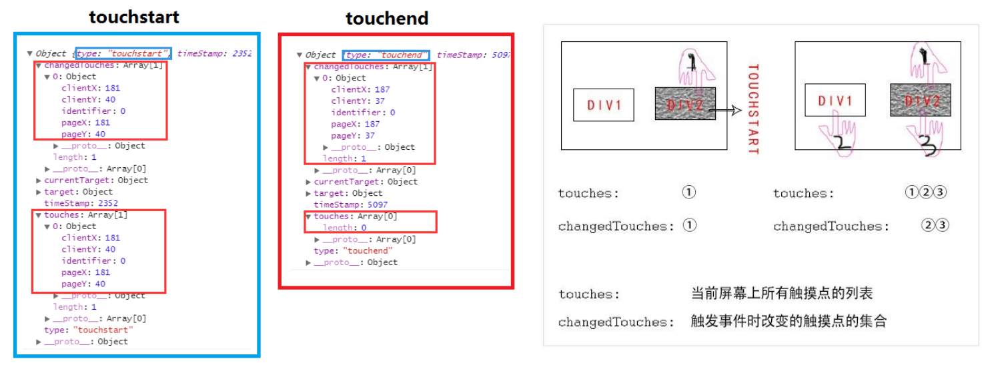
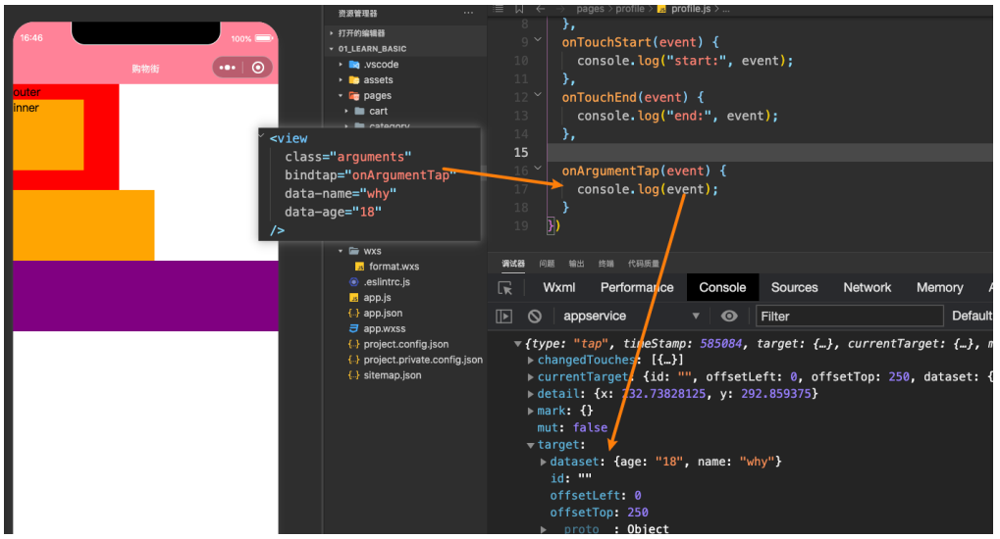
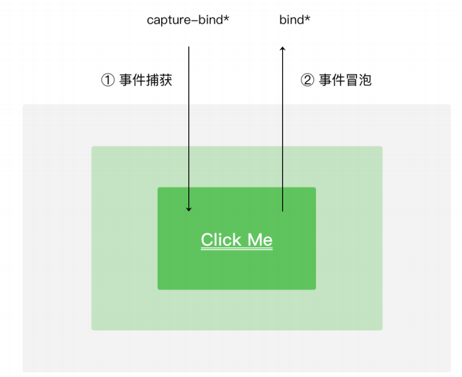

# 一. 小程序的事件监听

---

- 什么时候会产生事件呢？
  - 小程序需要经常和用户进行某种交互，比如点击界面上的某个按钮或者区域，比如滑动了某个区域
  - 事件是视图层到逻辑层的通讯方式
  - 事件可以将用户的行为反馈到逻辑层进行处理
  - 事件可以绑定在组件上，当触发事件时，就会执行逻辑层中对应的事件处理函数
  - 事件对象可以携带额外信息，如 ` id`, `dataset`, `touches`
- 事件时如何处理呢？
  - 事件是通过 `bind/catch` 这个属性绑定在组件上的（和普通的属性写法很相似, 以 `key=“value”` 形式）
  - `key` 以 `bind` 或 `catch` 开头, 从1.5.0版本开始, 可以在 `bind` 和 `catch` 后加上一个`:`
  - 同时在当前页面的 `Page` 构造器中定义对应的事件处理函数，如果没有对应的函数，触发事件时会报错
  - 比如当用户点击该 `button` 区域时，达到触发条件生成事件 `tap`，该事件处理函数会被执行，同时还会收到一个事件对象 `event`

# 二. 常见事件类型划分

---

- 某些组件会有自己特性的事件类型，可以在使用组件时具体查看对应的文档
  - 比如 `input` 有 `bindinput` / `bindblur` / `bindfocus` 等
  - 比如 `scroll-view` 有 `bindscrolltowpper` / `bindscrolltolower` 等
  
- 这里我们讨论几个组件都有的，并且也比较常见的事件类型：

  

# 三. 事件对象属性分析

---

## 1.事件对象 event

- 当某个事件触发时，会产生一个事件对象，并且这个对象被传入到回调函数中，事件对象有哪些常见的属性呢?

  

## 2. currentTarget 和 target 的区别

- `target`：触发事件的源组件

- `currentTarget`：事件绑定的当前组件

  

## 3. touches 和 changedTouches 的区别

- `touches` ：当前停留在屏幕上的触摸点 

  - 是一个数组，每个元素为一个 `Touch` 对象（`canvas` 触摸事件中携带的 `touches` 是  `CanvasTouch` 数组）。 

- `changedTouches` ：有变化的触摸点

  - 如从无变有（`touchstart`），位置变化（`touchmove`），从有变无（`touchend`、`touchcancel`）
  - 数据格式同 `touches`

- 在 `touchend` 中不同

- 多手指触摸时不同

  

# 四. 事件参数传递方法

---

- 当视图层发生事件时，某些情况需要事件携带一些参数到执行的函数中，这个时候就可以通过 `data-属性` 来完成：
  - 格式：`data-xxx` 属性的名称
  - 获取：`e.currentTarget.dataset.xxx` 属性的名称
  
  

# 五. 事件传递案例练习

---

# 六. 冒泡和捕获的区别

---

- 当界面产生一个事件时，事件分为了捕获阶段和冒泡阶段

- **将 `bind` 替换为 `catch`：阻止事件进一步传递（阻止事件向上冒泡）**

- 也可以用小程序内部提供的 `mark` 属性
  - 在基础库版本 `2.7.1` 以上，可以使用 `mark` 来识别具体触发事件的 `target` 节点
  - `mark` 还可以用于承载一些自定义数据（类似于 `dataset`）
  
  
