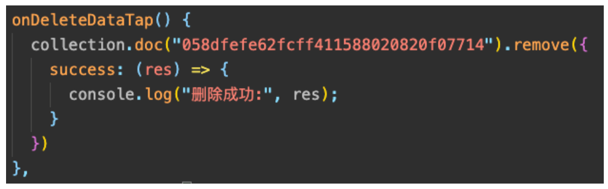
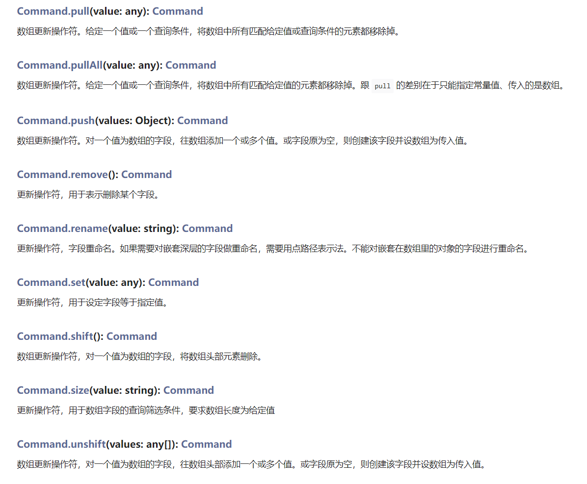
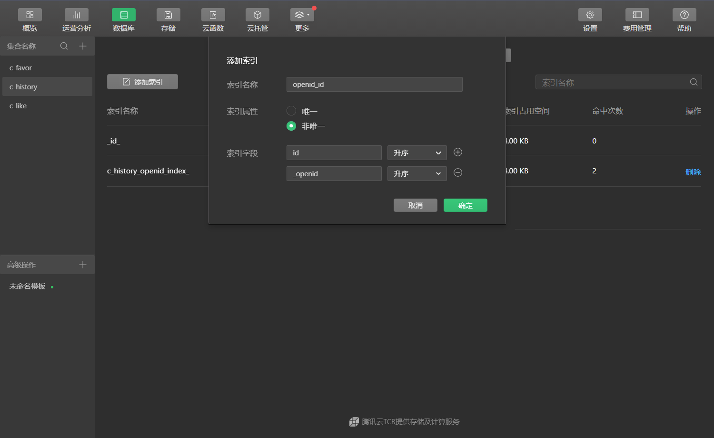

# 一. 小程序云开发模式

---

## 1. 完整的小程序项目


## 2. 开发成本的考虑

- 但是，如果一个小公司或个人只是想开发一个小程序推广自己的产品或者实现某个想法了？

- 按照传统的开发模式，我们需要考虑哪些东西呢？
  - 成本角度：维护服务器成本，并且需要考虑并发量大后服务器的扩展
  - 技术研发：对于单纯会前端的人来说，学习后端相关的技术，成本较高
  
  

## 3. 新的开发模式


## 4. 云开发的模式


## 5. 云开发模式和传统模式对比


## 6. 项目流程对比


## 7. 云开发核心技术

- 云开发主要包含三大核心技术：
- **云数据库**：
  - 提供在小程序端直接对数据库进行增删改查的能力
  - 数据库是类似于 `MongoDB` 的文档存储的数据库，操作非常方便
- **云存储**：
  - 可以在小程序端直接上传、下载、删除文件
  - 自带 `CDN`，提高文件访问速度
  - 可以获取临时链接，支持在小程序外访问
- **云函数**：
  - 提供了在服务器代码的执行能力
  - 包含微信天然的私有鉴权
  - 更大权限的操作数据库等
  - 进行云调用、`HTTP` 请求等操作


# 二. 云开发环境的搭建

---

## 1. 创建云开发项目


## 2. 项目目录结构


## 3. 云开发控制台

- 云开发控制台
  - 运营分析
  - 数据库（云数据库）
  - 存储（云存储）
  - 云函数
- 开通云开发
  - 设置 – 环境名称 – 创建环境


# 三. 云开发环境的介绍

---

- 什么是环境：
  - 一个环境对应一整套独立的云开发资源，包括数据库、存储空间、云函数等资源
  - 各个环境是相互独立的，用户开通云开发后即创建了一个环境，默认可拥有最多两个环境
  - 在实际开发中，建议每一个正式环境都搭配一个测试环境，所有功能先在测试环境测试完毕后再上到正式环境
- 什么是配额：
  - 默认有一定的免费配额（已经改成了1个月免费）
  - 后期可以根据自己的业务量选择对应的更高配额
  - https://developers.weixin.qq.com/miniprogram/dev/wxcloud/billing/quota.html


# 四. 云数据库的增删改查

---

## 1. 云开发项目初始化

- **在小程序端开始使用云能力前，需先调用 `wx.cloud.init` 方法完成云能力初始化**

  

## 2. 云数据库介绍

- `JSON` 数据库：
  
  - 云开发提供了一个文档型数据库，类似于 `MongoDB`，里面存放的是一条条 `JSON` 格式的对象
  - 一个数据库可以包含多个集合，一个集合中包含多个 `JSON` 对象
  
  

- 提供方便的 `API` 调用：学习这些 `API` 即可
- 提供了小程序端和服务器端（云函数）中调用的区分

## 3.操作数据库 – 控制台操作

- 演练：
  - 创建集合
  - 创建一条数据
  - 添加字段
  - 导入一组数据


## 4. 添加数据 和 调用结果

- 添加数据的调用过程：
  1. 获取数据库对象
  2. 获取操作的集合
  3. 添加数据
  
- 获取操作后的回调结果：
  - 基于回调：传入`success`、`fail`、`complete`
  - 基于 `Promise`：不传入回调函数，使用 `then`、`catch`、`finally`
  
  

## 5. 修改数据

- 修改数据有两种方式：
  - `update`：更新/增加 某一个字段
  - `set`：使用新对象替换原来对象
  
- 如果需要更新多个数据，需在 `Server` 端进行操作（云函数），在 `where` 语句后同样的调用  `update` 方法即可

  

## 6. 删除数据

- 对记录使用 `remove` 方法可以删除该条记录，首先要确定数据权限为可读写

  

- 如果需要更新多个数据，需在 `Server` 端进行操作（云函数）。可通过 `where` 语句选取多条记录执行删除，只有有权限删除的记录会被删除

## 7. 查询数据

- 查询数据的方式：
- 方式一：通过 `ID` 查询精确的某一条数据
  - 使用 `doc` 查询 `ID`
- 方式二：根据条件查询满足条件的数据
  - 使用 `where` 作为条件
  - `where` 传入的是空对象，等同于直接对所有的数据进行查询
- 方式三：通过指令过滤数据
  - 使用 `db.command` 的指令
- 方式四：通过正则表达式匹配符合的数据
  - 使用 `db.RegExp` 创建正则规则
- 方式五：获取整个集合的数据（小程序端一次性最多20条，云函数中可以获取100条）
  - 直接调用 `get`
- 方式六：过滤、分页、排序查询数据
  - 使用 `field`、`skip`、`limit`、`orderBy`

## 8. 查询指令

- 假设我们需要查询进度大于 30% 的待办事项，那么传入对象表示全等匹配的方式就无法满足了，这时就需要用到查询指令

- 数据库 `API` 提供了大于、小于等多种查询指令，这些指令都暴露在 `db.command` 对象上

  

- `Command` 数据库操作符，通过 `db.command` 获取

- https://developers.weixin.qq.com/miniprogram/dev/wxcloud/reference-sdk-api/database/Command.html#Command-push-values-Object-Command

  

## 9. 数据查询 – 代码


## 10. 数据库权限管理

- 设置为仅创建者可读写：即用户查询的时候，只能查询或修改到自己的数据，不能查询或修改其他人的数据

  

## 11. 数据库操作 - 报索引相关警告


- 添加一个索引，将 `id` 和 `_openid` 关联起来
  - 根据 `id` 和 `openid` 去查询
  - 因为数据权限默认是仅创建者可读的，虽然操作的时候，我们会传入 `id` 去进行单独操作，但其实是跟它的数据特性有关系的，仅创建者可读性，是根据 `openid` 去查询的，所以会报相关索引方面的警告，这里将两个关联起来会比较合适




# 五. 云存储的文件系统

---

## 1. 云存储介绍

- 云存储用于将文件存储到云端：
  - 云存储提供高可用、高稳定、强安全的云端存储服务
  - 持任意数量和形式的非结构化数据存储，如视频和图片
  - 并在控制台进行可视化管理
- 云存储常见的操作：
  - 上传文件到云存储中（图片、视频、音频等等都可以）
  - 获取文件的临时链接（在外网可以访问）
  - 下载文件到本地（本地文件缓存）
  - 将云存储中的文件删除

## 2. 云存储操作 – 在控制台操作

- 控制台演练：
  - 上传文件到云存储中
  - 获取 `fileID` 在项目中显示
  - 获取 `URL` 在浏览器显示
  
  

## 3. 云存储 – 上传文件

- 同路径下的同名文件，后上传的会覆盖之前的

- 文件上传成功之后，会返回一个 `fileID`

  

## 4. 云存储 – 获取临时链接

- 为什么要获取临时链接？
  - 我们将文件上传到云存储后，可以通过 `fileID` 在小程序中直接访问
  - 但是，如果我们希望在小程序以外的地方访问（比如浏览器、手机端），那么 `fileID` 是不可以的
  - 这个时候，我们可以通过获取临时链接，该链接可以在小程序以外访问
  
  

> **补充：**
>
> - **文件链接有效期为两个小时**

## 5. 云存储 – 下载文件

- 如果文件是放在云存储中，那么必然需要有网络的情况下才能访问

- 某些情况下，我们可能希望把某些重要的文件下载到本地，就可以使用云存储的文件下载了

  

## 6. 云存储 – 删除文件

- 某些文件不再使用时，可以将其从云存储中删除掉，这样可以省略空间

  


# 六. 云函数和云调用

---

## 1. 云函数和云调用

- 云函数即在云端（服务器端）运行的函数：
  - 在物理设计上，一个云函数可由多个文件组成，占用一定量的 `CPU` 内存等计算资源
  - 各云函数完全独立，可分别部署在不同的地区
  - 开发者无需购买、搭建服务器，只需编写函数代码并部署到云端即可在小程序端调用
  - 同时云函数之间也可互相调用
- 云函数的编写方式：
  - 一个云函数的写法与一个在本地定义的 `js` 方法无异，代码运行在云端 `Node.js` 中（需要专门学习 `Nodejs` 吗？）
  - 当云函数被小程序端调用时，定义的代码会被放在 `Node.js` 运行环境中执行
  - 我们可以如在 `Node.js` 环境中使用 `js` 一样在云函数中进行网络请求等操作，而且我们还可以通过云函数后端 `SDK` 搭配使用多种服务，比如使用云函数 `SDK` 中提供的数据库和存储 `API` 进行数据库和存储的操作
- 云开发的云函数的独特优势在于与微信登录鉴权的无缝整合
  - 当小程序端调用云函数时，云函数的传入参数中会被注入小程序端用户的 `openid`，开发者无需校验 `openid` 的正确性因为微信已经完成了这部分鉴权，开发者可以直接使用该 `openid`

## 2. 云函数使用过程

- 云函数的使用过程：
  1. 创建一个云函数
  2. 编写云函数的代码逻辑
  3. 将云函数上传到云端
  4. 小程序中对云函数调用
  
  

## 3. 云函数的基本使用

- 案例：让云函数帮我们计算两个数字的和

  

## 4. 云函数 – 获取 openID

- `openid` 可以用于作为用户身份的标识符，所以在云开发中我们可以获取用户 `openid` 来验证用户是否已经登录

- 在云函数中获取微信调用上下文
  - `Cloud.getWXContext()`: `Object`
  - https://developers.weixin.qq.com/miniprogram/dev/wxcloud/reference-sdk-api/utils/Cloud.getWXContext.html
  
  

## 5. 云函数 – 操作数据库

- **云函数中对数据库的操作限制更少**，所以我们常常会在云函数中进行数据库操作：
  
  - 比如可以根据条件一次性删除多条数据
  - 比如对数据请求的个数没有严格的限制
  
  

## 6. 云函数 – 发送 http 请求

- 云函数中支持对其他服务器进行 `http` 请求，也支持使用 `axios` 库发生网络请求：
  - `aixos` 库安装到当前云函数所在的文件夹下
  - `node_modules` 文件夹不需要上传到云端，一般云端那边会自动根据 `package.json` 文件自动下载好对应的库，当然有些云端那边不能通过 `npm` 下载的库，就可以选择上传到云端
  - 云端在对云函数中 **`axios` 的返回结果 `res` 进行序列化和反序列化的时候，可能会有些问题，所以如果遇到转化`json`的时候有问题，可以返回 `res.data`**
  
  

- 所以对于小程序某些域名的限制无法配置时，我们可以通过云函数作为代理来请求数据，再返回给小程序端

## 7. 云调用 – 生成小程序码

- 生成小程序码的逻辑：

  

- `createQRCode` 是不需要小程序上架即可使用的，下面两个则需要小程序上架才能使用（生成小程序码）

  - `createQRCode` 在云函数中使用，需在 `config.json` 中配置 `wxacode.createQRCode` `API` 的权限

    ```json
    {
      "permissions": {
        "openapi": [
          "wxacode.createQRCode"
        ]
      }
    }
    ```

- 对于使用云开发生成小程序码，相对于自己搭建服务器简单很少，因为它拥有天然的鉴权功能

- https://developers.weixin.qq.com/miniprogram/dev/api-backend/open-api/qr-code/wxacode.createQRCode.html

  

- `clound.init` 中也可以省略传入的 `env`


