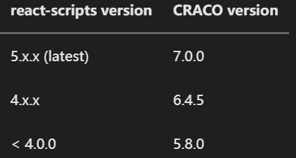

# 一. React中CSS的概述

---

## 1.组件化天下的`CSS`

- 前面说过，整个前端已经是组件化的天下：
  - 而`CSS`的设计就不是为组件化而生的，所以在目前组件化的框架中都在需要一种合适的`CSS`解决方案
- 在组件化中选择合适的`CSS`解决方案应该符合以下条件：
  - 可以编写局部`css`：`css`具备自己的局部作用域，不会随意污染其他组件内的元素
  - 可以编写动态的`css`：可以获取当前组件的一些状态，根据状态的变化生成不同的`css`样式
  - 支持所有的`css`特性：伪类、动画、媒体查询等
  - 编写起来简洁方便、最好符合一贯的`css`风格特点

## 2.`React`中的`CSS`

- 事实上，`css`一直是`React`的痛点，也是被很多开发者吐槽、诟病的一个点
- 在这一点上，`Vue`做的要好于`React`： 
  - `Vue`通过在`.vue`文件中编写` <style></style> `标签来编写自己的样式
  - 通过是否添加` scoped `属性来决定编写的样式是全局有效还是局部有效
  - 通过` lang `属性来设置你喜欢的` less、sass`等预处理器
  - 通过内联样式风格的方式来根据最新状态设置和改变`css`
- `Vue`在`CSS`上虽然不能称之为完美，但是已经足够简洁、自然、方便了，至少统一的样式风格不会出现多个开发人员、多个项目采用不一样的样式风格
- 相比而言，`React`官方并没有给出在`React`中统一的样式风格：
  - 由此，从普通的`css`，到`css modules`，再到`css in js`，有几十种不同的解决方案，上百个不同的库
  - 大家一致在寻找最好的或者说最适合自己的`CSS`方案，但是到目前为止也没有统一的方案


# 二. 内联样式`CSS`写法

---

- **内联样式是官方推荐的一种`css`样式的写法：**
  - `style `接受一个采用**小驼峰命名属性的`js`对象**，，而不是` CSS `字符串
  - 并且可以引用`state`中的状态来设置相关的样式
  
- **内联样式的优点:** 
  - 1.内联样式, 样式之间不会有冲突
  - 2.可以动态获取当前`state`中的状态
  
- **内联样式的缺点：**
  
  1. 写法上都需要使用驼峰标识
  2. 某些样式没有提示
  3. 大量的样式, 代码混乱
  4. 某些样式无法编写(比如伪类/伪元素) 
  
- 所以官方依然是希望内联适合和普通的`css`来结合编写

  	


# 三. 普通`CSS`文件写法

---

- 普通的`css`我们通常会编写到一个单独的文件，之后再进行引入
- 这样的编写方式和普通的网页开发中编写方式是一致的：
  - 如果我们按照普通的网页标准去编写，那么也不会有太大的问题
  - 但是组件化开发中我们总是希望组件是一个独立的模块，即便是样式也只是在自己内部生效，不会相互影响
  - 但是**普通的`css`都属于全局的`css`，样式之间会相互影响**
- 这种编写方式最大的问题是 **样式之间会产生覆盖**


# 四. `CSS Module`写法

---

- `css modules`并不是`React`特有的解决方案，而是**所有使用了类似于`webpack`配置的环境下都可以使用`css module`的**
  - 如果在其他项目中使用它，那么我们需要自己来进行配置，比如配置`webpack.config.js`中的`modules: true`等
- **`React`的脚手架`create-react-app`已经内置了`css modules`的配置**：
  - `.css/.less/.scss `等样式文件都需要修改成` .module.css/.module.less/.module.scss `等
  - 之后就可以引用并且进行使用了
- `css modules`确实解决了局部作用域的问题，也是很多人喜欢在`React`中使用的一种方案
- **最终生成的类名的格式是：`文件名_类名_哈希值`**，如：`Home_section_fxImn`
- 但是这种方案也有自己的缺陷：
  - 引用的类名，**不能使用连接符(`.xxx-xxx`)，在`js`中是不识别的**
  - 所有的`className`都必须使用{`module.className`} 的形式来编写
  - 不方便动态来修改某些样式，依然需要使用内联样式的方式
- 如果你觉得上面的缺陷还算OK，那么你在开发中完全可以选择使用`css modules`来编写，并且也是在`React`中很受欢迎的一种方式


# 五. `react`脚手架中使用`less`的方案

- 方案一：

  - 通过`npm run eject`命令暴露`webpack`文件，然后修改`webpack`配置，安装对应的`loader`如`less-loader，css-loader，style-loader`

- 方案二：

  - `craco`（`create-react-app-config`，一个对` create-react-app `进行自定义配置的社区解决方案）

  - `ant design `本身是用`less`编写样式的，也是用`react`，其文档中有提到如何在`react`中使用`less`

  - `ant design`官网有对应的使用说明：`https://ant.design/docs/react/use-with-create-react-app-cn#%E9%AB%98%E7%BA%A7%E9%85%8D%E7%BD%AE`

  - **安装` craco `并修改 `package.json` 里的 `scripts` 属性**

    ```shell
    npm i @craco/craco -D
    ```
  
  - **通过`craco`命令来运行，会合并根目录下的`craco.config.js`配置文件到`webpack`的配置里**
  
    ```json
      // package.json
    
      "scripts": {
      -  "start": "react-scripts start"
      +  "start": "craco start"
      -  "build": "react-scripts build"
      +  "build": "craco build"
      -  "test": "react-scripts test"
      +  "test": "craco test"
      }
    ```
  
  - `craco`目前支持`4.x`的`create-react-app`版本，如果我们脚手架`create-react-app`使用的`5.x`，可以**安装`aplha`版本**
  
    > 更新：
    >
    > - 2022-11-10
    >
    > - `craco`目前最新版本`7.0.0`开始支持`5.x.x`版本的`react-scripts`
    >
    >   
  
  - `craco`作者对应的回答：`https://github.com/dilanx/craco/issues/445`
  
  - 加不加`-D`，都不影响项目开发，但是按照规范来，最好加上`-D`（即开发阶段依赖）
  
    ```shell
    npm i @craco/craco@alpha -D
    ```

  - **在项目根目录创建一个 `craco.config.js` 用于修改默认配置**

    ```js
      // craco.config.js
    
      module.exports = {
        // ...
      };
    ```
  
  - 引入` craco-less `来帮助加载` less `样式和修改变量
  
  - 安装 `craco-less` 
  
    - 如果有版本问题，导致安装失败，也可采取安装其对应的`alpha`版本
    - 按照规范来说，可以加`-D`，如果忘记加`-D`，不需要重新安装
    - 直接修改`package.json`将`dependencies`中`craco-less`对应的代码，移动到`devDependencies`中也是可以的
    - 这种东西对我们项目开发来说，不影响的，如果是用于第三方库开发，是需要注意的
  
    ```shell
    npm i craco-less -D
    npm i craco-less@alpha -D 
    ```
  
  - 修改 `craco.config.js` 文件如下
  
    ```js
        const CracoLessPlugin = require('craco-less');
    
        module.exports = {
          plugins: [
            {
              plugin: CracoLessPlugin,
              // 下面这些是针对ant design增加的一些配置，如果没用到ant design，可以不配置下面的选项
              options: {
                lessLoaderOptions: {
                  lessOptions: {
                    modifyVars: { '@primary-color': '#1DA57A' },
                    javascriptEnabled: true,
                  },
                },
              },
            },
          ],
        };
    ```


# 六. `CSS in JS`解决方案

---

## 1.认识`CSS in JS`

- 官方文档也有提到过`CSS in JS`这种方案：
  - “`CSS-in-JS`” 是指一种模式，其中` CSS `由` js`生成而不是在外部文件中定义
  - 注意此功能并不是` React `的一部分，而是由第三方库提供
  - `React `对样式如何定义并没有明确态度
- 在传统的前端开发中，我们通常会将结构（`HTML`）、样式（`CSS`）、逻辑（`js`）进行分离
  - 但是在前面的学习中，我们就提到过，`React`的思想中认为逻辑本身和`UI`是无法分离的，所以才会有了`JSX`的语法
  - 样式呢？样式也是属于`UI`的一部分
  - 事实上`CSS-in-JS`的模式就是一种将样式（`CSS`）也写入到`js`中的方式，并且可以方便的使用`js`的状态
  - 所以`React`又被人称之为` All in JS`
  - 当然，这种开发的方式也受到了很多的批评：
  - `Stop using CSS in JavaScript for web development`
  - `https://hackernoon.com/stop-using-css-in-javascript-for-web-development-fa32fb873dcc`

## 2.认识`styled-components`

- 批评声音虽然有，但是在我们看来很多优秀的`CSS-in-JS`的库依然非常强大、方便：

  - `CSS-in-JS`通过`js`来为`CSS`赋予一些能力，包括类似于`CSS`预处理器一样的样式嵌套、函数定义、逻辑复用、动态修改状态等等
  - 虽然`CSS`预处理器也具备某些能力，但是获取动态状态依然是一个不好处理的点
  - 所以，目前可以说`CSS-in-JS`是`React`编写`CSS`最为受欢迎的一种解决方案

- 目前比较流行的**`CSS-in-JS`的库**有哪些呢？

  - `styled-components`
  - `emotion`
  - `glamorous`

- 目前可以说`styled-components`依然是社区最流行的`CSS-in-JS`库，所以我们以`styled-components`的讲解为主

- 安装`styled-components`：

  ```shell
  npm i styled-components 
  ```

## 3.`ES6`标签模板字符串

- `ES6`中增加了模板字符串的语法，这个对于很多人来说都会使用

- 但是模板字符串还有另外一种用法：标签模板字符串（`Tagged TemplateLiterals`）

- 我们一起来看一个普通的`js`的函数：

  - 正常情况下，我们都是通过` 函数名() `方式来进行调用的，其实函数还有另外一种调用方式：

    	

- 如果我们在调用的时候插入其他的变量：

  - 模板字符串被拆分了
  - 第一个元素是数组，是被模块字符串拆分的字符串组合
  - 后面的元素是一个个模块字符串传入的内容

- 在`styled components`中，就是通过这种方式来解析模块字符串，最终生成我们想要的样式的

## 4.`styled`的基本使用

- **`styled-components`的本质是通过`styled`函数的调用，最终创建出一个组件**：

  - 这个组件会被自动添加上一个唯一的`class`
  - `styled-components`会给该`class`添加相关的样式

- 另外，它支持类似于`CSS`预处理器一样的样式嵌套：

  - 支持直接 子代选择器 或 后代选择器，并且直接编写样式

  - 可以通过`&`符号获取当前元素

  - 直接伪类选择器、伪元素等

    		

## 5.`props、attrs`属性

- `props`可以传递

  ·	

- `props`可以被传递给`styled`组件

  - **获取`props`需要通过`${}`传入一个插值函数，该函数会被自动调用，`props`会作为该函数的参数**
  - 这种方式可以有效的解决动态样式的问题

- 添加`attrs`属性，该属性可以设置`props`中某些属性的默认值，`attrs`属性本身也是一个函数，其返回值也是函数，可以形成链式调用

- `attrs`定义的属性，也会被合并到`props`中的

  	

- 也可以这样写

  `

## 6.`styled`高级特性

- **支持样式的继承**

  - 通过`styled`函数传入对应的样式组件，可以实现样式的继承

    	

- **styled设置主题**


# 七. `classnames`库使用

---

## 1.`vue`中添加`class`

- `vue`中添加`class`是一件非常简单的事情：

- 传入一个对象：

  ```vue
  	<div class="static" v-bind:class="{ active: isActive, 'aaa': isAaa}"></div>
  ```

- 传入一个数组：

  ```vue
  	<div :class="[active, aaa]"></div>
  ```

- 对象和数组混合使用：

  ```vue
  	<div :class="[{ active: isActive }, aaa]"></div>
  ```

## 2.`React`中添加`class`

- `React`在`JSX`给了我们开发者足够多的灵活性，你可以像编写`js`代码一样，通过一些逻辑来决定是否添加某些`class`： 

  	

- 这个时候我们可以借助于一个第三方的库：`classnames`

  ```js
  	npm i classnames
  ```
  
  - 很明显，这是一个用于动态添加`classnames`的一个库
  
    	


