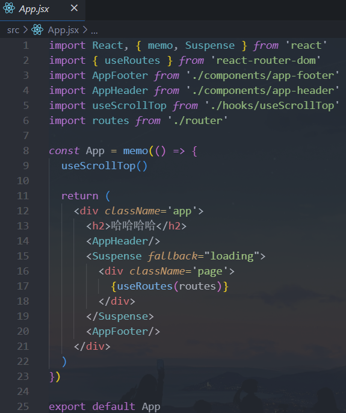

# 一. 认识`React-Router`

---

## 1.认识前端路由

- 路由其实是网络工程中的一个术语：
  - 在架构一个网络时，非常重要的两个设备就是路由器和交换机
  - 当然，目前在我们生活中路由器也是越来越被大家所熟知，因为我们生活中都会用到路由器
  - 事实上，路由器主要维护的是一个映射表
  - 映射表会决定数据的流向
- 路由的概念在软件工程中出现，最早是在后端路由中实现的，原因是`web`的发展主要经历了这样一些阶段：
  - 后端路由阶段
  - 前后端分离阶段
  - 单页面富应用`SPA`

## 2.后端路由阶段

- 早期的网站开发整个`HTML`页面是由服务器来渲染的
  - 服务器直接生产渲染好对应的`HTML`页面, 返回给客户端进行展示
- 但是, 一个网站, 这么多页面服务器如何处理呢?
  - 一个页面有自己对应的网址, 也就是`URL`
  - `URL`会发送到服务器, 服务器会通过正则对该`URL`进行匹配, 并且最后交给一个`Controller`进行处理
  - `Controller`进行各种处理, 最终生成`HTML`或者数据, 返回给前端
- 上面的这种操作, 就是后端路由： 
  - 当我们页面中需要请求不同的路径内容时, 交给服务器来进行处理, 服务器渲染好整个页面, 并且将页面返回给客户端
  - 这种情况下渲染好的页面, 不需要单独加载任何的`js`和`css`, 可以直接交给浏览器展示, 这样也有利于`SEO`的优化
- 后端路由的缺点:
  - 一种情况是整个页面的模块由后端人员来编写和维护的
  - 另一种情况是前端开发人员如果要开发页面, 需要通过`PHP`和`Java`等语言来编写页面代码
  - 而且通常情况下`HTML`代码和数据以及对应的逻辑会混在一起, 编写和维护都是非常糟糕的事情

## 3.前后端分离阶段

- 前端渲染的理解：
  - 每次请求涉及到的静态资源都会从静态资源服务器获取，这些资源包括`HTML`+`CSS`+`JS`，然后在前端对这些请求回来的资源进行渲染
  - 需要注意的是，客户端的每一次请求，都会从静态资源服务器请求文件
  - 同时可以看到，和之前的后端路由不同，这时后端只是负责提供`API`
- 前后端分离阶段：
  - 随着`Ajax`的出现, 有了前后端分离的开发模式
  - 后端只提供`API`来返回数据，前端通过`Ajax`获取数据，并且可以通过`JavaScript`将数据渲染到页面中
  - 这样做最大的优点就是前后端责任的清晰，后端专注于数据上，前端专注于交互和可视化上
  - 并且当移动端(`iOS`/`Android`)出现后，后端不需要进行任何处理，依然使用之前的一套`API`即可
  - 目前比较少的网站采用这种模式开发
- 单页面富应用阶段:
  - 其实`SPA`最主要的特点就是在前后端分离的基础上加了一层前端路由
  - 也就是前端来维护一套路由规则
- 前端路由的核心是什么呢？改变`URL`，但是页面不进行整体的刷新

## 4.`URL`的`hash`

- 前端路由是如何做到`URL`和内容进行映射呢？监听`URL`的改变
- `URL`的`hash`
  - `URL`的`hash`也就是锚点(`#`), 本质上是改变`window.location`的`href`属性
  - 我们可以通过直接赋值`location.hash`来改变`href`, 但是页面不发生刷新


- `hash`的优势就是兼容性更好，在老版`IE`中都可以运行，但是缺陷是有一个`#`，显得不像一个真实的路径

## 5.`HTML5`的`Histor`

- `history`接口是`HTML5`新增的, 它有六种模式改变`URL`而不刷新页面：
  - `replaceState`：替换原来的路径
  - `pushState`：使用新的路径
  - `popState`：路径的回退
  - `go`：向前或向后改变路径
  - `forward`：向前改变路径
  - `back`：向后改变路径


## 6. 认识react-router

- 目前前端流行的三大框架, 都有自己的路由实现

  - `Angular`的`ngRouter`
  - `React`的`React-Router`
  - `Vue`的`vue-router`

- `React Router`在最近两年版本更新的较快，并且在最新的`React Router6.x`版本中发生了较大的变化

  - 目前`React Router6.x`已经非常稳定，我们可以放心的使用

- `React-Router`包是`React Router`的核心，提供了`React-Router-dom`和`React-Router-native`的所有核心功能

- 安装`React Router`：

  - 安装时，我们选择`react-router-dom`

  - 因为`react-router`会包含一些`react-native`的内容，`web`开发并不需要

  - 我们项目是跑在浏览器环境上，所以需要的是基于浏览器页面提供的路由插件
  
    ```shell
    npm i react-router-dom
    ```


# 二. Router的基本使用

---

## 1. Router的基本使用

- `react-router`最主要的`API`是给我们提供的一些组件：

- `BrowserRouter` 或 `HashRouter`

  - `Router`中包含了对路径改变的监听，并且会将相应的路径传递给子组件

  - `BrowserRouter`使用`history`模式

  - `HashRouter`使用`hash`模式

    ```jsx
    import React from 'react';
    import ReactDOM from 'react-dom/client';
    import { HashRouter } from 'react-router-dom'
    
    // import App from './App';
    import App from '@/App'
    
    const root = ReactDOM.createRoot(document.getElementById('root'));
    root.render(
      <React.StrictMode>
        <HashRouter>
          <App />
        </HashRouter>
      </React.StrictMode>
    );	
    ```

## 2. 路由映射配置

- `Routes`：包裹所有的`Route`，在其中匹配一个路由

  - `Router5.x`使用的是`Switch`组件
  - `Router6.x`中必须配置在`Routes`组件中，以前是可以单独存在的

- `Route`：`Route`用于路径的匹配

  - **`path`属性：用于设置匹配到的路径**

  - **`element`属性：设置匹配到路径后，渲染的组件实例**

    - **`Router5.x`使用的是`component`属性**

  - `exact`：精准匹配，只有精准匹配到完全一致的路径，才会渲染对应的组件

    - `Router6.x`不再支持该属性，会自动做一个精准的匹配

      	

## 3. 路由配置和跳转

- `Link`和`NavLink`： 

  - 通常路径的跳转是使用**`Link`组件，最终会被渲染成`a`元素**

  - `NavLink`是在`Link`基础之上增加了一些样式属性

  - `to`属性：`Link`中最重要的属性，用于设置跳转到的路径

    	

## 4. NavLink的使用

- 需求：路径选中时，对应的`a`元素变为红色
- 这个时候，我们要使用`NavLink`组件来替代`Link`组件
- 因为**在路由默认匹配成功时，`NavLink`组件会自动给其转化后的`a`元素添加上一个名为`active`的动态`class`**
- 所以我们直接在`css`文件中编写类名为`active`及对应的样式即可
- 当然，如果你担心这个`class`在其他地方被使用了，出现样式的层叠，也可以自定义`class`，`NavLink`组件有两个属性：
  - `style`：
    - 传入回调函数，该函数接受一个对象类型的参数，该参数包含`isActive`属性
  - `className`：
    - 传入回调函数，该函数接受一个对象类型的参数，该参数包含`isActive`属性

> 注意：
>
> - 传入的回调函数，会`NavLink`内部自动调用
> - 根据其对应的路由（`to`属性中的路径）是否匹配（激活）来决定传入的`isActive`值为`true`或`false`

	

	

```tsx
<NavLink
  to="/"
  style={({ isActive }) =>
  	isActive ? activeStyle : undefined
  }
>
```


## 5. Navigate导航

- **`Navigate`用于路由的重定向，当这个组件出现时，就会执行跳转到对应的`to`路径中**：

- **以前`Router5.x`中叫做`Redirect`**

- 我们这里使用这个的一个案例：

  - 用户跳转到`Profile`界面

  - 但是在`Profile`界面有一个`isLogin`用于记录用户是否登录：

    - `true`：那么显示用户的名称

    - `false`：直接重定向到登录界面

      		

- 我们也可以在匹配到`/`的时候，直接跳转到路径为`/home`页面

  	

- 也可以在登录成功的时候，直接重定向到路径为`/home`的页面

  	

## 6. Not Found页面配置

- 如果用户随意输入一个地址，该地址无法匹配，那么在路由匹配的位置将什么内容都不显示

- 很多时候，我们希望在这种情况下，让用户看到一个`Not Found`的页面

- 这个过程非常简单：

  - 开发一个`Not Found`页面

  - 配置对应的`Route`，并且设置`path`为`*`即可，表示通配符，一般是放在最后面，前面的没匹配到就会被匹配到

    	

    	


# 三. `Router`的路由嵌套

---

- 在开发中，路由之间是存在嵌套关系的

- **以前`react`的路由嵌套需要在对应的页面中配置，现在不需要了**

- 这里我们假设`Home`页面中有两个页面内容：

  - 推荐列表和排行榜列表
  - 点击不同的链接可以跳转到不同的地方，显示不同的内容

- **`<Outlet>`组件用于在父路由元素中作为子路由的占位元素，等子路由匹配到的时候，显示对应的组件**

  		

	


# 四. `Router`的代码跳转

---

- 目前我们实现的跳转主要是通过`Link`或者`NavLink`进行跳转的，实际上我们也可以通过`js`代码进行跳转

  - 我们知道`Navigate`组件是可以进行路由的跳转的，但是依然是组件的方式

  - 如果我们希望通过`js`代码逻辑进行跳转（比如点击了一个`button`），那么就需要获取到`navigate`对象

    	

- **在`Router6.x`版本之后，通过`js`代码逻辑进行跳转的`API`都迁移到了`hooks`的写法**：

  - 如果我们希望进行代码跳转，需要通过`useNavigate`的`Hook`获取到`navigate`对象进行操作
  - 那么如果是一个函数式组件，我们可以直接调用，但是如果是一个类组件呢？
  - **使用高阶组件对类组件进行增强，使该类组件属性具有`navigate`对象**	

	

	


# 五. `Router`的参数传递

---

- 传递参数有二种方式：

  - 动态路由的方式
  - `search`传递参数

- 动态路由的概念指的是路由中的路径并不会固定：

  - 比如`/detail`的`path`对应一个组件`Detail`

  - 如果我们将`path`在`Route`匹配时写成`/detail/:id`，那么` /detail/abc、/detail/123`都可以匹配到该`Route`，并且进行显示

  - 这个匹配规则，我们就称之为动态路由

  - 通常情况下，使用动态路由可以为路由传递参数

    	

- `search`传递参数

  - `Object.fromEntries`
    - 参数：可迭代对象
    - 返回：传入的可迭代对象条目组成对应属性的一个新对象
  - `useSearchParams `返回 一个包含两个值的数组：
    - 当前位置的`search params`  和  可用于更新它们的函数

  ​	


# 六. `Router`的配置方式

---

- 目前我们所有的路由定义都是直接使用`Route`组件，并且添加属性来完成的

- 但是这样的方式会让路由变得非常混乱，我们希望将所有的路由配置放到一个地方进行集中管理：

  - 在早期的时候，`Router`并没有提供相关的`API`，我们需要借助于`react-router-config`库完成

  - 在`Router6.x`中，为我们提供了`useRoutes API`可以完成相关的配置

    ```tsx
    import { useRoutes } from 'react-router-dom'
    import routes from './router'
    
    function App() {
      return <div className="App">{useRoutes(routes)}</div>
    }
    
    export default App	
    ```

- `useRoutes()`只能在`<Router>`组件的上下文中使用，所以我们一般会在`App`组件的外层包裹一个`HashRouter`或`BrowserRouter`组件

  ```js
  // index入口文件
  
  import { HashRouter } from "react-router-dom"
  
  <HashRouter>
    <App/>
  </HashRouter>
  ```

- **默认路由都是同步加载，会打包到同一个`js`文件中**

- 如果我们希望**对某些组件进行异步加载（路由懒加载，分包处理），那么需要使用`React.lazy()`函数来进行懒加载**

  

- **当然懒加载的时候，这个组件很由可能还没下载下来，这时候就需要`React`提供的`Suspense`内置组件进行包裹**

- `Vue`中也有对应的`Suspense`内置组件，作用是一样的

- `fallback`：如果异步组件无法显示，那么会显示`fallback`插槽的内容，如果可以显示，那么显示异步组件的内容

  

- 推荐做法：将`Suspense`放置到使用`useRoutes`函数的组件当中进行包裹，因为`Suspense`只需要对异步组件进行包裹，但是如果提供一个字符串，效果并不好，页面上会出现该字符串闪出然后切换，最好是组件或空字符串（用户不易感知）

- 如果多级路由中，子路由也有使用异步加载，可以给父路由中的`Outlet`占位组件也包裹一层`Suspense`组件（这样当父路由中的子路由发生变化，最外层`useRoutes`所包裹的`Suspense`的替代方案将被子路由这一层中的`Suspense`所替代，也就不会引起父路由那一层级的也进行闪烁）

  	

​		


