# 一. js类型缺失

---

## 1. JavaScript一门优秀的语言

- 我始终相信：任何新技术的出现都是为了解决原有技术的某个痛点
- `js`是一门优秀的编程语言吗？
  - 每个人可能观点并不完全一致，但是从很多角度来看，`js`是一门非常优秀的编程语言
  - 而且，可以说在很长一段时间内这个语言不会被代替，并且会在更多的领域被大家广泛使用
- 著名的`Atwood`定律：
  - `Stack Overflow`的创立者之一的`Jeff Atwood`在2007年提出了著名的`Atwood`定律
  - `any application that can be written in JavaScript, will eventually be written in JavaScript`
  - 任何可以使用`js`来实现的应用都最终都会使用`js`实现
- 其实我们已经看到了，这句话正在一步步被应验：
  - `Web`端的开发我们一直都是使用`js`
  - 移动端开发可以借助于`ReactNative`、`Weex`、`Uniapp`等框架实现跨平台开发
  - 小程序端的开发也是离不开`js`
  - 桌面端应用程序我们可以借助于`Electron`来开发
  - 服务器端开发可以借助于`Node`环境使用`js`来开发

## 2. JavaScript的痛点

- 并且随着近几年前端领域的快速发展，让`js`迅速被普及和受广大开发者的喜爱，借助于`js`本身的强大，也让使用`js`开发的人员越来越多
- 优秀的`js`没有缺点吗？
  - 其实上由于各种历史因素，`js`语言本身存在很多的缺点
  - 比如`ES5`以及之前的使用的`var`关键字关于作用域的问题
  - 比如最初`js`设计的数组类型并不是连续的内存空间
  - 比如直到今天`js`也没有加入类型检测这一机制
- `js`正在慢慢变好
  - 不可否认的是，`js`正在慢慢变得越来越好，无论是从底层设计还是应用层面
  - `ES6`、`7`、`8`等的推出，每次都会让这门语言更加现代、更加安全、更加方便
  - 但是直到今天，`js`在类型检测上依然是毫无进展

## 3. 类型带来的问题

- 首先你需要知道，编程开发中我们有一个共识：**错误出现的越早越好**

  - 能在**写代码的时候**发现错误，就不要在**代码编译时**再发现（`IDE`的优势就是在代码编写过程中帮助我们发现错误）
  - 能在**代码编译期间**发现错误，就不要在**代码运行期间**再发现（类型检测就可以很好的帮助我们做到这一点）
  - 能在开发阶段发现错误，就不要在测试期间发现错误，能在测试期间发现错误，就不要在上线后发现错误

- 现在我们想探究的就是如何在**代码编译期间** **发现代码的错误：**

  - `js`可以做到吗？不可以，我们来看下面这段经常可能出现的代码问题

    ​	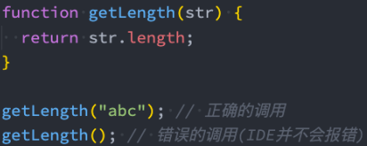	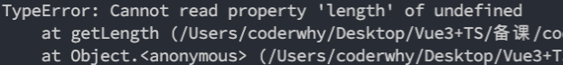	


## 4. 类型错误

-  这是我们一个非常常见的错误：
  - 这个错误很大的原因就是因为`js`没有对我们传入的参数进行任何的限制，只能等到运行期间才发现这个错误
  - 并且当这个错误产生时，会影响后续代码的继续执行，也就是整个项目都因为一个小小的错误而陷入崩溃
- 当然，你可能会想：我怎么可能犯这样低级的错误呢？
  - 当我们写像我们上面这样的简单的`demo`时，这样的错误很容易避免，并且当出现错误时，也很容易检查出来
  - 但是当我们开发一个大型项目时呢？你能保证自己一定不会出现这样的问题吗？而且如果我们是调用别人的类库，又如何知道让我们传入的到底是什么样的参数呢？
- 但是，如果我们可以给`js`加上很多限制，在开发中就可以很好的避免这样的问题了：
  - 比如我们的`getLength`函数中`str`是一个必传的类型，没有调用者没有传编译期间就会报错
  - 比如我们要求它的必须是一个`String`类型，传入其他类型就直接报错
  - 那么就可以知道**很多的错误问题在编译期间就被发现，而不是等到运行时再去发现和修改**

## 5. 类型思维的缺失

- 我们已经简单体会到没有类型检查带来的一些问题，`js`因为从设计之初就没有考虑类型的约束问题，所以造成了前端开发人员关于类型思维的缺失： 
  - 前端开发人员通常不关心变量或者参数是什么类型的，如果在必须确定类型时，我们往往需要使用各种判断验证
  - 从其他方向转到前端的人员，也会因为没有类型约束，而总是担心自己的代码不安全，不够健壮
- 所以我们经常会说`js`不适合开发大型项目，因为当项目一旦庞大起来，这种宽松的类型约束会带来非常多的安全隐患，多人员开发它们之间也没有良好的类型契约
  - 比如当我们去实现一个核心类库时，如果没有类型约束，那么需要对别人传入的参数进行各种验证来保证我们代码的健壮性
  - 比如我们去调用别人的函数，对方没有对函数进行任何的注释，我们只能去看里面的逻辑来理解这个函数需要传入什么参数，返回值是什么类型


# 二. 邂逅ts开发

---

## 1. js添加类型约束

- 为了弥补`js`类型约束上的缺陷，增加类型约束，很多公司推出了自己的方案：
  - 2014年，`Facebook`推出了`flow`来对`js`进行类型检查
  - 同年，`Microsoft`微软也推出了`TypeScript1.0`版本
  - 他们都致力于为`js`提供类型检查
- 而现在，无疑`TypeScript`已经完全胜出： 
  - `Vue2.x`的时候采用的就是`flow`来做类型检查
  - `Vue3.x`已经全线转向`TypeScript`，98.3%使用`TypeScript`进行了重构
  - 而`Angular`在很早期就使用`TypeScript`进行了项目重构并且需要使用`TypeScript`来进行开发
  - 而甚至`Facebook`公司一些自己的产品也在使用`TypeScript` 
- 学习`TypeScript`不仅仅可以为我们的代码增加类型约束，而且可以培养我们前端程序员具备类型思维
  - 如果之后想要学习其他语言，比如`Java`、`Dart`等也会是驾轻就熟

## 2. 认识TypeScript

- 虽然我们已经知道`TypeScript`是干什么的，也知道它解决了什么样的问题，但是我们还是需要全面的来认识一下`TypeScript`到底是什么？
- 我们来看一下`TypeScript`在`GitHub`和官方上对自己的定义：
  - `GitHub`说法：`TypeScript is a superset of JavaScript that compiles to clean JavaScript output`
  - `TypeScript`官网：`TypeScript is a typed superset of JavaScript that compiles to plain JavaScript`
  - 翻译一下：`TypeScript`是拥有类型的`js`超集，它可以编译成普通、干净、完整的`js`代码
- 怎么理解上面的话呢？
  - 我们可以将`ts`理解成加强版的`js`
  - `js`所拥有的特性，`ts`全部都是支持的，并且它紧随`ECMAScript`的标准，所以`ES6、ES7、ES8`等新语法标准，它都是支持的
  - `ts`在实现新特性的同时，总是保持和`ES`标准的同步甚至是领先
  - 并且在语言层面上，不仅仅增加了类型约束，而且包括一些语法的扩展，比如枚举类型（`Enum`）、元组类型（`Tuple`）等
  - 并且**`ts`只是用在开发阶段做类型限制的，最终会被编译成`js`代码，所以并不需要担心它的兼容性问题**，在编译时也可以不借助于`Babel`这样的工具
- 所以，我们可以把`ts`理解成更加强大的`js`，不仅让`js`更加安全，而且给它带来了诸多好用的好用特性

## 3. TypeScript的特点

- 官方对`ts`有几段特点的描述，我觉得非常到位（虽然有些官方，了解一下），我们一起来分享一下：
- 始于`js`，归于`js`
  - `ts`从今天数以百万计的`js`开发者所熟悉的语法和语义开始
  - 使用现有的`js`代码，包括流行的`js`库，并从`js`代码中调用`ts`代码
  - `ts`可以编译出纯净、 简洁的`js`代码，并且可以运行在任何浏览器上、`Node.js`环境中和任何支持`ECMAScript3`（或更高版本）的`js`引擎中
- `ts`是一个强大的工具，用于构建大型项目
  - 类型允许`js`开发者在开发`js`应用程序时，使用高效的开发工具和常用操作比如静态检查和代码重构
  - 类型是可选的，类型推断让一些类型的注释使你的代码的静态验证有很大的不同。类型让你定义软件组件之间的接口和洞察现有`js`库的行为
- 拥有先进的`js`
  - `ts`提供最新的和不断发展的`js`特性，包括那些来自2015年的`ECMAScript`和未来的提案中的特性，比如异步功能和`Decorators`，以帮助建立健壮的组件
  - 这些特性为高可信应用程序开发时是可用的，但是会被编译成简洁的`ECMAScript3`（或更新版本）的`js`

## 4. 众多项目采用TypeScript 

- 正是因为有这些特性，`ts`目前已经在很多地方被应用：
  - `Angular`源码在很早就使用`ts`来进行了重写，并且开发`Angular`也需要掌握`ts` 
  - `Vue3`源码也采用了`ts`进行重写，在阅读源码时你会看到大量`ts`的语法 
  - 包括目前已经变成最流行的编辑器`VSCode`也是使用`ts`来完成的
  - 包括在`React`中已经使用的`ant-design`的`UI`库，也大量使用`ts`来编写 
  - 目前公司非常流行`Vue3 + ts`、`React + ts`的开发模式
  - 包括小程序开发，也是支持`ts`的

## 5. 前端学不动系列

- 在之前`deno`的`issue`里面出现了一个问题：

  

## 6. 大前端的发展趋势

- 大前端是一群最能或者说最需要折腾的开发者：
  - 客户端开发者：从`Android`到`iOS`，或者从`iOS`到`Android`，到`RN`，甚至现在越来越多的客户端开发者接触前端相关知识（`Vue、React、Angular、小程序`）
  - 前端开发者：从`jQuery`到`AngularJS`，到三大框架并行：`Vue、React、Angular`，还有小程序，甚至现在也要接触客户端开发（比如`RN`、`Flutter`）
  - 目前又面临着不仅仅学习`ES`的特性，还要学习`ts` 
  - 新框架的出现，我们又需要学习新框架的特性，比如`vue3.x`、`react18`等
  - 新的工具也是层出不穷，比如`vite`（版本更新也很快）
- 但是每一样技术的出现都会让惊喜，因为他必然是解决了之前技术的某一个痛点的，而`ts`真是解决了`js`存在的很多设计缺陷，尤其是关于类型检测的
- 并且从开发者长远的角度来看，学习`ts`有助于我们前端程序员培养 类型思维，这种思维方式对于完成大型项目尤为重要


# 三. ts运行环境

---

## 1. ts的编译环境

- 在前面我们提到过，`ts`最终会被编译成`js`来运行，所以我们需要搭建对应的环境：

  - 我们需要在电脑上安装`ts`，这样就可以通过`ts`的`Compiler`将其编译成`js`

    	

- 所以，我们需要先可以先进行全局的安装：

  ```shell
  # 安装命令
  npm i typescript -g
  
  # 查看版本
  tsc --version
  ```

## 2. ts的运行环境

- 如果我们每次为了查看`ts`代码的运行效果，都通过经过两个步骤的话就太繁琐了：

  - 第一步：通过`tsc`编译`ts`到`js`代码

    ```shell
    # 编译 xxx.ts 文件到 js 代码
    tsc xxx.ts
    ```

  - 第二步：在浏览器或者`Node`环境下运行`js`代码

- 是否可以简化这样的步骤呢？

  - 比如编写了`ts`之后可以直接运行在浏览器上？
  - 比如编写了`ts`之后，直接通过`node`的命令来执行？ 

- 上面我提到的两种方式，可以通过两个解决方案来完成：

  - 方式一：通过`webpack`，配置本地的`ts`编译环境和开启一个本地服务，可以直接运行在浏览器上
  - 方式二：通过`ts-node`库，为`ts`的运行提供执行环境

## 3. 使用webpack运行ts

- 方式一：`webpack`配置

  - 对应的文章

  - https://mp.weixin.qq.com/s/wnL1l-ERjTDykWM76l4Ajw

## 4. 使用ts-node运行ts

- 方式二：全局安装`ts-node`

  ```shell
  npm i ts-node -g
  ```

- 另外`ts-node`需要依赖` tslib `和` @types/node `两个包：

  ```shell
  npm i tslib @types/node -g
  ```

- 现在，我们可以直接通过` ts-node `来运行`ts`的代码

  ```shell
  ts-node xxx.ts
  ```


# 四. ts变量声明

---

## 1. 变量的声明

- 我们已经强调过很多次，在`ts`中定义变量需要指定 标识符 的类型

- 所以完整的声明格式如下：

  - 声明了类型后`ts`就会进行类型检测，**声明的类型可以称之为类型注解（`Type Annotation`）** 

    ```js
      var/let/const 标识符: 数据类型 = 赋值;
    ```

- 比如我们声明一个`message`，完整的写法如下：

  - 注意：这里的`string`是小写的，和`String`是有区别的

  - **`string`是`ts`中定义的字符串类型，`String`是`ECMAScript`中定义的一个类**

    ```typescript
      let message: string = "Hello world"
    ```

- 如果我们给`message`赋值其他类型的值，那么就会报错：

  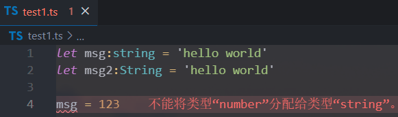

## 2. 声明变量的关键字

- 在`ts`定义变量（标识符）和`ES6`之后一致，可以使用`var`、`let`、`const`来定义

  ```typescript
    var msg: string = 'later'
    let num: number = 100
    const num2: number = 200
  ```

- 当然，在`tslint`中并不推荐使用`var`来声明变量：

  - 可见，在`ts`中不建议再使用`var`关键字了，主要原因和`ES6`升级后`let`和`var`的区别是一样的，`var`是没有块级作用域的，会引起很多的问题，这里不再展开探讨

    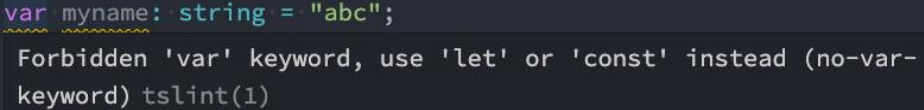

## 3. 变量的类型推导（推断）

- 在开发中，有时候为了方便起见我们并不会在声明每一个变量时都写上对应的数据类型，我们更希望可以通过`ts`本身的特性帮助我们推断出对应的变量类型：

  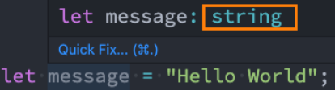		

- 如果我们给`message`赋值`123`：

  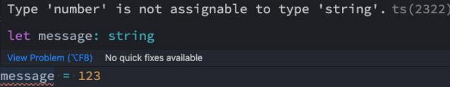	

- 这是因为在一个**变量第一次赋值时，会根据后面的赋值内容的类型，来推断出变量的类型**：

  - 上面的`message`就是因为后面赋值的是一个`string`类型，所以`message`虽然没有明确的说明，但是依然是一个`string`类型

    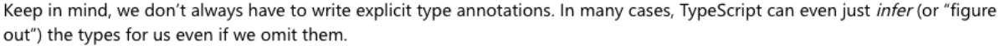

  - 请记住，我们并不总是必须编写显式的类型注释。在很多情况下，`TypeScript`甚至可以为我们推断(或“找出”)类型，即使我们忽略了它们

    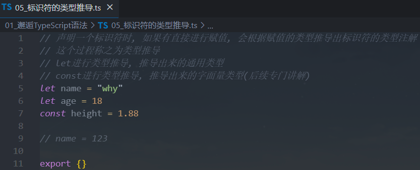	

> 注意：
>
> - **`let`进行类型推导时，推导出来的通用类型**
>
> - **`const`进行类型推导时，推导出来的则是字面量类型**
>
>   ```js
>   	const height = 1.88 // height 类型为 1.88
>     let height = 1.88 // height 类型为 number
>   ```


# 五. js数据类型

---

## 1. js 和 ts的数据类型

- 我们经常说`ts`是`js`的一个超集：

  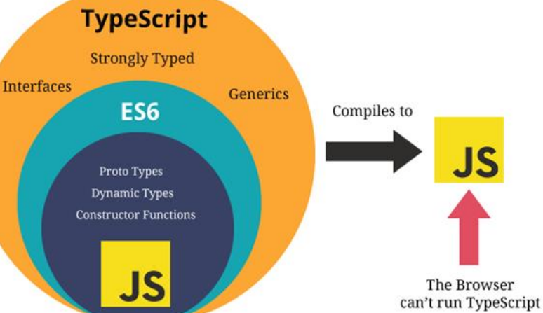			

## 2. number类型

- 数字类型是我们开发中经常使用的类型，`ts`和`js`一样，不区分整数类型（`int`）和浮点型（`double`），统一为`number`类型

  ```js
    let num = 100
    num = 20
    num = 6.66
  ```

- 学习过`ES6`应该知道，**`ES6`新增了二进制和八进制的表示方法**，而`ts`也是支持二进制、八进制、十六进制的表示：

  ```js
    num = 100 // 十进制
    num = 0b110 // 二进制
    num = 0o555 // 八进制
    num = 0xf23 // 十六进制
  ```

## 3. boolean类型

- `boolean`类型只有两个取值：`true` 和 `false`，非常简单

  ```typescript
    let flag: boolean = true
    flag = false	
    flag = 20 > 30
  ```

## 4. string类型

- `string`类型是字符串类型，可以使用单引号或者双引号表示：

  ```typescript
    let msg: string = 'hello world'
    msg = 'hello ts'
  ```

- 同时也支持`ES6`的模板字符串来拼接变量和字符串：

  ```js
    const name = 'later'
    const age = 18
    const info = `my name is ${name}, age is ${age}`
  ```

## 5. Array类型

- 数组类型的定义也非常简单，有两种方式：

  - 明确指定`<数组>`的类型注解

  - `Array<string>`事实上是一种泛型的写法，我们会在后续中学习它的用法
  
    ```typescript
      // string[]: 数组类型，并且数组中存放的只能是字符串类型
      const names: string[] = ['aaa', 'bbb', 'ccc']
    
      // Array<string>: 数组类型，并且数组中存放的只能是字符串类型
      const names2: Array<string> = ['aaa', 'bbb', 'ccc']
    ```

- 注意：**在实际开发中，数组一般存放相同的类型，不要存放不同的类型**

- 如果添加其他类型到数组中，那么会报错：

  ```typescript
  	// 下面两个都不允许
  	names.push(123) // number 类型的参数不能赋值给 string类型的参数
  	names2.push(123) // number 类型的参数不能赋值给string类型的参数
  ```

## 6. Object类型

- `object`对象类型可以用于描述一个对象：

  ```typescript
    const myInfo: object = {
      name: 'later',
      age: 18
    }
  ```

- **类型注解为`object`时，表明的是通用对象类型，不知道有哪些属性，即一个空对象类型**

- 所以从`myinfo`中我们不能获取数据，也不能设置数据：

  ```typescript
    myInfo['name'] = 'later-zc'
    console.log(myInfo['name']);
  ```

- 报错信息如下：

  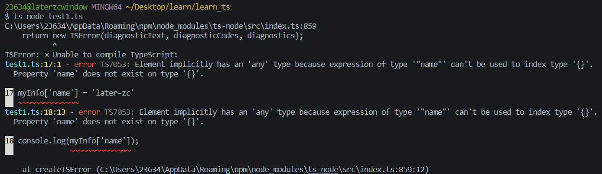

## 7. Symbol类型

- 在`ES5`中，如果我们是不可以在对象中添加相同的属性名称的，比如下面的做法：

  	

- 通常我们的做法是定义两个不同的属性名字：比如`identity1`和`identity2`

- 但是我们也可以通过`symbol`来定义相同的名称，因为`Symbol`函数返回的是不同的值：

  ```typescript
    const s1: symbol = Symbol('title')
    const s2: symbol = Symbol('title')
  
    const person = {
      [s1]: '程序员',
      [s2]: '老师'
    }
  ```

## 8. null 和 undefined类型

- 在`js`中，`undefined `和` null `是两个基本数据类型

- 在`ts`中，它们各自的类型也是`undefined`和`null`，也就意味着它们既是实际的值，也是自己的类型：

  ```typescript
    let n: null = null
    let u: undefined = undefined
  ```

## 9. 函数的参数类型

- 函数是`js`非常重要的组成部分，`ts`允许我们指定函数的参数和返回值的类型

- 参数的类型注解

  - 声明函数时，可以在每个参数后添加类型注解，以声明函数接受的参数类型

  - 同时也限制了参数的数量
  
    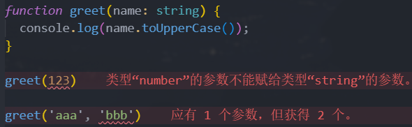

## 10. 函数的返回值类型

- 我们也可以添加函数返回值的类型注解，这个注解出现在函数列表的后面：

  ```typescript
    function sum(num1: number, num2: number): number {
      return num1 + num2
    }
  ```

- 和变量的类型注解一样，我们通常情况下不需要返回类型注解

- 因为**`ts`会根据`return`返回值自动推断函数的返回类型**

- **某些第三方库出于方便理解，会明确指定返回类型**，看个人喜好

## 11. 匿名函数的参数

- 匿名函数与函数声明会有一些不同：
  - 当一个函数出现在`ts`可以确定该函数会被如何调用的地方时
  
  - 该函数的参数会自动指定类型
  
    ```typescript
    	const names = ['abc', 'cba', 'nba']
      names.forEach(item => console.log(item.toUpperCase()))
    ```
  
- 我们并没有指定`item`的类型，但是`item`是一个`string`类型：
  - 这是因为`ts`会根据`forEach`函数接收的参数类型以及数组的类型推断出`item`的类型
  - 我们自己写可能还会写错，所以大多数情况下，匿名函数中的参数不需要添加类型注解
  - 这个过程称之为**上下文类型（`contextual typing`），因为函数执行的上下文可以帮助确定参数和返回值的类型**

## 12. 对象类型

- 如果我们希望限定一个函数接受的参数是一个对象，这个时候要如何限定呢？

  - 我们可以使用对象类型

    ```typescript
    	function printCoordinate(point: {x: number, y: number}) {
        console.log('x坐标: ', point.x)
        console.log('y坐标：', point.y)
      }
    	
    	printCoordinate({x: 10, y: 30})
    ```

- 在这里我们使用了一个对象来作为类型：

  - 在对象当中我们可以添加属性，并且告知`ts`该属性需要是什么类型
  - 属性之间可以使用` , `或者` ; `来分割，最后一个分隔符是可选的
  - 每个属性的类型部分也是可选的，如果不指定，那么就是`any`类型

## 13. 可选类型

- 对象类型也可以指定哪些属性是可选的，可以在属性的后面添加一个`?`：

  ```typescript
  	function printCoordinate(point: {x: number, y: number, z?: number}) {
      console.log('x坐标: ', point.x)
      console.log('y坐标：', point.y)
      if (point.z) console.log(point.z)
    }
  	
  	printCoordinate({x: 10, y: 30})
  ```


# 六. `ts`数据类型

---

## 1. any类型

- 在某些情况下，我们确实无法确定一个变量的类型，并且可能它会发生一些变化，这个时候我们可以使用`any`类型（类似于`Dart`语言中的`dynamic`类型）

- `any`类型有点像一种讨巧的`ts`手段：

  - 我们可以对`any`类型的变量进行任何的操作，包括获取不存在的属性、方法

  - 我们给一个`any`类型的变量赋值任何的值，比如数字、字符串的值

    ```typescript
    	let a: any = 'later'
      a = 123
    	a = true
    
    	const aArray: any[] = ['later', 1, {}]
    ```

- 如果对于某些情况的处理过于繁琐不希望添加规定的类型注解，或者在引入一些第三方库时，缺失了类型注解，这个时候我们可以使用`any`： 

  - 包括在`Vue`源码中，也会使用到`any`来进行某些类型的适配

> 注意：**`any`表示标识符可以为任意类型，并且可以在该标识符上面进行任意的操作**（类似于回到`js`中）

## 2. unknown类型

- `unknown`是`ts`中比较特殊的一种类型，它**用于描述类型不确定的变量**

  - 和`any`类型有点类似，但是**`unknown`类型默认情况下在上面进行任意的操作都是不合法的**

- 什么意思呢？我们来看下面的场景：

  ```typescript
  	function foo(): string {
      return 'foo'
    }
  
  	function bar(): number {
      return 123
    }
  
  	const flag = true
    let res: unknown
    
    if (flag) {
      res = foo()
    } else {
      res = bar()
    }
  	
  	console.log(res.length) // 报错：对象的类型为'unknown'
  
  	// 必须进行类型的检验(缩小)，才能根据缩小后的类型，进行对应的操作
  	if (typeof res === 'string') { // 类型缩小
      console.log(res.length， res.split(''))
    }
  ```

## 3. void类型

- **`void`通常用来指定一个函数是没有返回值的**，那么它的**返回值就是`void`类型**：

  ```typescript
  	function sum(num1: number, num2: number) {
      console.log(num1 + num2)
    }
  ```

- 这个函数我们没有写任何类型，那么它**默认返回值的类型就是`void`的**，我们也可以显示的来指定返回值是`void`： 

  ```typescript
    function sum(num1: number, num2: number): void {
      console.log(num1 + num2)
    }
  ```

- 这里还有一个注意事项：

  - 我们可以将`undefined`赋值给`void`类型，也就是函数可以返回`undefined`

- **当基于上下文的类型推导（`Contextual Typing`）推导出返回类型为` void `的时候，并不会强制函数一定不能返回内容**

  ```typescript
  	type FnType = () => void
  	const foo: FnType = () => 123
    
    const names = ['abc', 'cba', 'nba']
    /*
    	Array<string>.forEach(
    		callbackfn: (value: string, index: number, array: string[]) => void, 
    		thisArg?: any
      ): void
    */
    namse.forEach(item => item.length)
  ```
  

> 总结：
>
> - 在`ts`中如果一个函数没有任何的返回值，那么返回值的类型就是`void`类型
> - 如果返回值是`void`类型，那么我们也可以返回`undefined`（`ts`编译器允许这样做而已）
> - 基于上下文类型推导的函数中的返回值如果是`void`类型，并且不强制要求不能返回任何东西

## 4. never类型

- **`never `表示永远不会发生值的类型**，比如一个函数：

  - 如果一个函数中是一个死循环或者抛出一个异常，那么这个函数会返回东西吗？

  - 不会，那么写`void`类型或者其他类型作为返回值类型都不合适，我们就可以使用`never`类型

    ```typescript
    	function loopFun(): never {
        while(true) {
          console.log('123')
        }
      }
    
    	function loopErr(): never {
        throw new Error()
      }
    ```

- `never`有什么样的应用场景呢？这里我们举一个例子，但是它用到了联合类型，后面我们会讲到：

  ```typescript
    function handleMessage(message: string | number) {
      switch(typeof message) {
        case 'string':
          console.log(message.length)
          break
        case 'number':
          console.log(message)
          break
        // 其他人在扩展工具的时候（扩展message的类型），对于一些没有处理的case，可以直接报错进行提示
        default: 
          const check: never = message
      }
    }
  ```

> `never`的应用场景：
>
> - 实际开发中很少去定义`never`类型，某些情况下会自动进行类型推导出`never`
> - 开发框架（工具）的时候可能会用到`never`
> - 封装一些类型工具的时候，可以使用`never`，类型体操的练习：`never`

## 5. tuple类型

- `tuple`是元组类型，很多语言中也有这种数据类型，比如`Python`、`Swift`等

  ```typescript
  	const tInfo: [string, number, number] = ['later', 18, 1.88]
    const item1 = tInfo[0] // 'later'，并且知道类型是 string 类型
    const item2 = tInfo[1] // 18，并且知道类型是 number 类型
  ```

- 那么`tuple`和数组有什么区别呢？

  - 首先，数组中通常建议存放相同类型的元素，不同类型的元素是不推荐放在数组中（可以放在对象或者元组中）

  - 其次，**元组中每个元素都有自己特定的类型，根据索引值获取到的值可以确定对应的类型**

    ```typescript
    	const info: (string | number)[] = ['later', 18, 1.88]
      const item1 = info[0] // 不能确定类型
      
      const tInfo: [string, number, number] = ['later', 18, 1.88]
      const item2 = tInfo[0] // 一定是 string 类型
    ```

- `Tuple`的应用场景

- 那么`tuple`在什么地方使用的是最多的呢？

  - **`tuple`通常可以作为返回的值，在使用的时候会非常的方便**

    ```typescript
    	// 在函数中使用元组类型是最多的(函数的返回值)
    	function useState(initialState: number):[number, (newValue: number) => void] {
        let stateValue = initialState
        function setValue(newValue: number) {
          stateValue = newValue
        }
        return [stateValue, setValue]
      }
    
    	const [count, setCount] = useState(0)
      setCount(100)
    ```

    


