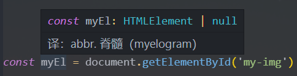
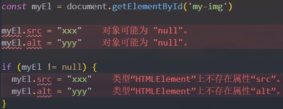
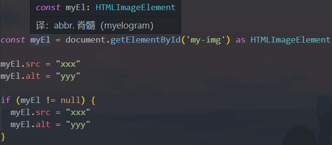

# 一. 联合类型 和 交叉类型

---

## 01. 联合类型

- `TS` 的类型系统允许我们使用多种运算符，从现有类型中构建新类型

- 我们来使用第一种组合类型的方法：**联合类型**（`Union Type`）

  - 联合类型是**由两个或多个其他类型组成的类型**

  - 表示可以是这些类型中的任何一个值

  - **`联合类型` 中的 `每一个` 类型被称之为 `联合成员`**（`union's members`）

    ```typescript
    let foo: string | number = 'abc'
    foo = 100
    
    function printId(id: number | string) {
    	console.log('id: ', id)
    }
    
    printId(10) // id: 10
    printId('abc') // id: abc
    ```

## 02. 使用联合类型

- 传入给一个联合类型的值是非常简单的：只要保证是联合类型中的某一个类型的值即可

  - 但是我们拿到这个值之后，应该如何使用它呢？
  - 因为它可能是联合类型中的任意一种类型
  - 比如拿到的值可能是 `string` 或 `number`，就不能对其调用 `string` 上的一些方法

- 那怎么处理这样的问题呢？

  - 我们需要使用**缩小（`narrow`）联合**（后续我们还会专门讲解缩小相关的功能）

  - **`ts` 可以根据我们 `缩小` 的 `代码结构`，推断出 `更具体` 的类型**

    ```typescript
    function printId(id: number | string) {
      if (typeof id === 'string') {
        // 确定是 string 类型
        console.log('id: ', id.toUpperCase())
      } else {
        // 确定是 number 类型
        console.log('id: ', id)
      }
    }
    ```

## 03. 交叉类型

- 前面我们学习了联合类型：

  - **联合类型表示满足多个类型的 `其中一个` 即可**

  - 联合类型使用 `|` 符号

    ```typescript
    type Alignment = 'left' | 'center' | 'right'
    ```

- 还有另外一种类型合并，就是交叉类型（`Intersection Types`）：

  - **交叉类似表示同时满足 `多个类型` 的条件**
  - 交叉类型使用 `&` 符号

- 我们来看下面的交叉类型：

  ```typescript
  type MyType = number & string // 无意义，等同于 never 类型
  ```

  - 表达的含义是 `number` 和 `string` 要同时满足
  - 但是有同时满足是一个 `number` 又是一个 `string` 的值吗？
  - 其实是没有的，所以 `MyType` 其实是一个 `never` 类型

## 04. 交叉类型的应用

- 所以在开发中，我们**使用 `交叉类型` 时，通常是对 `对象类型` 进行交叉的**：

  ```typescript
  interface IPerson {
    name: string
    age: number
  }
  
  interface IKun {
    dance: () => void
  }
  
  const obj: IPerson & IKun = {
    name: 'later',
    age: 18,
    dance: () => console.log('dancing')
  }
  ```


# 二. type 和 interface 使用

---

## 01. 类型别名 - type

- 在前面，我们通过在类型注解中编写 对象类型 和 联合类型，但是当我们想要多次在其他地方使用时，就要重复编写多次

- 为了避免重复编写，我们可以给对象类型起一个别名：

  ```typescript
  type Point = {
    x: number
    y: number
  }
  
  function printPoint(point: Point) {
    console.log(point.x, point.y)
  }
  function sumPoint(point: Point) {
    console.log(point.x + point.y)
  }
  printPoint({x: 20, y: 30})
  sumPoint({x: 20, y: 30})
  
  type ID = number | string
  
  function printId(id: ID) {
    console.log('id: ', id)
  }
  ```

## 02. 接口的声明

- 在前面我们可以通过 `type` 来声明一个对象类型的别名：

  ```typescript
  type Point = {
    x: number
    y: number
  }
  ```

- 对象类型的另外一种声明方式就是通过接口来声明：

  ```typescript
  interface Point {
    x: number
    y: number
  }
  ```

- 那么它们有什么区别呢？

  - 类型别名和接口非常相似，在定义对象类型时，大部分时候，可以任意选择使用
  - 接口的几乎所有特性都可以在 `type` 中使用（后续我们还会学习 `interface` 的很多特性）

## 03. type 和 interface 的区别

- 我们会发现 `interface` 和 `type` 都可以用来定义对象类型

- 那么在开发中定义对象类型时，到底选择哪一个呢？

  - 如果是**定义 `非对象类型`，通常推荐使用 `type`**
  - 比如 `Direction`、`Alignment`、一些 `Function`

- 如果是定义对象类型，那么他们是有区别的：

  - **`interface` 可以 `重复` 的对某个接口来定义属性和方法**

  - **而 `type` 定义的是 `别名`，别名是 `不能重复` 的**

    ```typescript
    interface IPerson {
      name: string
      running: () => void
    }
    
    interface IPerson {
      age: number
    }
    
    type Person = {
      // ...
    }
    
    // error: 重复标识符'Person'
    type Person = {
      // ...
    }
    ```

- 所以，`interface` 可以为现有的接口提供更多的扩展

  - 接口还有很多其他的用法，我们会在后续详细学习

- 具体区别：

  - 区别一：**`type` 类型使用范围更广,  `interface` 类型只能用来声明对象**

    ```typescript
    type MyNumber = number
    type IDType = number | string
    ```

  - 区别二：**在声明对象时，`interface` 可以多次声明**

    ```typescript
    // 2.1. type 不允许两个相同名称的别名同时存在
    type PointType1 = {
      x: number
      y: number
    }
    
    type PointType1 = {
      z?: number
    }
    
    // 2.2. interface 可以多次声明同一个接口名称
    interface PointType2 {
      x: number
      y: number
    }
    
    interface PointType2 {
      z: number
    }
    
    const point: PointType2 = {
      x: 100,
      y: 200,
      z: 300
    }
    ```

  - 区别三：**`interface` 支持继承**

    ```typescript
    interface IPerson {
      name: string
      age: number
    }
    
    interface IKun extends IPerson {
      kouhao: string
    }
    
    const ikun1: IKun = {
      kouhao: "你干嘛, 哎呦",
      name: "kobe",
      age: 30
    }
    ```

  - 区别四：**`interface` 可以被类实现**（`TS` 面向对象时候再讲）

    ```typescript
    class Person implements IPerson {
      // ...
    }
    ```
  
  > 总结：
  >
  > - **`type` 可以定义对象类型和非对象类型，`interface` 只能定义对象类型**
  > - **`type` 不支持重复定义别名，`interface` 支持重复定义接口**
  > - **`interface` 支持 `继承`，可以被类 `实现`**
  > - 如果是非对象类型的定义使用 `type`
  > - 如果是对象类型的声明那么使用 `interface`


# 三. 类型断言 和 非空断言

---

## 01. 类型断言 as

- **`TS` 有些情况下，无法获取 `具体` 的类型信息，这时候就需要使用 `类型断言`**（`Type Assertions`）

  - 比如：通过 `document.getElementById` 去获取某个元素

  - `ts` 只知道该函数会返回 `HTMLElement`，但并不知道它具体的元素类型：

    

  - 所以就会导致，后续即使我们使用缩小类型相关的操作，来访问某些属性时也会报错

    

- 如果我们确定这里获取到的元素是 `HTMLImageElement` 类型

- 这时，就可以使用类型断言，之前的操作也就不会引起报错了：

  

- **`ts` 只允许 `类型断言` 转换为 `更具体` 或 `不太具体`(`any`/`unknown`)的类型版本**

- 此规则可防止不被支持的强制转换：

  ```typescript
  const age: number = 18
  // 错误的做法
  const age2 = age as string // 报错：类型'number'到类型'string'的转换可能是错误的，因为两种类型不能充分重叠，如果这是有意的，请先将表达式转换为'unknown'
  ```

- 当然有一种写法可以规避这个问题，但是不建议，除非咱们是知道该做法是不会有问题的

  ```typescript
  // TS 类型检测来说是正确的, 但是这个代码本身不太正确
  const age3 = age as any
  const age4 = age3 as string
  console.log(age4.split(" "))
  ```

>注意：
>
>- 如果是 `document.querySelector` 去获取一个类名，`ts` 只知道该函数会返回`Element | null`
>- 具体是什么类型，根据实际情况来定

## 02. 非空类型断言 !

- 当我们编写下面的代码时，在执行 `ts` 的编译阶段会报错：

  ```typescript
  function printMessage(message?: string) {
    console.log(message.toUpperCase()) // 报错：Object is possibly 'undefined'
  }
  
  printMessage('hello')
  ```

- 这是因为传入的 `message` 有可能是为 `undefined` 的

- 这个时候是不能执行方法的，我们可以使用可选链来处理

  ```typescript
  function printMessage(message?: string) {
    console.log(message?.toUpperCase())
  }
  
  printMessage('hello')
  ```

- 当我们确定传入的参数是有值的，这个时候我们也可以使用非空类型断言

- **`非空断言` 使用的是 `!`，表示可以 `确定` 某个标识符是 `有值的`，跳过 `ts` 在编译阶段对它的检测**

  ```typescript
  function printMessage(message?: string) {
    console.log(message!.toUpperCase())
  }
  
  printMessage('hello')
  ```

- 但是，如果是属性赋值的操作呢？可选链还能行吗？

  ```typescript
  interface IPerson {
    name: string
    friend?: {
      name: string
    }
  }
  
  const info: IPerson = {
    name: "later",
  }
  
  info?.friend?.name = 'hehe' // 报错：赋值表达式的左侧不能是可选属性访问
  ```

- 所以这时，像上面的情况，我们有如下两种解决方案：

  - 方案一：类型缩小

    ```typescript
    if (info.friend) {
      info.friend.name = "kobe"
    }
    ```

  - 方案二：非空类型断言（有风险，只有确保属性一定有值的情况，才推荐使用）

    ```typescript
    info.friend!.name = "james"
    ```


# 四. 字面量类型 和 类型缩小

---

## 01. 字面量类型

- 除了前面我们所讲过的类型之外，也可以使用字面量类型（`literal types`）：

  ```typescript
  let message: 'hello' = 'hello'
  message = '你好啊' 
  // 报错：Type '你好啊' is not assignable to type 'hello'
  ```

- 那么这样做有什么意义呢？

  - 默认情况下这么做是没有太大的意义的

  - 但是我们可以将多个字面量类型联合在一起
  
    ```typescript
    type Alignment = 'left' | 'center' | 'right'
    
    function changeAlign(align: Alignment) {
      console.log('修改方向：', align)
    }
    
    changeAlign('left')
    ```

## 02. 字面量推理

- 我们来看下面的代码：

  ```typescript
  const info = {
    url: 'aaa/bbb/ccc',
    method: 'GET'
  }
  
  function request(url: string, method: 'GET' | 'POST') {
    console.log(url, method)
  }
  
  request(info.url, info.method) 
  // 报错：类型'string'的参数不能赋值给类型'GET' | 'POST'的参数
  ```

- 这是因为我们的对象在进行字面量推理的时候

- `info` 其实是一个 `{url: string, method: string}` 对象类型

- 所以我们没办法将一个 `info.method => string` 类型赋值给一个字面量类型

- 解决方式一：类型断言

  ```typescript
  request(info.url, info.method as 'GET')
  ```

- 解决方式二：让 `info` 对象类型是一个字面量类型

  ```typescript
  // 这样显式写会比较麻烦，如果对象属性比较多呢
  const info: {url: string, method: 'GET' | 'POST'} = {
    url: 'aaa/bbb/ccc',
    method: 'GET'
  }	
  
  // 特别语法 as const 强制变为一个字面量类型
  const info = {
    url: 'aaa/bbb/ccc',
    method: 'GET'
  } as const
  ```
  
  > 注意：
  >
  > - **`as const` 是一种特别语法：可以强制变为一个字面量类型**

## 03. 类型缩小

- 什么是类型缩小呢？
  - 类型缩小的英文是 `Type Narrowing`（也有人翻译成类型收窄）
  - 我们可以通过类似于 `typeof padding === "number"` 的判断语句，来改变 `TS` 的执行路径
  - **在给定的执行路径中，我们可以缩小成比声明时更小的类型，这个过程称之为类型缩小**
  - 而我们编写的 `typeof padding === "number` 可以称之为 **类型保护**（`type guards`）
- 常见的类型保护有如下几种：
  - `typeof`
  - 平等缩小（比如 `===`、`!==`） 
  - `instanceof`
  - `in`
  - ...

## 04. typeof

- 在 ` TS` 中，检查返回的值 `typeof` 是一种类型保护：

  - 因为 `TS` 对如何 `typeof` 操作不同的值进行编码

    ```typescript
    type ID = number | string
    
    function printId(id: ID) {
      if (typeof id === 'string') {
        // ts 会确定是 string 类型
        console.log(id.toUpperCase())
      } else {
        // ts 会确定是 number 类型
        console.log(id)
      }
    }
    ```

## 05. 平等缩小

- 我们可以使用 `Switch` 或 相等的一些运算符来表达相等性（比如 `===`，`!==`，`==`，`!=`）：

  ```typescript
  type Direction = 'left' | 'center' | 'right'
  
  function turnDirection(direction: Direction) {
    switch(direction) {
      case 'left': 
        // ...
        break
      case 'center':
        // ...
        break
      case 'right':
        // ...
        break
      default:
        // ...
    }
  }
  ```

## 06. instanceof

- `JS` 有一个运算符来检查一个值是否是另一个值的“`实例`”：

  ```typescript
  function printValue(date: Date | string) {
    if (date instanceof Date) {
      console.log(date.toLocaleString())
    } else {
      console.log(date)
    }
  }
  ```

## 07. in 操作符

- `in` 运算符，**用于确定对象是否具有指定名称的属性**：

  - 如果指定的属性在指定的对象或其原型链中，则 `in` 运算符返回 `true`

    ```typescript
    type Fish = {swim: () => void}
    type Dog = {run: () => void}
    
    function move(animal: Fish | Dog) {
      // if (animal.swim) // 报错： 类型'Dog'上不存在'swim'属性
      if ('swim' in animal) { // 这里要用 key，不能直接使用 swim，会被当成标识符
        animal.swim()
      } else {
        animal.run()
      }
    }
    ```


# 五. 函数的类型 和 函数签名

---

## 01. TS 函数类型

- 在 `JS` 开发中，函数是重要的组成部分，并且函数可以作为一等公民（可以作为参数，也可以作为返回值进行传递）

- 那么在使用函数的过程中，函数是否也可以有自己的类型呢？

- 我们可以编写**函数类型的表达式（Function Type Expressions），来表示 `函数类型`**

  ```typescript
  // 格式: (参数列表) => 返回值
  type CalcFunc = (num1: number, num2: number) => void
  
  function calc(fn: CalcFunc) {
    fn(20, 30)
  }
  
  function sum(num1: number, num2: number) {}
  
  calc(sum)
  ```

## 02. TS 函数类型解析

- 在上面的语法中 `(num1: number, num2: number) => void`，代表的就是一个函数类型：

  - 接收两个参数的函数：`num1` 和 `num2`，并且都是 `number` 类型
  - 并且这个函数是没有返回值的，所以是 `void`

  > 注意：
  >
  > - 在某些语言中，可能参数名称 `num1` 和 `num2` 是可以省略，但是 `ts` 中是不可以的

## 03. 函数类型参数的个数检验

```typescript
// TS 对于传入的函数类型的多余的参数会被忽略掉(the extra arguments are simply ignored.)

type CalcType = (num1: number, num2: number) => number
function calc(calcFn: CalcType) {
  calcFn(10, 20) // 函数直接调用的时候，有几个就得传几个
}

calc(function(num) { 
  // 传入的参数多于CalcType类型中的参数个数时，会报错。少于不会
  return 123
})

// 如果我们传入的函数类型的参数必须符合要求的话，那每次使用这些高阶函数时，难道都需要写一堆不需要的参数吗？
// forEach栗子:
const names = ["abc", "cba", "nba"]
names.forEach(function(item) {
  console.log(item.length)
})

// TS对于很多类型的检测报不报错, 取决于它的内部规则
// TS版本在不断更新: 在进行合理的类型检测的情况, 让ts同时更好用(好用和类型检测之间找到一个平衡)
// 举一个栗子:
interface IPerson {
  name: string
  age: number
}

// TS github issue, 成员：
// 这种现象是否会检测，取决于赋值的对象是否是新鲜的（即第一次定义），第一次定义的，就会检测
// 最早的时候，不是这样的，是后续 ts 版本更新的时候增加的规则

// 这种会检测，因为是第一次定义的，就会检测
const info: IPerson = { // 报错：IPerson 类型上不存在 height 属性
  name: "why",
  age: 18,
  height: 1.88,
  address: "广州市"
}

// 这种不会检测，因为不是第一次定义的
const p = {
  name: "why",
  age: 18,
  height: 1.88,
  address: "广州市"
}
const info2: IPerson = p
```

> 总结：
>
> - **`TS` 对于很多类型的检测报不报错，取决于它的内部规则**

## 04. 调用签名（Call Signatures）

- 在 `JS` 中，函数除了可以被调用，函数本身也是一种对象，也是可以具备属性的

  - 然而前面讲到的函数类型表达式，并不能支持声明函数对象的属性

  - 如果我们想**描述一个带有属性的函数对象，可以在一个对象类型中写一个调用签名**（`call signature`）

    ```typescript
    interface ICalcFn {
      name: string
      (num1: number, num2: number) ：void
    }
    
    function calc(calcFn: ICalcFn) {
      console.log(calcFn.name)
      calcFn(10, 20)
    }
    ```

- 注意这个语法跟函数类型表达式稍有不同

- **在 `参数列表` 和 `返回的类型` 之间用的是 `:` 而不是 `=>`**

  ```typescript
  // 1.函数类型表达式
  type BarType = (num1: number) => number
  
  // 2.函数的调用签名(从对象的角度来看待这个函数, 也可以有其他属性)
  interface IBar {
    name: string
    age: number
    // 函数可以调用: 函数调用签名
    (num1: number): number
  }
  
  const bar: IBar = (num1: number): number => {
    return 123
  }
  
  bar.name = "aaa"
  bar.age = 18
  bar(123)
  ```

  > 开发中如何选择：
  >
  > - 如果只是**描述函数类型本身**(函数可以被调用)，使用**函数类型表达式**(`Function Type Expressions`)
  > - 如果在描述函数作为对象可以被调用，同时**也有其他属性**时，使用**函数调用签名**(`Call Signatures`)

## 05. 构造签名（Construct Signatures）

- `JS` 函数也可以使用 `new` 操作符调用

- 当被调用的时候，`TS` 会认为这是一个构造函数，因为会产生一个新对象

  - 你可以写一个**构造签名，方法是在调用签名前面加一个 `new` 关键词**

    ```typescript
    interface IPerson {
      (name: string): void // 调用签名，之后 new 出来的对象是 any 类型
      new (name: string): Person // 构造签名，之后 new 出来的对象，ts 知道是 Person 类型
    }
    
    function factory(ctor: IPerson) {
      return new ctor('later')
    }
    
    class Person {
      constructor(name: string) {
        this.name = name
      }
    }
    
    factory(Person)
    ```

## 06. 参数的可选类型

- 我们可以指定某个参数是可选的：

  ```typescript
  function foo(x: number, y?: number) {
    console.log(x, y)
  }
  
  foo(10)
  ```

- 这个时候这个参数 `y` 依然是有类型的，它是什么类型呢？

-  `number` | `undefined` 联合类型

- 另外**可选参数需要在必传参数的后面**

## 07. 默认参数

- 从 `ES6` 开始，`JS` 是支持默认参数的，`TS` 也是支持默认参数的：

  ```typescript
  function foo(x: number, y: number = 20) {
    console.log(x, y)
  }
  
  foo(10)
  ```

- **有默认值的时候，可以不写类型注解**

- 有默认值的参数，是可以接收一个 `undefined` 的值

  ```typescript
  function foo(x: number, y = 20) {
    console.log(x, y)
  }
  
  foo(10, undefined)
  ```

- 这个时候 `y` 的类型其实是 `undefined` 和 `number` 类型的联合

## 08. 剩余参数

- 从 `ES6` 开始，`JS` 也支持剩余参数，剩余参数语法允许我们将一个不定数量的参数放到一个数组中

  ```typescript
  function sum(...nums: number[]) {
    console.log(nums)
  }
  
  sum(10, 20, 30) // [10, 20, 30]
  
  function bar(...args: (string | number)[]) {
    console.log(args)
  }
  
  sum(10, 20, 30) // [10, 20, 30]
  sum('aaa', 'bbb', 'ccc') // ['aaa', 'bbb', 'ccc']
  ```


# 六. 函数的重载 和 this 类型

---

## 01. 函数的重载

- 在 `TS` 中，如果我们编写了一个 `add` 函数，希望可以对字符串和数字类型进行相加，应该如何编写呢？

- 我们可能会这样来编写，但是其实是错误的：

  ```typescript
  function sum(a1: number | string, a2: number | string): number | string {
    return a1 + a2 
    // 报错：运算符'+'不能应用于'string | number' 和 'string | number'类型
  }
  
  sum(10, 20)
  sum('aaa', 'bbb')
  ```

- 那么这个代码应该如何去编写呢？

  - 在 `TS` 中，我们可以**编写不同的重载签名（`overload signatures`）来表示函数可以以不同的方式进行调用**
  - 一般是**编写两个或以上的重载签名，再去编写一个通用的函数以及其实现**

- 比如我们对 `sum` 函数进行重构：

  - 在我们调用 `sum` 的时候，它会**根据传入的参数类型来决定执行函数体时，到底执行哪一个函数的重载签名**

    ```typescript
    // TypeScript中函数的重载写法
    
    // 1.先编写重载签名
    function sum(arg1: number, arg2: number): number
    function sum(arg1: string, arg2: string): string
    
    // 2.编写通用函数的实现
    function sum(arg1: any, arg2: any): any {
      return arg1 + arg2
    }
    
    sum(10, 20)
    sum("aaa", "bbb")
    ```

- 但是注意，**有执行体的通用函数，是不能直接被调用的**：

  ```typescript
  // 通用函数不能被调用
  sum({name: "why"}, "aaa")  // 报错：没有与此调用调用匹配的重载
  sum("aaa", 111) // 报错：没有与此调用调用匹配的重载
  ```

## 02. 联合类型和重载

- 现在有一个需求：定义一个函数，可以传入字符串或数组，获取它们的长度

- 这里有两种实现方案：

  - 方案一：使用联合类型来实现

    ```typescript
    function getLength(arg: string | any[]) {
      return arg.length
    }
    ```

  - 方案二：使用函数重载来实现

    ```typescript
    function getLength(a: string): number;
    function getLength(a: any[]): number;
    function getLength(arg: any) {
      return arg.length
    }
    ```

- 在开发中我们选择使用哪一种呢？

  - 在可能的情况下，尽量选择使用联合类型来实现

## 03. 可推导的 this 类型

- `this` 是 `JS` 中一个比较难以理解和把握的知识点：

  - 在公众号也有一篇文章专门讲解 `this`：https://mp.weixin.qq.com/s/hYm0JgBI25grNG_2sCRlTA

- 当然在目前的 `Vue3` 和 `React` 开发中你不一定会使用到 `this`：

  - `Vue3` 的 `Composition API` 中很少见到 `this`
  - `React` 的 `Hooks` 开发中也很少见到 `this` 了

- 但是我们还是简单掌握一些 `TS` 中的 `this`，`TS` 是如何处理 `this` 呢？

- 我们先来看两个例子：

  ```typescript
  const obj = {
    name: 'obj',
    foo: () => console.log(this.name)
  }
  
  obj.foo()
  
  function foo1() {
    console.log(this)
  }
  
  foo1()
  ```
  
- 上面的代码默认情况下是可以正常运行的，也就是 `TS` 在编译时，认为我们的 `this` 是可以正确去使用的：

  - 这是因为在没有指定 `this` 的情况，`this` 默认情况下是 `any` 类型的

## 04. this 的编译选项

- `VSCode` 在检测我们的 `TS` 代码时，默认情况下运行不确定的 `this` 按照 `any` 类型去使用

  - 但是我们可以在当前目录下创建一个 `tsconfig.json` 文件

  - 在其中告知 `VSCode` `this` 必须明确执行（不能是隐式的）

    ```shell
    # 初始化配置文件
    tsc --init
    ```

- **在设置了 `noImplicitThis` 为 `true` 时（`tsconfig.json`文件中该选项默认就是开启的）**

- **`TS` 会根据上下文推导 `this`，但是在不能正确推导时，就会报错，需要我们明确的指定 `this`**

  ```typescript
  function foo1() {
    console.log(this) // 报错：'this'隐式具有'any'类型. 因为它没有类型注释
  }
  
  foo1()
  ```

> 注意：
>
> - **`tsconfig.json` 配置文件中的编译配置选项仅对当前目录下的所有 `ts` 文件起作用**

## 05. 指定 this 的类型

- 在开启 `noImplicitThis` 的情况下，我们必须指定 `this` 的类型

- 如何指定呢？函数的第一个参数类型：

  - 函数的第一个参数我们可以根据该函数之后被调用的情况，用于声明 `this` 的类型（**名词必须叫 `this`**）

  - 在**后续调用函数传入参数时，从第二个参数开始传递的，`this` 参数会在编译后被抹除**

    ```typescript
    function foo1(this: {name: string}, age: number) {
      console.log(this)
    }
    
    foo1() // 类型为“void”的 "this" 上下文不能分配给类型为“{ name: string; }”的方法的 "this"
    foo1.call({name: 'hehe'}, 18)
    ```

## 06. this 相关的内置工具

- `TS` 提供了一些工具类型来辅助进行常见的类型转换，这些类型全局可用

- `ThisParameterType`： 

  - **用于提取一个函数类型 `Type` 的 `this` `(opens new window)` 参数类型**

  - 如果这个函数类型没有 `this` 参数返回 `unknown`

    ```typescript
    function foo(this: { name: string }, info: {name: string}) {
      console.log(this, info)
    }
    
    // 获取foo函数的类型
    type FooType = typeof foo
    
    // ThisParameterType: 获取FooType类型中this的类型
    type FooThisType = ThisParameterType<FooType>
    ```

- `OmitThisParameter`：

  - **用于移除一个函数类型 `Type` 的 `this` 参数类型，并且返回删除 `this` 后的函数类型**

    ```typescript
    function foo(this: { name: string }, info: {name: string}) {
      console.log(this, info)
    }
    
    // 获取foo函数的类型
    type FooType = typeof foo
    
    // OmitOmitThisParameter: 返回删除this参数类型后，剩余的函数类型
    type PureFooType = OmitThisParameter<FooType>
    ```

- `ThisType`：

  - 这个类型不返回一个转换过的类型，它被**用于绑定(标记)一个上下文的 `this` 类型**（官方文档）

  - 事实上官方文档的不管是解释，还是案例都没有说明出来 `ThisType` 类型的作用

  - 这里用另外一个例子来进行说明：

    ```typescript
    // ThisType: 用于绑定一个上下文的this
    
    interface IState {
      name: string
      age: number
    }
    
    interface IStore {
      state: IState
      eating: () => void
      running: () => void
    }
    
    // 2.所以我们使用ThisType<IState>: 让store中的this类型都是IState类型
    const store: IStore & ThisType<IState> = {
      state: {
        name: "why",
        age: 18
      },
      // 1.下面这样写也可以，但是实际开发中有很多方法，每一个都写会很麻烦
      // eating: function(this: IState) {
      //   console.log(this.name)
      // },
      // running: function(this: IState) {
      //   console.log(this.name)
      // }
      eating: function() {
        console.log(this.name)
      },
      running: function() {
        console.log(this.name)
      }
    }
    
    store.eating.call(store.state)
    ```


