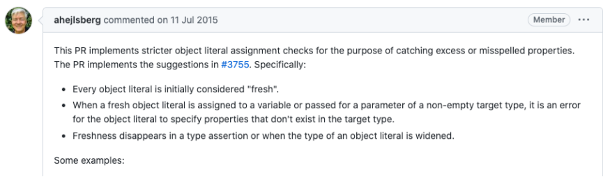

# 一. TS类的使用

---

## 01. 认识类的使用

- 在早期的 `JS` 开发中（`ES5`）我们需要通过函数和原型链来实现类和继承，从 `ES6` 开始，引入了 `class` 关键字，可以更加方便的定义和使用类
- `TS` 作为 `JS` 的超集，也是支持使用 `class` 关键字的，并且还可以对类的属性和方法等进行静态类型检测
- 实际上在 `JS` 的开发过程中，我们更加习惯于函数式编程：
  - 比如 `React` 开发中，目前更多使用的函数组件以及结合 `Hook` 的开发模式
  - 比如在 `Vue3` 开发中，目前也更加推崇使用 `Composition API`
- 但是在封装某些业务的时候，类具有更强大封装性，所以我们也需要掌握它们
- 类的定义我们通常会使用 `class` 关键字：
  - 在面向对象的世界里，任何事物都可以使用类的结构来描述
  - 类中包含特有的属性和方法

## 02. 类的定义

- 我们来定义一个 `Person` 类：

  - 使用 `class` 关键字来定义一个类

- 我们可以声明类的属性：在类的内部声明类的属性以及对应的类型

  - 如果类型没有声明，那么它们默认是 `any` 的

  - 我们也可以给属性设置初始化值

  - 在 `tsconfig.json` 配置文件中的 `strictPropertyInitialization` 模式下面我们的属性默认是必须初始化的，如果**没有初始化且未在构造函数中明确赋值，那么编译时就会报错**

    - 如果我们在 `strictPropertyInitialization` 模式下确实**不希望给属性初始化，可以使用 `name!: string` 语法**

    ```typescript
    class Person {
      // name: string // 报错：属性“name”没有初始化表达式，且未在构造函数中明确赋值
      name!: string
      age: number
      _id = 1 // 也可以省略类型注解，会根据初始值自动推导出类型 
      constructor(name: string, age: number) {
        // this.name = name
        this.age = age
      }
    }
    
    const p1 = new Person('later', 18)
    const p2 = new Person('later-zc', 18)
    ```

- 类可以有自己的构造函数 `constructor`，当我们通过 `new` 关键字创建一个实例时，构造函数会被调用

  - **构造函数 `不需要` 返回任何值，默认 `返回` 当前创建出来的 `实例`**

- 类中可以有自己的函数，定义的函数称之为方法

## 03. 类的继承

- 面向对象的其中一大特性就是继承，继承不仅仅可以减少我们的代码量，也是多态的使用前提

- 我们使用 `extends` 关键字来实现继承，子类中使用 `super` 来访问父类

- 我们来看一下 `Student` 类继承自 `Person`：
  - `Student` 类可以有自己的属性和方法，并且会继承 `Person` 的属性和方法
  
  - 在构造函数中，可以通过 `super` 来调用父类的构造方法，对父类中的属性进行初始化
  
    ```typescript
    class Person {
      name: string
      age: number
      constructor(name, age) {
        this.name = name
        this.age = age
      }
      studying() {}
    }
    
    class Student extends Person {
      sno: number
      constructor(name: string, age: number, sno: number) {
        super(name, age)
        this.sno = sno
      }
      studying() {
        super.studying()
      }
    }
    ```

## 04. 类的成员修饰符

- 在 `TS` 中，类的属性和方法支持三种修饰符： `public`、`private`、`protected`

  - `public` 修饰的是在任何地方可见、公有的属性或方法，**默认编写的属性就是 `public` 的**
  - `private` 修饰的是仅在同一类中可见、私有的属性或方法
  - `protected` 修饰的是仅在**类自身及子类中（类的内部）**可见、受保护的属性或方法

- `public` 是默认的修饰符，也是可以直接访问的

- 我们这里来演示一下 `protected` 和 `private`：

  ```typescript
  // protected: 类自身及子类中可访问
  class Person {
    protected name: string
    constructor(name: string) {
      this.name = name
    }
  }
  
  class Student extends Person {
    constructor(name: string) {
      super(name)
    }
    running() { 
      console.log(this.name)
    }
  }
  
  const p1 = new Person('later')
  p1.name // 报错：属性“name”受保护，只能在类“Person”及其子类中访问
  
  
  
  
  // private: 类本身中可访问
  class Person {
    private name: string
    constructor(name: string) {
      this.name = name
    }
  }
  
  const p1 = new Person('later')
  p1.name // 报错：属性“name”为私有属性，只能在类“Person”中访问
  ```

## 05. 只读属性 readonly

- 如果有一个属性我们不希望外界可以任意的修改，只希望确定值后直接使用

- 那么可以使用 `readonly`：

  ```typescript
  class Person {
    readonly name: string
    constructor(name: string) {
      this.name = name
    }
    updateName() {
      this.name = name // 报错：无法分配到 "name" ，因为它是只读属性
    }
  }
  
  const p1 = new Person('later')
  console.log(p1.name)
  p1.name = 'later-zc' // 报错：无法分配到 "name" ，因为它是只读属性
  ```

> 总结：
>
> - `readonly` 属性只能在 `constructor` 中进行赋值
> - 内部方法，外部都不能赋值，只能访问

## 06. getters / setters

- 在前面一些私有属性我们是不能直接访问的

- 或者某些属性我们想要监听它的获取 `getter` 和设置 `setter` 的过程

- 这个时候我们可以使用**存取器**

  ```typescript
  class Person {
    private _name: string
  
    constructor(name: string) {
      this._name = name
    }
  
    set name(value: string) {
      this._name = value
    }
  
    get name() {
      return this._name
    }
  }
  
  const p1 = new Person('later')
  p1.name = 'later-zc'
  console.log(p1.name)
  ```

## 07. 参数属性（Parameter Properties）

- `TS` 提供了特殊的语法，**可以把一个构造函数参数转成一个同名同值的类属性**

  - 这些就被称为参数属性

  - 通过**在 `构造函数参数` 前添加一个 `可见性修饰符` 来创建 `参数属性`**

    - 修饰符：`public`、 `private`、`protected` 或 `readonly`
    
  - 最后这些**`参数属性` 会转换为一个 `同名同值` 的 `类属性`，同时这些 `类属性字段` 也会得到相应的 `修饰符`**
  
    ```typescript
    class Person {
      // name: string
      // age: number
    
      constructor(public name: string, private _age: number) {
        // this.name = name
        // this.age = age
      }
    
      set age(value: number) {
        this._age = value
      }
    
      get age() {
        return this._age
      }
    }
    
    const p1 = new Person('later', 18)
    console.log(p1.name) // 'later'
    console.log(p1.age) // 18
    ```
  
  > 注意：
  >
  > - **参数属性**的修饰符 `public` **不能省略**
  > - **类的成员**的修饰符 `public` **可省略**，因为其默认就是 `public`


# 二. TS中抽象类

---

## 01. 抽象类 abstract

- 我们知道，继承是多态使用的前提

  - 所以在定义很多通用的调用接口时，我们通常会让调用者传入父类，通过多态来实现更加灵活的调用方式
  - 但是，父类本身可能并不需要对某些方法进行具体的实现，所以父类中定义的方法，我们可以定义为抽象方法

- 什么是 抽象方法? **在 `TS` 中没有具体实现的方法(没有方法体)，就是 `抽象方法`**

  - **抽象方法，必须存在于抽象类中**
  - **抽象类是使用 `abstract` 声明的类**

- 抽象类有如下的特点：

  - 抽象类是**不能被实例化**（也就是不能通过 `new` 创建）

  - 抽象类可以包含抽象方法，也可以包含有实现体的方法

  - **有抽象方法的类，必须是一个抽象类**

  - **抽象方法必须被 `子类实现`，否则该类必须是一个抽象类**

    ```typescript
    // 抽象方法必须出现在抽象类中, 类前面也需要加 abstract
    abstract class Shape {
      // 将 getArea 方法定义为抽象方法: 在方法的前面加 abstract
      abstract getArea() {}
    }
    
    class Rectangle extends Shape {
      constructor(public width: number, public height: number) {
        super()
      }
      // 子类实现抽象方法
      getArea() {
        return this.width * this.height
      }
    }
    
    class Circle extends Shape {
      constructor(public radius: number) {
        super()
      }
      getArea() {
        return this.radius ** 2 * Math.PI
      }
    }
    
    class Triangle extends Shape {
      getArea() {
        return 10
      }
    }
    
    function caclArea(shape: Shape) {
      return shape.getArea() 
    }
    
    caclArea(new Rectangle(10, 20))
    caclArea(new Circle(5))
    caclArea(new Triangle())
    caclArea(new Shape()) // 报错：无法创建抽象类的实例
    ```
  
  > 注意：
  >
  > - `abstract` 是 `js` 中的保留字，`ts` 中的关键字

## 02. 鸭子类型

```typescript
class Person {
  constructor(public name: string, public age: number) {}
  run() {}
}

class Coder {
  constructor(public name: string, public age: number) {}
  run() {}
}

function printPerson(p: Person) {
  console.log(p.name, p.age)
}

printPerson(new Person('later', 18))

// 下面三种情况都不会报错，就是因为TS对于类型检测的时候使用的鸭子类型
// 鸭子类型: 如果一只鸟, 走起来像鸭子, 游起来像鸭子, 看起来像鸭子, 那么你可以认为它就是一只鸭子
// 鸭子类型, 只关心属性和行为, 不关心你具体是不是对应的类型
printPerson({name: 'later', age: 20, run(){}}) 
printPerson(new Coder('later', 20))
const p: Person = new Coder('later', 20)


class Dog {}
const d: Dog = {} // 这也是符合鸭子类型的
```

> 总结：
>
> - `TS` 对于**类型检测**的时候，使用的是**鸭子类型**
> - **鸭子类型**：**只检验**是否具有对应**属性**和**方法**，**不检验**是不是对应的**类型**

## 03. 类的类型

- 类本身也是可以作为一种数据类型的：

  ```typescript
  class Person {}
  
  /**
    * 类的作用:
    *  1. 可以创建类对应的实例对象
    *  2. 类本身可以作为这个实例的类型
    *  3. 类也可以当作有一个构造签名的函数，因为类可以被new
  */
  
  const name: string = "aaa"
  const p: Person = new Person()
  function printPerson(p: Person) {}
  
  function factory(ctor: new () => void) {}
  factory(Person)
  ```


# 三. TS 对象类型

---

## 01. 对象类型的属性修饰符（Property Modifiers）

- 对象类型中的每个属性可以说明它的类型、属性是否可选、属性是否只读等信息

- 可选属性（`Optional Properties`）

  - 我们可以在属性名后面加一个 `?` 标记表示这个属性是可选的

- 只读属性（`Readonly Properties`）

  - 在 `TS` 中，属性可以被标记为 `readonly`，这不会改变任何运行时的行为

  - 但在类型检查的时候，一个标记为 `readonly` 的属性是不能被写入的

    ```typescript
    type IPerson = {
      name: string
      age?: number
      readonly height: number
    }
    
    interface IKun {
      name: string
      slogan?: string
      readonly height: number
    }
    ```

## 02. 索引签名（Index Signatures）

- 什么是索引签名呢？

  - 有时候，你不能提前知道一个类型里的所有属性的名字

  - 但是你知道这些值的特征

  - 这种情况，你就可以**用一个 `索引签名` 来描述 `可能的值` 的类型**
  
    ```typescript
    interface ICollection {
      // 返回值类型的目的是告知通过索引去获取到的值是什么类型
      [index: number]: string
      length: number 
    }
    
    function printCollection(collection: ICollection) {
      for (let i = 0; i < collection.length; i++) {
        const item = collection[i]
        console.log(item.length)
      }
    }
    
    const array = ["abc", "cba", "nba"]
    const tuple: [string, string] = ["why", "广州"]
    printCollection(array)
    printCollection(tuple)
    ```

## 03. 索引签名奇怪的现象

```typescript
interface IIndexType {
  [index: string]: string
}
const names: IIndexType = ["abc", "cba", "nba"] // 报错：不能将类型“string[]”分配给类型“IIndexType”。类型“string[]”中缺少类型“string”的索引签名


interface IIndexType2 {
  [index: number]: string
}
const names2: IIndexType2 = ["abc", "cba", "nba"] // 不报错

// 为什么会出现上面的情况？
// 因为我们字面量形式定义的数组，是会经过严格字面量赋值检测的，而数组本身还具有其他的一些属性，比如：forEach，filter这些属性
// 而这些属性其对应的值并不是string类型
// ["abc", "cba", "nba"] => Array实例 => names[0]、names.forEach、...
// names["forEach"] => function
// names["map/filter"] => function

// 既然有严格字面量检查，那我们让它不是新鲜的不就可以绕过检查了吗？
// 经过测试发现，可能索引签名这里是比较特殊的，即使使其失去新鲜，仍然会保持严格的字面量检查

// 所以当索引类型为string时，除了会检测['abc', 'cba', 'nba']中的['0']、['1']、['2']这几个字符串索引，
// 还会检测到['forEach']、['filter']这些字符串索引，而这些索引对应的值就并不符合string类型，所以就会报错，我们可以使用any类型来解决
// [index: string]: any

// 当索引类型为number时，只会检测['abc', 'cba', 'nba']中的[0]、[1]、[2]这几个数字索引，这几个索引所对应的值也是符合string类型的，所以不会报错
```

> 注意：
>
> - 当索引一个数字时，`JS` 实际上会在**索引对象**之前**将其转换**为字符串，即`[0] `等价于`['0']`

## 04. 两个索引签名

- 有时候我们可能会像下面这样来使用索引签名：

  ```typescript
  interface IIndexType {
    // 两个索引类型的写法
    [index: number]: string | number // 报错：“number”索引类型“string | number”不能分配给“string”索引类型“string”
    [key: string]: string
  }
  ```

- 会报如上的错，这是因为 `TS` 中指定了 `number` 索引类型返回的类型必须是 `string` 索引类型返回的类型中的子类型

- 所以改成如下即可：

  ```typescript
  interface IIndexType {
    [index: number]: string | number
    [key: string]: any // string返回的类型改成any，也或者将number返回的类型缩小成string所包含的类型
  }
  ```

> 注意：
>
> - 一个索引签名的属性类型必须是 `string` 或者是 `number`
> - 虽然 `TS` 可以同时支持 `string` 和 `number` 类型，但**数字索引**的**返回类型**一定要是**字符索引**的**返回类型**的**子类型**
> - 如果索引签名中有定义其他属性，**其他属性返回的类型，也必须符合`string`类型返回的属性**


# 四. TS 接口补充

---

## 01. 接口继承

- 接口和类一样是可以进行继承的，也是使用 `extends` 关键字：

  - 并且我们会发现，**接口是支持多继承的（类不支持多继承）**

    ```typescript
    interface IPerson {
      name: string
      age: number
    }
    
    interface IRun {
      running: () => void
    }
    
    // 可以从其他的接口中继承过来属性
    // 1.减少了相同代码的重复编写
    // 2.如果使用第三库, 给我们定义了一些属性
    //  > 自定义一个接口, 同时你希望自定义接口拥有第三方某一个类型中所有的属性
    //  > 可以使用继承来完成
    interface IKun extends IPerson, IRun {
      // name: string 
      // age: number
      slogan: string
    }
    
    // 报错：类型“{ slogan: string; }”缺少类型“IKun”中的以下属性: name, age, running
    const ikun: IKun = { 
      slogan: '你干嘛，哎哟'
    }
    ```

## 02. 接口的实现

- 接口定义后，也是可以被类实现的：
  - 如果被一个类实现，那么在之后需要传入接口的地方，都可以将这个类传入
  
  - 这就是面向接口开发
  
    ```typescript
    interface IKun {
      name: string
      slogan: string
      dance: () => void
    }
    
    interface IRun {
      running: () => void
    }
    
    const ikun: IKun = {
      name: 'later',
      slogan: '你干嘛',
      dance: function() {}
    }
    
    
    class Person implements IKun, IRun {
      constructor(public name: string, public slogan: string, public dance: () => void, public running: () => void) {}
    }
    
    const ikun1 = new Person('later', '小黑子', function(){}, function(){})
    console.log(ikun1.name, ikun1.slogan, ikun1.dance, ikun1.running)
    ```
  

## 3. 抽象类和接口的区别（了解）

- 抽象类在很大程度上和接口会有点类似：都可以在其中定义一个方法，让子类或实现类来实现对应的方法
- 那么抽象类和接口有什么区别呢？
  - 抽象类是事物的抽象，抽象类用来捕捉子类的通用特性，接口通常是一些行为的描述
  - 抽象类通常用于一系列关系紧密的类之间，接口只是用来描述一个类应该具有什么行为
  - 接口可以被多层实现，而抽象类只能单一继承
  - 抽象类中可以有实现体，接口中只能有对象的声明
- 通常我们会这样来描述类和抽象类、接口之间的关系：
  - **抽象类是对事物的抽象**，表达的是` is a `的关系。猫是一种动物（动物就可以定义成一个抽象类）
  - **接口是对行为的抽象**，表达的是` has a `的关系。猫拥有跑（可以定义一个单独的接口）、爬树（可以定义一个单独的接口）的行为


# 五. 特殊: 严格字面量检测

---

## 01. 严格的字面量赋值检测

- 对于对象的字面量赋值，在 `TS` 中有一个非常有意思的现象：

  ```typescript
  // 1.奇怪的现象一: 
  const info: IPerson = {
    name: "why",
    age: 18,
    // 多了一个height属性
    // 报错：不能将类型“{ name: string; age: number; height: number; }”分配给类型“IPerson”。对象文字可以只指定已知属性，并且“height”不在类型“IPerson”中
    height: 1.88 
  }
  
  const obj = {
    name: "why",
    age: 18,
    // 多了一个height属性
    height: 1.88
  }
  
  // 不报错
  const info2: IPerson = obj
  
  
  // 2.奇怪的现象二:
  function printPerson(person: IPerson) {}
  
  printPerson({ name: "kobe", age: 30, height: 1.98 }) // 报错：类型“{ name: string; age: number; height: number; }”的参数不能赋给类型“IPerson”的参数。对象文字可以只指定已知属性，并且“height”不在类型“IPerson”中
  
  const kobe = { name: "kobe", age: 30, height: 1.98 } 
  printPerson(kobe) // 不报错
  ```

## 02. 为什么会出现这种情况呢？

- 这里引入 `TS` 成员在 `GitHub` 的 `issue` 中的回答：

  

- 简单对上面的英文进行翻译解释：

  - 每个对象字面量最初都被认为是“新鲜的（`fresh`）”
  - 当一个新的对象字面量分配给一个变量或传递给一个非空目标类型的参数时，对象字面量指定目标类型中不存在的属性是错误的
  - 当类型断言或对象字面量的类型扩大时（别的场景扩大使用时），新鲜度会消失
  
  > 总结：
  >
  > - **第一次创建的对象字面量，是新鲜的，会被严格检测（对象字面量中有除指定目标类型外的属性时会报错）**
  > - **该对象字面量之后使用时，不再是新鲜的，不会被严格检测**


# 六. TS 枚举类型

---

## 01. TS 枚举类型

- 枚举类型是为数不多的 `TS` 特性有的特性之一：

  - 枚举其实**就是将 `一组可能出现的值`，一个个 `列举出来`，定义在一个类型中，这个类型就是 `枚举类型`**

  - 枚举允许开发者定义一组命名常量，常量可以是数字、字符串类型

    ```typescript
    enum Direction {
      TOP,
      BOTTOM,
      LEFT,
      RIGHT
    }
    
    const d1: Direction = Direction.LEFT
    
    function turnDirection(direction: Direction) {
      switch(direction) {
        case Direction.LEFT:
          console.log('转向左边')
          break
        case Direction.RIGHT:
          console.log('转向右边')
          break
        case Direction.TOP:
          console.log('转向上边')
          break
        case Direction.BOTTOM:
          console.log('转向下边')
          break
        default:
          const myDirection: never = direction
      }
    }
    ```

## 02. 枚举类型的值

- 枚举类型默认是有值的，比如上面的枚举，默认值是这样的：

  ```typescript
  enum Direction {
    TOP, // 默认值为0，依次递增
    BOTTOM, // 1
    LEFT, // 2
    RIGHT // 3
  }
  ```

- 当然，我们也可以给枚举其他值：

  - 这个时候会从`100`进行递增

    ```typescript
    enum Direction {
      TOP, // 100
      BOTTOM, // 101
      LEFT, // 102
      RIGHT // 103
    }
    ```

- **枚举类型 `默认值` 为 `0`，`默认类型` 为 `number`**

- 我们也可以给它们赋值其他的类型：

  - **赋值为 `其他类型` 时，所有的 `枚举成员` 都必须具有 `初始化值`**

    ```typescript
    enum Direction {
      TOP = 'left',
      BOTTOM = 'bottom', 
      LEFT = 'left',
      RIGHT // 报错：枚举成员必须具有初始化表达式
    }
    ```


