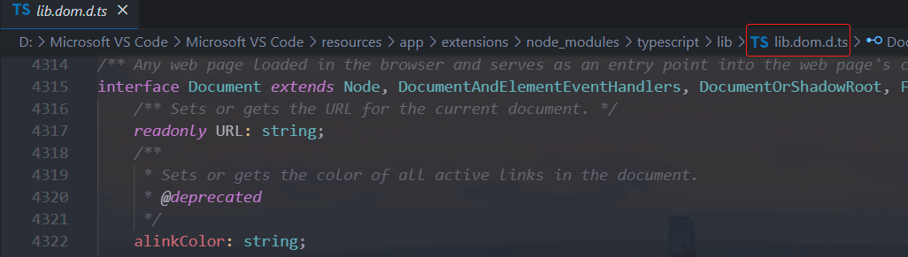
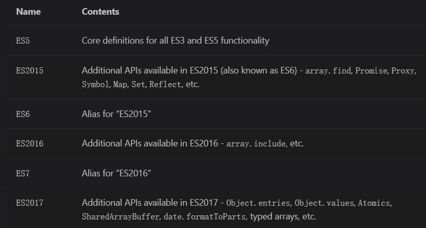

# 一. TypeScript模块使用

---

## 1. TypeScript模块化

- `JavaScript `有一个很长的处理模块化代码的历史，`TypeScript `从2012年开始跟进，现在已经实现支持了很多格式。但是随着时间流逝，社区和` JavaScript `规范已经使用为名为` ES Module`的格式，这也就是我们所知的`import/export `语法

  - `ES `模块在2015年被添加到` JavaScript `规范中，到2020年，大部分的`web `浏览器和` JavaScript `运行环境都已经广泛支持

  - 所以在`TypeScript`中最主要使用的模块化方案就是`ES Module` 

    ```typescript
      export function add(num1: number, num2: number) {
        return num1 + num2
      }
    
      export function sub(num1: number, num2: number) {
        return num1 - num2
      }
    ```

- 在前面我们已经学习过各种各样模块化方案以及对应的细节，这里我们主要学习`TypeScript`中一些比较特别的细节

## 2. 非模块（Non-modules）

- 我们需要先理解` TypeScript `认为什么是一个模块

  - **`JS `规范声明任何没有` export `的` JS`文件都应该被认为是一个脚本，而非一个模块**
  - **在一个脚本文件中，变量和类型会被声明在共享的全局作用域**，将多个输入文件合并成一个输出文件，或者在 `HTML`使用多个` <script> `标签加载这些文件

- 如果你有一个文件，现在没有任何` import `或者` export`，但是你希望它被作为模块处理，添加这行代码：

  ```typescript
  	export {}
  ```

- 这会把文件改成一个没有导出任何内容的模块，这个语法可以生效，无论你的模块目标是什么

## 3. 内置类型导入（Inline type imports）

- `TypeScript 4.5 `也允许单独的导入，你需要**使用` type `前缀 ，表明被导入的是一个类型**：

  ```typescript
  	// type.ts
  	export interface IPerson {
      name: string
      age: number
    }
  
    export type IDType = number | string
  ```

  ```typescript
    import { sum } from "./test1";
    // 导入的是类型时，推荐在类型前面加上type关键字
    import { type IDType, type IPerson } from "./type";
  
  	// 也可以使用下面的写法，作用等价的
  	// import type { IDType, IPerson } from './type'
  
    console.log(sum(10, 20))
  
    const id: IDType = 100
    const person: IPerson = {
      name: 'later',
      age: 10
    }
  ```

- 这样**可以让一个非` TypeScript `编译器比如` Babel`、`swc`或者` esbuild `知道什么样的导入可以被安全移除**

> 总结：
>
> - 这些类型在经过我们代码的编译阶段，全部会被删除掉，因为类型只是用来在开发阶段进行类型检测的，打包之后的生产环境中不需要类型检测
> - 对于编译器来说，对于这些导入的类型代码，如果通过语法来识别，需要先识别语法再进行删除，对编译器来说会增加工作量
> - 而如果在导入的同时，明确指定了导入的东西是类型，编译器之后在转换编译过程中，就可以直接删掉
> - 编译`ts`代码方式：`tsc`、`babel`、...


# 二. TypeScript命名空间

---

## 1. 命名空间namespace

- `TypeScript `有它自己的模块格式，名为` namespaces` ，它在` ES `模块标准之前出现

  - 命名空间在`TypeScript`早期时，称之为内部模块，目的是将一个模块内部再进行作用域的划分，防止一些命名冲突的问题

  - 虽然命名空间没有被废弃，但是由于` ES `模块已经拥有了命名空间的大部分特性，因此更推荐使用` ES `模块，这样才能与`JavaScript `的发展方向保持一致

    ```typescript
    	// format.ts
    	export namespace price {
        export function format(price: string) {
          return `￥${price}`
        }
        export const name = 'price'
      }
    
      export namespace date {
        export function date(dateString: string) {
          return '2020-10-22' 
        }
        export const name = 'date'
      }
    ```

    ```typescript
      import { price, date } from "./format";
    
      price.format('10')
      console.log(price.name) // price
      console.log(date.name) // date
    ```


# 三. 内置声明文件的使用

---

## 1. 类型的查找

- 之前我们所有的`TypeScript`中的类型，几乎都是我们自己编写的，但是我们也有用到一些其他的类型：

  ```typescript
  	const imageEl = document.getElementById('image') as HTMLImageElement
  ```

- 大家是否会奇怪，我们的`HTMLImageElement`类型来自哪里呢？甚至是`document`为什么可以有`getElementById`的方法呢？

  - 其实这里就涉及到`typescript`对类型的管理和查找规则了

- 这里先给大家介绍另外的一种`typescript`文件：`.d.ts`文件

  - 我们之前编写的`typescript`文件都是` .ts `文件，这些文件最终会输出` .js `文件，也是我们通常编写代码的地方
  - 还有另外一种文件**` .d.ts `文件，它是用来做类型的声明**(`declare`)，称之为**类型声明**（`Type Declaration`）或者**类型定义**（`Type Definition`）**文件**
  - **它仅仅用来做类型检测，告知`typescript`我们有哪些类型**

- 那么`typescript`会在哪里查找我们的类型声明呢？

  - 内置类型声明
  - 外部定义类型声明
  - 自己定义类型声明

## 2. 内置类型声明

- **内置类型声明是`typescript`自带的、帮助我们内置了`JavaScript`运行时的一些标准化`API`的声明文件**

  - 包括比如`Function`、`String`、`Math`、`Date`等内置类型
  - 也包括运行环境中的`DOM API`，比如`Window`、`Document`等

- `TypeScript `使用模式命名这些声明文件`lib.[something].d.ts`

  

- **内置类型声明通常在我们安装`typescript`的环境中会带有的**

  - https://github.com/microsoft/TypeScript/tree/main/lib

## 3. 内置声明的环境

- 我们可以通过`target`和`lib`来决定哪些内置类型声明是可以使用的：
  - 例如，`startsWith`字符串方法只能从称为`ECMAScript 6`的` JavaScript `版本开始使用
  
- 我们可以通过`target`的编译选项来配置：`TypeScript`通过`lib`根据您的`target`设置更改默认包含的文件来帮助解决此问题
  - https://www.typescriptlang.org/tsconfig#lib
  
    


# 四. 第三方库声明的文件

---

## 1. 外部定义类型声明 – 第三方库

- 外部类型声明通常是我们使用一些库（比如第三方库）时，需要的一些类型声明

- 这些库通常有两种类型声明方式：

- 方式一：在自己库中进行类型声明（编写`.d.ts`文件），比如`axios`

- 方式二：通过社区的一个公有库`DefinitelyTyped`存放类型声明文件

  - 该库的`GitHub`地址：https://github.com/DefinitelyTyped/DefinitelyTyped/

  - 该库查找声明安装方式的地址：https://www.typescriptlang.org/dt/search?search=

  - 比如我们安装`react`的类型声明： `npm i @types/react --save-dev`

    

> 总结：
>
> 1. 包本身包含声明文件，如`axios`
> 2. 没有包含，但在官方`DefineTypes`库中包含声明文件，安装对应的声明文件即可
>    - 如：`npm i @types/react -D`
> 3. 包本身没有声明，`DefineTypes`库也没有，只能手写自定义声明文件


# 五. 编写自定义声明文件

---

## 1. 外部定义类型声明 – 自定义声明

- 什么情况下需要自己来定义声明文件呢？
  - 情况一：我们使用的第三方库是一个纯`JavaScript`库，没有对应的声明文件；比如`lodash`
  - 情况二：我们给自己的代码中声明一些类型，方便在其他地方直接进行使用


# 六. tsconfig配置文件解析

---


