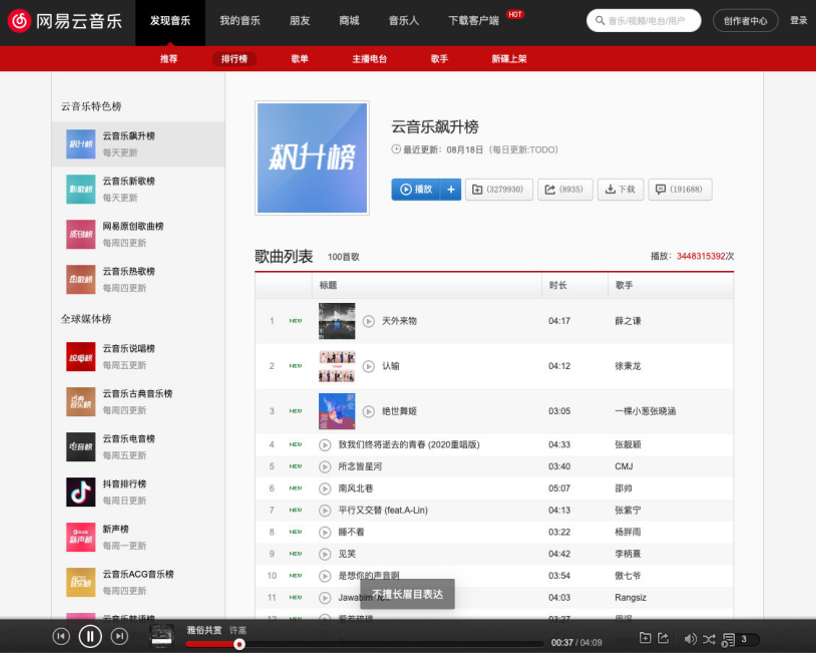
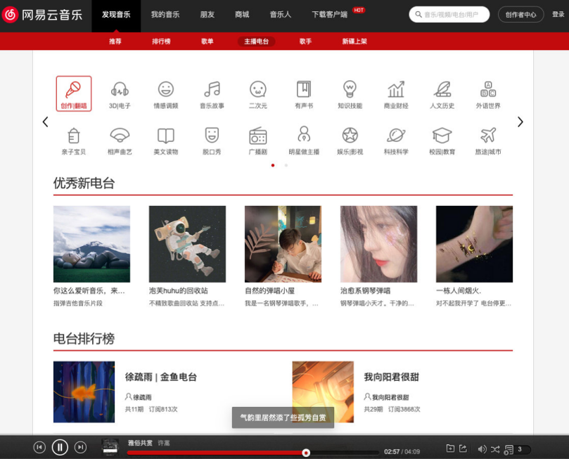

# 一. 项目介绍 - 网易云音乐

---






# 二. 项目搭建

---

- 早期创建的`react`项目，默认使用的是`yarn`包管理工具（因为早期`npm`不如`yarn`）

- 创建`TS + react`项目方式：

  - 方式一（基本不采用）：

    - `create-react-app`的方式创建一个项目，然后手动从零配置`TS`
    - 弊端一：
      - `react`是基于`webpack`创建的项目，所有的配置默认是隐藏的，即使通过`eject`暴露配置，但是修改配置是很麻烦的（比从零配置还麻烦），也很容易配置失败

    - 弊端二：
      - `TS`的配置涉及到的东西比较多麻烦（有难度）
      - `TS`代码最终是要编译成`js`代码的
        - `TypeScript Complier（tsc）`：类型检测
        - `babel`：最终转换为`js`

  - 方式二：

    - `create-react-app`脚手架
    - 同时配置`TypeScript`的支持

    ```shell
    create-react-app react-ts-music --template typescript
    ```

    


