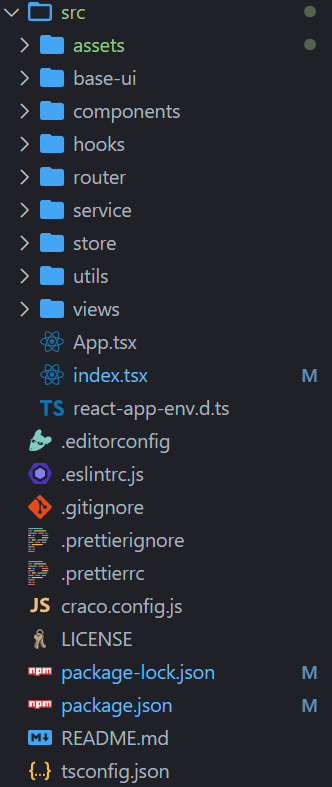

# 一. 项目介绍 - 网易云音乐

---


# 二. 项目搭建

---

- 早期创建的`react`项目，默认使用的是`yarn`包管理工具（因为早期`npm`不如`yarn`）

- 创建`TS + react`项目方式：

  - 方式一（基本不采用）：

    - `create-react-app`的方式创建一个项目，然后手动从零配置`TS`
    - 弊端一：
      - `react`是基于`webpack`创建的项目，所有的配置默认是隐藏的，即使通过`eject`暴露配置，但是修改配置是很麻烦的（比从零配置还麻烦），也很容易配置失败

    - 弊端二：
      - `TS`的配置涉及到的东西比较多麻烦（有难度）
      - `TS`代码最终是要编译成`js`代码的
        - `TypeScript Complier（tsc）`：类型检测
        - `babel`：最终转换为`js`

  - 方式二：

    - `create-react-app`脚手架
    - 同时配置`TypeScript`的支持

    ```shell
    create-react-app react-ts-music --template typescript
    ```

  
  - 项目配置：
  
    - 配置项目的`icon`
  
    - 配置项目的标题
  
    - 配置项目别名等（`craco.config.ts`） 
  
      ```js
      // craco.config.js
      
      const path = require('path')
      
      const resolve = (dir) => path.resolve(__dirname, dir)
      
      module.exports = {
        webpack: {
          alias: {
            '@': resolve('src'),
          },
        },
      }
      ```
  
    - 配置`tsconfig.json`
  
      - `baseUrl`：指定解析非相对模块名所基于的目录
      - `paths`：指定`TS`如何解析你的`require/imports`中的导入
  
      ```json
      // tsconfig.json
      
      {
        "compilerOptions": {
          // ...
        + "baseUrl": ".",
        + "paths": {
        +   "@/*": ["./src/*"]
        + }
        },
      }
      ```
  


# 三. 项目目录结构划分

---

- 对项目进行目录结构的划分

  


# 四. CSS样式的重置

---

- 对默认`CSS`样式进行重置: 
  - `normalize.css`
  
  - `reset.less`
  
    

- 即使在入口文件进行引入，默认`less`文件是会被忽略的（不起作用）

- 安装`craco-less`

  - `craco-less@2.0.0`对等依赖的是`@craco/craco@^6.0.0`
  - 而我们这里使用的是`@craco/craco@7.0.0`，所以安装`alpha`版本

  ```shell
  npm i craco-less@alpha -D
  ```

- `craco.config.js`文件新增配置如下，`antd`这里没有还没引入

  ```js
  // craco.config.js
  
  const resolve = (dir) => path.resolve(__dirname, dir)
  const CracoLessPlugin = require('craco-less')
  
  module.exports = {
    plugins: [
      {
        plugin: CracoLessPlugin
      }
    ],
    // ...
  }
  ```

- `less`引入细节具体可查看`react`部分第`8`节的通过`craco`引入`less`


# 五. 项目细节

---

## 1. 路由使用.tsx文件

- 路由文件中的`element`属性对应的`<组件xx />`这种写法是`jsx`语法，不能直接在`ts`文件中写`jsx`，所以需要用`tsx`文件

- `tsx`文件中，使用`JSX`时，`React`必须在作用域内，所以需要引入`React`

  


