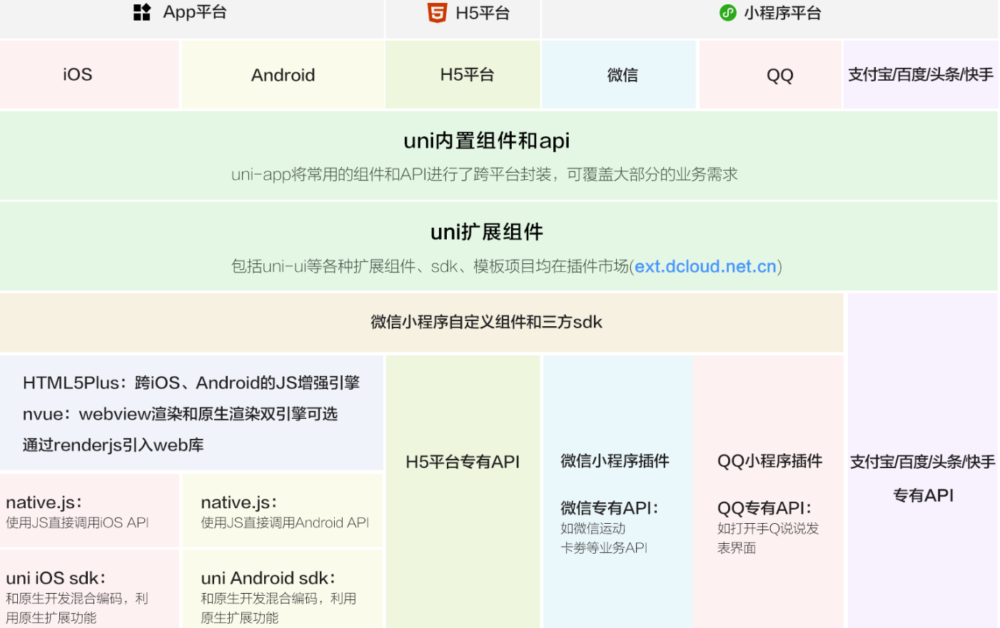
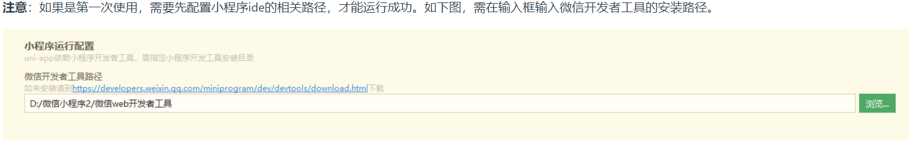
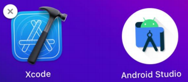
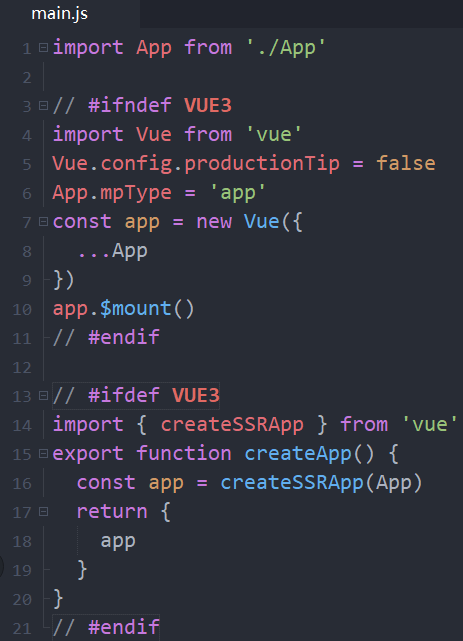
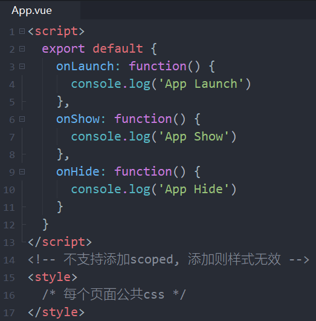
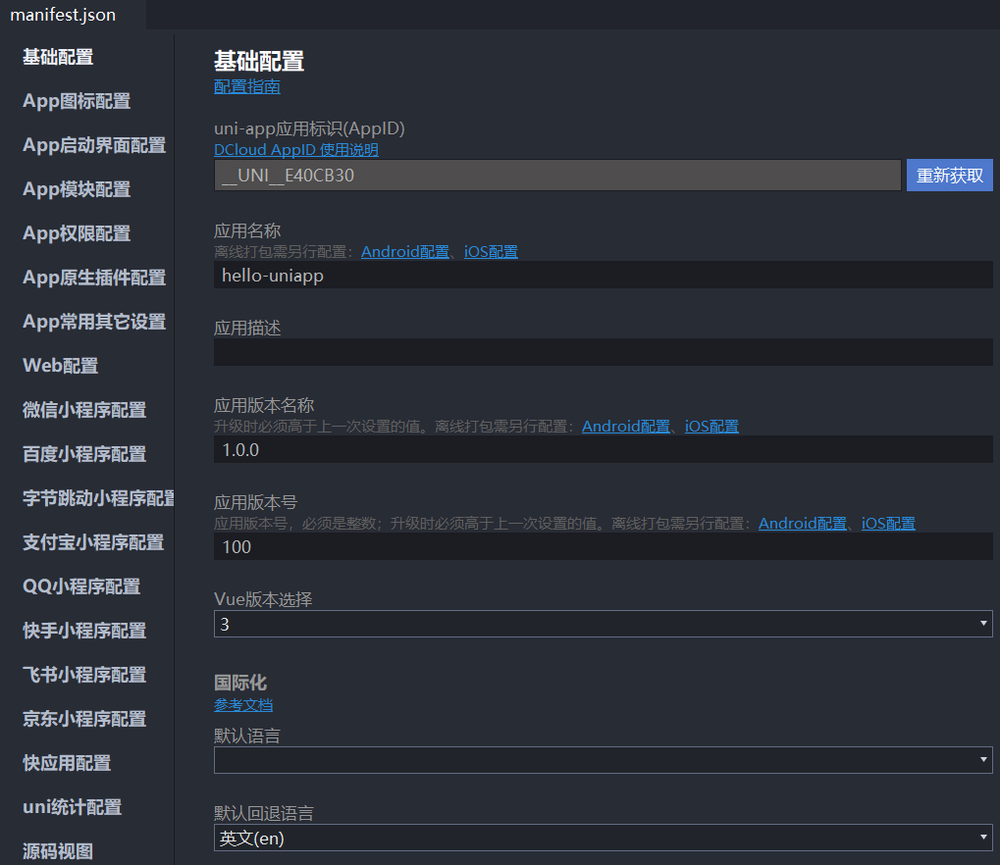

# 一. 邂逅跨平台开发

---

## 1. 邂逅跨平台开发


- 传统移动端开发方式
  - 自从`iOS`和`Android`系统诞生以来，移动端开发主要由` iOS `和 `Android `这两大平台占据
  - 早期的移动端开发人员主要是针对` iOS `和` Android `这两个平台分别进行同步开发
  - **原生开发模式**优缺点：
    1. 原生`App`在**体验、性能、兼容性都非常好**，并可以非常方便的使用硬件设备，比如：摄像头、罗盘等
    2. 但是同时开发两个平台，无论是**成本**上，还是**时间**，对于企业来说这个**花费都是巨大**，不可接受的
    3. 纯原生 **开发效率** 和 **上线周期** 也严重影响了应用快速的迭代，也不利于多个平台版本控制等
- **跨平台开发**的诞生
  - 因为原生`App`存在：**时间长、成本高、迭代慢、部署慢、不利于推广**等因素
  - 导致了跨平台开发的概念渐渐走进了人们的视野
  - 因此 “**一套代码，多端运行**” 的跨平台理念也应运而生

## 2. 原生 VS 跨平台

- **原生开发**的特点：
  - **性能稳定，使用流畅，用户体验好、功能齐全，安全性有保证，兼容性好，可使用手机所有硬件功能**等
  - 但是**开发周期长、维护成本高、迭代慢、部署慢、新版本必须重新下载应用**
  - 不支持跨平台，**必须同时开发多端代码**
- **跨平台开发**的特点：
  - 可以跨平台，一套代码搞定`iOS`、`Android`、微信小程序、`H5`应用等
  - **开发成本较低，开发周期比原生短**
  - 适用于跟系统交互少、页面不太复杂的场景
  - 但是对开发者要求高，除了本身`js`的了解，还必须熟悉一点原生开发
  - 不适合做高性能、复杂用户体验，以及定制高的应用程序。比如：抖音、微信、QQ等
  - 同时开发多端**兼容和适配比较麻烦**、调试起来不方便

## 3. 跨平台发展史

- 跨平台发展史
  - 2009年以前，当时最要是使用最原始的`HTML` + `CSS` + `JS`进行移动端`App`开发
  - 2009-2014年间， 出现了`PhoneGap` 、`Cordova`等跨平台框架，以及`Ionic`轻量级的手机端`UI`库
  - 2015年，`ReactNative`（跨平台框架）掀起了国内跨平台开发热潮，一些互联网大厂纷纷投入` ReactNative `开发阵营
  - 2016年，阿里开源了`Weex`，它是一个可以使用现代化`Web`技术开发高性能原生应用的框架
  - 2017年`Google I/O`大会上，`Google`正式向外界公布了`Flutter`，一款跨平台开发工具包，用于为`Android`、`iOS`、`Web`、`Windows`、`Mac`等平台开发应用
  - 2017年至今，微信小程序、`uni-app`、`Taro `等一系列跨平台小程序框架陆续流行起来了
- 应该如何选择？个人建议
  - 需要做高性能、复杂用户体验、定制高的`APP`、需硬件支持的选 原生开发
  - 需要性能较好、体验好、跨`Android`、`iOS`平台、 `H5`平台、也需要硬件支持的选` Flutter`（采用`Dart`开发）
  - 需要跨小程序、`H5`平台、`Android`、`iOS`平台、不太复杂的先选 `uni-app`，其次选` Taro`
  - 不需要跨平台的，选择对应技术框架即可

## 4. 跨平台框架对比

|   类型   |              `Cordova`               |          `Xamarin`          |      `React Native`      |           `Weex`           |              `Uniapp`               |                          `Flutter`                           |
| :------: | :----------------------------------: | :-------------------------: | :----------------------: | :------------------------: | :---------------------------------: | :----------------------------------------------------------: |
|   性能   |                  低                  |             高              |           较高           |             中             |                 高                  |                              高                              |
| 上手难度 |                 容易                 |            较高             |           较高           |            容易            |                容易                 |                              中                              |
|   核心   |                 `js`                 |           `.NET`            |         `React`          |           `Weex`           |                `vue`                |                            `Dart`                            |
| 框架轻重 |                  轻                  |            较重             |           较重           |            较轻            |                 轻                  |                              重                              |
|   特点   |              适合单页面              |      适合开发整体`App`      |    适合开发整体`App`     |         适合单页面         |          适合开发整体`App`          |                      适合开发整体`App`                       |
|   社区   |              活跃度较低              |          活跃度低           | 活跃度高，`Facebook`维护 | 活跃度中，目前托管`apache` |       活跃度高，`Dcloud`维护        |                    活跃度高，`Google`维护                    |
| 支持平台 | `Android`、`ios`、`Windows`、`MacOS` | `Android`、`ios`、`Windows` | `Android`、`ios`、`Web`  |  `Android`、`ios`、`Web`   | `Android、ios、Web`、小程序、快应用 | `Android`、`ios、Web`、`MacOS`、`Linux`、`Windows`、`Fuchsia` |
|  适应性  |         `Web`开发学习成本低          |     `.NET C#`工程师开发     |   `Web`开发学习成本低    |    `Web`开发学习成本低     |         `Web`开发学习成本低         |               `Java、C++、C#`、开发学习成本低                |

## 5. 跨平台项目实战


## 6. 认识uni-app

- 官网对`uni-app`的介绍：
  - `uni-app `是一个使用`Vue.js`开发前端应用的框架
  - 即开发者编写一套代码，便可发布到`iOS`、`Android`、`Web`（响应式）、以及各种小程序（微信/支付宝/百度/头条/飞书/QQ/快手/钉钉/淘宝）、快应用等多个平台
  - `uni-app`在手，做啥都不愁。即使不跨端， `uni-app`也是更好的小程序开发框架、更好的`App`跨平台框架、更方便的`H5`开发框架。不管领导安排什么样的项目，你都可以快速交付，不需要转换开发思维、不需要更改开发习惯
- `uni-app`的历史
  - `uni-app`中的` uni`，读` you ni`，是统一的意思
  - `DCloud`于2012年开始研发的小程序技术，并推出了` HBuilder X `开发工具
  - 2015年，`DCloud`正式商用了自己的小程序，产品名为“流应用”，
    - 并捐献给了工信部旗下的`HTML5`中国产业联盟
  - 该应用能接近原生功能和性能的`App`，并且即点即用，不需要安装
  - 微信团队经过分析，于2016年初决定上线微信小程序业务，但其没有接入中国产业联盟标准，而是订制了自己的标准

## 7. uni-app VS 微信小程序

- `uni-app`和微信小程序相同点：
  - 都是接近原生的体验、打开即用、不需要安装
  - 都可开发微信小程序、都有非常完善的官方文档
- `uni-app`和微信小程序区别：
  - `uni-app`支持跨平台，编写一套代码，可以发布到多个平台，而微信小程序不支持
  - `uni-app`纯`Vue`体验、高效、统一、工程化强，微信小程序工程化弱、使用小程序开发语言
  - 微信小程序适合较复杂、定制性较高、兼容和稳定性更好的应用
  - `uni-app`适合不太复杂的应用，因为需要兼容多端，多端一起兼容和适配增加了开发者心智负担
- `uni-app ` 和 微信小程序，应该如何选择？
  - 需要跨平台、不太复杂的应用选 `uni-app`，复杂的应用使用`uni-app`反而增加了难度
  - 不需要跨平台、较复杂、对兼容和稳定性要求高的选原生微信小程序

## 8. uni-app架构图




# 二. 初体验uni-app

---

## 1. uni-app初体验

- 创建`uni-app`项目

  - 支持 可视化界面 和 `Vue-CLI` 两种方式。可视化方式比较简单，`HBuilder X` 内置相关环境，开箱即用

- 开发工具`HBuilder X`：

  - `Hbuilder X `是通用的前端开发工具，但为` uni-app `做了特别强化 
    - 下载地址：https://hx.dcloud.net.cn/Tutorial/install/windows
  - 安装完之后可以注册一个`Dcloud`的开发者账号(左下角可以点击注册)
  - 注意：用`Vue3`的`Composition API `建议用` HBuilder X`最新`Alpha`版，旧版有兼容问题

- 方式一（推荐）：`HBuilderX`创建` uni-app`项目步骤：

  - 点工具栏里的文件 -> 新建 -> 项目（快捷键`Ctrl + N`）
  - 选择`uni-app`类型，输入工程名，选择模板，选择`Vue`版本，点击创建即可

- 方式二：`Vue-CLI `命令行创建

  - 全局安装`Vue-CLI `（目前仍推荐使用` vue-cli 4.x `）

    ```shell
    npm install -g @vue/cli@4
    ```

  - 创建项目

    ```shell
    vue create -p dcloudio/uni-preset-vue my-project-name
    ```

## 2. HBuilder X 开发工具特点

- `HBuilderX`从`v3.2.5`(包含)开始优化了对`vue3`的支持
  - 完善的提示，在代码助手右侧还能看到清晰的帮助描述
  - 支持`css`中使用`v-bind`提示和参数变量提示及转到定义(`Alt + click`)
  - `Vue3`推荐使用的`setup`语法糖支持也完全支持
  - 在`data`、`props`和`setup`中定义的变量以及`methods`和`setup`内定义的函数都能在`template`中提示和转到定义(`Alt + click`)
- `HBuilderX`支持各种表达式语法，如`less`、`scss`、`stylus`、`typescript`等高亮，无需安装插件
- `this`的精准识别和语法提示
- 组件的标签、属性都可以直接被提示出来
- 不管是关闭`HBuilder`，还是断电、崩溃，临时文件始终会自动保存
- 更多功能：https://hx.dcloud.net.cn/Tutorial/Language/vue

## 3. 运行uni-app

- **在浏览器运行**

  - 选中`uniapp `项目，点击工具栏的运行 -> 运行到浏览器 -> 选择浏览器，即可体验` uni-app `的` web `版

- **在微信开发者工具运行**

  - 选中`uniapp`项目，点击工具栏的运行 -> 运行到小程序模拟器 -> 微信开发者工具，即可在微信开发者工具里面体验` uni-app`

  - 其它注意事项：

    1. 微信开发者工具需要开启服务端口：小程序开发工具设置 -> 安全（目的是让`HBuilder`可以启动微信开发者工具）

    2. 如第一次使用，需配置微信开发者工具的安装路径（会提示下图）

       - 点击工具栏运行 -> 运行到小程序模拟器 -> 运行设置，配置相应小程序开发者工具的安装路径

       

    3. 自动启动失败，可用微信开发者工具手动打开项目（项目在`unpackage/dist/dev/mp-weixin`路径下）

- **在运行`App`到手机或模拟器（需要先安装模拟器）**

  - 先连接真机 或 模拟器（`Android`的还需要配置`adb`调试桥命令行工具）
  - 选中`uniapp`项目，点击工具栏的运行 -> 运行`App`到手机或模拟器，即可在该设备里面体验`uni-app`（支持中文路径）

## 4. 安装mumu模拟器

- 第一步：下载`mumu`模拟器：https://mumu.163.com/mac/index.html
- 第二步：安装`mumu`模拟器
- 第三步：配置`adb`调试桥命令行工具（用于` HBuilderX `和`Android`模拟器建立连接，来实时调试和热重载。`HBuilderX `是有内置`adb`的 )
  - `HBuilderX`正式版的`adb`目录位置：安装路径下的` tools/adbs `目录
    - 而`MAC`下为`HBuilderX.app/Contents/tools/adbs`目录
  - `HBuilderX Alpha`版的`adb`目录位置：安装路径下的 `plugins/launcher/tools/adbs `目录( **需先运行后安装了插槽才会有该目录** )
    - 而`MAC`下为`/Applications/HBuilderX-Alpha.app/Contents/HBuilderX/plugins/launcher/tools/adbs`目录
  - 在`adbs`目录下运行`./adb `，即可使用`adb`命令（`Win`和`Mac`一样）
  - 如想要全局使用` adb `命令，`window`电脑可在：设置 -> 高级设计 -> 环境变量中设置，详情见`ppt`
- 第四步：**`HBuilderX `开发工具连接`mumu`模拟器，使用`adb`调试桥来连接**
  - **`adb connect 127.0.0.1:7555`**（ 端口是固定的，启动`mumu`模拟器默认是运行在`7555`端口）
- 第五步：选中项目 -> 运行 -> 运行`App`到手机或模拟器 -> 选中`Android`基座（基座其实是一个`app`壳）

## 5. 安装其它模拟器

- `Mac `电脑：

  - 可以安装` Xcode `或者` Android Studio `软件。推荐`XCode`

- `Window`电脑：

  - 安装`mumu`、夜神、雷电模拟器等（推荐）
  - 可以安装`Android Studio`软件（模拟器大、速度慢、卡）

- 详细安装教程

  - 可以看资料中对应的安装文档

  

## 6. 目录结构


## 7. 开发规范

- 为了实现多端兼容，综合考虑编译速度、运行性能等因素，`uni-app `约定了如下开发规范：
  - 页面文件遵循` Vue `单文件组件 (`SFC`) 规范
  - 组件标签靠近小程序规范，详见`uni-app`组件规范
  - 接口能力（`JS API`）靠近微信小程序规范，但需将前缀` wx `替换为` uni`，详见`uni-app`接口规范
  - 数据绑定及事件处理同` Vue.js `规范，同时补充了`App`及页面的生命周期
  - 为兼容多端运行，建议使用`flex`布局进行开发，推荐使用`rpx`单位（750设计稿）
  - 文档直接查看`uni-app`的官网文档： https://uniapp.dcloud.net.cn/


# 三. uni-app全局文件

---

## 1. main.js

- `main.js`是` uni-app `的入口文件，主要作用是：

  - 初始化`vue`实例
  - 定义全局组件
  - 定义全局属性
  - 安装插件，如：`pinia`、`vuex `等

  

## 2. App.vue

- `App.vue`入口组件
  - `App.vue`是`uni-app`的入口组件，所有页面都是在`App.vue`下进行切换
  - `App.vue`本身不是页面，这里不能编写视图元素，也就是没有`<template>`元素
  
- `App.vue`的作用：
  - 应用的生命周期
  - 编写全局样式
  - 定义全局数据` globalData`
  
- 注意：应用生命的周期仅可在`App.vue`中监听，在页面监听无效

  

## 3. 全局和局部样式

- 全局样式
  - `App.vue `中`style`的样式为全局样式，作用于每一个页面（`style`标签不支持`scoped`，写了导致样式无效）
    - `App.vue `中通过` @import `语句可以导入外联样式，一样作用于每一个页面
  - `uni.scss `文件也是用来编写全局公共样式，通常用来定义全局变量
    - `uni.scss `中通过` @import `语句可以导入外联样式，一样作用于每一个页面
- 局部样式
  - 在` pages `目录下的` vue `文件的`style`中的样式为局部样式，只作用对应的页面，并会覆盖` App.vue `中相同的选择器
  - `vue`文件中的`style`标签也可支持`scss`等预处理器，比如：安装`dart-sass`插件后，`style`标签便可支持`scss`写样式了
  - `style`标签支持`scoped`吗？不支持，不需写

## 4. uni.scss

- `uni.scss`全局样式文件

  - 为了方便整体控制应用风格。 默认定义了`uni-app`框架内置全局变量，当然也可以存放自定义的全局变量等

  - 在`uni.scss`中定义的变量，我们无需`@import`就可以在任意组件中直接使用

  - 使用`uni.scss`中的变量，需在`HBuilderX`里面安装`scss`插件（`dart-sass`插件），

  - 然后在该组件的`style`上加`lang="scss"`，重启即可生效

    ```scss
    $primary-color: pink;
    $uni-color-primary: #007aff;
    ```

    ```vue
    <style lang="scss">
      .content {
        color: $primary-color;
      }
    </style>
    ```

> 注意事项：
>
> - 这里的`uni-app`框架内置变量和后面`uni-ui`组件库的内置变量是不一样的
> - `uni.scss`定义的变量是全局可以直接使用，`App.vue`定义的变量只能在当前组件中使用

## 5. 页面调用接口

- `getApp() `函数( 兼容`h5`、`weapp`、`app` )：

  - 用于获取当前应用实例，可用于获取`globalData`

- `getCurrentPages() `函数( 兼容`h5`、`weapp`、`app` )

  - 用于获取当前页面栈的实例，以数组形式按栈的顺序给出
    - 数组：第一个元素为首页，最后一个元素为当前页面
  - 仅用于展示页面栈的情况，请勿修改页面栈，以免造成页面状态错误
  - 常用方法如下图所示：

  | 方法                    | 描述                            | 平台说明 |
  | ----------------------- | ------------------------------- | -------- |
  | `page.$getAppWebview()` | 获取当前页面的`webview`对象实例 | `App`    |
  | `page.route`            | 获取当前页面的路由              |          |

  ```vue
  // App.vue
  <script>
  	export default {
  		globalData: {
  			name: 'later'
  		}
  	}
  </script>
  ```

  ```vue
  // index.vue
  <script>
  	export default {
  		onLoad() {
  			const app = getApp()
  			console.log('app.globalData: ', app.globalData);
  			const pages = getCurrentPages()
  			console.log('pages: ', pages[pages.length-1].route);
  			// output
  			// app.globalData: {name: 'later'}
  			// pages: pages/index/index
  		},
  	}
  </script>
  ```

## 6. page.json

- `page.json`全局页面配置（兼容`h5`、`weapp`、`app` ）

  - `pages.json `文件用来对` uni-app `进行全局配置，类似微信小程序中`app.json`
  - 决定页面的路径、窗口样式、原生的导航栏、底部的原生`tabbar`等

  | 属性          | 类型           | 必填 | 描述                   |  平台兼容  |
  | ------------- | -------------- | :--: | :--------------------- | :--------: |
  | `globalStyle` | `Object`       |  否  | 设置默认页面的窗口     |            |
  | `pages`       | `Object Array` |  是  | 设置页面路径及窗口表现 |            |
  | `easycom`     | `Object`       |  否  | 组件自动引入规则       |   2.5.5+   |
  | `tabBar`      | `Object`       |  否  | 设置底部tab的表现      |            |
  | `condition`   | `Object`       |  否  | 启动模式配置           |            |
  | `subPackages` | `Object Array` |  否  | 分包加载配置           |            |
  | `preloadRule` | `Object`       |  否  | 分包预下载规则         | 微信小程序 |
  | `workers`     | `String`       |  否  | `Worker`代码放置的目录 | 微信小程序 |
  | `leftWindow`  | `Object`       |  否  | 大屏左侧窗口           |     H5     |
  | `topWindow`   | `Object`       |  否  | 大屏顶部窗口           |     H5     |

## 7. manifest.json

- `manifest.json`应用配置

  - `Android`平台相关配置
  - `iOS`平台相关配置
  - `Web`端相关的配置
  - 微信小程序相关配置

  


# 四. 内置组件和样式

---

## 1. 常用内置组件

- `view`：视图容器。类似于传统`html`中的`div`，用于包裹各种元素内容。（视图容器可以使用`div`吗？可以，但`div`不跨平台）
- `text`：文本组件。用于包裹文本内容
- `button`：在小程序端的主题 和 在其它端的主题色不一样（可通过条件编译来统一风格）
- `image`：图片。默认宽度320px、高度240px
  - 仅支持相对路径、绝对路径，支持导入，支持`base64`码
- `scrollview`：可滚动视图区域，用于区域滚动
  - 使用竖向滚动时，需要给`<scroll-view>`一个固定高度，通过`css`设置`height`
  - 使用横向滚动时，需要给`<scroll-view>`添加`white-space: nowrap;`样式，子元素设置为行内块级元素
  - `APP`和小程序中，请勿在`scroll-view`中使用`map`、`video`等原生组件
  - 小程序的`scroll-view`中也不要使用`canvas`、`textarea`原生组件
  - 若要使用下拉刷新，建议使用页面的滚动，而不是`scroll-view`
- `swiper`：滑块视图容器，一般用于左右滑动或上下滑动比如`banner`轮播图
  - 默认宽100%，高为150px，可设置`swiper`组件高度来修改默认高度，图片宽高可用100%


# 五. 扩展组件和样式

---


# 六. 跨端兼容实现

---


# 七. 路由和生命周期

---


