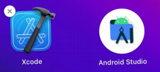

# 一. 邂逅跨平台开发

---

## 1. 邂逅跨平台开发

- 传统移动端开发方式
  - 自从`iOS`和`Android`系统诞生以来，移动端开发主要由` iOS `和 `Android `这两大平台占据
  - 早期的移动端开发人员主要是针对` iOS `和` Android `这两个平台分别进行同步开发
  - **原生开发模式**优缺点：
    1. 原生`App`在**体验、性能、兼容性都非常好**，并可以非常方便的使用硬件设备，比如：摄像头、罗盘等
    2. 但是同时开发两个平台，无论是**成本**上，还是**时间**，对于企业来说这个**花费都是巨大**，不可接受的
    3. 纯原生 **开发效率** 和 **上线周期** 也严重影响了应用快速的迭代，也不利于多个平台版本控制等
- **跨平台开发**的诞生
  - 因为原生`App`存在：**时间长、成本高、迭代慢、部署慢、不利于推广**等因素
  - 导致了跨平台开发的概念渐渐走进了人们的视野
  - 因此 “**一套代码，多端运行**” 的跨平台理念也应运而生

## 2. 原生 VS 跨平台

- **原生开发**的特点：
  - **性能稳定，使用流畅，用户体验好、功能齐全，安全性有保证，兼容性好，可使用手机所有硬件功能**等
  - 但是**开发周期长、维护成本高、迭代慢、部署慢、新版本必须重新下载应用**
  - 不支持跨平台，**必须同时开发多端代码**
- **跨平台开发**的特点：
  - 可以跨平台，一套代码搞定`iOS`、`Android`、微信小程序、`H5`应用等
  - **开发成本较低，开发周期比原生短**
  - 适用于跟系统交互少、页面不太复杂的场景
  - 但是对开发者要求高，除了本身`js`的了解，还必须熟悉一点原生开发
  - 不适合做高性能、复杂用户体验，以及定制高的应用程序。比如：抖音、微信、QQ等
  - 同时开发多端**兼容和适配比较麻烦**、调试起来不方便

## 3. 跨平台发展史

- 跨平台发展史
  - 2009年以前，当时最要是使用最原始的`HTML` + `CSS` + `JS`进行移动端`App`开发
  - 2009-2014年间， 出现了`PhoneGap` 、`Cordova`等跨平台框架，以及`Ionic`轻量级的手机端`UI`库
  - 2015年，`ReactNative`（跨平台框架）掀起了国内跨平台开发热潮，一些互联网大厂纷纷投入` ReactNative `开发阵营
  - 2016年，阿里开源了`Weex`，它是一个可以使用现代化`Web`技术开发高性能原生应用的框架
  - 2017年`Google I/O`大会上，`Google`正式向外界公布了`Flutter`，一款跨平台开发工具包，用于为`Android`、`iOS`、`Web`、`Windows`、`Mac`等平台开发应用
  - 2017年至今，微信小程序、`uni-app`、`Taro `等一系列跨平台小程序框架陆续流行起来了
- 应该如何选择？个人建议
  - 需要做高性能、复杂用户体验、定制高的`APP`、需硬件支持的选 原生开发
  - 需要性能较好、体验好、跨`Android`、`iOS`平台、 `H5`平台、也需要硬件支持的选` Flutter`（采用`Dart`开发）
  - 需要跨小程序、`H5`平台、`Android`、`iOS`平台、不太复杂的先选 `uni-app`，其次选` Taro`
  - 不需要跨平台的，选择对应技术框架即可

## 4. 跨平台框架对比

|   类型   |              `Cordova`               |          `Xamarin`          |      `React Native`      |           `Weex`           |              `Uniapp`               |                          `Flutter`                           |
| :------: | :----------------------------------: | :-------------------------: | :----------------------: | :------------------------: | :---------------------------------: | :----------------------------------------------------------: |
|   性能   |                  低                  |             高              |           较高           |             中             |                 高                  |                              高                              |
| 上手难度 |                 容易                 |            较高             |           较高           |            容易            |                容易                 |                              中                              |
|   核心   |                 `js`                 |           `.NET`            |         `React`          |           `Weex`           |                `vue`                |                            `Dart`                            |
| 框架轻重 |                  轻                  |            较重             |           较重           |            较轻            |                 轻                  |                              重                              |
|   特点   |              适合单页面              |      适合开发整体`App`      |    适合开发整体`App`     |         适合单页面         |          适合开发整体`App`          |                      适合开发整体`App`                       |
|   社区   |              活跃度较低              |          活跃度低           | 活跃度高，`Facebook`维护 | 活跃度中，目前托管`apache` |       活跃度高，`Dcloud`维护        |                    活跃度高，`Google`维护                    |
| 支持平台 | `Android`、`ios`、`Windows`、`MacOS` | `Android`、`ios`、`Windows` | `Android`、`ios`、`Web`  |  `Android`、`ios`、`Web`   | `Android、ios、Web`、小程序、快应用 | `Android`、`ios、Web`、`MacOS`、`Linux`、`Windows`、`Fuchsia` |
|  适应性  |         `Web`开发学习成本低          |     `.NET C#`工程师开发     |   `Web`开发学习成本低    |    `Web`开发学习成本低     |         `Web`开发学习成本低         |               `Java、C++、C#`、开发学习成本低                |

## 5. 跨平台项目实战

# 二. 初体验uni-app

---

# 三. uni-app全局文件

---

# 四. 内置组件和样式

---

# 五. 扩展组件和样式

---

# 六. 跨端兼容实现

---

# 七. 路由和生命周期

---

