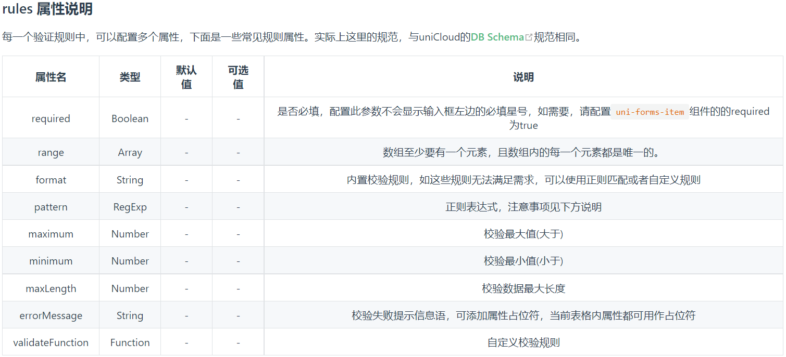
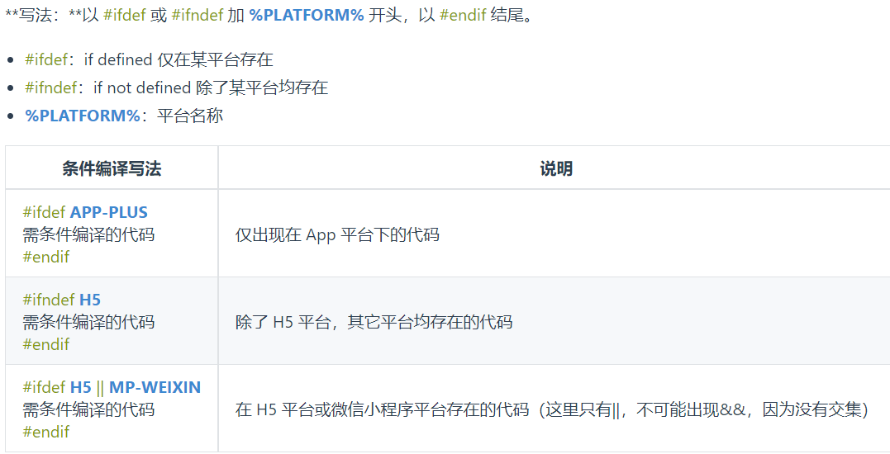
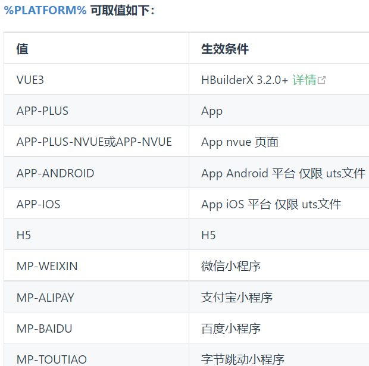
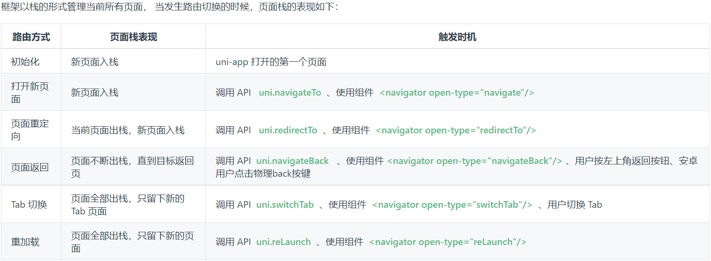
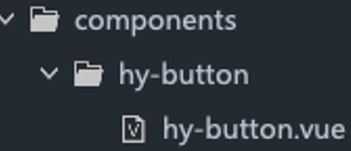
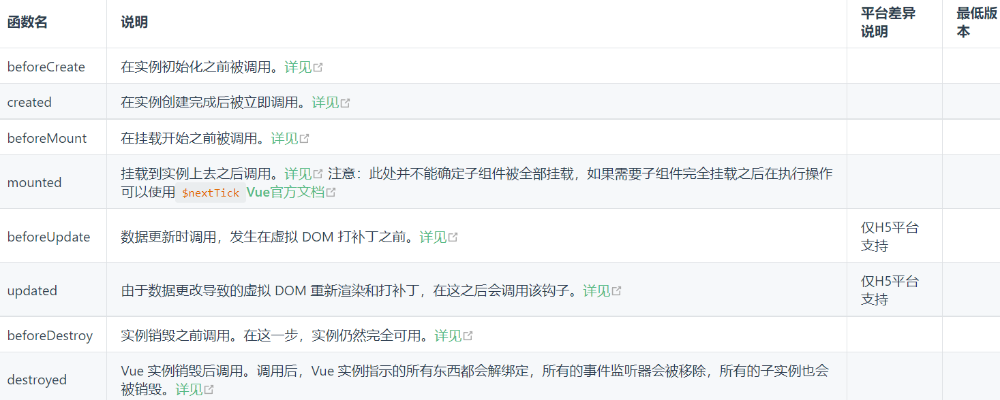

# 一. 扩展组件uni-ui

---

## 1. 扩展组件（uni-ui）

- 什么是` uni-ui`？
  - `uni-ui`是`DCloud`提供的一个`UI`组件库，一套基于`Vue`组件、`flex`布局的跨全端`UI`框架
  - `uni-ui`不包括`uni-app`框架提供的基础组件，而是基础组件的补充
  - 详情：https://uniapp.dcloud.net.cn/component/uniui/uni-ui.html
- `uni-ui `特点
  - 高性能
    - 目前为止，在小程序和混合`app`领域，`uni-ui`是性能的标杆
    - 自动差量更新数据。`uni-app`引擎底层会自动用`diff`算法更新数据
    - 优化逻辑层和视图层通讯折损。 比如，需要跟手式操作的`UI`组件，底层使用了`wxs`、`bindingx`等技术，实现了高性能的交互体验
      - ` WXS（WeiXin Script）`是小程序的一套脚本语言，结合` WXML`，可以构建出页面的结构。在` iOS `设备上小程序内的` WXS `会比` JavaScript `代码快 2 ~ 20 倍
      - `bindingx`技术提供了一种称之为表达式绑定(`Expression Binding`) 的机制，在` weex `上让手势等复杂交互操作以`60fps`的帧率流畅执行，而不会导致卡顿
  - 全端
    - `uni-ui`的组件都是多端自适应的，底层会抹平很多小程序平台的差异或`bug`
    - `uni-ui`还支持`nvue`原生渲染、以及`PC`宽屏设备
  - 风格扩展
    - `uni-ui`的默认风格是中型的，与`uni-app`基础组件风格一致
    - 支持`uni.scss`，可以方便的扩展和切换应用的风格

## 2. 安装 uni-ui 组件库

- 方式一（推荐）：通过` uni_modules`（插件模块化规范）单独安装组件，通过 `uni_modules `按需安装某个组件：
  - 步骤1：官网找到扩展组件清单，然后将所需要的组件导入到项目，导入后直接使用，无需`import`和注册
  - 步骤2：通常我们还想切换应用风格，这时可以在`uni.scss`导入`uni-ui`提供的内置`scss`变量，然后重启应用
  - 注意：需要登录`DCloud`账号才能安装
- 方式二（推荐） ：通过` uni_modules `导入全部组件
  - 如想把所有`uni-ui`组件导入到项目，可以借用`HbuilderX`插件导入
  - 如没自动导入其他组件，可在` uni-ui `组件目录上右键选择 安装三方插件依赖 即可
- 方式三：在` HBuilderX `新建` uni-app`项目时，在模板中选择` uni-ui `模板来创建项目
  - 由于`uni-app`独特的`easycom`（自动导包）技术，可以免引入、注册，就直接使用符合规则的vue组件
- 方式四：`npm`安装
  - 在` vue-cli `项目中可用` npm `安装` uni-ui `库
  - 或直接在` HBuilderX `项目中用` npm`安装

## 3. 定制 uni-ui 主题风格

1. 安装`dart-sass`插件(一般都会提示，并自动安装)

2. 在项目根目录的`uni.scss`文件中引入`uni-ui`组件库的`variable.scss`变量文件，然后就可以使用或修改对应的`scss`变量

3. 变量主要定义的是主题色

   ```scss
   /* 需要放到文件最上面 */
   @import '@/uni_modules/uni-scss/variables.scss';
   
   /* 以下变量是默认值，如不需要修改可以不用给下面的变量重新赋值 */
   // 主色
   $uni-primary: #2979ff;
   $uni-primary-disable:mix(#fff,$uni-primary,50%);
   $uni-primary-light: mix(#fff,$uni-primary,80%);
   
   // 辅助色
   // 除了主色外的场景色，需要在不同的场景中使用（例如危险色表示危险的操作）。
   $uni-success: #18bc37;
   $uni-success-disable:mix(#fff,$uni-success,50%);
   $uni-success-light: mix(#fff,$uni-success,80%);
   
   // 中性色
   // 中性色用于文本、背景和边框颜色。通过运用不同的中性色，来表现层次结构。
   $uni-main-color: #3a3a3a; 			// 主要文字
   $uni-base-color: #6a6a6a;			// 常规文字
   $uni-secondary-color: #909399;	// 次要文字
   $uni-extra-color: #c7c7c7;			// 辅助说明
   
   // 边框颜色
   $uni-border-1: #F0F0F0;
   $uni-border-2: #EDEDED;
   $uni-border-3: #DCDCDC;
   $uni-border-4: #B9B9B9;
   
   // 常规色
   $uni-black: #000000;
   $uni-white: #ffffff;
   $uni-transparent: rgba($color: #000000, $alpha: 0);
   
   // 背景色
   $uni-bg-color: #f7f7f7;
   
   /* 水平间距 */
   $uni-spacing-sm: 8px;
   $uni-spacing-base: 15px;
   $uni-spacing-lg: 30px;
   
   // 阴影
   $uni-shadow-sm:0 0 5px rgba($color: #d8d8d8, $alpha: 0.5);
   $uni-shadow-base:0 1px 8px 1px rgba($color: #a5a5a5, $alpha: 0.2);
   $uni-shadow-lg:0px 1px 10px 2px rgba($color: #a5a4a4, $alpha: 0.5);
   
   // 蒙版
   $uni-mask: rgba($color: #000000, $alpha: 0.4);
   ```

## 4. uni-forms 组件

- `uni-froms`组件使用步骤（类似`Element Plus`的表单组件用法）：
  - 安装`uni-forms`等组件
  - `uni-forms`搭建表单布局
  - 编写表单项的验证规则
  - 提交表单时验证表单项
  - 重置表单
  
  

## 5. 重写 uni-forms 组件样式

- 小程序、`App`直接重写，需要添加` important`

- H5、App和小程序使用：`global( selector )`，需要添加`important`

- H5 、App和小程序使用：`deep( selector )`，需要添加`important`

  ```scss
  /* weapp、app */
  .uni-forms-item_label {
    justify-content: center !important;
  }
  
  /* weapp、h5、app */
  :global(.uni-forms-item_label) {
    justify-content: center !important;
  }
  
  /* weapp、h5、app */
  :deep(.uni-forms-item_label) {
    justify-content: center !important;
  }
  ```


# 二. 跨端兼容实现

---

## 1. 跨平台兼容

- `uni-app`能实现一套代码、多端运行，核心是通过编译器 + 运行时实现的：
  - 编译器：将`uni-app`统一代码编译生成每个平台支持的特有代码；如在小程序平台，编译器将`.vue`文件拆分生成`wxml`、`wxss`、`js`等
  - 运行时：动态处理数据绑定、事件代理，保证`Vue`和对应宿主平台 数据的一致性
- 跨平台存在的问题：
  - `uni-app `已将常用的组件、`JS API `封装到框架中，开发者按照` uni-app `规范开发即可保证多平台兼容，大部分业务均可直接满足
  - 但每个平台有自己的一些特性，因此会存在一些无法跨平台的情况
    - 大量写` if else`，会造成代码执行性能低下和管理混乱
    - 编译到不同的工程后二次修改，会让后续升级变的很麻烦
- 跨平台兼容解决方案：
  - 在` C `语言中，通过` #ifdef`、`#ifndef `的方式，为` windows`、`mac `等不同` os `编译不同的代码
  - `uni-app `参考这个思路，为` uni-app `提供了条件编译手段，在一个工程里优雅的完成了平台个性化实现

## 2. 条件编译



- 条件编译是用特殊的注释作为标记，在编译时根据这些特殊的注释，将注释里面的代码编译到不同平台

- 具体的语法：以` #ifdef `或` #ifndef `加` %PLATFORM% `开头，以` #endif `结尾

  - `#ifdef`：`if defined `仅在某平台存在
  - `#ifndef`：`if not defined `除了某平台，其它平台均存在
  - `%PLATFORM%`：平台名称

  

- 支持编写条件编译的文件，如下：

  - `.vue（template 、script 、style）`
  - `.js`、`.ts`、`pages.json`
  - `.css`、`.scss`、`.less`、`.stylus`

- 例如：设置页面的标题

  - H5专有API：`document.title = ''`
  - 微信小程序专有API：`wx.setNavigationBarTitle(object)`

## 3. 注意事项

- **条件编译是利用注释实现的**，在不同语法里注释写法不一样
  - `js`使用`// 注释`
  - `css `使用` /* 注释 */`
  - `vue/nvue `模板里使用` <!-- 注释 -->`
- 条件编译` APP-PLUS `包含 ：`APP-NVUE `和` APP-VUE`
- `APP-PLUS-NVUE `和` APP-NVUE `没什么区别，为了简写后面出了` APP-NVUE`
- 使用条件编译请保证编译前和编译后文件的正确性，比如` json `文件中不能有多余的逗号
- `Android `和` iOS `平台不支持条件编译，如需区分` Android`、`iOS` 平台，请通过调用` uni.getSystemInfo `来获取平台信息
- 微信小程序主题色是绿色，而百度支付宝小程序是蓝色，应用想分平台适配颜色，条件编译是代码量最低、最容易维护的


# 三. 页面路由和传参

---

## 1. 新建Page页面

- `uni-app`页面是编写在`pages`目录下：
  - 可直接在` uni-app `项目上右键 " 新建页面 "，`HBuilderX`会自动在`pages.json`中完成页面注册
  - `HBuilderX `还内置了常用的页面模板（如图文列表、商品列表等），这些模板可以大幅提升你的开发效率
- 注意事项：
  - 每次新建页面，需在`pages.json`中配置`pages`列表（手动才需配置）
  - 未在`pages.json -> pages `中配置的页面，`uni-app`会在编译阶段进行忽略
- 删除页面：
  - 删除`.vue`文件或`.nvue`文件
  - 删除`pages.json -> pages`列表项中的配置
- 配置`tabBar`
  - `color`：`tab`上的文字默认颜色
  - `selectedColor`：`tab`上的文字选中时的颜色
  - `list`：`tab`的列表，详见`list`属性说明，最少2个、最多5个`tab`

## 2. 页面路由

- `uni-app `有两种页面路由跳转方式：使用`navigator`组件跳转、调用`API`跳转（类似小程序，与`vue-router`不同）

  - 组件：`navigator`
  - `API`：`navigateTo`、`redirectTo`、`navigateBack`、`switchTab`

  

## 3. 页面间通讯

- 在`uni-app`中，常见页面通讯方式：

  - 方式一：`url`查询字符串和`EventChannel`
  - 方式二：使用事件总线
  - 方式三：全局数据` globalData`
  - 方式四：本地数据存储
  - 方式五：`Vuex`和`Pinia`，状态管理库

- 方式一：`url`和`EventChannel`（兼容`h5`、`weapp`、`app`）

  - 直接在`url`后面通过查询字符串的方式拼接
    - 如`url`查询字符串出现特殊字符等格式，需编码
  - 然后可在`onLoad`生命周期中获取`url`传递的参数
  - url有长度限制，太长的字符串会传递失败，可使用[窗体通信](https://uniapp.dcloud.io/tutorial/page.html#emit)、[全局变量](https://ask.dcloud.net.cn/article/35021)，或`encodeURIComponent`等多种方式解决，如下为`encodeURIComponent`示例

  ```html
  <navigator :url="'/pages/aaa/bbb?item='+ encodeURIComponent(JSON.stringify(item))"></navigator>
  ```

  ```js
  // bbb.vue页面接受参数
  onLoad: function (option) {
  	const item = JSON.parse(decodeURIComponent(option.item));
  }
  ```

- `EventChannel`对象的获取方式

  - `Options`语法：`this.getOpenerEventChannel()`
  - `Composition`语法：`getCurrentInstance().proxy、getOpenerEventChannel()`

## 4. 事件总线

- 方式二：事件总线
  - `uni.$emit( eventName, OBJECT )` 触发全局的自定义事件
  - `uni.$on( eventName, callback )` 监听全局的自定义事件。由` uni.$emit `触发
  - `uni.$once( eventName, callback )` 只监听一次全局的自定义事件。由` uni.$emit `触发
  - `uni.$off( eventName, callback )` 移除全局自定义事件监听器
    - 如果没有提供参数，则移除所有的事件监听器
  
  > 注意：
  >
  > - 需先监听，再触发事件，比如：你在A界面触发，然后跳转到B页面后才监听是不行的
  > - 通常`on`和`off`是同时使用，可以避免多次重复监听
  > - 适合页面返回传递参数、适合跨组件通讯，不适合界面跳转传递参数

## 5. 页面生命周期

- `uni-app `常用的页面生命周期函数：

  | 函数名              | 说明                                                         |
  | ------------------- | ------------------------------------------------------------ |
  | `onLoad`            | 监听页面加载，其参数为上个页面传递的数据，参数类型为`Object`（用于页面传参），参考[示例](https://uniapp.dcloud.net.cn/api/router#navigateto) |
  | `onShow`            | 监听页面显示。页面每次出现在屏幕上都触发，包括从下级页面点返回露出当前页面 |
  | `onReady`           | 监听页面初次渲染完成。注意如果渲染速度快，会在页面进入动画完成前触发 |
  | `onHide`            | 监听页面隐藏                                                 |
  | `onUnload`          | 监听页面卸载                                                 |
  | `onPullDownRefresh` | 监听用户下拉动作，一般用于下拉刷新，参考[示例](https://uniapp.dcloud.net.cn/api/ui/pulldown) |
  | `onReachBottom`     | 页面滚动到底部的事件（不是`scroll-view`滚到底），常用于下拉下一页数据。具体见下方注意事项 |

- 更多： https://uniapp.dcloud.net.cn/tutorial/page.html#lifecycle

  > 注意：
  >
  > - 页面可以使用`Vue`组件生命周期吗？ 可以的
  > - 页面滚动才会触发` onReachBottom `回调，如果自行通过`overflow`实现的滚动不会触发` onReachBottom `回调


# 四. 其他常用API

---

## 1. 网络请求

- `uni.request(OBJECT)` 发起网络请求
  - 登录各个小程序管理后台，给网络相关的` API `配置合法域名（域名白名单）
  - 微信小程序开发工具，在开发阶段可以配置：不校验合法域名
  - 运行到手机时，资源没有出来时可以打开手机的调试模式
  - 请求的`header`中` content-type `默认为`application/json`
- 文档：https://uniapp.dcloud.net.cn/api/request/request.html#request

## 2. 数据缓存

- `uni.setStorage(OBJECT)`
  - 将数据存储在本地缓存中指定的` key `中，会覆盖掉原来该` key `对应的内容，这是一个**异步**接口
- `uni.setStorageSync(KEY, DATA)`
  - 将` data `存储在本地缓存中指定的` key `中，会覆盖掉原来该` key `对应的内容，这是一个**同步**接口
- `uni.getStorage(OBJECT)`
  - 从本地缓存中异步获取指定` key `对应的内容
- `uni.getStorageSync(KEY)`
  - 从本地缓存中同步获取指定` key `对应的内容
- `uni.removeStorage(OBJECT)`
  - 从本地缓存中异步移除指定` key`
- `uni.removeStorageSync(KEY)`
  - 从本地缓存中同步移除指定` key`


# 五. 自定义组件

---

## 1. 组件（Component）

- `uni-app `组件与` Vue`标准组件基本相同，但是也有一点区别，比如：

  - 传统`vue`组件，需要创建组件、引用、注册，三个步骤后才能使用组件， `easycom`组件模式可以将其精简为一步

  - `easycom`组件规范：

    - **组件需符合 `components`/组件名称/组件名称`.vue `的目录结构**
    - **符合以上目录结构的就可不用引用、注册，直接在页面中使用该组件了**

    

## 2. 组件生命周期

- `uni-app `组件支持的生命周期，与`Vue`组件的生命周期相同

  - 组件中可以使用页面的生命周期吗？
    - **在`Options API `语法：组件中不支持使用页面生命周期**
    - **在`Composition API`语法：组件中支持页面生命周期，不同端支持情况有差异**

  


# 六. 状态管理pinia

---

- 认识`Pinia`
  - Pinia（发音为 /piːnjʌ/，如英语中的 peenya） 是 Vue 的存储库，它允许跨组件、页面共享状态
  - uni-app 内置了 Pinia，使用 HBuilder X 不需要手动安装，直接使用即可
  - 使用 CLI 需要手动安装，执行 yarn add pinia 或 npm install pinia
- Pinia的初体验，步骤如下：
  - 第一步：在 main.js 中安装 Pinia插件
  - app.use(Pinia.createPinia())
  - 第二步：接着创建一个store
  - 第三步：然后在组件中就可以直接使用了


# 七. uni-app项目实战

---


