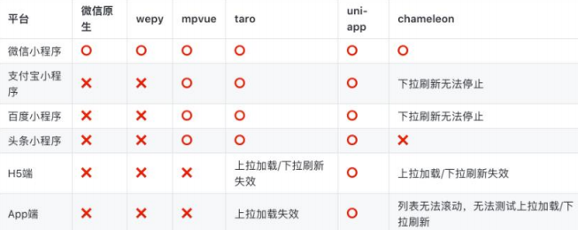
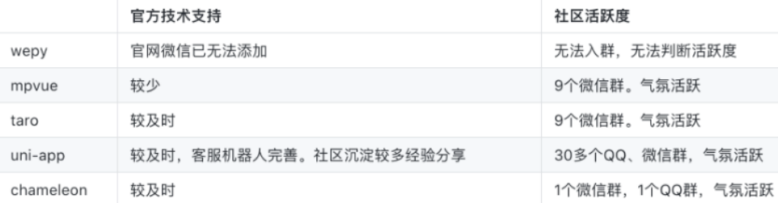
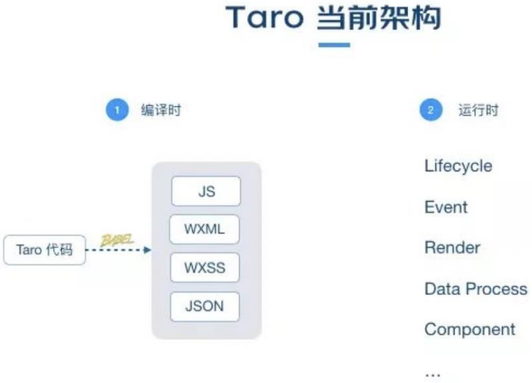

# 一. 邂逅 Taro 框架 

---

## 1. 认识 Taro 框架

- 什么是`Taro`？
  - `Taro `是由京东 凹凸实验室 打造的**一个开放式跨端、跨框架解决方案**，并于2018年6月7日正式开源
  - `Taro`**支持使用`React/Vue/Preact`等框架**来开发 微信 / 京东 / 百度 / 支付宝 / 字节跳动 / QQ 等小程序 / `H5` / `RN` 等应用
- `Taro`的版本史
  - Taro 1.x / 2.x 版的文档，现已不再积极维护
  - 2021年3月，Taro 3.1版本正式发布，主要改动是打造开放式架构，支持以插件的形式编译到任意小程序平台
  - 2021年4月，Taro 3.2 版本正式发布，新增了对 `ReactNative` 的支持，主要是由 58同城团队主导
  - 2021年4月，Taro 3.3 alpha发布，主要改动是支持使用 `HTML` 标签进行开发
  - 2022年1月，Taro 3.4版本正式发布，主要改动是支持使用 `Preact` 和 `Vue3.2` 进行开发
  - 目前 Taro 团队的**迭代重心在于 `Taro 3`，`Taro 1/2` 只会对重大问题进行修复，不会新增新特性**

## 2. Taro的特点

- 多端支持
  - **`Taro3 `支持转换到`H5`、`ReactNative `以及任意小程序平台（重心是小程序端）**
  - 目前官方支持转换的平台如下：
    - `H5`、`ReactNative`、微信小程序、京东小程序、百度小程序、支付宝小程序、字节跳动小程序
    - QQ 小程序、钉钉小程序、企业微信小程序、支付宝小程序等
- 多框架支持
  - 在`Taro3 `中可以使用完整的 `React` / `Vue` / `Nervjs` / `Preact` 开发体验

## 3. Taro vs uni-app

- 跨端支持度

  

- 社区活跃度

  

- 资料完善度

  - `Taro`： 官方文档较完整，但不是很丰富，资料一般
  - `uni-app`：官方文档和各种专题内容很丰富，资料齐全

- 工具和周边生态

  - `Taro`：官方的`Taro UI`，只支持小程序和`H5`( 不支持`RN` )，截至到2019年10月28日， Taro只有64个插件
  - `uni-app`：官方的`uni-ui`支持多端、周边模板丰富、完善的插件市场，截至到2019年10月28日，有850个插件

- `Taro`和`uni-app`如何选择？

  - 如需要跨平台，并且应用不是很复杂，可选` Taro `和` uni-app`
  - 如熟悉`Vue`可优先选择`uni-app`， 如熟悉`React`推荐使用` Taro`
  - `uni-app`在资料、生态、工具、开发效率、跨端数会比`Taro`略胜一筹
  - 当然`Taro`也有独特的优势，如：用`React`开发非常的灵活

## 4. Taro架构图设计图

- `Taro`当前的架构主要分为：**编译时** 和 **运行时**

- 其中编译时主要是将`Taro`代码通过`Babel[11] `转换成 小程序的代码，如：`JS`、`WXML`、`WXSS`、`JSON`

- 运行时主要是进行一些：生命周期、事件、`data`等部分的处理和对接，以保证和宿主平台数据的一致性

  

## 5. 编辑器选择

- 推荐使用`VSCode `或` WebStorm`
- 当你使用` VSCode `时，推荐安装` ESLint `插件，如果你使用` TypeScript`，别忘了配置` eslint.probe `参数
- 如果使用` Vue`，推荐安装` Vetur `或` Volar `插件
- 如果你愿意花钱又懒得折腾可以选择` WebStorm`，基本不需要配置
- 不管使用` VSCode `还是` WebStrom`，安装了上述插件之后使用` Taro `都实现自动补全和代码实时检查（`linting`）的功能


# 二. Taro的初体验

---

## 1. 安装及使用

- `Taro `项目基于` node`，请确保已具备较新的` node `环境（`>=12.0.0`）

- `Taro CLI `工具安装

  - 首先，你需要使用` npm `或` yarn `全局安装` @tarojs/cli`，或直接使用` npx`

    ```bash
    # 使用 npm 安装 CLI
    $ npm install -g @tarojs/cli
    
    # OR 使用 yarn 安装 CLI
    $ yarn global add @tarojs/cli
    
    # OR 安装了 cnpm，使用 cnpm 安装 CLI
    $ cnpm install -g @tarojs/cli
    ```

  - 查看` Taro CLI `工具版本

    - 可以使用 `npm info` 查看` Taro `版本信息，在这里你可以看到当前最新版本

      ```bash
      npm info @tarojs/cli
      ```

## 2. 项目初始化

- 使用命令创建模板项目：

  ```bash
  $ taro init myApp
  ```

- `npm 5.2+ `也可在不全局安装的情况下使用` npx `创建模板项目：

  ```bash
  $ npx @tarojs/cli init myApp
  ```

> 注意事项：
>
> - 开发支付宝小程序时，`Webpack4 `暂不支持使用` React18`
> - 受小程序环境限制，诸如新` SSR Suspense `等特性将不能在小程序中使用
> - `RN `暂不支持` React v18`，需要等待` RN `官方输出支持方案
> - 为了顺利地用`Taro`来开发`App`，我们强烈地建议您，先对` React Native `开发进行学习

## 3. 编译运行

- `Taro`编译分为` dev `和` build `模式：

  - **`dev `模式（增加`--watch `参数） 将会监听文件修改**
  - **`build `模式（去掉`--watch`参数） 将不会监听文件修改，并会对代码进行压缩打包**

- `dev `命令 启动` Taro `项目的开发环境

  - `pnpm run dev:h5 `启动`H5`端
  - `pnpm run dev:weapp `启动小程序端

- `build `命令可以把` Taro `代码编译成不同端的代码，然后在对应的开发工具中查看效果，比如：

  - `H5`直接在浏览器中可以查看效果
  - 微信小程序需在《微信开发者工具》打开根目录下的`dist`查看效果
  - `RN`应用需参考《`React Native`端开发流程》
  - ...等等

  ```bash
  # yarn
  $ yarn dev:weapp
  $ yarn build:weapp
  
  # npm script
  $ npm run dev:weapp
  $ npm run build:weapp
  
  # 仅限全局安装
  $ taro build --type weapp --watch
  $ taro build --type weapp
  
  # npx 用户也可以使用
  $ npx taro build --type weapp --watch
  $ npx taro build --type weapp
  
  # watch 同时开启压缩
  $ set NODE_ENV=production && taro build --type weapp --watch # CMD
  $ NODE_ENV=production taro build --type weapp --watch # Bash
  ```

## 4. 项目目录结构

```
├── dist                        编译结果目录
|
├── config                      项目编译配置目录
|   ├── index.js                默认配置
|   ├── dev.js                  开发环境配置
|   └── prod.js                 生产环境配置
|
├── src                         源码目录
|   ├── pages                   页面文件目录
|   |   └── index               index 页面目录
|   |       ├── index.js        index 页面逻辑
|   |       ├── index.css       index 页面样式
|   |       └── index.config.js index 页面配置
|   |
|   ├── app.js                  项目入口文件
|   ├── app.css                 项目总通用样式
|   └── app.config.js           项目入口配置
|
├── project.config.json         微信小程序项目配置 project.config.json
├── project.tt.json             字节跳动小程序项目配置 project.tt.json
├── project.swan.json           百度小程序项目配置 project.swan.json
├── project.qq.json             QQ 小程序项目配置 project.qq.json
|
├── babel.config.js             Babel 配置
├── tsconfig.json               TypeScript 配置
├── .eslintrc                   ESLint 配置
|
└── package.json
```

- 官方文档地址：https://taro-docs.jd.com/docs/folder

## 5. Taro + React开发规范

- 为了实现多端兼容，综合考虑编译速度、运行性能等因素，`Taro`可以约定了如下开发规范：
  - 页面文件遵循` React`组件 (`JSX`) 规范
  - 组件标签靠近小程序规范（但遵从大驼峰，并需导包），详见`Taro `组件规范
  - 接口能力（`JS API`）靠近微信小程序规范，但需将前缀` wx `替换为` Taro`(需导包)，详见`Taro`接口规范
  - 数据绑定及事件处理同` React `规范，同时补充了`App`及页面的生命周期
  - 为兼容多端运行，建议使用`flex`布局进行开发，推荐使用` px `单位（`750`设计稿）
  - 在` React `中使用`Taro`内置组件前，必须从` @tarojs/components `进行引入
  - 文档直接查看`Taro`的官网文档： https://docs.taro.zone/docs


# 三. Taro配置文件 

---

## 1. 编译配置（ config ）

- 用于配置 ` Taro ` 项目的编译行为、修改 ` Webpack ` 配置等，详情请参考[编译配置](https://taro-docs.jd.com/docs/config)和[编译配置详情](https://taro-docs.jd.com/docs/config-detail)


- 编译配置存放于项目根目录下的 `config` 目录中，包含三个文件：

  - `index.js` 是通用配置
  - `dev.js` 是项目开发（预览）时的配置
  - `prod.js` 是项目生产（打包）时的配置

- 常用的配置

  - `projectName ` ： 项目名称
  - `date ` ： 项目创建时间
  - `designWidth` ：设计稿尺寸
  - `sourceRoot` ：项目源码目录
  - `outputRoot` ：项目产出目录
  - `defineConstants` ：定义全局的变量（`DefinePlugin`）
  - `alias` ：配置路径别名
  - `h5.webpackChain` ：`webpack` 配置
  - `h5.devServer` ：开发者服务配置
  - 更多的配置：https://docs.taro.zone/docs/config
  
- 详细的编译配置文档请查阅：[编译配置详情](https://taro-docs.jd.com/docs/config-detail)

## 2. 全局配置（ app.config.js ）

- `app.config.js` 用来对小程序进行全局配置，配置项遵循微信小程序规范，类似微信小程序的`app.json`，并对所有平台进行统一，在 `H5`、`React Native`、所有小程序均支持的配置

|                             属性                             |      类型      | 必填 | 描述                |
| :----------------------------------------------------------: | :------------: | :--: | :------------------ |
|   [pages](https://taro-docs.jd.com/docs/app-config#pages)    | `String Array` |  是  | 页面路径列表        |
|  [window](https://taro-docs.jd.com/docs/app-config#window)   |    `Object`    |  否  | 全局的默认窗口表现  |
|  [tabBar](https://taro-docs.jd.com/docs/app-config#tabbar)   |    `Object`    |  否  | 底部 `tab` 栏的表现 |
| [subPackages](https://taro-docs.jd.com/docs/app-config#subpackages) | `Object Array` |  否  | 分包结构配置        |

```js
// app.config.js
export default defineAppConfig({
  pages: ['pages/index/index'],
  window: {
    backgroundTextStyle: 'light',
    navigationBarBackgroundColor: '#fff',
    navigationBarTitleText: 'WeChat',
    navigationBarTextStyle: 'black'
  }
})
```

- 更多配置：https://taro-docs.jd.com/docs/app-config#pages

## 3. 页面配置（ xxx.config.js ）

- 每一个小程序页面都可以使用 `.config.js` 文件来对本页面的窗口表现进行配置
- 页面中配置项在当前页面会覆盖全局配置 `app.config.json` 的 `window` 中相同的配置项
- 文件需要 `export` 一个默认对象，**配置项遵循微信小程序规范**，并且对所有平台进行统一

```js
// page.config.js
export default definePageConfig({
  navigationBarTitleText: '首页'
})
```

- 详细页面配置：https://docs.taro.zone/docs/next/page-config

## 4. 项目配置（ project.xxx.json ）

- 为了适配不同的小程序， `Taro` 支持各个小程序平台添加各自项目配置文件

  - **默认 `project.config.json` 配置只能用于微信小程序**

- `project.config.json` 常用配置

  - `libVersion` 小程序基础库版本
  - `projectname` 小程序项目名字
  - `appid` 小程序项目的 `appid`
  - `setting` 小程序项目编译配置

- 各类小程序平台均有自己的项目配置文件，例如：

  | 小程序平台 | 添加配置文件          |
  | :--------: | :-------------------- |
  |    微信    | `project.config.json` |
  |    百度    | `project.swan.json`   |
  |  字节跳动  | `project.tt.json`     |
  |     QQ     | `project.qq.json`     |
  |   支付宝   | `project.alipay.json` |
  |    飞书    | `project.lark.json`   |

- 官方文档：https://taro-docs.jd.com/docs/project-config

## 5. 入口组件（ app.js ）

- 每一个 `Taro` 应用都需要一个入口组件（如 `React` 组件）用来注册应用。入口文件默认是 `src` 目录下的 `app.js`

- 在入口 `app.js` 组件中我们可以：

  - 定义应用的生命周期

    - `onLaunch` -> `useEffect`：在小程序环境中对应 `app` 的 `onLaunch`
    - `componentDidShow` -> `useDidShow`：在小程序环境中对应 `app` 的 `onShow`
    - `componentDidHide` -> `useDidHide`：在小程序环境中对应 `app` 的 `onHide`

  - 定义全局数据

    - `taroGlobalData`

    ```js
    // app.js
    
    class App extends Component {
      // 设置全局变量 "x"
      taroGlobalData = {
        x: 1
      }
    }
    ```

    ```js
    // index.js
    
    function Index () {
      // 获取并使用全局变量 "x"
      const app = Taro.getApp()
      console.log(app.x) // 1
    }
    ```

  - 定义应用的全局状态

    - `Redux(Vuex、Pinia)`

- `React` 入口组件官方文档：https://taro-docs.jd.com/docs/react-entry


# 四. 内置组件和样式

---

## 1. 常用内置组件

- `Taro` 以 [微信小程序组件库](https://developers.weixin.qq.com/miniprogram/dev/component/) 为标准，结合 `jsx` 语法规范，定制了一套自己的组件库规范。

  基于以上原则，在小程序端，我们可以使用所有的小程序原生组件，而在其他端，我们提供了对应的组件库实现

  - `H5` 端，`@tarojs/components`，同时也是需要引入的默认标准组件库

- **在使用时，`React` 中我们需要先从 `Taro` 标准组件库 `@tarojs/components` 引用组件，再进行使用**，例如使用 `<View />`、 `<Text />` 组件，**而 `Vue` 我们则无需引入**

- `View` ：视图容器。用于包裹各种元素内容（`Taro3.3` 以后支持使用 `HTML` 标签 进行开发）

- `Text` ：文本组件。用于包裹文本内容

- `Button` : 按钮组件，多端主题色一样

- `Image` ：图片。`H5` 默认为图片宽高，`weapp` 为默认组件宽高，支持 `JPG` 、`PNG`、`SVG`、`WEBP`、`GIF` 等格式以及云文件 `ID`

  - 支持 `import` 导入 和 `URL` 网络图片

- `ScrollView` ：可滚动视图区域，用于区域滚动

  - 使用竖向滚动时，需要给 ` <scroll-view>` 一个固定高度，通过 `css` 设置 `height`
  - 使用横向滚动时，需要给 `<scroll-view>` 添加 `white-space: nowrap;` 样式，子元素设置为行内块级元素
  - 小程序中，请勿在 `scroll-view` 中使用 `map`、`video` 等原生组件，也不要使用 `canvas`、`textarea` 原生组件

- `Swiper` ：滑块视图容器，一般作为 `banner` 轮播图，默认宽 `100%`，高 `150px`

## 2. 设计稿及尺寸单位(px)

- **`Taro` 默认以 `750px` 作为换算尺寸标准，如设计稿不是 `750px` 为标准需修改 `designWidth`**

  - 比如：设计稿是 `640px`，则需修改 `config/index.js` 中 `designWidth` 为 `640`

  ```js
  // /config/index.js
  const config = {
    projectName: 'myProject',
    date: '2018-4-18',
    designWidth: 640,
    ....
  }
  ```

- 在 `Taro` 中单位建议使用 `px`、 百分比 `%`，`Taro` 默认会对所有单位进行转换

  - 在 `Taro` 中写尺寸按照 `1:1` 关系来写，即设计稿量长度 `100px`，那么尺寸就写 `100px`，当转成微信小程序时尺寸为 `100rpx`，当转成 `H5` 时尺寸以 `rem` 为单位
  - 如你希望部分 `px` 单位不被转换成 `rpx` 或 `rem`，最简单做法就是在 `px` 单位中增加一个大写字母

- `JS` 中行内样式的转换

  - 在编译时，`Taro` 会帮你对样式做尺寸转换操作

  - 但是如果是在 `JS` 中书写了行内样式，那么编译时就无法做替换了

  - 针对这种情况，`Taro` 提供了 `API` `Taro.pxTransform` 来做运行时的尺寸转换

    ```js
    Taro.pxTransform(10) // 小程序：rpx，H5：rem
    ```

## 3. CSS 编译时忽略

- **忽略单个属性**

  - 当前忽略单个属性的最简单的方法，就是 `px` 单位使用大写字母

    ```js
     /* `px` is converted to `rem` */
    .convert {
      font-size: 16px; // converted to 1rem
    }
    
     /* `Px` or `PX` is ignored by `postcss-pxtorem` but still accepted by browsers */
    .ignore {
      border: 1Px solid; // ignored
      border-width: 2PX; // ignored
    }
    ```

- **忽略样式文件**

  - 对于头部包含注释 `/*postcss-pxtransform disable*/` 的文件，插件不予转换处理

## 4. 全局和局部样式

- 全局样式

  - `Taro` 页面和普通组件导入的样式默认都是全局样式
  - 那在 `Taro` 中应该如何编写局部的样式呢？使用 `CSS Modules` 功能

- 局部样式

  1. 在 `config/index.js` 配置文件中启用 `CSS Modules` 的功能
  2. 编写的样式文件需要加上 `.module` 关键字
     - 比如： `index.module.scss` 文件
  3. 然后在组件中导入该样式文件，即可以按照模块的方式使用了

  ```react
  // 1.全局样式
  import "./index.scss";
  // 2.导入局部样式
  import Style from "./index.modules.scss";
  const StyPage = memo(() => {
    return (
    	<View className={`sty-page title ${Style.demo}`}>
      	<View>sty-page</View>
      </View>
    )
  })
  ```

  ```css
  .title {
    font-weight: 800;
  }
  
  .index-module_demo__CYmAH {
    border: 0.025rem solid red;
  }
  
  .sty-page {
    color: red;
  }
  ```

- `CSS Modules` 中也支持编写全局样式

  ```css
  :global(.title) {
    font-weight: 800;
  }
  ```

## 5. 背景图片

- `Taro` 支持使用在 `css` 里设置背景图片，使用方式与普通 `web` 项目大体相同，但需要注意以下几点：
  - 支持 `base64` 格式图片，支持网络路径图片

> 使用本地背景图片需注意：
>
> - 小程序不支持在 `css` 中使用本地文件，包括本地的背景图和字体文件。需以 `base64` 方式方可使用
> - 为了方便开发，`Taro` 提供了直接在样式文件中引用本地资源的方式，其原理是通过 `PostCSS` 的 `postcss-url` 插件将样式中本地资源引用转换成 `Base64` 格式，从而能正常加载
> - 不建议使用太大的背景图，大图需挪到服务器上，从网络地址引用
> - 本地背景图片的引用支持：相对路径和绝对路径

```css
// 相对路径（h5和小程序支持）
// background-image: url(../../assets/images/empty_cart.png);

// 绝对路径（h5支持）
// background-image: url(~@/assets/images/empty_cart.png);
```

```js
// /config/index.js

// 小程序端样式引用本地资源内联
url: {
  enable: true,
  config: {
    limit: 10240 // 设定转换尺寸上限
  }
}
```

## 6. 字体图标

- `Taro` 支持使用字体图标，使用方式与普通 `web` 项目相同：
  - 第一步：先生成字体图标文件
  - 第二步：`app.scss` 引入字体图标
  - 第三步：组件中使用自定义字体


# 五. Taro页面和传参 

---

## 1. 新建Page页面

- 快速创建新页面
  1. 命令行创建：`Taro create --name [页面名称]`
     - 能够在当前项目的 `pages` 目录下快速生成新的页面文件，并填充基础代码，是一个提高开发效率的利器
  2. 手动创建页面
     - 在目录根目录下的 `pages` 目录下新建即可

> 注意：
>
> - 新建的页面，都需在 `app.config.json` 中的 `pages` 列表上配置

- 删除页面，需做两件工作
  - 删除页面对应的文件
  - 删除 `app.config.json` 中对应的配置

## 2. 配置Tabbar

- 在 `app.config.js` 中配置 `Tabbar`

- `icon` 路径支持 绝对路径 和 相对路径

  ```js
  tabBar: {
    color: "#999",
    selectedColor: "#ff464e",
    list: [
      {
        text: "首页",
        pagePath: "pages/home/index",
        iconPath: "assets/images/tabbar/home.png",
        selectedIconPath: "assets/images/tabbar/home_active.png",
      },
      {
        text: "分类",
        pagePath: "pages/category/index",
        iconPath: "assets/images/tabbar/category.png",
        selectedIconPath: "assets/images/tabbar/category_active.png",
      }
    ],
  },
  ```

## 3. 页面路由

- `Taro` 有两种页面路由跳转方式：使用 `Navigator` 组件跳转、调用`API` 跳转

  - 组件：`Navigator`，`open-type` 属性的合法值

    | 参数           | 说明                                                         |
    | -------------- | ------------------------------------------------------------ |
    | `navigate`     | 对应 `Taro.navigateTo` 或 `Taro.navigateToMiniProgram` 的功能 |
    | `redirect`     | 对应 `Taro.redirectTo` 的功能                                |
    | `switchTab`    | 对应 `Taro.switchTab` 的功能                                 |
    | `reLaunch`     | 对应 `Taro.reLaunch` 的功能                                  |
    | `navigateBack` | 对应 `Taro.navigateBack` 的功能                              |
    | `exit`         | 退出小程序，`target="miniProgram"` 时生效                    |

  - 常用 `API`：`navigate`、`redirectTo`、`switchTab`、`navigateBack`

    ```js
    // 跳转到目的页面，打开新页面
    Taro.navigateTo({
      url: '/pages/page/path/name'
    })
    
    // 跳转到目的页面，在当前页面打开
    Taro.redirectTo({
      url: '/pages/page/path/name'
    })
    ```

## 4. 页面通讯

- 在 `Taro` 中，常见页面通讯方式：
  - 方式一： `url` 查询字符串 和 只支持小程序端的 `EventChannel`
  - 方式二：全局事件总线：`Taro.eventCenter`
  - 方式三：全局数据：`taroGloabalData`
  - 方式四：本地数据存储：`Taro.setStorageSync(key, data)` 等
  - 方式五：`Redux` 状态管理库
- 方式一：`url` 查询字符串
  - 传递参数：`?name=liujun&id=100`
  - 获取参数：
    - `onLoad`、`useLoad` 生命周期获取路由参数
    - `Taro.getCurrentInstance().router.params` 获取路由参数

## 5. 全局事件总线

- 为了支持跨组件、跨页面之间的通信，`Taro` 提供了全局事件总线：`Taro.eventCenter`

  ```js
  // 监听一个事件
  Taro.eventCenter.on(eventName, function) 
  
  // 触发一个事件
  Taro.eventCenter.trigger(eventName, function) 
  
  // 取消监听事件
  Taro.eventCenter.off(eventName, function) 
  ```

> 注意事项：
>
> - 需先监听，再触发事件，比如：你在A界面触发，然后跳转到B页面后才监听是不行的
> - 通常 `on` 和 `off` 是同时使用，可以避免多次重复监听
> - 适合页面返回传递参数、适合跨组件通讯，不适合界面跳转传递参数

## 6. 页面生命周期

- `Taro` 页面组件除了支持 `React` 组件生命周期 方法外，还根据小程序的标准，额外支持以下页面生命周期：
  - `onLoad(options)` 在小程序环境中对应页面的 `onLoad`
    - 通过访问 `options` 参数或调用 `getCurrentInstance().router`，可以访问到页面路由参数
  - `componentDidShow()` 在小程序环境中对应页面的 `onShow`
  - `onReady()` 在小程序环境中对应页面的 `onReady`
    - 可以使用 `createCanvasContext` 或 `createSelectorQuery` 等 `API` 访问小程序渲染层 `DOM` 节点
  - `componentDidHide()` 在小程序环境中对应页面的 `onHide`
  - `onUnload()` 在小程序环境中对应页面的 `onUnload`
    - 一般情况下建议使用 `React` 的 `componentWillUnmount` 生命周期处理页面卸载时的逻辑
  - `onPullDownRefresh()` 监听用户下拉动作
  - `onReachBottom()` 监听用户上拉触底事件
  - 更多生命周期函数： https://docs.taro.zone/docs/react-page

## 7. Hooks 生命周期

- `Taro` 使用 `Hooks` 很简单。`Taro` 专有 `Hooks`，例如 `usePageScroll`, `useReachBottom`，需从 `@tarojs/taro` 中引入

- `React` 框架自己的 `Hooks`，例如 `useEffect`、`useState`，从对应的框架引入

  ```js
  import { usePageScroll, useReachBottom } from '@tarojs/taro' // Taro 专有 Hooks
  import { useState, useEffect } from 'react' // 框架 Hooks （基础 Hooks）
  // 如果你使用 Nerv 的话
  // import { useState, useEffect } from 'nervjs' // 框架 Hooks （基础 Hooks）
  ```

- 更多的 `Hooks` 可查看官网： https://docs.taro.zone/docs/hooks


# 六. Taro常用的API 

---

## 1. 网络请求

- `Taro.request(OBJECT)` 发起网络请求

  - 在各个小程序平台运行时，网络相关的 `API` 在使用前需要配置合法域名（域名白名单）
  - 微信小程序开发工具在开发阶段可以配置：不校验合法域名
  - `header` 中的 `content-type` 属性的默认值为：`application/json`

  ```js
  Taro.request({
    url: 'test.php', //仅为示例，并非真实的接口地址
    data: {
      x: '',
      y: ''
    },
    header: {
      'content-type': 'application/json' // 默认值
    },
    success: function (res) {
      console.log(res.data)
    }
  })
  ```

- 官方文档：https://docs.taro.zone/docs/apis/network/request/#%E5%8F%82%E6%95%B0

## 2. 数据缓存

- `Taro.setStorage(OBJECT)`
  - 将数据存储在本地缓存中指定的 `key` 中，会覆盖掉原来该 `key` 对应的内容，这是一个异步接口
- `Taro.setStorageSync(KEY, DATA)`
  - 将 `data` 存储在本地缓存中指定的 `key` 中，会覆盖掉原来该 `key` 对应的内容，这是一个同步接口
- `Taro.getStorage(OBJECT)`
  - 从本地缓存中异步获取指定 `key` 对应的内容
- `Taro.getStorageSync(KEY)`
  - 从本地缓存中同步获取指定 `key` 对应的内容
- `Taro.removeStorage(OBJECT)`
  - 从本地缓存中异步移除指定 `key` 
- `Taro.removeStorageSync(KEY)`
  - 从本地缓存中同步移除指定 `key`


