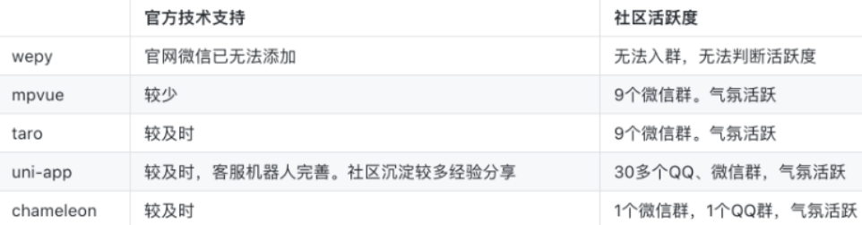

# 一. 邂逅 Taro 框架 

---

## 1. 认识 Taro 框架

- 什么是`Taro`？
  - `Taro `是由京东 凹凸实验室 打造的**一个开放式跨端、跨框架解决方案**，并于2018年6月7日正式开源
  - `Taro`**支持使用`React/Vue/Preact`等框架**来开发 微信 / 京东 / 百度 / 支付宝 / 字节跳动 / QQ 等小程序 / `H5` / `RN` 等应用
- `Taro`的版本史
  - Taro 1.x / 2.x 版的文档，现已不再积极维护
  - 2021年3月，Taro 3.1版本正式发布，主要改动是打造开放式架构，支持以插件的形式编译到任意小程序平台
  - 2021年4月，Taro 3.2 版本正式发布，新增了对 `ReactNative` 的支持，主要是由 58同城团队主导
  - 2021年4月，Taro 3.3 alpha发布，主要改动是支持使用 `HTML` 标签进行开发
  - 2022年1月，Taro 3.4版本正式发布，主要改动是支持使用 `Preact` 和 `Vue3.2` 进行开发
  - 目前 Taro 团队的**迭代重心在于 `Taro 3`，`Taro 1/2` 只会对重大问题进行修复，不会新增新特性**

## 2. Taro的特点

- 多端支持
  - **`Taro3 `支持转换到`H5`、`ReactNative `以及任意小程序平台（重心是小程序端）**
  - 目前官方支持转换的平台如下：
    - `H5`、`ReactNative`、微信小程序、京东小程序、百度小程序、支付宝小程序、字节跳动小程序
    - QQ 小程序、钉钉小程序、企业微信小程序、支付宝小程序等
- 多框架支持
  - 在`Taro3 `中可以使用完整的 `React` / `Vue` / `Nervjs` / `Preact` 开发体验

## 3. Taro vs uni-app

- 跨端支持度

  

- 社区活跃度

  

- 资料完善度

  - `Taro`： 官方文档较完整，但不是很丰富，资料一般
  - `uni-app`：官方文档和各种专题内容很丰富，资料齐全

- 工具和周边生态

  - `Taro`：官方的`Taro UI`，只支持小程序和`H5`( 不支持`RN` )，截至到2019年10月28日， Taro只有64个插件
  - `uni-app`：官方的`uni-ui`支持多端、周边模板丰富、完善的插件市场，截至到2019年10月28日，有850个插件

- `Taro`和`uni-app`如何选择？

  - 如需要跨平台，并且应用不是很复杂，可选` Taro `和` uni-app`
  - 如熟悉`Vue`可优先选择`uni-app`， 如熟悉`React`推荐使用` Taro`
  - `uni-app`在资料、生态、工具、开发效率、跨端数会比`Taro`略胜一筹
  - 当然`Taro`也有独特的优势，如：用`React`开发非常的灵活

## 4. Taro架构图设计图

- `Taro`当前的架构主要分为：**编译时** 和 **运行时**

- 其中编译时主要是将`Taro`代码通过`Babel[11] `转换成 小程序的代码，如：`JS`、`WXML`、`WXSS`、`JSON`

- 运行时主要是进行一些：生命周期、事件、`data`等部分的处理和对接，以保证和宿主平台数据的一致性

  

## 5. 编辑器选择

- 推荐使用`VSCode `或` WebStorm`
- 当你使用` VSCode `时，推荐安装` ESLint `插件，如果你使用` TypeScript`，别忘了配置` eslint.probe `参数
- 如果使用` Vue`，推荐安装` Vetur `或` Volar `插件
- 如果你愿意花钱又懒得折腾可以选择` WebStorm`，基本不需要配置
- 不管使用` VSCode `还是` WebStrom`，安装了上述插件之后使用` Taro `都实现自动补全和代码实时检查（`linting`）的功能


# 二. Taro的初体验

---

## 1. 安装及使用

- `Taro `项目基于` node`，请确保已具备较新的` node `环境（`>=12.0.0`）

- `Taro CLI `工具安装

  - 首先，你需要使用` npm `或` yarn `全局安装` @tarojs/cli`，或直接使用` npx`

    ```bash
    # 使用 npm 安装 CLI
    $ npm install -g @tarojs/cli
    
    # OR 使用 yarn 安装 CLI
    $ yarn global add @tarojs/cli
    
    # OR 安装了 cnpm，使用 cnpm 安装 CLI
    $ cnpm install -g @tarojs/cli
    ```

  - 查看` Taro CLI `工具版本

    - 可以使用 `npm info` 查看` Taro `版本信息，在这里你可以看到当前最新版本

      ```bash
      npm info @tarojs/cli
      ```

## 2. 项目初始化

- 使用命令创建模板项目：

  ```bash
  $ taro init myApp
  ```

- `npm 5.2+ `也可在不全局安装的情况下使用` npx `创建模板项目：

  ```bash
  $ npx @tarojs/cli init myApp
  ```

- 注意事项：
  - 开发支付宝小程序时，`Webpack4 `暂不支持使用` React18`
  - 受小程序环境限制，诸如新` SSR Suspense `等特性将不能在小程序中使用
  - `RN `暂不支持` React v18`，需要等待` RN `官方输出支持方案
  - 为了顺利地用`Taro`来开发`App`，我们强烈地建议您，先对` React Native `开发进行学习


# 三. Taro配置文件 

---


# 四. 内置组件和样式

---


# 五. Taro页面和传参 

---


# 六. Taro常用的API 

---


