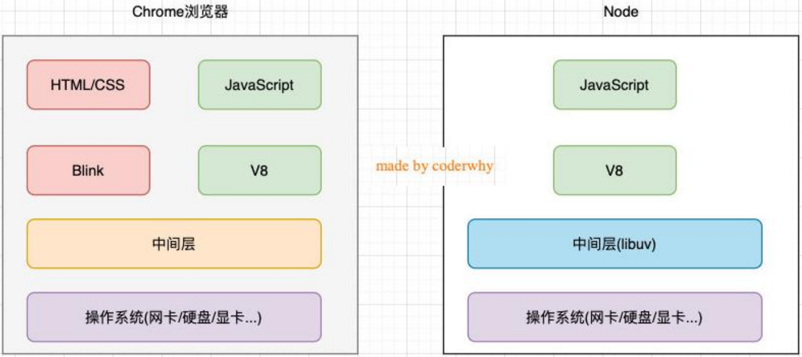
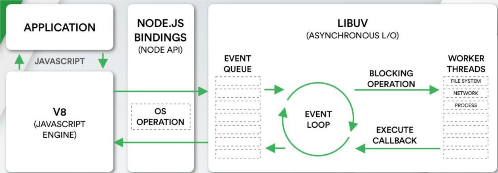
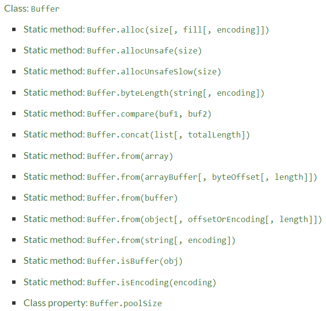
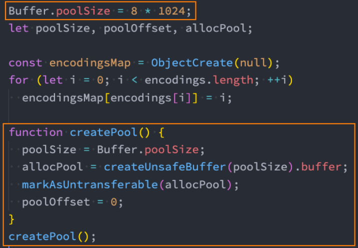
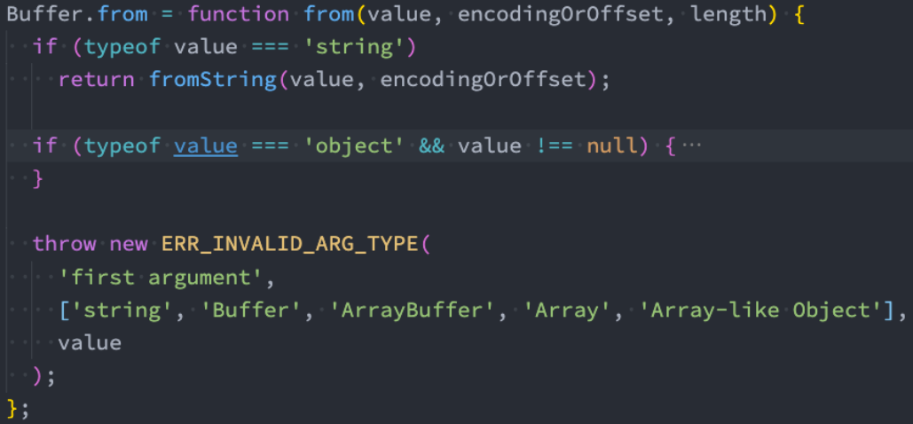
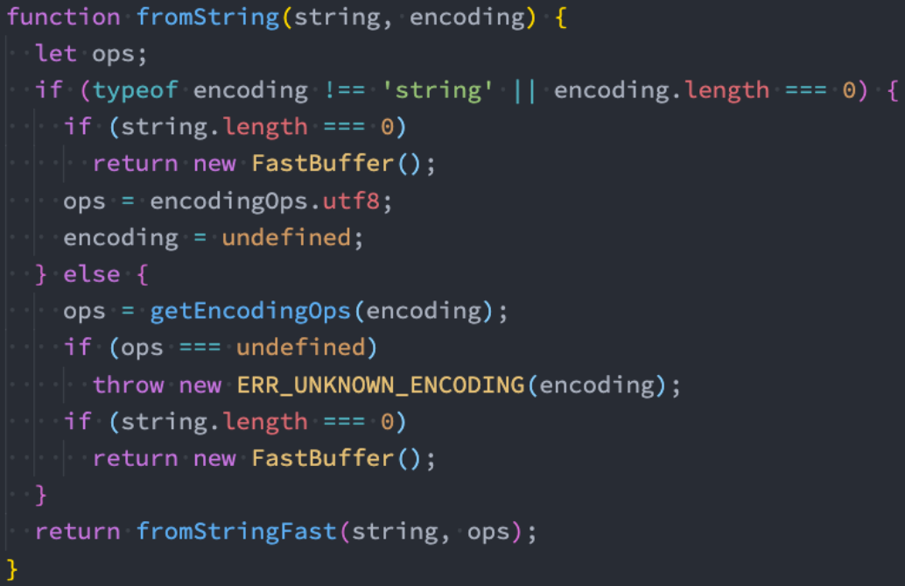
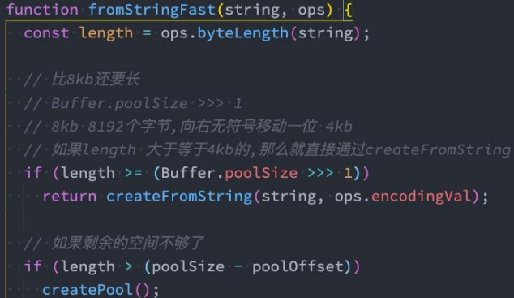
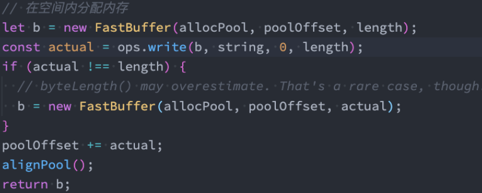

# 一. Node服务器开发

---

## 1. 服务器开发


## 2. Node.js 是什么

- 官方对 `Node.js` 的定义：
  - **`Node.js` 是一个基于 `V8` 引擎（`js`引擎）的 `JavaScript` 运行时环境**
- 也就是说 `Node.js` 基于 `V8` 引擎来执行 `js` 代码，但是不仅仅只有 `V8` 引擎：
  - 前面我们知道 `V8` 可以嵌入到任何 `C ++` 应用程序中，无论是`Chrome` 还是 `Node.js`，事实上都是嵌入了 `V8` 引擎来执行`js` 代码
  - 但是在 `Chrome` 浏览器中，还需要解析、渲染 `HTML`、`CSS` 等相关渲染引擎，另外还需要提供支持浏览器操作的 `API`、浏览器自己的事件循环等
  - 另外，在 `Node.js` 中我们也需要进行一些额外的操作，比如文件系统读/写、网络 `IO`、加密、压缩解压文件等操作

## 3. 浏览器和 Node.js 架构区别

- 我们可以简单理解规划出 `Node.js` 和浏览器的差异：



## 4. Node.js 架构



- 我们来看一个单独的 `Node.js` 的架构图：
  - 我们编写的 `js` 代码会经过 `V8` 引擎，再通过 `Node.js` 的 `Bindings`，将任务放到 `Libuv` 的事件循环中
  - `libuv`（Unicorn Velociraptor — 独角伶盗龙）是使用 `C` 语言编写的库
  - `libuv` 提供了事件循环、文件系统读写、网络 `IO`、线程池等等内容


# 二. fs模块-文件系统

---

## 1. 内置模块 fs

- `fs` 是 `File System` 的缩写，表示文件系统
- **对于任何一个为服务器端服务的语言或框架通常都会有自己的 文件系统：**
  - 因为服务器需要将各种数据、文件等放置到不同的地方
  - 比如用户数据可能大多数是放到数据库中的
  - 比如某些配置文件或用户资源（图片、音视频）都是以文件的形式存在于操作系统上的
- **`Node` 也有自己的文件系统操作模块，就是 `fs`：**
  - 借助于 `Node` 帮我们封装的文件系统，我们可以在任何的操作系统（`window`、`Mac OS`、`Linux`）上面直接去操作文件
  - 这也是 `Node` 可以开发服务器的一大原因，也是它可以成为前端自动化脚本等热门工具的原因

## 2. fs 的 API 介绍

- `Node` 文件系统的 `API` 非常的多：
  - https://nodejs.org/docs/latest-v16.x/api/fs.html
  - 我们不可能，也没必要一个个去学习
  - 这个更多的应该是作为一个 `API` 查询的手册，等用到的时候查询即可
  - 学习阶段我们只需要学习最常用的即可
- 但是这些 `API` 大多数都提供三种操作方式：
  - 方式一：**同步操作文件**：代码会被阻塞，不会继续执行
  - 方式二：**异步回调函数操作文件**：代码不会被阻塞，需要传入回调函数，当获取到结果时，回调函数被执行
  - 方式三：**异步 `Promise` 操作文件**：代码不会被阻塞，通过 `fs.promises` 调用方法操作，会返回一个 `Promise`，可以通过 `then`、`catch` 进行处理

## 3. 案例：获取一个文件的状态

- 我们这里以获取一个文件的状态为例：

  ```js
  const fs = require('fs')
  
  // 1.同步读取
  // const res1 = fs.readFileSync('./a.txt')
  // console.log('res1: ', res1.toString())
  const res1 = fs.readFileSync('./a.txt', {
    encoding: 'utf-8',
  })
  console.log('res1: ', res1)
  console.log('同步读取执行完成，才执行后续代码')
  
  // 2.异步读取: 回调函数
  fs.readFile(
    './a.txt',
    {
      encoding: 'utf-8',
    },
    (err, data) => {
      console.log('err: ', err)
      console.log('data: ', data)
    }
  )
  console.log('异步读取，不阻塞后续代码')
  
  // 3.异步读取: Promise
  fs.promises
    .readFile('./a.txt', {
      encoding: 'utf-8',
    })
    .then((res) => {
      console.log('res: ', res)
    })
    .catch((err) => {
      console.log('err: ', err)
    })
  ```

## 4. 文件描述符

- 文件描述符（`File descriptors`）是什么呢？

  - 在常见的操作系统上，对于每个进程，内核都维护着一张当前打开着的文件和资源的表格
  - 每个打开的文件都分配了一个称为文件描述符的简单的数字标识符
  - **在系统层，所有文件系统操作都使用这些文件描述符来标识和跟踪每个特定的文件**
  - `Windows` 系统使用了一个虽然不同但概念上类似的机制来跟踪资源

- **为了简化用户的工作，`Node.js` 抽象出操作系统之间的特定差异，并为所有打开的文件分配一个数字型的文件描述符**

- **`fs.open()` 方法用于分配新的文件描述符**

  - 一旦被分配，则文件描述符可用于从文件读取数据、向文件写入数据、或请求关于文件的信息

    ```js
    const fs = require('fs')
    
    fs.open('./a.txt', (err, fd) => {
      console.log('err: ', err)
      // 读取文件描述符
      console.log('fd: ', fd)
      // 读取文件的信息
      fs.fstat(fd, (err, stats) => {
        if (err) return
        console.log('stats: ', stats)
        // 手动释放文件 or 关闭进程(基本服务不会关闭的)
        fs.close(fd)
      })
    })
    ```

## 5. 文件的读写

- 如果我们希望对文件的内容进行操作，这个时候可以使用文件的读写：

  - `fs.readFile(path[, options], callback)`：读取文件的内容
  - `fs.writeFile(file, data[, options], callback)`：在文件中写入内容

  ```js
  const fs = require('fs')
  
  // 1.有一段内容（客户端传递过来的http/express/koa）
  const content = 'hello world, hello node'
  
  // 2.文件的写入操作（若文件不存在则自动创建）
  fs.writeFile('./b.txt', content, {flag: ""}, (err) => {
    if (err) {
      console.log('文件写入失败')
    } else {
      console.log('文件写入成功')
    }
  })
  ```

- 在上面的代码中，你会发现有一个对象类型，这个是写入时填写的 `option` 参数：

  - `flag`：写入的方式
  - `encoding`：字符的编码

## 6. flag 选项

- 我们先来看 `flag`：

- `flag` 的值有很多：**https://nodejs.org/dist/latest-v14.x/docs/api/fs.html#fs_file_system_flags**

  - `w` 打开文件写入，文件不存在则创建文件，默认值
  - `w+` 打开文件进行读写（可读可写），如果不存在则创建文件
  - `r` 打开文件读取，读取时的默认值
  - `r+` 打开文件进行读写，如果不存在那么抛出异常
  - `a` 打开要写入的文件，将流放在文件末尾。如果不存在则创建文件
  - `a+` 打开文件以进行读写（可读可写），将流放在文件末尾。如果不存在则创建文件

  > `TIP`：`write`->`w`、`read`->`r`，`append`->`a`

## 7. encoding 选项

- 我们再来看看编码：

  - 在简书上一篇关于字符编码的文章：https://www.jianshu.com/p/899e749be47c
  - 目前基本用的都是 `UTF-8` 编码

- 文件读取：

  - 如果不填写 `encoding`，返回的结果是 `Buffer`

  ```js
  const fs = require('fs')
  
  fs.readFile(
    './a.txt',
    {
      encoding: 'utf-8',
    },
    (err, data) => {
      console.log('err: ', err)
      console.log('data: ', data)
    }
  )
  ```

## 8. 文件夹操作

- 新建一个文件夹

  - 使用 `fs.mkdir()` 或 `fs.mkdirSync()` 创建一个新文件夹

    ```js
    const fs = require('fs')
    
    // 创建文件夹
    fs.mkdir('./test', (err) => {
      console.log('err: ', err)
    })
    ```

  - 获取文件夹的内容

    ```js
    const fs = require('fs')
    
    function readDirectory(dir) {
      fs.readdir(dir, { withFileTypes: true }, (err, files) => {
        console.log('files: ', files)
        files.forEach((item) => {
          if (item.isDirectory()) {
            console.log(item.name, '是一个文件夹')
            readDirectory(`${dir}/${item.name}`)
          } else {
            console.log(item.name, '是一个文件')
          }
        })
      })
    }
    
    readDirectory('./test')
    ```

  - 文件重命名

    ```js
    const fs = require('fs')
    
    // 1.对文件夹进行重命名
    fs.rename('./test', './demo', (err) => {
      console.log(`重命名文件：${err === null ? '成功' : err}`)
    })
    
    // 2.对文件重命名
    fs.rename('./b.txt', './bb.txt', (err) => {
      console.log(`重命名文件：${err === null ? '成功' : err}`)
    })
    ```


# 三. event模块-事件处理 

---

## 1. events 模块

- `Node` 中的核心 `API` 都是基于异步事件驱动的：

  - 在这个体系中，某些对象（发射器（`Emitters`））发出某一个事件
  - 我们可以监听这个事件（监听器 `Listeners`），并且传入的回调函数，这个回调函数会在监听到事件时调用

- **发出事件和监听事件都是通过 `EventEmitter` 类来完成的**，它们都属于 `events` 对象

  - `emitter.on(eventName, listener)`：监听事件，也可以使用 `addListener`
  - `emitter.off(eventName, listener)`：移除事件监听，也可以使用`removeListener`
  - `emitter.emit(eventName[, ...args])`：发出事件，可以携带一些参数

  ```js
  // event模块中的事件总线
  const EventEmitter = require('events')
  
  // 创建EventEmitter的实例
  const emitter = new EventEmitter()
  
  function handleLater(...args) {
    console.log('监听到later事件')
    console.log('args: ', args)
  }
  
  // 监听事件
  emitter.on('later', handleLater)
  
  // 发出事件
  setTimeout(() => {
    emitter.emit('later', 18, 'coder')
  
    // 取消事件
    emitter.off('later', handleLater)
  
    setTimeout(() => {
      emitter.emit('later')
    }, 1000)
  }, 2000)
  ```

## 2. 常见的方法一

- `EventEmitter` 的实例有一些属性，可以记录一些信息：

  - `emitter.eventNames()`：返回当前 `EventEmitter` 对象注册的事件字符串数组
  - `emitter.getMaxListeners()`：返回当前 `EventEmitter` 对象的最大监听器数量，可以通过 `setMaxListeners()` 来修改，默认是`10`
  - `emitter.listenerCount(事件名称)`：返回当前 `EventEmitter` 对象某一个事件名称，监听器的个数
  - `emitter.listeners(事件名称)`：返回当前 `EventEmitter` 对象某个事件监听器上所有的监听器数组

  ```js
  const EventEmitter = require('events')
  const emitter = new EventEmitter()
  
  emitter.on('aaa', () => {})
  emitter.on('aaa', () => {})
  emitter.on('aaa', () => {})
  
  emitter.on('bbb', () => {})
  emitter.on('bbb', () => {})
  
  // 1.获取所有监听事件的名称
  console.log('所有监听事件的名称: ', emitter.eventNames)
  
  // 2.获取监听最大的监听个数
  console.log('最大监听个数: ', emitter.getMaxListeners())
  
  // 3.获取某一个事件名称对应的监听器个数
  console.log('aaa事件的监听器个数: ', emitter.listenerCount('aaa')
  
  // 4.获取某一个事件名称对应的监听器函数(数组)
  console.log('aaa事件的监听器函数: ', emitter.listeners('aaa'))
  ```

## 3. 常见的方法二

- `EventEmitter` 的实例方法补充：

  - `emitter.once(eventName, listener)`：事件监听一次
  - `emitter.prependListener()`：将监听事件添加到最前面
  - `emitter.prependOnceListener()`：将监听事件添加到最前面，但是只监听一次
  - `emitter.removeAllListeners([eventName])`：移除所有的监听器

  ```js
  const EventEmitter = require('events')
  const emitter = new EventEmitter()
  
  emitter.on('aaa', () => {
    console.log('on监听aaa')
  })
  
  // 1.once: 事件监听只监听一次
  emitter.once('aaa', () => {
    console.log('once监听aaa')
  })
  
  // 2.prependListener: 将事件监听添加到最前面
  emitter.prependListener('aaa', () => {
    console.log('prependListener监听aaa')
  })
  
  emitter.prependOnceListener('aaa', () => {
    console.log('prependOnceListener监听aaa')
  })
  
  // 3.移除所有的事件监听
  // 不传递参数的情况下，移除所有事件名称的所有事件监听
  // 传递参数的情况下，只移除传递的事件名称所对应的事件监听
  emitter.removeAllListeners('aaa')
  
  emitter.emit('aaa')
  emitter.emit('aaa')
  emitter.emit('aaa')
  ```


# 四. 认识二进制 和 buffer 

---

## 1. 数据的二进制

- 计算机中所有的内容：文字、数字、图片、音频、视频最终都会使用二进制来表示
- `js` 可以直接去处理非常直观的数据：比如字符串，我们通常展示给用户的也是这些内容
- 不对啊，`js` 不是也可以处理图片吗？
  - 事实上在网页端，图片我们一直是交给浏览器来处理的
  - `js` 或 `HTML`，只是负责告诉浏览器一个图片的地址
  - 浏览器负责获取这个图片，并且最终将这个图片渲染出来
- 但是对于服务器来说是不一样的：
  - 服务器要处理的本地文件类型相对较多
  - 比如某一个保存文本的文件并不是使用 `utf-8` 进行编码的，而是用 `GBK`，那么我们必须读取到他们的二进制数据，再通过 `GKB` 转换成对应的文字
  - 比如我们需要读取的是一张图片数据（二进制），再通过某些手段对图片数据进行二次的处理（裁剪、格式转换、旋转、添加滤镜），`Node` 中有一个 `Sharp` 的库，就是读取图片或者传入图片的 `Buffer` 对其再进行处理
  - 比如在 `Node` 中通过 `TCP` 建立长连接，`TCP` 传输的是字节流，我们需要将数据转成字节再进行传入，并且需要知道传输字节的大小（客户端需要根据大小来判断读取多少内容）

## 2. Buffer和二进制

- 我们会发现，对于前端开发来说，通常很少会和二进制直接打交道，但是**对于服务器端为了做很多的功能，我们必须直接去操作其二进制的数据**
- 所以 `Node` 为了可以方便开发者完成更多功能，提供给了我们一个类 `Buffer`，并且它是全局的
- 我们前面说过，`Buffer` 中存储的是二进制数据，那么到底是如何存储呢？
  - 我们**可以将 `Buffer` 看成是一个存储二进制的数组，用来处理二进制数据的**
  - 这个数组中的每一项，可以保存`8`位二进制： `0000 0000`
- 为什么是8位呢？
  - **在计算机中，很少的情况我们会直接操作一位二进制，因为一位二进制存储的数据是非常有限的**
  - 所以通常会将**`8`位二进制合在一起作为一个单元，这个单元称之为一个字节**( `byte` )
  - 也就是说 `1byte = 8bit`，`1kb = 1024byte`，`1M = 1024kb`
  - 比如很多编程语言中的 `int` 类型是4个字节，`long` 类型是8个字节
  - **比如 `TCP` 传输的是字节流，在写入和读取时都需要说明字节的个数**
  - **比如 `RGB` 的最大值分别都是`255`，所以本质上在计算机中都是用一个字节存储的（因为`1`字节最大->`1111 1111`，能表示的最大数字就是`255`）**


# 五. Buffer的创建方式

---

## 1. Buffer和字符串

- `Buffer` 相当于是一个字节的数组，数组中的每一项对应一个字节的大小

- 如果我们希望将一个字符串放入到 `Buffer` 中，是怎么样的过程呢？

  

  ```js
  // 1.创建Buffer
  const buf = new Buffer('hello')
  console.log('buf: ', buf)
  
  // 2.创建Buffer(推荐形式)
  const buf2 = Buffer.from('world')
  console.log('buf2: ', buf2)
  
  // 3.创建Buffer(字符串中包含中文，utf-8编码中一般常见中文在3个字节，生僻字在4个字节)
  const buf3 = Buffer.from('你好啊')
  console.log('buf3: ', buf3)
  
  // output:
  // buf:  <Buffer 68 65 6c 6c 6f>
  // buf2:  <Buffer 77 6f 72 6c 64>
  // buf3:  <Buffer e4 bd a0 e5 a5 bd e5 95 8a>
  ```

## 2. 如果是中文呢？

- 默认编码：`utf-8`

  ```js
  const buf = new Buffer('hello')
  console.log('buf: ', buf)
  console.log('buf.toString(): ', buf.toString())
  
  // output:
  // buf:  <Buffer 68 65 6c 6c 6f>
  // buf.toString():  hello
  ```

- 如果解码和编码所用的编码格式不一致，就会导致出现乱码的情况：

  ```js
  const buf4 = Buffer.from('哈哈', 'utf16le')
  // 解码操作（编解码格式不一致，会导致解码出现乱码）
  console.log('buf4.toString(): ', buf4.toString())
  
  // output:
  // buf4.toString():  �T�T
  ```

## 3. Buffer的其他创建



## 4. Buffer.alloc

- 来看一下 `Buffer.alloc`：

  - 我们会发现创建了一个`8`位长度的 `Buffer`，里面所有的数据默认为 `00`

- 我们也可以对其进行操作

  ```js
  // 1.创建一个Buffer对象
  const buf = Buffer.alloc(8)
  console.log('buf: ', buf)
  
  // 2.手动对每个字节进行访问
  console.log('buf[0]: ', buf[0])
  console.log('buf[1]: ', buf[1])
  
  // 3.手动对每个字节进行操作
  buf[0] = 100
  buf[1] = 0x66
  console.log('buf: ', buf)
  console.log('buf.toString(): ', buf.toString())
  
  buf[2] = 'm'.charCodeAt()
  
  console.log('buf: ', buf)
  
  // output:
  // buf:  <Buffer 00 00 00 00 00 00 00 00>
  // buf[0]:  0
  // buf[1]:  0
  // buf:  <Buffer 64 66 00 00 00 00 00 00>
  // buf.toString():  df
  // buf:  <Buffer 64 66 6d 00 00 00 00 00>
  ```

## 5. Buffer和文件读取

- 文本文件的读取

  ```js
  // 1.从文件中读取Buffer
  fs.readFile('./a.txt', (err, data) => {
    console.log('data: ', data)
  })
  
  fs.readFile('./a.txt', (err, data) => {
    data[0] = 0x65
    console.log('data.toString(): ', data.toString())
  })
  
  // output:
  // data:  <Buffer 68 65 6c 6c 6f 20 77 6f 72 6c 64>   
  // data.toString():  hello world -> eello world
  ```

- 图片文件的读取

  ```js
  // 2.读取一个图片的二进制(node中有一个库sharp)
  fs.readFile('./kobe02.png', (err, data) => {
    console.log('data: ', data)
  })
  
  // output: 
  // data:  <Buffer ff d8 ff e0 00 10 4a 46 49 46 00 01 01 00 00 01 00 01 00 00 ff db 00 43 00 05 03 04 04 04 03 05 04 04 04 05 05 05 06 07 0c 08 07 07 07 07 0f 0b 0b 09 ... 36217 more bytes>
  ```


# 六. Buffer的源码解析 

---

## 1. Buffer 的创建过程

- 事实上我们创建 `Buffer` 时，并不会频繁的向操作系统申请内存，它会默认先申请一个 `8*1024` 个字节大小的内存，也就是 `8kb`

  

## 2. Buffer.from 源码

- 假如我们调用 `Buffer.from` 申请 `Buffer`：

  - 这里我们以从字符串创建为例
  - `node/lib/buffer.js`：290行

  

## 3. fromString 的源码



## 4. fromStringFast

- 接着我们查看 `fromStringFast`：
  - 这里做的事情是判断剩余的长度是否还足够填充这个字符串
  - 如果不足够，那么就要通过 `createPool` 创建新的空间
  - 如果够就直接使用，但是之后要进行 `poolOffset` 的偏移变化
  - `node/lib/buffer.js`：428行






