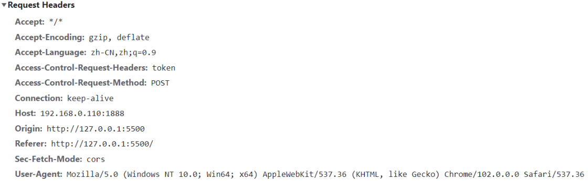
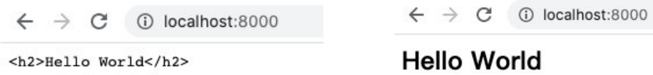
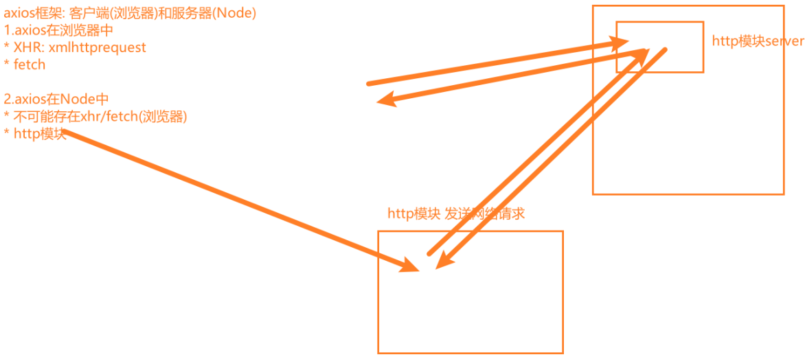

# 一. Stream的读写操作 

---

## 1. 认识 Stream

- 什么是 `Stream`（小溪、小河，在编程中通常翻译为流）呢？
  - 我们的第一反应应该是流水，源源不断的流动
  - 程序中的流也是类似的含义，我们可以想象当我们从一个文件中读取数据时，文件的二进制（字节）数据会源源不断的被读取到我们程序中
  - 而这个一连串的字节，就是我们程序中的流
- 所以，我们可以这样理解流：
  - 是连续字节的一种表现形式和抽象概念
  - 流应该是可读的，也是可写的
- 在之前学习文件的读写时，我们**可以直接通过 `readFile` 或者 `writeFile` 方式读写文件，为什么还需要流呢？**
  - 直接读写文件的方式，虽然简单，但是无法控制一些细节的操作
  - 比如从什么位置开始读、读到什么位置、一次性读取多少个字节
  - 读到某个位置后，暂停读取，某个时刻恢复继续读取等等
  - 或者这个文件非常大，比如一个视频文件，一次性全部读取并不合适

## 2. 文件读写的 Stream

- 事实上 `Node` 中很多对象是基于流实现的：
  - `http` 模块的 `Request` 和 `Response` 对象
- 官方文档：另外**所有的流都是 `EventEmitter` 的实例**
- 那么在 `Node` 中都有哪些流呢？
- **`Node.js` 中有四种基本流类型（可写流、可读流、双向流、可变流）**：
  - `Writable`：可以向其写入数据的流（例如 `fs.createWriteStream()`）
  - `Readable`：可以从中读取数据的流（例如 `fs.createReadStream()`）
  - `Duplex`：同时为 `Readable` 和 `Writable`（例如 `net.Socket`）
  - `Transform`：`Duplex`可以在写入和读取数据时修改或转换数据的流（例如 `zlib.createDeflate()`）
- 这里我们通过 `fs` 的操作，讲解一下 `Writable`、`Readable`，另外两个大家可以自行学习一下

## 3. Readable

- 之前我们读取一个文件的信息：

  ```js
  const fs = require('fs')
  
  // 1.一次性读取
  // 缺点一：没有办法精准控制从何处开始读取，及读取到何处截止
  // 缺点二：不能读取到某个位置时，暂停读取，恢复读取
  // 缺点三：文件非常大的时候，无法多次读取
  fs.readFile('./a.txt', (err, data) => {
    console.log('data: ', data)
  })
  ```

- 这种方式是一次性将一个文件中所有的内容都读取到程序（内存）中，但是这种读取方式就会出现我们之前提到的很多问题：
  - 文件过大、读取的位置、结束的位置、一次读取的大小
- 这个时候，我们可以使用 `createReadStream`，我们来看几个参数，更多参数可以参考官网：
  - `start`：文件读取开始的位置（包括该索引位置）
  - `end`：文件读取结束的位置（包括该索引位置）
  - `highWaterMark`：一次性读取字节的长度，默认是`64kb`

## 4. Readable 的使用

- 创建文件的 `Readable`

- 我们如何获取到数据呢？可以通过监听 `data` 事件，获取读取到的数据

- 也可以做一些其他的操作：监听其他事件、暂停或者恢复

  ```js
  // 2.通过流读取文件
  // 2.1 创建一个可读流
  const readStream = fs.createReadStream('./a.txt', {
    start: 2, // 什么位置开始读取
    end: 10, // 结束读取位置
    highWaterMark: 3, // 一次性读取字节的长度
  })
  
  // 2.2 监听读取到的数据
  readStream.on('data', (data) => {
    console.log('data.toString(): ', data.toString())
    readStream.pause() // 暂停读取
    setTimeout(() => {
      readStream.resume() // 恢复读取
    }, 2000)
  })
  
  // 3.补充其他的事件监听
  readStream.on('open', (fd) => {
    console.log('监听到: 通过流将文件打开~, fd: ', fd)
  })
  
  readStream.on('end', () => {
    console.log('监听到: 已经读取到end位置~')
  })
  
  readStream.on('close', () => {
    console.log('监听到：文件读取结束并被关闭')
  })
  ```

## 5. Writable

- 之前我们写入一个文件的方式是这样的：

  ```js
  fs.writeFile(
    './a.txt',
    'hello world',
    {
      flag: 'a+',
    },
    (err, data) => {
      console.log('data: ', data)
    }
  )
  ```

- 这种方式相当于一次性将所有的内容写入到文件中，但是这种方式也有很多问题：

  - 比如我们希望一点点写入内容，精确每次写入的位置等

- 这个时候，我们可以使用 `createWriteStream`，我们来看几个参数，更多参数可以参考官网：

  - `flags`：默认是 `w`，如果我们希望是追加写入，可以使用 `a` 或者 `a+`
  - `start`：写入的位置

## 6. Writable 的使用

- 我们进行一次简单的写入

  ```js
  // 创建一个写入流
  const writeStream = fs.createWriteStream('./a.txt', {
    start: 1,
  })
  
  writeStream.write('666~')
  writeStream.write('666~', (err) => {
    console.log('写入完成~: ', err)
  })
  ```

- 你可以监听 `open` 事件：

  ```js
  writeStream.on('open', () => {
    console.log('文件被打开~')
  })
  ```

## 7. close 的监听

- 我们会发现，我们并不能监听到 `close` 事件：

  - 这是因为写入流在打开后是不会自动关闭的
  - 我们必须手动关闭，来告诉 `Node` 已经写入结束了
  - 并且会发出一个 `finish` 事件的

- 另外一个非常常用的方法是 `end`：**`end`方法相当于做了两步操作：  `write` 传入的数据和调用 `close` 方法**

  ```js
  // 创建一个写入流
  const writeStream = fs.createWriteStream('./a.txt', {
    start: 1,
  })
  
  writeStream.on('open', () => {
    console.log('文件被打开~')
  })
  
  writeStream.write('666~')
  writeStream.write('666~', (err) => {
    console.log('写入完成~: ', err)
  })
  
  writeStream.on('finish', () => {
    console.log('写入完成了~')
  })
  
  writeStream.on('close', () => {
    console.log('文件被关闭~')
  })
  
  // 3.写入完成时, 需手动调用close方法
  // writeStream.close()
  
  // 4. end方法: 将最后的内容写入到文件中，并关闭文件
  writeStream.end('哈哈哈')
  ```

## 8. 文件的拷贝流操作 - pipe 方法

- 正常情况下，我们**可以将读取到的 输入流，手动的放到 输出流中进行写入**：

  ```js
  const fs = require('fs')
  
  // 1.方式一：一次性读取和写入文件
  fs.readFile('./b.txt', (err, data) => {
    fs.writeFile('./foo_copy01.txt', data, () => {
      console.log('写入文件完成')
    })
  })
  
  // 2.方式二：创建可读流和可写流
  const readStream = fs.createReadStream('./b.txt')
  const writeStream = fs.createWriteStream('./foo_copy02.txt')
  
  readStream.on('data', (data) => {
    writeStream.write(data)
  })
  
  readStream.on('end', () => {
    writeStream.close()
  })
  ```

- 我们也可以通过 `pipe`（管道） 来完成这样的操作：

  ```js
  // 3.在可读流和可写流之间建立一个管道
  // 可读流中读取到的数据直接放到可写流中
  const readStream = fs.createReadStream('./b.txt')
  const writeStream = fs.createWriteStream('./foo_copy03.txt')
  readStream.pipe(writeStream)
  ```


## 9. 可写流的start属性，在window上的兼容性问题

```js
const fs = require('fs')

const writeStream = fs.createWriteStream('./c.txt', {
  // windows兼容性问题：flags为a+时，无法在start位置处写入，而是在末尾写入
  // mac无此问题，window有此问题
  // flags: 'a+',
  // 解决方式：使用'r+'，新数据会覆盖对应位置上的原有数据
  flags: 'r+',
  start: 1,
})

writeStream.write('---')
```


# 二. http模块web服务

---

## 1. Web 服务器

- 什么是 `Web` 服务器？

  - 当应用程序（客户端）需要某一个资源时，可以向一台服务器，通过 `Http` 请求获取到这个资源
  - 提供资源的这个服务器，就是一个 `Web` 服务器

  

- 目前有很多开源的 `Web` 服务器：`Nginx`、`Apache`（静态）、`Apache Tomcat`（静态、动态）、`Node.js`

## 2. http 模块

- 在 `Node` 中，**提供 `web` 服务器的资源返回给浏览器**，主要是通过 `http` 模块

- 我们先简单对它做一个使用：

  ```js
  const http = require('http')
  const HTTP_HOST = 8000
  // 创建一个http对应的服务器
  const server = http.createServer((request, response) => {
    // request对象中包含本次客户端请求的所有信息（request本质是一个可读流）
    // 请求的url
    // 请求的method
    // 请求的headers
    // 请求携带的数据
    // ...
    // response对象用于给客户端返回结果的（response本质是一个可写流）
    response.end('hello world')
  })
  
  // 开启对应的服务器，并告知需监听的端口
  // 1024及以下的端口，一般是给那些特殊服务来监听的
  // 监听端口时，一般监听1024以上的端口~65536以下的端口
  // 1025~65535之间的端口
  // 为什么在65535呢？因为在大多数操作系统中，端口在保存的时候是用了两个字节，两个字节能表示最大的数值在65536
  // 2个byte => 256*256 => 65536
  server.listen(HTTP_HOST, () => {
    console.log(`服务器运行成功~ 端口: ${HTTP_HOST}`)
  })
  ```

## 3. 创建服务器

- 创建服务器对象，我们是通过 `createServer` 来完成的

  - `http.createServer` 会返回服务器的对象

  - 底层其实使用直接 `new Server` 对象

    ```js
    function createServer(opts, requestListener) {
      return new Server(opts, requestListener)
    }
    ```

- 那么，当然，我们也可以自己来创建这个对象：

  ```js
  const http = require('http')
  const HTTP_HOST_01 = 2001
  const HTTP_HOST_02 = 2002
  
  // 创建第1个服务器
  const serv1 = http.createServer((req, res) => {
    res.end(`${HTTP_HOST_01}端口服务器返回的结果`)
  })
  serv1.listen(HTTP_HOST_01, () => {
    console.log(`服务器运行成功~ 端口: ${HTTP_HOST_01}`)
  })
  
  // 创建第2个服务器
  const serv2 = new http.Server((req, res) => {
    res.end(`${HTTP_HOST_02}端口服务器返回的结果`)
  })
  serv2.listen(HTTP_HOST_02, () => {
    console.log(`服务器运行成功~ 端口: ${HTTP_HOST_02}`)
  })
  ```

- 上面我们已经看到，创建 `Server` 时会传入一个回调函数，这个回调函数在被调用时会传入两个参数：

  - `req`：`request` 请求对象，包含请求相关的信息
  - `res`：`response` 响应对象，包含我们要发送给客户端的信息

## 4. 监听主机和端口号

- `Server` 通过 `listen` 方法来开启服务器，并且在某一个主机和端口上监听网络请求：
  - 也就是当我们通过 `ip:port` 的方式发送到我们监听的 `Web` 服务器上时
  - 我们就可以对其进行相关的处理
- `listen` 函数有三个参数：
- 端口 `port`：可以不传，系统会默认分配端口，后续项目中我们会写入到环境变量中
- 主机 `hostname`：通常可以传入 `localhost`、`ip` 地址 `127.0.0.1`、或者 `ip` 地址 `0.0.0.0`，默认是 `0.0.0.0`
  - `localhost`：本质上是一个域名，通常情况下会被解析成 `127.0.0.1`
  - `127.0.0.1`：回环地址（`Loop Back Address`），表达的意思其实是我们主机自己发出去的包，直接被自己接收
    - 正常的数据库包经常 应用层 - 传输层 - 网络层 - 数据链路层 - 物理层 
    - 而回环地址，是在网络层直接就被获取到了，是不会经常数据链路层和物理层的
    - 比如我们监听 `127.0.0.1` 时，在同一个网段下的其他主机中，通过 `ip` 地址是不能访问的
  - `0.0.0.0`：
    - 监听 `IPV4` 上所有的地址，再根据端口找到不同的应用程序
    - 比如我们监听 `0.0.0.0` 时，在同一个网段下的其他主机中，通过 `ip` 地址是可以访问的
- 回调函数`cb`：服务器启动成功时的回调函数

## 5. nodemon 文件修改自动重启服务器

- 对于每次修改代码需要手动重启服务器，我们可以借助一个库 `node ` `mon` (`monitor`侦测器)来帮助我们自动重启服务器

  ```bash
  npm i nodemon -g
  ```

- 全局安装，因为这个工具我们在其他项目中也可能会使用到这个工具

  ```bash
  // 使用
  nodemon xxx.js
  ```

- 之后检测到 `xxx.js` 文件修改，就会自动重启服务器

## 6. 浏览器中输入某个地址访问时的特性

- 当在浏览器中输入某个地址访问时，会默认访问该地址下的 `favicon.ico` 图标，所以也会对服务器进行一次访问，因此下面代码中的 `服务器被访问~` 会被打印两次

  ```js
  const http = require('http')
  
  const server = http.createServer((req, res) => {
    console.log('服务器被访问~')
    res.end('hello world')
  })
  
  server.listen(8000, () => {
    console.log('服务器运行成功~')
  })
  ```

- 所以我们可以借助 `postman` 工具来发起请求


# 三. request请求对象 

---

## 1. request 对象

- 在向服务器发送请求时，我们会携带很多信息，比如：

  - 本次请求的 `URL`，服务器需要根据不同的 `URL` 进行不同的处理
  - 本次请求的请求方式，比如 `GET`、`POST` 请求传入的参数和处理的方式是不同的
  - 本次请求的 `headers` 中也会携带一些信息，比如客户端信息、接受数据的格式、支持的编码格式等
  - 等等...

- 这些信息，`Node` 会帮助我们封装到一个 `request` 的对象中，我们可以直接来处理这个 `request` 对象：

  ```js
  const http = require('http')
  
  const server = http.createServer((req, res) => {
    // request对象包含哪些信息
    // 1.url
    console.log('req.url: ', req.url)
    // 2.method请求方式
    console.log('req.method: ', req.method)
    // 3.headers
    console.log('req.headers: ', req.headers)
    res.end('hello world')
  })
  
  server.listen(8000, () => {
    console.log('服务器运行成功~')
  })
  ```

## 2. URL 的处理

- 客户端在发送请求时，会请求不同的数据，那么会传入不同的请求地址：

  - 比如 http://localhost:8000/login
  - 比如 http://localhost:8000/products

- 服务器端需要根据不同的请求地址，作出不同的响应：

  ```js
  const http = require('http')
  
  const server = http.createServer((req, res) => {
    const url = req.url
    switch (url) {
      case '/login':
        res.end('登录成功~')
        break
      case '/products':
        res.end('商品列表~')
        break
      case '/lyric':
        res.end('天空好想下雨，我好想住你隔壁！')
        break
    }
  })
  
  server.listen(8000, () => {
    console.log('服务器运行成功~')
  })
  ```

## 3. URL 的解析

- 那么如果用户发送的地址中还携带一些额外的参数呢？

  - http://localhost:8000/home?a=1&b=2
  - 这个时候，`url` 的值是 `/home?a=1&b=2`

- 我们如何对它进行解析呢？使用内置模块 `url`：

  ```js
  const url = require('url')
  // ...
  const urlInfo = url.parse(req.url)
  // ...
  ```

- 但是 `query` 信息如何可以获取呢？可以借助内置模块 `querystring`（官方已弃用，推荐使用 `URLSearchParams`）

  ```js
  const http = require('http')
  const url = require('url')
  const qs = require('querystring')
  
  const server = http.createServer((req, res) => {
    // 1.参数一：query类型参数
    // /home?a=1&b=2
    console.log('req.url: ', req.url) // /home?a=1&b=2
  
    const urlInfo = url.parse(req.url)
    console.log('urlInfo: ', urlInfo)
    
  	// urlInfo.query: a=1&b=2
    const queryInfo = qs.parse(urlInfo.query)
    console.log('queryInfo: ', queryInfo) // queryInfo: {a: '1', b: '2'}
  
    res.end('hello world~ 🚀🚀🚀')
  })
  
  server.listen(8000, () => {
    console.log('服务器运行成功~ 🚀🚀🚀')
  })
  ```

## 4. method 的处理

- 在 `Restful` 规范（设计风格）中，我们对于数据的增删改查应该通过不同的请求方式：

  - `GET`：查询数据
  - `POST`：新建数据
  - `PATCH`：更新数据
  - `DELETE`：删除数据

- 所以，我们可以通过判断不同的请求方式进行不同的处理

  - 比如创建一个用户
  - 请求接口为 `/users`
  - 请求方式为 `POST` 请求
  - 携带数据 `username` 和 `password`

  ```js
  const http = require('http')
  
  const server = http.createServer((req, res) => {
    const { url, method } = req
    switch (url) {
      case '/login':
        method === 'POST'
        	? res.end('登录成功~')
        	: res.end('不支持的请求方式')
        break
      case '/products':
        res.end('商品列表~')
        break
      case '/lyric':
        res.end('天空好想下雨，我好想住你隔壁！')
        break
    }
  })
  
  server.listen(8000, () => {
    console.log('服务器运行成功~')
  })
  ```

## 5. 创建用户接口

- 在我们程序中如何进行判断以及获取对应的数据呢？

  - 这里我们需要判断接口是 `/users`，并且请求方式是 `POST` 方法去获取传入的数据
  - 获取这种 `body` 携带的数据，我们需要通过监听 `req` 的 `data` 事件来获取

- 将 `JSON` 字符串格式转成对象类型，通过 `JSON.parse` 方法即可

  ```js
  const http = require('http')
  
  const server = http.createServer((req, res) => {
    // 获取参数：body参数
    // 设置可读流中的编码格式，获取到可读流中的数据时会根据编码格式进行转换
    req.setEncoding('utf-8')
  
    // request对象本质上是一个可读流，而这些流都继承自EventEmitter对象，自然也就有on这些方法去监听data这些事件
    let isLogin = null
    req.on('data', (data) => {
      console.log('data: ', data)
      const loginInfo = JSON.parse(data)
      if (loginInfo.name === 'later-zc' && loginInfo.password === 123) {
        isLogin = true
      } else {
        isLogin = false
      }
    })
  
    req.on('end', () => {
      if (isLogin) {
        res.end('登录成功，欢迎回来~ 🚀🚀🚀')
      } else {
        res.end('账户或密码错误')
      }
    })
  })
  
  server.listen(8000, () => {
    console.log('服务器运行成功~ 🚀🚀🚀')
  })
  ```


## 6. HTTP Request Header

- 在 `request` 对象的 `header` 中也包含很多有用的信息，客户端会默认传递过来一些信息：

- **`content-type` 是这次请求携带的数据类型**：
  - `application/x-www-form-urlencoded`：表示数据被编码成以 `&` 分隔的键 - 值对，同时以 `=` 分隔键和值
  - `application/json`：表示是一个`json`类型
  - `text/plain`：表示是文本类型
  - `application/xml`：表示是 `xml` 类型
  - `multipart/form-data`：表示是上传文件
- `content-length`：文件的大小长度
- `keep-alive`：
  - `http` 是基于 `TCP` 协议的，但是通常在进行一次请求和响应结束后会立刻中断
  - 在 `http1.0` 中，如果想要继续保持连接：
    1. 浏览器需要在请求头中添加 `connection: keep-alive`
    2. 服务器需要在响应头中添加 `connection: keey-alive`
    3. 当客户端再次放请求时，就会使用同一个连接，直接一方中断连接
  - 在 `http1.1` 中，所有连接默认是 `connection: keep-alive` 的
    - 不同的 `Web` 服务器会有不同的保持 `keep-alive` 的时间
    - `Node` 中默认是 `5s` 
- **`accept-encoding`：告知服务器，客户端支持的文件压缩格式**，比如 `js` 文件可以使用 `gzip` 编码，对应 `.gz`文件，服务器就可以根据客户端支持的压缩格式返回对应的压缩文件，浏览器会自动解压该文件，从而提高网络上的传输速度
- **`accept`：告知服务器，客户端可接受文件的格式类型**
- `user-agent`：客户端相关的信息


# 四. response响应对象

---

## 1. 返回响应结果

- 如果我们希望给客户端响应的结果数据，可以通过两种方式：

  - `Write` 方法：这种方式是直接写出数据，但是并没有关闭流
  - `end` 方法：这种方式是写出最后的数据，并且写出后会关闭流

- 正常的写入流是可以调用 `close` 的，`Writeable` 内部源码不让调用 `close` 方法

- 如果我们没有调用 `end` 方法，客户端将会一直等待结果：

  - 所以客户端在发送网络请求时，都会设置超时时间 `timeout`

  ```js
  const http = require('http')
  
  const server = http.createServer((req, res) => {
    // res: response对象 -> Writeable可写流
    // 1.响应数据方式一：write
    res.write('hello world')
    res.write('hehe')
  
    // 2.响应数据方式二：end
    // res.close() // 会报错，正常的写入流是可以调用close的，Writeable内部不让调用close方法
    res.end('hello world~ 🚀🚀🚀')
  })
  
  server.listen(8000, () => {
    console.log('服务器运行成功~ 🚀🚀🚀')
  })
  ```

## 2. 返回状态码（http响应状态码）

- `Http` 状态码（`Http Status Code`）是用来表示 `Http` 响应状态的数字代码：
  - `Http` 状态码非常多，可以根据不同的情况，给客户端返回不同的状态码
  - `MDN` 响应码解析地址：https://developer.mozilla.org/zh-CN/docs/web/http/status

| 常见HTTP状态码 | 状态描述              | 信息说明                                                     |
| -------------- | --------------------- | ------------------------------------------------------------ |
| 200            | OK                    | 客户端请求成功                                               |
| 201            | Created               | 该请求已成功，并因此创建了一个新的资源。这通常是在 POST 请求，或是某些 PUT 请求之后返回的响应 |
| 301            | Moved Permanently     | 请求资源的 URL 已修改。在响应中会给出新的 URL                |
| 400            | Bad Request           | 由于被认为是客户端错误（例如，错误的请求语法、无效的请求消息帧或欺骗性的请求路由），服务器无法或不会处理请求客户端 |
| 401            | Unauthorized          | 未授权的错误，客户端必须携带请求的身份信息                   |
| 403            | Forbidden             | 客户端没有访问权限；未经授权的，因此服务器拒绝提供请求的资源 |
| 404            | Not Found             | 服务器找不到请求的资源                                       |
| 500            | Internal Server Error | 服务器遇到了不知道如何处理的情况                             |
| 503            | Service Unavailable   | 服务器没有准备好处理请求。常见原因是服务器因维护或重载而停机 |

```js
const http = require('http')

const server = http.createServer((req, res) => {
  // 响应状态码
  // 1.方式一：statusCode
  // res.statusCode = 201
  // res.end('创建资源成功~ 🚀🚀🚀')

  // res.statusCode = 403
  // res.end('客户端没有访问权限~ 🚀🚀🚀')

  // 2.方式二：setHead响应头
  res.writeHead(401)
  res.end('未授权，请携带身份信息~ 🚀🚀🚀')
})

server.listen(8000, () => {
  console.log('服务器运行成功~ 🚀🚀🚀')
})
```

## 3. 响应头文件

- 返回头部信息，主要有两种方式：

  - `res.setHeader`：一次写入一个头部信息
  - `res.writeHead`：同时写入 `header` 和 `status`

  ```js
  const http = require('http')
  
  const server = http.createServer((req, res) => {
    // 设置header信息: 数据的类型以及数据的编码格式
    // 浏览器默认的编码格式，是无法解析中文的，所以需要在响应头中设置utf-8的编码格式
    // 当编码格式不正确，浏览器无法解析时，就会直接下载文件
    // 1.单独设置某一个header
    res.setHeader('Content-Type', 'text/plain;charset=utf8;')
    // res.end('hello world 你好啊 ~ 🚀🚀🚀')
  
    res.setHeader('Content-Type', 'application/json;charset=utf8;')
  
    // 2.和http statusCode一块设置
    res.writeHead(200, {
      'Content-Type': 'application/json;chartset=utf8;',
    })
  
    const data = {
      name: 'later-zc',
      age: 18,
    }
    res.end(JSON.stringify(data))
    // res.end('{"name": "later-zc"}')
  })
  
  server.listen(8000, () => {
    console.log('服务器运行成功~ 🚀🚀🚀')
  })
  ```

- `Header` 设置 `Content-Type` 有什么作用呢？

  - 默认客户端接收到的是字符串，客户端会按照自己默认的方式进行处理

  


# 五. axios node中使用

---

- `axios` 库可以在浏览器中使用，也可以在 `Node` 中使用：

  - 在浏览器中，`axios` 使用的是封装 `xhr`（`XMLHttpRequeust`）
  - 在 `Node` 中，`axios` 使用的是 `http` 内置模块

- `http` 发送网络请求( `axios` 在 `node` 中的本质)：

  

```js
const http = require('http')

// 1.使用http模块发送get请求
// http.get('http://localhost:8000', (res) => {
//   // 从可读流中获取数据
//   res.setEncoding('utf-8')
//   res.on('data', (data) => {
//     console.log('data: ', JSON.parse(data))
//   })
// })

// 2.使用http模块发送post请求
// http模块没有提供直接的post方法
const req = http.request(
  {
    method: 'POST',
    hostname: 'localhost',
    port: 8000,
  },
  (res) => {
    res.on('data', (data) => {
      console.log('data: ', data.toString())
    })
  }
)

// 必须调用end，表示写入内容完成
req.end()
```

```js
const axios = require('axios')

axios.get('http://localhost:8000').then((res) => {
  console.log('res.data: ', res.data)
})
```


# 六. 文件上传的细节分析

---

## 1. 文件上传 – 错误示范

```js
const http = require('http')
const fs = require('fs')

const server = http.createServer((req, res) => {
  const writeStream = fs.createWriteStream('./foo.png', {
    flags: 'a+',
  })

  // req.pipe(writeStream) // 可读流中有些数据不能被放入到可写流中

  req.on('data', (data) => {
    console.log('data: ', data)
    writeStream.write(data)
  })

  req.on('end', () => {
    writeStream.close()
    res.end('上传完成~')
  })
})

server.listen(8000, () => {
  console.log('服务器运行成功~ 🚀🚀🚀')
})
```

- 客户端传过来的不仅仅只有图片数据，还包含了表单数据，所以当这些信息混合在一起作为一个 `png` 的图片时，格式不正确从而无法被解析的

## 2. 文件上传 – 正确做法


