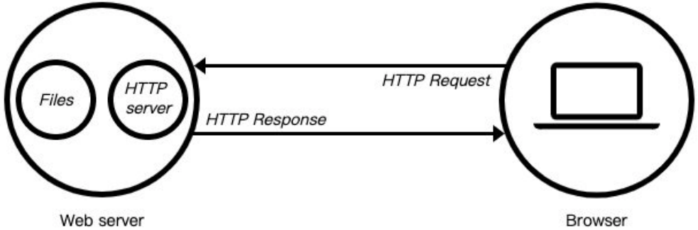

# 一. Stream的读写操作 

---

## 1. 认识 Stream

- 什么是 `Stream`（小溪、小河，在编程中通常翻译为流）呢？
  - 我们的第一反应应该是流水，源源不断的流动
  - 程序中的流也是类似的含义，我们可以想象当我们从一个文件中读取数据时，文件的二进制（字节）数据会源源不断的被读取到我们程序中
  - 而这个一连串的字节，就是我们程序中的流
- 所以，我们可以这样理解流：
  - 是连续字节的一种表现形式和抽象概念
  - 流应该是可读的，也是可写的
- 在之前学习文件的读写时，我们**可以直接通过 `readFile` 或者 `writeFile` 方式读写文件，为什么还需要流呢？**
  - 直接读写文件的方式，虽然简单，但是无法控制一些细节的操作
  - 比如从什么位置开始读、读到什么位置、一次性读取多少个字节
  - 读到某个位置后，暂停读取，某个时刻恢复继续读取等等
  - 或者这个文件非常大，比如一个视频文件，一次性全部读取并不合适

## 2. 文件读写的 Stream

- 事实上 `Node` 中很多对象是基于流实现的：
  - `http` 模块的 `Request` 和 `Response` 对象
- 官方文档：另外**所有的流都是 `EventEmitter` 的实例**
- 那么在 `Node` 中都有哪些流呢？
- **`Node.js` 中有四种基本流类型（可写流、可读流、双向流、可变流）**：
  - `Writable`：可以向其写入数据的流（例如 `fs.createWriteStream()`）
  - `Readable`：可以从中读取数据的流（例如 `fs.createReadStream()`）
  - `Duplex`：同时为 `Readable` 和 `Writable`（例如 `net.Socket`）
  - `Transform`：`Duplex`可以在写入和读取数据时修改或转换数据的流（例如 `zlib.createDeflate()`）
- 这里我们通过 `fs` 的操作，讲解一下 `Writable`、`Readable`，另外两个大家可以自行学习一下

## 3. Readable

- 之前我们读取一个文件的信息：

  ```js
  const fs = require('fs')
  
  // 1.一次性读取
  // 缺点一：没有办法精准控制从何处开始读取，及读取到何处截止
  // 缺点二：不能读取到某个位置时，暂停读取，恢复读取
  // 缺点三：文件非常大的时候，无法多次读取
  fs.readFile('./a.txt', (err, data) => {
    console.log('data: ', data)
  })
  ```

- 这种方式是一次性将一个文件中所有的内容都读取到程序（内存）中，但是这种读取方式就会出现我们之前提到的很多问题：
  - 文件过大、读取的位置、结束的位置、一次读取的大小
- 这个时候，我们可以使用 `createReadStream`，我们来看几个参数，更多参数可以参考官网：
  - `start`：文件读取开始的位置（包括该索引位置）
  - `end`：文件读取结束的位置（包括该索引位置）
  - `highWaterMark`：一次性读取字节的长度，默认是`64kb`

## 4. Readable 的使用

- 创建文件的 `Readable`

- 我们如何获取到数据呢？可以通过监听 `data` 事件，获取读取到的数据

- 也可以做一些其他的操作：监听其他事件、暂停或者恢复

  ```js
  // 2.通过流读取文件
  // 2.1 创建一个可读流
  const readStream = fs.createReadStream('./a.txt', {
    start: 2, // 什么位置开始读取
    end: 10, // 结束读取位置
    highWaterMark: 3, // 一次性读取字节的长度
  })
  
  // 2.2 监听读取到的数据
  readStream.on('data', (data) => {
    console.log('data.toString(): ', data.toString())
    readStream.pause() // 暂停读取
    setTimeout(() => {
      readStream.resume() // 恢复读取
    }, 2000)
  })
  
  // 3.补充其他的事件监听
  readStream.on('open', (fd) => {
    console.log('监听到: 通过流将文件打开~, fd: ', fd)
  })
  
  readStream.on('end', () => {
    console.log('监听到: 已经读取到end位置~')
  })
  
  readStream.on('close', () => {
    console.log('监听到：文件读取结束并被关闭')
  })
  ```

## 5. Writable

- 之前我们写入一个文件的方式是这样的：

  ```js
  fs.writeFile(
    './a.txt',
    'hello world',
    {
      flag: 'a+',
    },
    (err, data) => {
      console.log('data: ', data)
    }
  )
  ```

- 这种方式相当于一次性将所有的内容写入到文件中，但是这种方式也有很多问题：

  - 比如我们希望一点点写入内容，精确每次写入的位置等

- 这个时候，我们可以使用 `createWriteStream`，我们来看几个参数，更多参数可以参考官网：

  - `flags`：默认是 `w`，如果我们希望是追加写入，可以使用 `a` 或者 `a+`
  - `start`：写入的位置

## 6. Writable 的使用

- 我们进行一次简单的写入

  ```js
  // 创建一个写入流
  const writeStream = fs.createWriteStream('./a.txt', {
    start: 1,
  })
  
  writeStream.write('666~')
  writeStream.write('666~', (err) => {
    console.log('写入完成~: ', err)
  })
  ```

- 你可以监听 `open` 事件：

  ```js
  writeStream.on('open', () => {
    console.log('文件被打开~')
  })
  ```

## 7. close 的监听

- 我们会发现，我们并不能监听到 `close` 事件：

  - 这是因为写入流在打开后是不会自动关闭的
  - 我们必须手动关闭，来告诉 `Node` 已经写入结束了
  - 并且会发出一个 `finish` 事件的

- 另外一个非常常用的方法是 `end`：**`end`方法相当于做了两步操作：  `write` 传入的数据和调用 `close` 方法**

  ```js
  // 创建一个写入流
  const writeStream = fs.createWriteStream('./a.txt', {
    start: 1,
  })
  
  writeStream.on('open', () => {
    console.log('文件被打开~')
  })
  
  writeStream.write('666~')
  writeStream.write('666~', (err) => {
    console.log('写入完成~: ', err)
  })
  
  writeStream.on('finish', () => {
    console.log('写入完成了~')
  })
  
  writeStream.on('close', () => {
    console.log('文件被关闭~')
  })
  
  // 3.写入完成时, 需手动调用close方法
  // writeStream.close()
  
  // 4. end方法: 将最后的内容写入到文件中，并关闭文件
  writeStream.end('哈哈哈')
  ```

## 8. 文件的拷贝流操作 - pipe 方法

- 正常情况下，我们**可以将读取到的 输入流，手动的放到 输出流中进行写入**：

  ```js
  const fs = require('fs')
  
  // 1.方式一：一次性读取和写入文件
  fs.readFile('./b.txt', (err, data) => {
    fs.writeFile('./foo_copy01.txt', data, () => {
      console.log('写入文件完成')
    })
  })
  
  // 2.方式二：创建可读流和可写流
  const readStream = fs.createReadStream('./b.txt')
  const writeStream = fs.createWriteStream('./foo_copy02.txt')
  
  readStream.on('data', (data) => {
    writeStream.write(data)
  })
  
  readStream.on('end', () => {
    writeStream.close()
  })
  ```

- 我们也可以通过 `pipe`（管道） 来完成这样的操作：

  ```js
  // 3.在可读流和可写流之间建立一个管道
  // 可读流中读取到的数据直接放到可写流中
  const readStream = fs.createReadStream('./b.txt')
  const writeStream = fs.createWriteStream('./foo_copy03.txt')
  readStream.pipe(writeStream)
  ```


## 9. 可写流的start属性，在window上的兼容性问题

```js
const fs = require('fs')

const writeStream = fs.createWriteStream('./c.txt', {
  // windows兼容性问题：flags为a+时，无法在start位置处写入，而是在末尾写入
  // mac无此问题，window有此问题
  // flags: 'a+',
  // 解决方式：使用'r+'，新数据会覆盖对应位置上的原有数据
  flags: 'r+',
  start: 1,
})

writeStream.write('---')
```


# 二. http模块web服务

---

## 1. Web 服务器

- 什么是 `Web` 服务器？

  - 当应用程序（客户端）需要某一个资源时，可以向一台服务器，通过 `Http` 请求获取到这个资源
  - 提供资源的这个服务器，就是一个 `Web` 服务器

  

- 目前有很多开源的 `Web` 服务器：`Nginx`、`Apache`（静态）、`Apache Tomcat`（静态、动态）、`Node.js`

## 2. http 模块

- 在 `Node` 中，**提供 `web` 服务器的资源返回给浏览器**，主要是通过 `http` 模块

- 我们先简单对它做一个使用：

  ```js
  const http = require('http')
  const HTTP_HOST = 8000
  // 创建一个http对应的服务器
  const server = http.createServer((request, response) => {
    // request对象中包含本次客户端请求的所有信息（request本质是一个可读流）
    // 请求的url
    // 请求的method
    // 请求的headers
    // 请求携带的数据
    // ...
    // response对象用于给客户端返回结果的（response本质是一个可写流）
    response.end('hello world')
  })
  
  // 开启对应的服务器，并告知需监听的端口
  // 1024及以下的端口，一般是给那些特殊服务来监听的
  // 监听端口时，一般监听1024以上的端口~65536以下的端口
  // 1025~65535之间的端口
  // 为什么在65535呢？因为在大多数操作系统中，端口在保存的时候是用了两个字节，两个字节能表示最大的数值在65536
  // 2个byte => 256*256 => 65536
  server.listen(HTTP_HOST, () => {
    console.log(`服务器运行成功~ 端口: ${HTTP_HOST}`)
  })
  ```

## 3. 创建服务器

- 创建服务器对象，我们是通过 `createServer` 来完成的

  - `http.createServer` 会返回服务器的对象

  - 底层其实使用直接 `new Server` 对象

    ```js
    function createServer(opts, requestListener) {
      return new Server(opts, requestListener)
    }
    ```

- 那么，当然，我们也可以自己来创建这个对象：

  ```js
  const http = require('http')
  const HTTP_HOST_01 = 2001
  const HTTP_HOST_02 = 2002
  
  // 创建第1个服务器
  const serv1 = http.createServer((req, res) => {
    res.end(`${HTTP_HOST_01}端口服务器返回的结果`)
  })
  serv1.listen(HTTP_HOST_01, () => {
    console.log(`服务器运行成功~ 端口: ${HTTP_HOST_01}`)
  })
  
  // 创建第2个服务器
  const serv2 = new http.Server((req, res) => {
    res.end(`${HTTP_HOST_02}端口服务器返回的结果`)
  })
  serv2.listen(HTTP_HOST_02, () => {
    console.log(`服务器运行成功~ 端口: ${HTTP_HOST_02}`)
  })
  ```

- 上面我们已经看到，创建 `Server` 时会传入一个回调函数，这个回调函数在被调用时会传入两个参数：

  - `req`：`request` 请求对象，包含请求相关的信息
  - `res`：`response` 响应对象，包含我们要发送给客户端的信息

## 4. 监听主机和端口号

- `Server` 通过 `listen` 方法来开启服务器，并且在某一个主机和端口上监听网络请求：
  - 也就是当我们通过 `ip:port` 的方式发送到我们监听的 `Web` 服务器上时
  - 我们就可以对其进行相关的处理
- `listen` 函数有三个参数：
- 端口 `port`：可以不传，系统会默认分配端口，后续项目中我们会写入到环境变量中
- 主机 `hostname`：通常可以传入 `localhost`、`ip` 地址 `127.0.0.1`、或者 `ip` 地址 `0.0.0.0`，默认是 `0.0.0.0`
  - `localhost`：本质上是一个域名，通常情况下会被解析成 `127.0.0.1`
  - `127.0.0.1`：回环地址（`Loop Back Address`），表达的意思其实是我们主机自己发出去的包，直接被自己接收
    - 正常的数据库包经常 应用层 - 传输层 - 网络层 - 数据链路层 - 物理层 
    - 而回环地址，是在网络层直接就被获取到了，是不会经常数据链路层和物理层的
    - 比如我们监听 `127.0.0.1` 时，在同一个网段下的其他主机中，通过 `ip` 地址是不能访问的
  - `0.0.0.0`：
    - 监听 `IPV4` 上所有的地址，再根据端口找到不同的应用程序
    - 比如我们监听 `0.0.0.0` 时，在同一个网段下的其他主机中，通过 `ip` 地址是可以访问的
- 回调函数`cb`：服务器启动成功时的回调函数


# 三. request请求对象 

---


# 四. response响应对象

---


# 五. axios node中使用

---


# 六. 文件上传的细节分析

---


