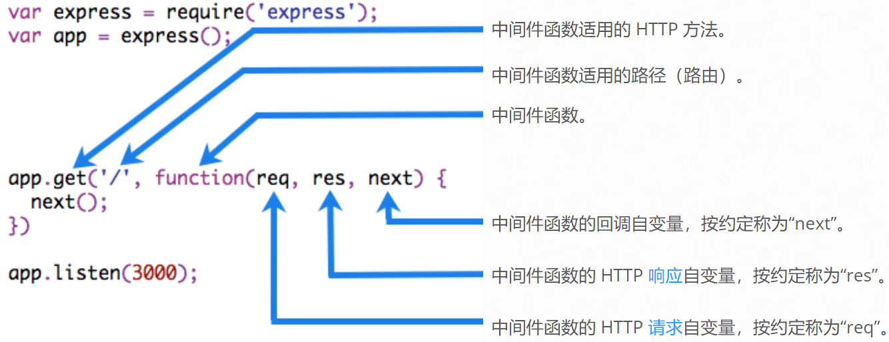
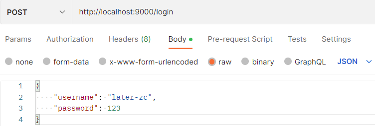
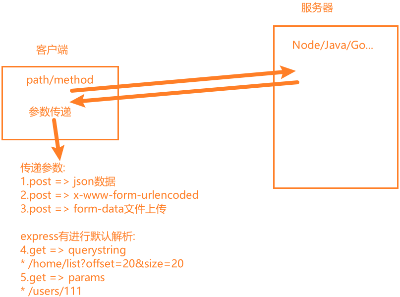

# 一. Express 初体验 

---

## 1. 认识 Web 框架

- 前面我们已经学习了使用 `http` 内置模块来搭建 `Web` 服务器，为什么还要使用框架？

  - 原生 `http` 在进行很多处理时，会较为复杂
  - 有 `URL` 判断、`Method` 判断、参数处理、逻辑代码处理等，都需要我们自己来处理和封装
  - 并且所有的内容都放在一起，会非常的混乱
- 目前在 `Node` 中比较流行的 `Web` 服务器框架是 `express`、`koa`

  - 我们先来学习 `express`，后面再学习 `koa`，并且对他们进行对比
- `express` 早于 `koa` 出现，并且在 `Node` 社区中迅速流行起来：
  - 我们可以基于 `express` 快速、方便的开发自己的 `Web` 服务器
  - 并且可以通过一些实用工具和中间件来扩展自己功能

- **`Express` 整个框架的核心就是中间件，理解了中间件其他一切都非常简单！**

## 2. Express 安装

- `express` 的使用过程有两种方式：

  - 方式一：通过 `express` 提供的脚手架，直接创建一个应用的骨架
  - 方式二：从零搭建自己的 `express` 应用结构

- 安装 `express`：

  ```js
  npm i express
  ```

- 方式一：安装 `express-generator`

  ```bash
  # 安装脚手架
  npm i -g express-generator
  
  # 创建项目
  express express-demo
  
  # 安装依赖
  npm i 
  
  # 启动项目
  node bin/www
  ```

- 方式二：从零搭建自己的 `express` 应用结构

  ```bash
  npm init -y # 如果报错文件夹名字有问题，则使用 npm init
  ```

## 3. Express 的基本使用

- 我们来创建第一个 `express` 项目：

  - 我们会发现，之后的开发过程中，可以方便的将请求进行分离
  - 无论是不同的 `URL`，还是 `get`、`post` 等请求方式
  - 这样的方式非常方便我们已经进行维护、扩展
  - 当然，这只是初体验，接下来我们来探索更多的用法

- 请求的路径中如果有一些参数，可以这样表达：

  - `/users/:userId`
  - 在 `request` 对象中获取该参数可以通过 `req.params.userId`

- 返回数据，我们可以方便的使用 `json`：

  - `res.json(数据)` 方式
  - 可以支持其他的方式，可以自行查看文档
  - https://www.expressjs.com.cn/guide/routing.html

  ```js
  const express = require('express')
  
  // 1.创建express的服务器
  const app = express()
  
  // 客户端访问URL：/login 和 /home
  app.post('/login', (req, res) => {
    res.end('登录成功 ~')
  })
  
  app.get('/home', (req, res) => {
    res.end('访问home页面数据 ~')
  })
  
  // 2. 启动服务器，并且监听端口
  app.listen(9000, () => {
    console.log('express server running ~')
  })
  ```


# 二. Express 中间件使用

---

## 1. 认识中间件 (middleware)

- `Express` 是一个路由和中间件的 `Web` 框架，它本身的功能非常少：
  - `Express` 应用程序本质上是一系列中间件函数的调用
- 中间件是什么呢？
  - **中间件的本质 是传递给 `express` 的一个回调函数**
  - 这个回调函数接受三个参数：
    - 请求对象（`request` 对象）
    - 响应对象（`response` 对象）
    - `next` 函数（在 `express` 中定义的用于执行下一个中间件的函数）

- 中间件中可以执行哪些任务呢？

  - 执行任何代码
  - 对请求（`request`）和响应（`response`）对象进行更改
  - 结束请求 - 响应周期（返回数据）
  - 调用堆栈中的下一个中间件

- 如果当前中间件功能没有结束请求-响应周期，则必须调用 `next()` 将控制权传递给下一个中间件功能，否则，请求将被挂起

  

```js
const express = require('express')

// 创建express的服务器
const app = express()

// 给express创建的app传入一个回调函数
// 传入的这个回调函数就称之为中间件(middleware)
// app.post('/login', callback) // callback => 中间件
app.post('/login', (req, res, next) => {
  console.log('first middleware exec ~')

  // 1.中间件中可以执行任意代码
  // 打印
  // 查询数据
  // 逻辑代码

  // 2.在中间件中可以修改req/res对象
  req.abc = 99

  // 3.可以在中间件中结束响应周期
  // res.json({
  //   message: '登录成功',
  //   code: 0,
  // })

  // 4.执行下一个中间件（当响应周期未结束时）
  next()
})

app.use((req, res, next) => {
  console.log('second middleware exec ~')
})

// 2. 启动服务器，并且监听端口
app.listen(9000, () => {
  console.log('express server running ~')
})
```

## 2. 应用中间件 – 自己编写

- 那么，如何将一个中间件应用到我们的应用程序中呢？

  - `express` 主要提供了两种方式：
    - `app/router.use`
    - `app/router.methods`
  - 可以是 `app`，也可以是 `router`，`router` 我们后续再学习
  - `methods` 指的是常用的请求方式，比如： `app.get` 或 `app.post` 等

- 我们先来学习 `use` 的用法，因为 `methods` 的方式本质是 `use` 的特殊情况

  - 案例一：最普通的中间件

    ```js
    const express = require('express')
    const app = express()
    
    // 通过use方法注册的中间件是最普通/简单的中间件
    // 通过use注册的中间件，无论是什么请求方式/路径，都可以匹配上
    app.use((req, res, next) => {
      console.log('normal middleware exec ~')
    })
    
    // 2. 启动服务器，并且监听端口
    app.listen(9000, () => {
      console.log('express server running ~')
    })
    ```

  - 案例二：`path` 匹配中间件

    ```js
    const express = require('express')
    const app = express()
    
    // 注册普通的中间件
    // app.use((req, res, next) => {
    //   res.end('------')
    // })
    
    // 注册路径匹配的中间件
    // 路径匹配的中间件是不会对请求方式有限制的
    app.use('/home', (req, res, next) => {
      console.log('match /home middleware ~')
      res.end('home data')
    })
    
    app.listen(9000, () => {
      console.log('express server running ~')
    })
    ```

  - 案例三：`path` 和 `method` 匹配中间件

    ```js
    const express = require('express')
    const app = express()
    
    // 注册中间件：对path/method都有限制
    // app.method(path, middleware)
    app.get('/home', (req, res, next) => {
      console.log('match /home get method middleware')
      res.end('home data')
    })
    
    app.post('/users', (req, res, next) => {
      console.log('match /users post middleware')
      res.end('users data')
    })
    
    app.listen(9000, () => {
      console.log('express server running ~')
    })
    ```

  - 案例四：注册多个中间件

    ```js
    const express = require('express')
    const app = express()
    
    // app.get(路径，中间件1，中间件2，...)
    app.get(
      '/home',
      (req, res, next) => {
        console.log('111')
        next() // 执行下一个中间件
        res.end('home data')
      },
      (req, res, next) => {
        console.log('222')
        // 不会执行下一个中间件
        // 当前中间件中未调用next方法
      },
      (req, res, next) => {
        console.log('333')
      }
    )
    
    app.listen(9000, () => {
      console.log('express server running ~')
    })
    ```

> **总结：**
>
> - **当 `express` 接收到客户端发送的请求时，在所有中间件中开始进行匹配**
> - **当匹配到第一个符合要求的中间件时，那么就会执行第一个匹配到的中间件**
> - **后续的中间件是否执行？取决于当前中间件中是否执行 `next` 方法**

## 3. 中间件案例练习

```js
const express = require('express')
const app = express()

// 注册实际请求的中间件
// 案例一：用户登录的请求处理 /login post => username/password
app.post('/login', (req, res, next) => {
  req.setEncoding('utf-8')
  let isLogin = null

  // 1.获取本次请求过程中传递过来的json数据
  req.on('data', (data) => {
    const { username, password } = JSON.parse(data)
    if (username === 'later-zc' && password === 123) {
      isLogin = true
    }
  })

  req.on('end', () => {
    if (!isLogin) return res.end('账户或密码错误')
    res.end('登录成功~')
  })
})

// 案例二：注册用户的请求处理 /register post = > username/password
app.post('/register', (req, res, next) => {
  req.setEncoding('utf8')
  let isRegister = null

  req.on('data', (data) => {
    const { username, password } = data
    if (username && password) isRegister = true
  })

  req.on('end', () => {
    if (!isRegister) return res.end('注册失败')
    res.end('注册成功~')
  })
})

app.listen(9000, () => {
  console.log('express server running ~')
})
```

- 上面的案例练习，可以看出，每次在中间件函数中，需要去监听事件和转换数据格式，再加上逻辑代码，就显得代码不简洁，复用性低
- 下面看如何通过利用普通中间件抽取 `body` 解析

## 4. 应用中间件 – body解析

- 并非所有的中间件都需要我们从零去编写：

  - `express` 有内置一些帮助我们完成对 `request` 解析的中间件
  - `registry` 仓库中也有很多可以辅助我们开发的中间件

- 在客户端发送 `post` 请求时，会将数据放到 `body` 中：

  - 客户端可以通过 `json` 的方式传递
  - 也可以通过 `form` 表单的方式传递

  

## 5. 编写解析request body中间件

```js
const express = require('express')
const app = express()

// 通过普通中间件抽取 body 解析
// 自己解析
app.use((req, res, next) => {
  if (req.headers['content-type'] === 'application/json') {
    req.setEncoding('utf8')
    req.on('data', (data) => {
      req.body = JSON.parse(data)
    })

    req.on('end', () => {
      next()
    })
  } else {
    // ...
    next()
  }
})

app.post('/login', (req, res, next) => {
  // 直接操作req.body，无需再监听事件，处理数据格式
  console.log('req.body: ', req.body)
})

app.post('/register', (req, res, next) => {
  // 直接操作req.body，无需再监听事件，处理数据格式
})

app.listen(9000, () => {
  console.log('express server running ~')
})
```

## 6. 应用中间件 – express 提供

- 但是，事实上我们可以使用 `express` 内置的中间件或使用 `body-parser` 来完成：

  ```js
  // ...
  
  // 直接使用 express 提供给我们的中间件(express.json方法返回的就是一个中间件函数)
  app.use(express.json())
  
  // ...
  ```

- 如果我们解析的是 `application/x-www-form-urlencoded`：

  ```js
  // ...
  
  // 方式一：自己解析
  
  // 方式二：express.urlencoded() 解析客户端传递过来的urlencode数据
  // 解析传递过来的urlencode数据时，默认使用的是node内置querystring模块
  // {extended: true}：不再使用内置的querystring库，而是qs库
  app.use(
    express.urlencoded({
      extended: true,
    })
  )
  
  // ...
  ```


## 7. 应用中间件 – 第三方中间件

- 如果我们希望将请求日志记录下来，那么可以使用 `express` 官网开发的第三方库：`morgan`

  ```js
  const fs = require('fs')
  const express = require('express')
  const morgan = require('morgan')
  
  const app = express()
  
  const writeStream = fs.createWriteStream('./log/acess.log')
  app.use(
    morgan('combined', {
      stream: writeStream,
    })
  )
  
  app.post('/login', (req, res, next) => {
    res.end('登录成功')
  })
  
  app.listen(9000, () => {
    console.log('express server running ~')
  })
  ```

  > **注意：**
  >
  > - **需要单独安装该库**
  >
  >   ```bash
  >   npm i morgan
  >   ```

- 上传文件，我们可以使用 `express` 提供的 `multer` 来完成：

- 文档：https://github.com/expressjs/multer/blob/master/doc/README-zh-cn.md

- 单个文件上传

  ```js
  const express = require('express')
  const multer = require('multer')
  
  const app = express()
  
  const upload = multer({
    dest: './uploads', // dest: 在哪里存储文件
  })
  
  // single方法返回一个中间件，当请求这个接口的时候，该中间件可以将传过来的图片数据进行解析，内部会调用next，将解析好的数据传入到后一个中间件中
  // ' Request '对象将填充一个' file '对象，其中包含关于已处理文件的信息
  // 上传的如果是一个单文件，使用single()，并传入要处理的表单fieldName（字段名）
  app.post('/avatar', upload.single('avatar'), (req, res, next) => {
    // 这里可以获取传入的解析好的数据
    // req.file 是 `avatar` 文件的信息
    console.log('req.file: ', req.file)
    res.end('上传成功')
  })
  
  app.listen(9000, () => {
    console.log('express server running ~')
  })
  ```

- 多文件上传

  ```js
  const express = require('express')
  const multer = require('multer')
  const path = require('path')
  
  const app = express()
  
  const upload = multer({
    // storage: 在哪里存储文件
    storage: multer.diskStorage({
      // destination 是用来确定上传的文件应该存储在哪个文件夹中
      destination(req, file, cb) {
        cb(null, './uploads')
      },
      // filename 用于确定文件夹中的文件名的确定
      filename(req, file, cb) {
        // file.originalname：获取用户计算机中图片原始名，包括扩展名
        // path.extname: 返回path的扩展名，即path的最后一部分中从最后一次出现的.（句点）字符到字符串的结尾
        cb(null, Date.now() + '_' + path.extname(file.originalname))
      },
    }),
  })
  
  // 上传多文件
  app.post('/photos', upload.array('photos'), (req, res, next) => {
    console.log('req.files: ', req.files)
    res.end('上传多张照片成功')
  })
  
  app.listen(9000, () => {
    console.log('express server running ~')
  })
  ```

## 8. multer 解析 form-data 中普通数据

- 如果我们希望借助于 `multer` 帮助我们解析一些 `form-data` 中的普通数据，那么我们可以使用 `any` 方法：

  ```js
  const express = require('express')
  const multer = require('multer')
  
  const app = express()
  const formdata = multer()
  
  // 不能解析form-data数据
  // app.use(express.json())
  // app.use(express.urlencoded({ extended: true }))
  
  // 可以解析
  // app.use(formdata.any())
  app.post('/login', formdata.any(), (req, res, next) => {
    console.log('req.body: ', req.body)
    res.end('登录成功')
  })
  
  app.listen(9000, () => {
    console.log('express server running ~')
  })
  ```


# 三. Express 请求和响应

---

## 1. 客户端发送请求的方式

- 客户端传递到服务器参数的方法常见的是5种：
  
  - 方式一：通过 `post` 请求中的 `body` 的 `json` 格式（中间件中使用过）
  - 方式二：通过 `post` 请求中的 `body` 的 `x-www-form-urlencoded` 格式（中间件使用过）
  - 方式三：通过 `post` 请求中的 `form-data` 格式（中间件中使用过）
  - 方式四：通过 `get` 请求中的 `URL` 的 `params`
  - 方式五：通过 `get` 请求中的 `URL` 的 `query`
  
  
  
- 目前我们主要有两种方式没有讲，下面进行一个演练

## 2. 传递参数 params 和 query

- `request.query`方式

  ```js
  // 请求地址：http://localhost:9000/home/list?offset=20&size=30
  // 1.解析querystring (express内部自动解析)
  app.get('/home/list', (req, res, next) => {
    const { offset, size } = req.query
  
    console.log(offset) // '20'
    console.log(size) // '30'
    res.end('/home/list')
  })
  ```

- `request.params`方式

  ```js
  // 请求地址：http://localhost:9000/users/222
  // 2.解析params (express内部自动解析)
  app.get('/users/:id', (req, res, next) => {
    const { id } = req.params // 222
    res.end(`/users/${id}`)
  })
  ```

## 3. 响应数据

- 服务器返回客户端数据方式：

- `end` 方法

  - 类似于 `http` 中的 `response.end` 方法，用法是一致的

- `json` 方法

  - `json` 方法中可以传入很多的类型：`object`、`array`、`string`、`boolean`、`number`、`null` 等，它们会被转换成 `json` 格式返回

- `status` 方法

  - 用于设置 `http` 状态码

  > **注意：`status` 是一个方法，而不是属性赋值**

  ```js
  const express = require('express')
  
  const app = express()
  
  app.get('/login', (req, res, next) => {
    // 1. end方法(用得少)
    res.end('end方法')
  
    // 2. res.json方法
    res.json('json方法')
  
    // 3. res.status方法
    res.status(201).json({
      code: 200,
      data: {
        name: 'later-zc',
        message: 'hello world',
      },
      message: 'ok',
    })
  })
  
  app.listen(9000, () => {
    console.log('express server running ~')
  })
  ```

- 更多响应的方式：https://www.expressjs.com.cn/4x/api.html#res


# 四. Express 路由的使用

---

## 1. Express 的路由

- 如果我们将所有的代码逻辑都写在 `app` 中，那么 `app` 会变得越来越复杂：

  - 一方面完整的 `Web` 服务器包含非常多的处理逻辑
  - 另一方面有些处理逻辑其实是一个整体，我们应该将它们放在一起：比如对 `users` 相关的处理
    - 获取用户列表
    - 获取某一个用户信息
    - 创建一个新的用户
    - 删除一个用户
    - 更新一个用户

  ```js
  const express = require('express')
  const userRouter = require('./router/useRouter')
  
  const app = express()
  
  app.post('/login', (req, res, next) => {})
  app.post('/home', (req, res, next) => {})
  
  // 方式一.将用户的接口直接定义在app中
  app.get('/users', (req, res, next) => {})
  app.get('/users/:id', (req, res, next) => {})
  app.post('/users', (req, res, next) => {})
  app.delete('/users/:id', (req, res, next) => {})
  app.patch('/users/:id', (req, res, next) => {})
  
  // 方式二.将用户的接口定义在单独的路由对象中
  app.use('/users', userRouter) // 让路由生效
  
  app.listen(9000, () => {
    console.log('express server running ~')
  })
  ```

- 我们可以使用 `express.Router` 来创建一个路由处理程序：

  - **一个 `Router` 实例拥有完整的中间件和路由系统**
  - 因此，它也被称为 迷你应用程序（`mini-app`）

  ```js
  // ./router/useRouter.js
  
  const express = require('express')
  
  // 创建一个新的路由器对象
  const userRouter = express.Router()
  userRouter.get('/', (req, res, next) => {
    res.json('用户列表数据')
  })
  userRouter.get('/:id', (req, res, next) => {
    const { id } = req.params
    res.json('某个用户数据：' + id)
  })
  userRouter.post('/', (req, res, next) => {
    res.json('创建用户成功')
  })
  userRouter.delete('/:id', (req, res, next) => {
    const { id } = req.params
    res.json('删除某个用户数据：' + id)
  })
  userRouter.patch('/:id', (req, res, next) => {
    const { id } = req.params
    res.json('修改某个用户数据：' + id)
  })
  
  module.exports = userRouter
  ```

## 2. 静态资源服务器

- 部署静态资源我们可以选择很多方式：

  - `nginx`、`apache`、....
  - `Node` 也可以作为静态资源服务器，并且 `express` 给我们提供了方便部署静态资源的方法 `static`

  ```js
  const express = require('express')
  
  const app = express()
  
  // express.static()内置的中间件
  // 直接将一个文件夹作为静态资源
  // 当访问某个文件时，自动从文件夹中读取
  // 当访问loacalhost:9000时，默认会访问localhost:9000/index.html，自然就读取到了bulid文件下的index.html文件
  app.use(express.static('./uploads'))
  app.use(express.static('./build'))
  
  app.post('/login', (req, res, next) => {})
  
  app.listen(9000, () => {
    console.log('express server running ~')
  })
  ```


# 五. Express 的错误处理

---

- 错误处理中间件总是有*四个*参数。您必须提供四个参数以将其标识为错误处理中间件函数。即使您不需要使用该`next`对象，您也必须指定它以维护签名。否则，该`next`对象将被解释为常规中间件并且无法处理错误。有关错误处理中间件的详细信息，请参阅：[错误处理](https://expressjs.com/en/guide/error-handling.html)。
- 以与其他中间件函数相同的方式定义错误处理中间件函数，除了使用四个参数而不是三个参数，特别是使用签名`(err, req, res, next)`）：

```js
const express = require('express')

const app = express()
app.use(express.json())

// 服务器给客户端返回错误信息的方案
app.post('/login', (req, res, next) => {
  const { username, password } = req.body
  if (!username || !password) {
    next(-1001)
  } else if (username !== 'later-zc' || password !== 123) {
    next(-1002)
  } else {
    res.json({
      code: 0,
      message: '登录成功',
      token: 'hello world',
    })
  }
})

// 错误处理的中间件
app.use((err, req, res, next) => {
  const code = err
  let message = '未知错误信息'
  switch (code) {
    case -1001:
      message = '没有输入用户名和密码'
      break
    case -1002:
      message = '用户名或密码输入错误'
      break
  }
  res.json({
    code,
    message,
  })
})

app.listen(9000, () => {
  console.log('express server running ~')
})
```


# 六. Express 的源码解析

---

## 1. 创建 app 的过程

- `express` 函数的本质其实是 `createApplication`：


