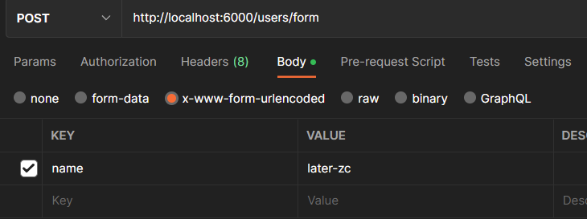
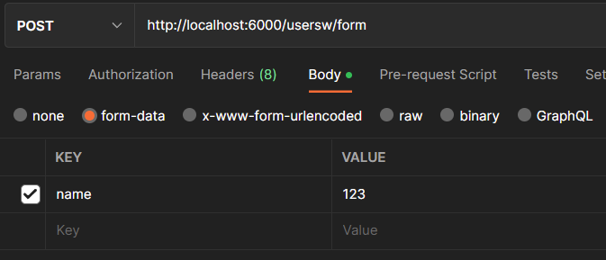

# 一. koa 的基本使用

---

## 1. 认识 Koa

- 前面我们已经学习了 `express`，另外一个非常流行的 `Node Web` 服务器框架就是 `Koa`
- `Koa`官方的介绍：
  - koa: next generation web framework for node.js
  - koa: `node.js` 的下一代 `web` 框架
- 事实上，`koa` 是 `express` 同一个团队开发的一个新的 `Web` 框架：
  - 目前团队的核心开发者 `TJ` 的主要精力也在维护 `Koa`，`express` 已经交给团队维护了
  - `Koa` 旨在为 `Web` 应用程序和 `API` 提供更小、更丰富和更强大的能力
  - **`koa` 相对于 `express` 具有更强的异步处理能力**
  - `Koa` 的核心代码只有 `1600+` 行，**是一个更加轻量级的框架**
  - 我们可以根据需要安装和使用中间件
- 事实上学习了 `express` 之后，学习 `koa` 的过程是很简单的

## 2. Koa 初体验

- 我们来体验一下 `koa` 的 `Web` 服务器，创建一个接口

  - `koa` 也是通过注册中间件来完成请求操作的

- `koa` 注册的中间件提供了两个参数：

- `ctx`：上下文（`Context`）对象

  - `koa` 并没有像 `express` 一样，将 `req` 和 `res` 分开，而是将它们作为 `ctx` 的属性
  - `ctx` 代表一次请求的上下文对象
  - `ctx.request`：获取请求对象
  - `ctx.response`：获取响应对象

- `next`：本质上是一个 `dispatch`，类似于之前的 `next`

  - 后续我们学习 `Koa` 的源码，来看一下它是一个怎么样的函数

  ```js
  const Koa = require('koa')
  // koa在没有提供对应的服务时，koa没有像express那样提供一个对应的页面
  const app = new Koa()
  
  // 注册中间件(middleware)
  // koa中间件有两个参数：ctx/next
  app.use((ctx, next) => {
    // 1.请求对象
    // ctx.request：koa封装的请求对象
    console.log('ctx.request: ', ctx.request)
    // ctx.req: node封装的请求对象(http.createServer中的请求对象)
    console.log('ctx.req: ', ctx.req)
  
    // 2.响应对象
    // ctx.response: koa封装的响应对象
    console.log('ctx.response: ', ctx.response)
    // ctx.res: node封装的响应对象(http.createServer中的响应对象)
    console.log('ctx.res: ', ctx.res)
  
    // 3.其他属性
    console.log('ctx.query: ', ctx.query)
    next()
  })
  
  app.use(() => {
    console.log('hello world~')
  })
  
  app.listen(6000, () => {
    console.log('koa server running~')
  })
  // koa在没有提供对应的服务时，koa没有像express那样提供一个对应的页面，而是返回Not Found
  ```
  

## 3. Koa 中间件

- `koa` 通过创建的 `app` 对象，注册中间件只能通过 `use` 方法：

  - **`Koa` 并没有提供 `methods` 的方式来注册中间件**
  - **也没有提供 `path` 中间件来匹配路径**

- 但是真实开发中我们如何将路径和 `method` 分离呢？

  - 方式一：根据 `request` 自己来判断

    ```js
    const Koa = require('koa')
    const app = new Koa()
    
    app.use((ctx, next) => {
      const { path, request, method } = ctx
      console.log(path === request.path) // true
      const mtd = method == 'GET' ? 'GET' : 'POST'
      switch (path) {
        case '/users':
          ctx.body = `${mtd} users`
          break
        case '/home':
          ctx.body = `${mtd} home`
          break
        case '/login':
          ctx.body = `${mtd} login`
          break
      }
    })
    
    app.listen(6000, () => {
      console.log('koa server running~')
    })
    ```

  - 方式二：使用第三方路由中间件（看下一节）

## 4. 路由的使用

- `koa` 官方并没有给我们提供路由的库，我们可以选择第三方库`@koa/router`

  ```bash
  npm i @koa/router
  ```

- 我们可以先封装一个 `userRouter.js` 的文件：

  ```js
  // ./router/userRouter.js
  const KoaRouter = require('@koa/router')
  
  // 1.创建路由对象
  const userRouter = new KoaRouter({
    prefix: '/users',
  })
  
  // 2.在路由中注册中间件：path/method
  userRouter.get('/', (ctx, next) => {
    ctx.body = 'users 01'
  })
  userRouter.get('/:id', (ctx, next) => {
    const { id } = ctx.params
    ctx.body = '获取某一个用户' + id
  })
  userRouter.post('/', (ctx, next) => {
    ctx.body = '创建用户成功'
  })
  userRouter.delete('/:id', (ctx, next) => {
    const { id } = ctx.params
    ctx.body = '删除某一个用户' + id
  })
  userRouter.patch('/:id', (ctx, next) => {
    const { id } = ctx.params
    ctx.body = '修改某一个用户' + id
  })
  
  module.exports = userRouter
  ```

- 在 `app` 中将 `router.routes()` 注册为中间件：

  ```js
  const Koa = require('koa')
  const userRouter = require('./router/userRouter')
  
  const app = new Koa()
  
  // 3.让路由中的中间件生效
  app.use(userRouter.routes())
  app.use(userRouter.allowedMethods())
  
  app.listen(6000, () => {
    console.log('koa server running~')
  })
  ```

> **注意：**
>
> - **`allowedMethods` 用于判断某一个 `method` 是否支持：**
>
>   - **如果我们请求 `get`，那么是正常的请求，因为我们有实现 `get`** 
>
>   - **如果我们请求 `put`、`delete`、`patch`，会自动报错：`Method Not Allowed`，状态码：405**
>
>   - **如果我们请求 `link`、`copy`、`lock`，会自动报错：`Not Implemented`，状态码：501**


# 二. koa 的参数解析

---

- 下列参数解析示例都是基于以下配置：

  ```js
  const Koa = require('koa')
  const KoaRouter = require('@koa/router')
  
  const app = new Koa()
  const userRouter = new KoaRouter({
    prefix: '/users',
  })
  
  /**
   * 1.get: params方式，例子：/id
   * 2.get: query方式，例子：?name=later-zc&age=1
   * 3.post: json方式，例子：{"name": "later-zc"}
   * 4.post: x-www-form-urlencode
   * 5.post: form-data
   */
  
  app.use(userRouter.routes())
  app.use(userRouter.allowedMethods())
  
  app.listen(6000, () => {
    console.log('koa server running~')
  })
  
  ```

## 1. 参数解析：params - query

- 请求地址：http://localhost:6000/users/123

  - 获取 `params`：

    ```js
    // params
    userRouter.get('/:id', (ctx, next) => {
      const { id } = ctx.params
      ctx.body = 'params ' + id // params 123
    })
    ```

- 请求地址：http://localhost:6000/users?username=later-zc&age=18

  - 获取 `query`：

    ```js
    // query
    userRouter.get('/', (ctx, next) => {
      const { name, age } = ctx.query
      ctx.body = name + ' ' + age // later-zc 18
    })
    ```

## 2. 参数解析：json

- 请求地址：http://localhost:6000/users

- `body` 是 `json` 格式：`{"name": "later-zc", "password": "123"}`

- 获取 `json` 数据：

  - 安装依赖： 

    ```bash
    npm i koa-bodyparser
    ```

  - 使用 `koa-bodyparser` 的中间件

    ```js
    const bodyParser = require('koa-bodyparser')
    // ...
    app.use(bodyParser())
    
    // post/json
    userRouter.post('/', (ctx, next) => {
      // 注意事项：不能从ctx.body中获取，ctx.body用来返回数据
      const { name, age } = ctx.request.body
      ctx.body = name + ' ' + age
    })
    ```

## 3. 参数解析：x-www-form-urlencoded

- 请求地址：http://localhost:6000/users/urlencode

  - `body` 是 `x-www-form-urlencoded` 格式：

  

- 获取 `json` 数据：(和 `json` 是一致的)

  - 安装依赖： 

    ```bash
    npm i koa-bodyparser
    ```

  - 使用 `koa-bodyparser` 的中间件

    ```js
    const bodyParser = require('koa-bodyparser')
    // ...
    app.use(bodyParser())
    
    // post/urlencode
    userRouter.post('/urlencode', (ctx, next) => {
      const { name } = ctx.request.body
      ctx.body = name
    })
    ```

## 4. 参数解析：form-data

- 请求地址：http://localhost:8000/login

  - `body` 是 `form-data` 格式：

  

- 解析  `body` 中的数据，我们需要使用 `multer`

  - 安装依赖：

    ```bash
    npm i koa-multer
    ```

  - 使用 `multer` 中间件

    ```js
    const multer = require('@koa/multer')
    // ...
    const formParser = multer()
    
    // form-data
    userRouter.post('/form', formParser.any(), (ctx, next) => {
      const { name } = ctx.request.body
      ctx.body = name
    })
    ```

## 5. Multer上传文件

```js
const Koa = require('koa')
const KoaRouter = require('@koa/router')
const multer = require('@koa/multer')

const app = new Koa()
const upload = multer({
  // dest: './uploads',
  storage: multer.diskStorage({
    destination(req, file, cb) {
      cb(null, './uploads')
    },
    filename(req, file, cb) {
      cb(null, Date.now() + '_' + file.originalname)
    },
  }),
})
const uploadRouter = new KoaRouter({
  prefix: '/upload',
})

// 单文件
uploadRouter.post('/avatar', upload.single('avatar'), (ctx, next) => {
  console.log('ctx.request.file: ', ctx.request.file)
  ctx.body = '文件上传成功'
})
// 多文件
uploadRouter.post('/photos', upload.array('photos'), (ctx, next) => {
  console.log('ctx.request.files: ', ctx.request.files)
  ctx.body = '文件上传成功'
})

app.use(uploadRouter.routes())
app.use(uploadRouter.allowedMethods())

app.listen(6000, () => {
  console.log('koa server running~')
})
```


# 三. koa 响应和错误

---

## 1. 数据的响应

- 输出结果：`body` 将响应主体设置为以下之一：

  - `string`：字符串数据
  - `Buffer`：`Buffer` 数据
  - `Stream`：流数据
  - `Object||Array`：对象或者数组
  - `null`：不输出任何内容
  - 如果 `response.status` 尚未设置，`Koa` 会自动将状态设置为 `200` 或 ` 204`

- 请求状态：`status`

  ```js
  const fs = require('fs')
  const Koa = require('koa')
  const KoaRouter = require('@koa/router')
  const bodyParser = require('koa-bodyparser')
  
  const app = new Koa()
  
  app.use(bodyParser())
  
  const userRouter = new KoaRouter({
    prefix: '/users',
  })
  
  userRouter.get('/', (ctx, next) => {
    // 1.body类型是string
    // ctx.body = 'hello world'
  
    // 2.body类型是Buffer
    // ctx.body = Buffer.from('hello world')
  
    // 3.body的类型是Stream
    // const readStream = fs.createReadStream('./uploads/01.png')
    // ctx.type = 'image/png'
    // ctx.body = readStream
  
    // 4.body的类型是数据(array/object)
    // ctx.body = {
    //   code: 0,
    //   data: [
    //     { id: 111, price: 99 },
    //     { id: 112, price: 89 },
    //   ],
    // }
  
    // 5.body的类型是null, 自动设置http状态码为204 no content
    ctx.body = null
  })
  
  app.use(userRouter.routes())
  app.use(userRouter.allowedMethods())
  
  app.listen(8000, () => {
    console.log('koa server running~')
  })
  ```

## 2. 错误处理

```js
const Koa = require('koa')
const KoaRouter = require('@koa/router')

const app = new Koa()

const userRouter = new KoaRouter({
  prefix: '/users',
})

userRouter.get('/', (ctx, next) => {
  const isAuth = false
  if (isAuth) {
    ctx.body = {
      username: 'later-zc',
      age: 18,
    }
  } else {
    // EventEmitter
    ctx.app.emit('error', -1003, ctx)
  }
})

app.use(userRouter.routes())
app.use(userRouter.allowedMethods())

// 独立的文件：error-handle.js
app.on('error', (code, ctx) => {
  let message = '未知错误'
  switch (code) {
    case -1001:
      message = '账户或密码错误'
      break
    case -1002:
      message = '请求参数不正确'
      break
    case -1003:
      message = 'token未授权'
      break
  }
  ctx.body = {
    code,
    message,
  }
})

app.listen(8000, () => {
  console.log('koa server running~')
})
```


# 四. koa 静态服务器

---

- `koa` 并没有内置部署相关的功能，所以我们需要使用第三方库：

  ```bash
  npm i koa-static
  ```

- 部署的过程类似于 `express`：

  ```js
  const Koa = require('koa')
  const static = require('koa-static')
  
  const app = new Koa()
  
  app.use(static('./uploads'))
  app.use(static('./build'))
  
  app.listen(8000, () => {
    console.log('koa server running~')
  })
  ```

  


# 五. koa 的源码解析

---


# 六. 和 express 对比

---


