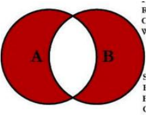

# 一. MySQL 的聚合函数 

---

## 1. 聚合函数

- 聚合函数表示 **对值的集合 进行操作的 组函数（集合函数）**

  ```mysql
  # 1.计算华为手机的平均价格
  SELECT AVG(price) FROM `products` WHERE `brand` = '华为';
  
  # 2.计算小米手机的平均评分
  SELECT AVG(score) FROM `products` WHERE `brand` = '小米';
  
  # 3.计算手机中最高和最低的评分
  SELECT MAX(score) FROM products;
  SELECT MIN(score) FROM products;
  
  # 4.计算总投票人数
  SELECT SUM(voteCnt) FROM products;
  
  # 5.计算所有条目的数量
  SELECT COUNT(*) FROM products;
  # 6.计算华为手机的个数
  SELECT COUNT(*) FROM products WHERE brand = '华为';
  ```

  

## 2. 认识 Group By

- 事实上**聚合函数相当于默认将所有的数据分成了一组**：
  - 我们前面使用 `avg` 还是 `max` 等，都是将所有的结果看成一组来计算的
  - 那么如果我们希望划分多个组：比如华为、苹果、小米等手机分别的平均价格，应该怎么来做呢？
  - 这个时候我们可以使用 `GROUP BY`
  
- **`GROUP BY` 通常和聚合函数一起使用**：
  - **表示我们先对数据进行分组，再对每一组数据，进行聚合函数的计算**
  
- 我们现在来提一个需求：
  - 根据品牌进行分组
  
  - 计算各个品牌中：商品的个数、平均价格
  
  - 也包括：最高价格、最低价格、平均评分
  
    ```mysql
    # group by：数据根据品牌进行分组
    SELECT 
    	brand, MAX(price), MIN(price), ROUND(AVG(price), 2), ROUND(AVG(score), 2)
    FROM products
    GROUP BY brand; 
    	
    # 添加别名：直接在后面写 或者 使用as/AS
    SELECT 
    	brand, MAX(price) maxPrice, MIN(price) minPrice, ROUND(AVG(price), 2) as avgPrice,   	ROUND(AVG(score), 2) AS avgScore
    FROM products
    GROUP BY brand; 
    ```

## 3. Group By 的约束条件

- 如果我们希望**给 `Group By` 查询到的结果添加一些约束，可以使用：`HAVING`**

- 比如：如果我们还希望筛选出平均价格在4000以下，并且平均分在7以上的品牌：

  ```mysql
  SELECT 
  	brand, MAX(price) maxPrice, MIN(price) minPrice, ROUND(AVG(price), 2) as avgPrice, ROUND(AVG(score), 2) AS avgScore
  FROM products
  GROUP BY brand
  HAVING avgPrice < 4000 AND avgScore > 7; 
  ```


# 二. MySQL 的外键约束

---

## 1. 创建多张表

- 假如我们的上面的商品表中，对应的品牌还需要包含其他的信息：

  - 比如品牌的官网，品牌的世界排名，品牌的市值等等

- 如果我们直接在商品中去体现品牌相关的信息，会存在一些问题：

  - 一方面，`products` 表中应该表示的都是商品相关的数据，应该又另外一张表来表示 `brand` 的数据
  - 另一方面，多个商品使用的品牌是一致时，会存在大量的冗余数据

- 所以，我们可以将所有的品牌数据，单独放到一张表中，创建一张品牌的表：

  ```mysql
  CREATE TABLE IF NOT EXISTS `brand`(
    id INT PRIMARY KEY AUTO_INCREMENT,
    name VARCHAR(20) NOT NULL,
    website VARCHAR(100),
    worldRank INT
  );
  ```

## 2. 插入模拟数据

- 插入模拟的数据：

  - 这里我是刻意有一些商品数据的品牌是没有添加的
  - 并且也可以添加了一些不存在的手机品牌

  ```mysql
  INSERT INTO `brand` (name, website, worldRank) VALUES ('华为', 'www.huawei.com', 1);
  INSERT INTO `brand` (name, website, worldRank) VALUES ('小米', 'www.mi.com', 10);
  INSERT INTO `brand` (name, website, worldRank) VALUES ('苹果', 'www.apple.com', 5);
  INSERT INTO `brand` (name, website, worldRank) VALUES ('oppo', 'www.oppo.com', 15);
  INSERT INTO `brand` (name, website, worldRank) VALUES ('京东', 'www.jd.com', 3);
  INSERT INTO `brand` (name, website, worldRank) VALUES ('Google', 'www.google.com', 8);
  ```

## 3. 创建外键

- 将两张表联系起来，我们可以将 `products` 中的 `brand_id` 关联到 `brand` 中的 `id`：

  - **如果是创建表添加外键约束**，我们需要在创建表的`()`中的添加如下语句

    ```mysql
    FOREIGN KEY (brand_id) REFERENCES brand(id)
    ```

  - **如果是表已经创建好，额外添加外键**：

    ```mysql
    ALTER TABLE `products` ADD `brand_id` INT;
    ALTER TABLE `products` ADD FOREIGN KEY (brand_id) REFERENCES brand(id);
    ```

- 现在我们可以将 `products` 中的 `brand_id` 关联到 `brand` 中的 `id` 的值：

  ```mysql
  UPDATE `products` SET `brand_id` = 1 WHERE `brand` = '华为';
  UPDATE `products` SET `brand_id` = 4 WHERE `brand` = 'OPPO';
  UPDATE `products` SET `brand_id` = 3 WHERE `brand` = '苹果';
  UPDATE `products` SET `brand_id` = 2 WHERE `brand` = '小米';
  ```

## 4. 外键存在时更新和删除数据

- 我们来思考一个问题：

  - 如果 `products` 中引用的外键被更新了或者删除了，这个时候会出现什么情况呢？

- 我们来进行一个更新操作：比如将华为的 `id` 更新为100

  ```mysql
  UPDATE `brand` SET id = 100 WHERE id = 1;
  ```

- 这个时候执行代码是报错的：

  

## 5. 如何进行更新呢？

- 如果我希望可以更新呢？我们需要修改 `ondelete` 或者 `onupdate` 的值

- 我们可以给更新或者删除时设置几个值：

  - `RESTRICT`(**默认属性**)：当更新或删除某个记录时，会检查该记录是否有关联的外键记录，有的话会报错的，不允许更新或删除（`MySQL`中定义的标准）
  - `NO ACTION`：和 `RESTRICT` 是一致的，是在 `SQL` 标准中定义的
  - `CASCADE`：当更新或删除某个记录时，会检查该记录是否有关联的外键记录，有的话：
    - 更新：那么会更新对应的记录
    - 删除：那么关联的记录会被一起删除掉
  - `SET NULL`：当更新或删除某个记录时，会检查该记录是否有关联的外键记录，有的话，将对应的值设置为 `NULL`

  ```mysql
  # 删除外键约束
  ALTER TABLE products DROP FOREIGN KEY products_ibfk_1;
  
  # 设置ondelete和onupdate 的值
  ALTER TABLE products ADD FOREIGN KEY (brand_id) REFERENCES brand(id)
  	ON UPDATE CASCADE
  	ON DELETE CASCADE;
  ```


# 三. MySQL 的多表查询

---

## 1. 什么是多表查询？

- 如果我们希望查询到产品的同时，显示对应的品牌相关的信息，因为数据是存放在两张表中，所以这个时候就需要进行多表查询

- 如果我们直接通过查询语句希望在多张表中查询到数据，这个时候是什么效果呢？

  ```mysql
  # 1. 直接从两张表中查询数据
  SELECT * FROM products, brand;
  ```


## 2. 默认多表查询的结果

- 我们会发现一共有648条数据，这个数据量是如何得到的呢？

  - 第一张表的108条 * 第二张表的6条数据
  - 也就是说第一张表中每一个条数据，都会和第二张表中的每一条数据结合一次
  - 这个结果我们称之为**笛卡尔乘积**，也称之为**直积**，表示为 `X*Y`

- 但是事实上很多的数据是没有意义的，比如华为和苹果、小米的品牌结合起来的数据就是没有意义的，我们可不可以进行筛选呢？

  - 使用 `where` 来进行筛选

  - 这个表示查询到笛卡尔乘积后的结果中，符合 `products.brand_id = brand.id` 条件的数据过滤出来

    ```mysql
    # 2. 从两张表查询所有的数据，再对结果进行过滤（了解，实际开发中不会这样用）
    SELECT * FROM products, brand WHERE products.brand_id = brand.id;
    ```


# 四. 表和表间的连接方式	

---

## 1. 多表之间的连接

- 事实上我们想要的效果并不是这样的，而且表中的某些特定的数据，这个时候我们可以使用 `SQL JOIN` 操作：

  - 左连接、右连接、内连接、全连接

    

## 2. 左连接 LEFT JOIN

- 如果我们希望获取到的是左边所有的数据（以左表为主）：

  - 这个时候就表示无论左边的表是否有对应的 `brand_id` 的值对应右边表的 `id`，**左边的数据都会被查询出来**

  - 这个也是开发中使用最多的情况，它的完整写法是 `LEFT [OUTER] JOIN`，但是 `OUTER` 可以省略的

    

    ```mysql
    # 左连接: LEFT [OUTER] JOIN '表' ON '连接条件'
    SELECT * FROM products LEFT JOIN brand 
    	ON products.brand_id = brand.id;
    
    # 只查询左边表的数据跟右边没有交集的数据
    SELECT * FROM products LEFT JOIN brand 
    	ON products.brand_id = brand.id 
    	WHERE brand.id IS NULL;
    
    # 只查询左边表的数据跟右边有交集的数据
    SELECT * FROM products LEFT JOIN brand 
    	ON products.brand_id = brand.id 
    	WHERE brand.id IS NOT NULL;
    ```
  
  > **注意：**
  >
  > - **`ON` 后面的语句只是将表和表之间之间的字段建立连接关系，并不是赋值、判断的含义**

## 3. 右连接 RIGHT JOIN

- 如果我们希望获取到的是右边所有的数据（以右表为主）：

  - 这个时候就表示无论左边的表中的 `brand_id` 是否有和右边表中的 `id` 对应，**右边的数据都会被查询出来**

  - 右连接在开发中没有左连接常用，它的完整写法是 `RIGHT [OUTER] JOIN`，但是 `OUTER` 可以省略的

    

    ```mysql
    # 右连接: RIGHT [OUTER] JOIN '表' ON '连接条件'
    SELECT * FROM products RIGHT JOIN brand 
    	ON products.brand_id = brand.id;
    
    # 只查询右边表的数据跟右边没有交集的数据
    SELECT * FROM products RIGHT JOIN brand 
    	ON products.brand_id = brand.id 
    	WHERE products.id IS NULL;
    
    # 只查询右边表的数据跟右边有交集的数据
    SELECT * FROM products RIGHT JOIN brand 
    	ON products.brand_id = brand.id 
    	WHERE products.id IS NOT NULL;
    ```

## 4. 内连接 INNER JOIN

- 事实上**内连接 表示左边的表和右边的表都有对应的数据关联**：

  - 内连接在开发中偶尔也会有一些场景使用，看自己的场景

  - 写法：`INNER [OUTER] JOIN`

    ```mysql
    SELECT * FROM products INNER JOIN brand 
    	ON products.brand_id = brand.id;
    ```

  - 内连接有其他的写法：`CROSS JOIN` 或者 `JOIN` 都可以

    ```mysql
    # 内连接: CROSS/INNER [OUTER] JOIN '表' ON '连接条件'
    SELECT * FROM products CROSS JOIN brand 
    	ON products.brand_id = brand.id;
    ```

- 我们会发现它和之前的下面写法是一样的效果：

  ```mysql
  SELECT * FROM `products`, `brand` 
  	WHERE `products`.brand_id = `brand`.id;
  ```

- 但是他们代表的含义并不相同：

  - `SQL` 语句一：内连接，代表的是在两张表连接时就会约束数据之间的关系，来决定之后查询的结果
  - `SQL` 语句二：`where` 条件，代表的是先计算出笛卡尔乘积，在笛卡尔乘积的数据基础之上进行 `where` 条件的筛选

## 5. 全连接 FULL JOIN

- `SQL` 规范中全连接是使用 `FULL JOIN`，**但是 `MySQL` 中并没有实现对它的支持，需要使用 `UNION` 来实现**：

  

  ```mysql
  (SELECT * FROM products LEFT JOIN brand ON products.brand_id = brand.id)
  UNION
  (SELECT * FROM products RIGHT JOIN brand ON products.brand_id = brand.id)
  
  # 展示全部没有交集的数据
  (SELECT * FROM products LEFT JOIN brand ON products.brand_id = brand.id WHERE brand.id IS NULL)
  UNION
  (SELECT * FROM products RIGHT JOIN brand ON products.brand_id = brand.id WHERE products.id IS NULL)
  ```


# 五. 多对多关系的关系表

---

## 1. 多对多关系数据准备

- 在开发中我们还会遇到多对多的关系：

  - 比如学生可以选择多门课程，一个课程可以被多个学生选择
  - 这种情况我们应该在开发中如何处理呢？
  - 答案是：通过**建立关系表**

  

- 我们先建立好两张表

  ```mysql
  # 创建学生表
  CREATE TABLE IF NOT EXISTS `students`(
  	id INT PRIMARY KEY AUTO_INCREMENT,
  	name VARCHAR(20) NOT NULL,
  	age INT
  );
  
  INSERT INTO `students` (name, age) VALUES('why', 18);
  INSERT INTO `students` (name, age) VALUES('tom', 22);
  INSERT INTO `students` (name, age) VALUES('lilei', 25);
  INSERT INTO `students` (name, age) VALUES('lucy', 16);
  INSERT INTO `students` (name, age) VALUES('lily', 20);
  
  # 创建课程表
  CREATE TABLE IF NOT EXISTS `courses`(
  	id INT PRIMARY KEY AUTO_INCREMENT,
  	name VARCHAR(20) NOT NULL,
  	price DOUBLE NOT NULL
  );
  
  INSERT INTO `courses` (name, price) VALUES ('英语', 100);
  INSERT INTO `courses` (name, price) VALUES ('语文', 666);
  INSERT INTO `courses` (name, price) VALUES ('数学', 888);
  INSERT INTO `courses` (name, price) VALUES ('历史', 80);
  ```

## 2. 创建关系表

- 我们需要一个关系表来记录两张表中的数据关系：

  ```mysql
  # 创建学生选择的课程关系表
  CREATE TABLE IF NOT EXISTS students_select_courses (
  	id INT PRIMARY KEY AUTO_INCREMENT,
  	student_id INT NOT NULL,
  	course_id INT NOT NULL,
  	FOREIGN KEY (student_id) REFERENCES students(id) 
    ON UPDATE CASCADE ON DELETE CASCADE,
  	FOREIGN KEY (course_id) REFERENCES courses(id) 
    ON UPDATE CASCADE ON DELETE CASCADE
  ); 
  
  # why 选修了 英文和数学
  INSERT INTO `students_select_courses` (student_id, course_id) VALUES (1, 1);
  INSERT INTO `students_select_courses` (student_id, course_id) VALUES (1, 3);
  # lilei选修了 语文和数学和历史
  INSERT INTO `students_select_courses` (student_id, course_id) VALUES (3, 2);
  INSERT INTO `students_select_courses` (student_id, course_id) VALUES (3, 3);
  INSERT INTO `students_select_courses` (student_id, course_id) VALUES (3, 4);
  ```


# 六. 多对多数据查询语句

---


## 1. 查询多对多数据（一）

- **查询多条数据：**

  ```mysql
  # 查询有选课的学生的选课情况
  SELECT
  	stu.name, stu.age, cs.name csName, cs.price csPrice
  FROM students stu
  JOIN students_select_courses ssc ON stu.id = ssc.student_id
  JOIN courses cs ON ssc.course_id = cs.id
  
  # 查询所有学生的选课情况
  SELECT
  	stu.name, stu.age, cs.name csName, cs.price csPrice
  FROM students stu
  LEFT JOIN students_select_courses ssc ON stu.id = ssc.student_id
  LEFT JOIN courses cs ON ssc.course_id = cs.id
  ```

## 2. 查询多对多数据（二）

- **查询单个**学生的课程：

  ```mysql
  # 查询单个学生(why)的选课情况
  SELECT
  	stu.name, stu.age, cs.name csName, cs.price csPrice
  FROM students stu
  LEFT JOIN students_select_courses ssc ON stu.id = ssc.student_id
  LEFT JOIN courses cs ON ssc.course_id = cs.id
  WHERE stu.id = 1;
  
  # 查询单个学生(lily)的选课情况(注意，这里最好用左连接，防止lily没有选课)
  SELECT
  	stu.name, stu.age, cs.name csName, cs.price csPrice
  FROM students stu
  LEFT JOIN students_select_courses ssc ON stu.id = ssc.student_id
  LEFT JOIN courses cs ON ssc.course_id = cs.id
  WHERE stu.id = 5;
  ```

## 3. 查询多对多数据（三）

- **查询哪些学生没有选择和哪些课程没有被选择：**

  ```mysql
  # 查询哪些学生是没有选课的
  SELECT
  	stu.name, stu.age, cs.name csName, cs.price csPrice
  FROM students stu
  LEFT JOIN students_select_courses ssc ON stu.id = ssc.student_id
  LEFT JOIN courses cs ON ssc.course_id = cs.id
  WHERE ssc.student_id IS NULL;
  
  # 查询哪些课程没有被学生选择
  SELECT
  	cs.name csName, cs.price csPrice
  FROM courses cs
  LEFT JOIN students_select_courses ssc ON cs.id = ssc.course_id
  WHERE ssc.course_id IS NULL;
  ```

  


