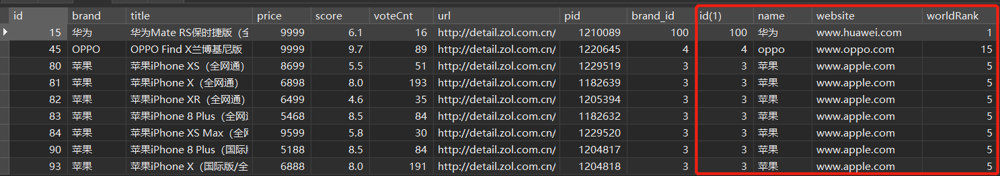
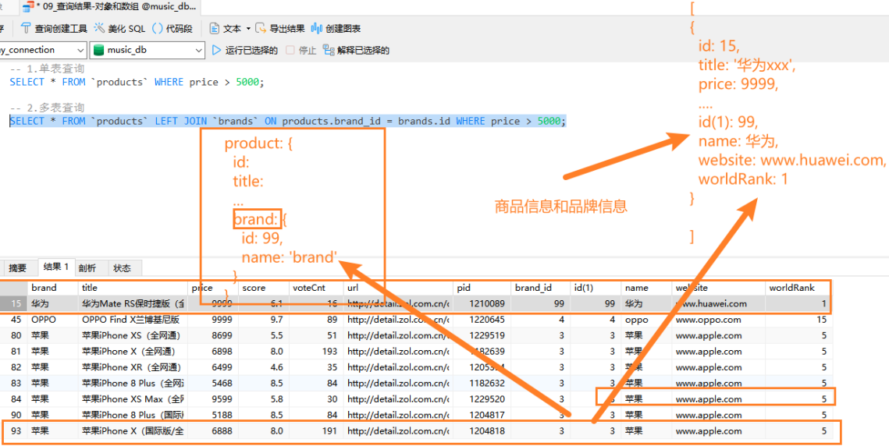
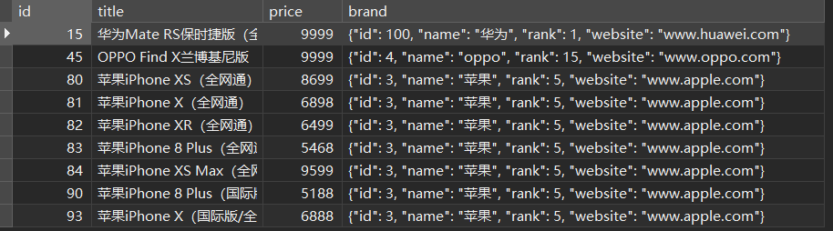
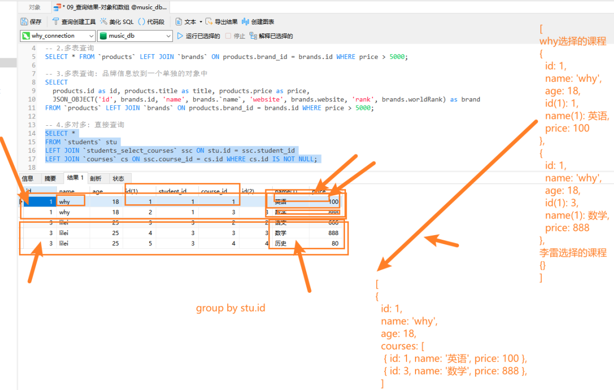
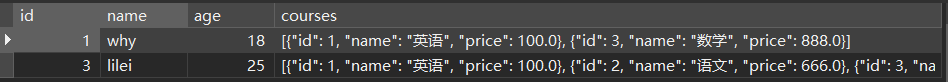

# 一. MySQL 查询对象

---

## 1. 查询数据的问题

- 前面我们学习的查询语句，查询到的结果通常是一张表，比如查询手机+品牌信息：

  ```mysql
  SELECT * FROM products LEFT JOIN brand ON products.brand_id = brand.id WHERE price > 5000;
  ```

  

## 2. 将 查询数据 转成对象

- 但是在真实开发中，实际上红色圈起来的部分应该放入到一个对象中，那么我们可以使用下面的查询方式：

  

  - 这个时候我们要用一个聚合函数 `JSON_OBJECT`

    ```mysql
    # 多表查询：品牌信息放到一个单独的对象中
    SELECT
    	products.id, products.title, products.price,
    	JSON_OBJECT(
    		'id', brand.id, 'name', brand.`name`, 'website', brand.website, 'rank', brand.worldRank
    	) AS brand
    FROM products LEFT JOIN brand ON products.brand_id = brand.id WHERE price > 5000;
    ```

    


# 二. MySQL 查询数组

---

## 1. 多对多转成数组

- 在多对多关系中，我们希望查询到的是一个数组：
  - 比如一个学生的多门课程信息，应该是放到一个数组中的
  
  - 数组中存放的是课程信息的一个个对象
  
    
  
  - 这个时候我们要 `JSON_ARRAYAGG` 和 `JSON_OBJECT` 结合来使用
  
    ```mysql
    SELECT 
    	stu.id, stu.`name`, stu.age, 
    	JSON_ARRAYAGG(JSON_OBJECT('id', cs.id, 'name', cs.`name`, 'price', cs.price)) AS courses
    FROM students stu
    LEFT JOIN students_select_courses ssc ON stu.id = ssc.student_id
    LEFT JOIN courses cs ON ssc.course_id = cs.id
    WHERE cs.id IS NOT NULL
    GROUP BY stu.id;
    ```
  
    


# 三. mysql2 库介绍使用

---

## 1. 认识 mysql2

- 前面我们所有的操作都是在 `GUI` 工具中，通过执行 `SQL` 语句来获取结果的，那真实开发中肯定是通过代码来完成所有的操作的
- 那么如何可以**在 `Node` 的代码中执行 `SQL` 语句来，这里我们可以借助于两个库**：
  - `mysql`：最早的 `Node` 连接 `MySQL` 的数据库驱动（停止维护）
  - `mysql2`：在 `mysql` 的基础之上，进行了很多的优化、改进
- 目前相对来说，个人更偏向于使用 `mysql2`，`mysql2` 兼容 `mysql` 的 `API`，并且提供了一些附加功能：
  - 更快 / 更好的性能
  - `Prepared Statement`(预编译语句)：
    - 提高性能：将创建的语句模块发送给 `MySQL`，然后 `MySQL` 编译（解析、优化、转换）语句模块，并且存储它但是不执行，之后在真正执行时会给 `?` 提供实际的参数才会执行；就算多次执行，也只会编译一次，所以性能是更高的
    - **防止 `SQL` 注入**：之后传入的值不会像模块引擎那样就编译，那么一些 `SQL` 注入的内容不会被执行；`or 1 = 1` 不会被执行
  - 支持 `Promise`，所以我们可以使用 `async`和 `await` 语法
  - 等等....
- 所以后续的学习中我们在 `node` 中操作数据库会选择 `mysql2` 


# 四. mysql2 预处理语句

---


# 五. mysql2 连接池使用

---


# 六. mysql2 的 Promise

---


