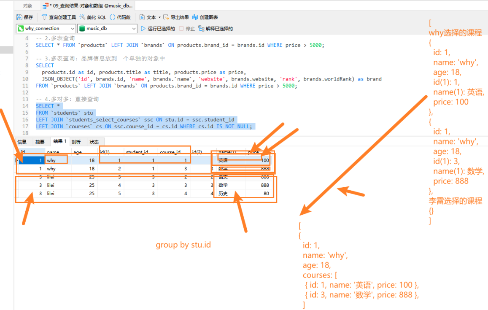
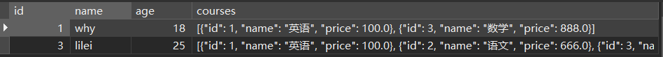

# 一. MySQL 查询对象

---

## 1. 查询数据的问题

- 前面我们学习的查询语句，查询到的结果通常是一张表，比如查询手机+品牌信息：

  ```mysql
  SELECT * FROM products LEFT JOIN brand ON products.brand_id = brand.id WHERE price > 5000;
  ```

  

## 2. 将 查询数据 转成对象

- 但是在真实开发中，实际上红色圈起来的部分应该放入到一个对象中，那么我们可以使用下面的查询方式：

  

  - 这个时候我们要用一个**聚合函数 `JSON_OBJECT`**

    ```mysql
    # 多表查询：品牌信息放到一个单独的对象中
    SELECT
    	products.id, products.title, products.price,
    	JSON_OBJECT(
    		'id', brand.id, 'name', brand.`name`, 'website', brand.website, 'rank', brand.worldRank
    	) AS brand
    FROM products LEFT JOIN brand ON products.brand_id = brand.id WHERE price > 5000;
    ```

    


# 二. MySQL 查询数组

---

## 1. 多对多转成数组

- 在多对多关系中，我们希望查询到的是一个数组：
  - 比如一个学生的多门课程信息，应该是放到一个数组中的
  
  - 数组中存放的是课程信息的一个个对象
  
    
  
  - 这个时候我们要 `JSON_ARRAYAGG` 和 `JSON_OBJECT` 结合来使用
  
    ```mysql
    SELECT 
    	stu.id, stu.`name`, stu.age, 
    	JSON_ARRAYAGG(JSON_OBJECT('id', cs.id, 'name', cs.`name`, 'price', cs.price)) AS courses
    FROM students stu
    LEFT JOIN students_select_courses ssc ON stu.id = ssc.student_id
    LEFT JOIN courses cs ON ssc.course_id = cs.id
    WHERE cs.id IS NOT NULL
    GROUP BY stu.id;
    ```
  
    


# 三. mysql2 库介绍使用

---

## 1. 认识 mysql2

- 前面我们所有的操作都是在 `GUI` 工具中，通过执行 `SQL` 语句来获取结果的，那真实开发中肯定是通过代码来完成所有的操作的
- 那么如何可以**在 `Node` 的代码中执行 `SQL` 语句来，这里我们可以借助于两个库**：
  - `mysql`：最早的 `Node` 连接 `MySQL` 的数据库驱动（停止维护）
  - `mysql2`：在 `mysql` 的基础之上，进行了很多的优化、改进
- 目前相对来说，个人更偏向于使用 `mysql2`，`mysql2` 兼容 `mysql` 的 `API`，并且提供了一些附加功能：
  - 更快 / 更好的性能
  - `Prepared Statement`(预编译语句)：
    - 提高性能：将创建的语句模块发送给 `MySQL`，然后 `MySQL` 编译（解析、优化、转换）语句模块，并且存储它但是不执行，之后在真正执行时会给 `?` 提供实际的参数才会执行；就算多次执行，也只会编译一次，所以性能是更高的
    - **防止 `SQL` 注入**：之后传入的值不会像模块引擎那样就编译，那么一些 `SQL` 注入的内容不会被执行；`or 1 = 1` 不会被执行
  - 支持 `Promise`，所以我们可以使用 `async`和 `await` 语法
  - 等等....
- 所以后续的学习中我们在 `node` 中操作数据库会选择 `mysql2` 

## 2. 使用 mysql2

- 安装 `mysql2`

  ```shell
  npm i mysql2
  ```

- `mysql2` 的使用过程如下：

  - 第一步：创建连接（通过 `createConnection()`），并且获取连接对象
  - 第二步：执行 `SQL` 语句即可（`query` 用于执行普通语句，不能执行预处理语句）

  ```js
  const mysql = require('mysql2')
  
  // 创建一个连接
  const connection = mysql.createConnection({
    host: 'localhost',
    port: 3306,
    user: 'root',
    password: 'laterZc0123mysql',
    database: 'coderhub'
  })
  
  const statement = 'SELECT * FROM students;'
  // structure query language: DDL/DML/DQL/DCL
  connection.query(statement, (err, results, fields) => {
    if (err) 
      return console.log('查询失败: ', err)
    
    console.log('results: ', results)
    console.log('fields: ', fields)
  })
  ```


# 四. mysql2 预处理语句

---

- `Prepared Statement`(预编译语句)：

  - 提高性能：将创建的语句模块发送给 `MySQL`，然后 `MySQL` 编译（解析、优化、转换）语句模块，并且存储它但是不执行，之后我们在真正执行时会给 `?` 提供实际的参数才会执行；就算多次执行，也只会编译一次，所以性能是更高的

    

  - 防止 `SQL` 注入：之后传入的值不会像模块引擎那样就编译，那么一些 `SQL` 注入的内容不会被执行；`or 1 = 1` 这样的永远成立的条件语句就不会被当初条件语句执行，而是当成传入的参数的值

    

    ```mysql
    const mysql = require('mysql2')
    
    // 创建一个连接
    const connection = mysql.createConnection({
      host: 'localhost',
      port: 3306,
      user: 'root',
      password: 'laterZc0123mysql',
      database: 'coderhub'
    })
    
    // 执行一个SQL语句: 预处理语句
    const statement = 'SELECT * FROM products WHERE price > ? AND score > ?;'
    connection.execute(statement, [1000, 8], (err, results) => {
      console.log('results: ', results)
      console.log('err: ', err)
    })
    ```


# 五. mysql2 连接池使用

---

- 前面我们是创建了一个连接（`connection`），但是如果我们有多个请求的话，该连接很有可能正在被占用，那么我们是否需要每次一个请求都去创建一个新的连接呢？

  - 事实上，`mysql2` 给我们提供了**连接池（`connection pools`）**

  - 连接池可以在**需要的时候自动创建连接**，并且**创建的连接不会被销毁**，会放到连接池中，后续可以继续使用

  - 我们可以在创建连接池的时候设置 `LIMIT`，也就是最大创建个数

    ```mysql
    const mysql = require('mysql2')
    
    // 创建一个连接池
    const connectionPool = mysql.createPool({
      host: 'localhost',
      port: 3306,
      user: 'root',
      password: 'laterZc0123mysql',
      database: 'coderhub',
      connectionLimit: 5
    })
    
    // 执行一个SQL语句: 预处理语句
    const statement = 'SELECT * FROM products WHERE price > ? AND score > ?;'
    connectionPool.execute(statement, [1000, 8], (err, results) => {
      console.log('results: ', results)
      console.log('err: ', err)
    })
    ```


# 六. mysql2 的 Promise

---

- 目前在 `js` 开发中我们更习惯 `Promise` 和 `await`、`async` 的方式，`mysql2` 同样是支持的：

  ```mysql
  const mysql = require('mysql2')
  
  const connectionPool = mysql.createPool({
    host: 'localhost',
    port: 3306,
    user: 'root',
    password: 'laterZc0123mysql',
    database: 'coderhub',
    connectionLimit: 5
  })
  
  const statement = 'SELECT * FROM products WHERE price > ? AND score > ?;'
  connectionPool.promise().execute(statement, [1000, 8]).then(res => {
    const [results, fields] = res
    console.log('results: ', results)
    console.log('fields: ', fields)
  }).catch(err => {
    console.log('err: ', err)
  })
  ```


