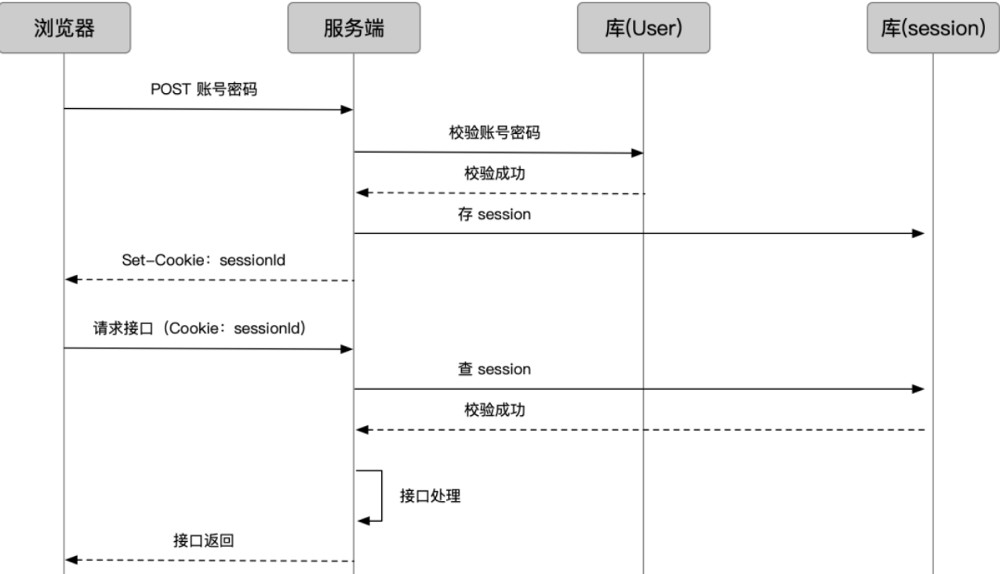
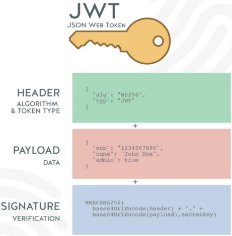
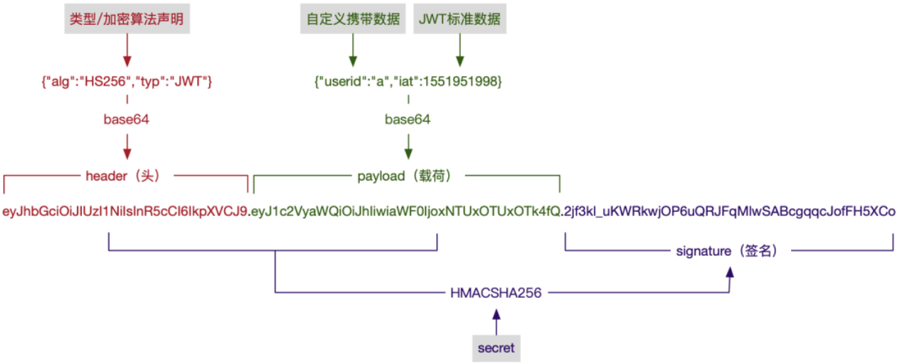
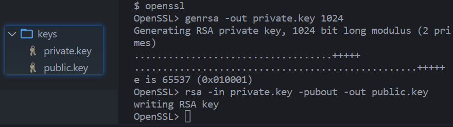

# 一. 项目介绍和搭建

---

## 1. coderhub 功能接口说明

- `Coderhub` 旨在创建一个程序员分享生活动态的平台

  

- 完整的项目接口包括：

  - 面向用户的业务接口
  - 面向企业或者内部的后台管理接口

- 课堂上完成的功能如下：

  1. 用户管理系统
  2. 内容管理系统
  3. 内容评论管理
  4. 内容标签管理
  5. 文件管理系统
  6. 其他功能其实都是非常相似的

## 2. 项目的搭建

- 功能一：目录结构的划分：
  - 按照功能模块划分
  - 按照业务模块划分
  
- 功能二：应用配置信息写到环境变量
  - 编写 `.env` 文件
  
  - 通过 `dotenv` 库加载 `env` 文件配置的变量
  
    ```shell
    npm i dotenv
    ```
  
    ```js
    const dotenv = require('dotenv')
    
    // 可以配置path，但是默认会加载当前项目下面的根目录的.env文件
    dotenv.config()
    ```
  
- 功能三：创建和启动服务器

  - 基于 `koa` 创建 `app`
  - 启动服务器


# 二. 注册接口的逻辑

---

## 1. 用户注册接口

- 用户注册接口编写流程：
  - 注册用户路由 `router` 编写
  - 处理函数的控制器 `controller` 编写
  - 操作数据库的 `service` 编写
  
- 数据库连接操作：`mysql2`

  ```bash
  npm i mysql2
  ```

  - 创建数据库连接
  - 测试数据库连接是否成功

- 注册用户校验
  - 用户名或密码不能为空
  - 用户名没有被注册过

- 通过使用 `node` 内置模块 `crypto` 对用户密码进行 `md5` 加密存储

  ```js
  const crypto = require('node:crypto')
  
  function md5Password(key) {
    const md5 = crypto.createHash('md5')
    return md5.update(key).digest('hex')
  }
  
  module.exports = {
    md5Password,
  }
  ```

## 2. 错误统一处理

- 封装错误处理函数，`App` 监听错误事件：

  ```js
  const app = require('../app')
  const {
    USERNAME_IS_ALREADY_EXIST,
    USERNAME_OR_PASSWORD_NOT_NULL,
  } = require('../config/error.constants')
  
  app.on('error', (error, ctx) => {
    switch (error) {
      case USERNAME_OR_PASSWORD_NOT_NULL:
        ctx.body = {
          code: -1001,
          message: error,
        }
        break
      case USERNAME_IS_ALREADY_EXIST:
        ctx.body = {
          code: -1002,
          message: error,
        }
    }
  })
  ```


# 三. 登录用户的凭证

---

## 1. 用户登录接口

- 用户登录接口编写流程：
  - 授权 `router` 的编写
  - 处理函数的 `controller` 编写
- 验证的中间件：
  - 账号和密码是否为空
  - 用户名是否存在
  - 校验密码是否一致
- 登录成功返回凭证：
  - `cookie` + `session`
  - `Token` 令牌

## 2. 为什么需要登录凭证呢？

- `web` 开发中，我们使用最多的协议是 `http`，但是 **`http` 是一个无状态的协议**
  - 无状态的协议？什么叫做无状态协议呢？
- 举个例子：
- 我们登录了一个网站 www.coderhub.com
- 登录的时候我们需要输入用户名和密码：比如用户名 `coder1`，密码：666
- 登录成功之后，我们要以 `coder1` 的身份去访问其他的数据和资源，还是通过 `http` 请求去访问
  - `coderhub` 服务器会问：你谁呀？
  - `coder1` 说：我是 `coder1` 呀，刚刚登录过呀
  - `coderhub` 服务器：怎么证明你刚刚登录过呀？
  - `coder1` 说：这...，`http` 没有告诉你吗？
  - `coderhub` 服务器：**`http` 的每次请求对服务器来说都是一个单独的请求，和之前请求过什么没有关系**
- 看到了吧？这就是 `http` 的无状态，也就是服务器不知道你上一步做了什么，我们必须得有一个办法可以证明我们登录过

## 3. 认识 cookie

- `Cookie` (小饼干/曲奇饼)。类型为 '小型文本文件'，某些网站为了辨别用户身份而**存储在用户本地终端（`Client Side`）上的数据**
  - 浏览器会在特定的情况下携带上 `cookie` 来发送请求，我们可以通过 `cookie` 来获取一些信息
- `Cookie` 总是保存在客户端中，根据其客户端中的存储位置，`Cookie` 可以分为内存 `Cookie` 和硬盘 `Cookie`
  - **内存 `Cookie` （会话 `cookie`）**由浏览器维护，保存在内存中，浏览器所有 `tab` 页关闭时 `Cookie` 就会消失，其存在时间是短暂的
  - **硬盘 `Cookie` （持久化  `cookie`）**保存在硬盘中，有一个过期时间，用户手动清理或者过期时间到时，才会被清理
- 如何判断一个 `cookie` 是内存 `cookie` 还是硬盘 `cookie` 呢？
  - 没有设置过期时间，默认情况下 `cookie` 是内存 `cookie`，在关闭浏览器时会自动删除
  - 有设置过期时间，并且过期时间不为 `0` 或者负数的 `cookie`，是硬盘 `cookie`，需要手动或者到期时，才会删除

> 注意：
>
> - **会话 `cookie` 只有当浏览器所有标签页都关闭时，才会被清理**，只关闭浏览器标签页，而不关闭整个浏览器，是无法被清理的
> - 什么是关闭整个浏览器？**只有浏览器的所有标签页都关闭了，该浏览器的生命周期也就结束了，这时会话 `cookie` 才会被清理**
> - **一个网页所创建的 `cookie` 只能被与这个网页在同一目录或子目录下的网页访问，而不能被其他目录下的网页访问**
> - https://www.cnblogs.com/zhuzhenwei918/p/6603151.html
> - https://developer.mozilla.org/zh-CN/docs/Web/HTTP/Cookies#%E5%AE%9A%E4%B9%89_cookie_%E7%9A%84%E7%94%9F%E5%91%BD%E5%91%A8%E6%9C%9F

## 4. cookie 常见的属性

- `cookie` 的生命周期：
  - 默认情况下的 `cookie` 是内存 `cookie`，也称之为会话 `cookie`，也就是在浏览器所有 `tab` 页关闭时会自动被删除
  - 我们可以通过设置 `expires` 或者 `max-age` 来设置过期的时间
    - `expires`：设置的是 `Date.toUTCString()`，设置格式是 `expires=date-in-GMTString-format`
    - `max-age`：设置到期的时间（单位：`s`），`max-age=max-age-in-seconds` (例如一年为60 * 60 * 24 * 365)
- `cookie` 的作用域（允许 `cookie` 发送给哪些 `URL`）：
  - **`Domain`：指定哪些主机可以接受 `cookie`**
    - 如果不指定，那么默认是 `origin`（当前创建 `cookie` 的 `host`），不包含子域名
    - 如果指定 `Domain`，则包含子域名。例如，如果设置 `Domain=mozilla.org`，则 `Cookie` 也包含在子域名中（如`developer.mozilla.org`）
  - **`Path`：指定主机下哪些路径可以接受 `cookie`**（**只有与创建 `cookie` 的页面在同一个目录或子目录下的网页才可以访问**）
    - 例如，设置 `Path=/docs`，则以下地址都会匹配：
      - `/docs`
      - `/docs/Web/`
      - `/docs/Web/HTTP`
- 限制访问 `cookie`：
  - **`HttpOnly`：指定该 `cookie` 不支持客户端访问**
    - `Document.cookie` `API` 无法访问带有 `HttpOnly` 属性的 `cookie`
    - 此类 `Cookie` 仅作用于服务器。例如，持久化服务器端会话的 `Cookie` 不需要对 `js` 可用，而应具有 `HttpOnly` 属性
    - 此预防措施有助于缓解[跨站点脚本（XSS） (en-US)](https://developer.mozilla.org/en-US/docs/Web/Security/Types_of_attacks)攻击
  - `Secure`：指定该 `Cookie` 只应通过被 `HTTPS` 协议加密过的请求发送给服务端

## 5. 客户端设置 cookie

- `js` 直接设置和获取 `cookie`：

  ```js
  document.cookie
  ```

- 这个 `cookie` 会在浏览器所有tab页都关闭时，才被删除掉

  ```js
  // 设置过期时间的就是本地cookie，不设置的就是内存cookie
  document.cookie = 'name=aaa';
  ```

- 设置 `cookie`，同时设置过期时间（默认单位是秒）

  ```js
  doucment.cookie = 'name=aaa;max-age=10' // 10s之后过期
  ```

## 6. 服务器设置 cookie

- `Koa` 中默认支持直接操作 `cookie`

  - `/login` 请求中设置 `cookie`

  - `/list` 请求中获取 `cookie`

    ```js
    userRouter.get('/login', (ctx, next) => {
      ctx.cookies.set('slogon', 'ikun', {
        maxAge: 60 * 1000 * 5,
      })
      ctx.body = {
        message: '登录成功',
        code: 200,
      }
    })
    userRouter.get('/list', (ctx, next) => {
      // 验证用户的登录凭证: 携带ikun
      const value = ctx.cookies.get('slogon')
      ctx.body = {
        message: value == 'ikun' ? 'user list data' : '权限验证失败, 请重新登录',
        code: 200,
      }
    })
    ```

## 7. Session 是基于 cookie 实现机制

- 典型的 `session` 登陆/验证流程：

  

  - 浏览器登录发送账号密码，服务端查用户库，校验用户
  - 服务端把用户登录状态存为 `Session`，生成一个 `sessionId`
  - 通过登录接口返回，把 `sessionId` `set` 到 `cookie` 上
  - 此后浏览器再请求业务接口，`sessionId` 随 `cookie` 带上
  - 服务端查 `sessionId` 校验 `session`
  - 成功后正常做业务处理，返回结果

- `Session` 的存储方式：

  - 显然，服务端只是给 `cookie` 一个 `sessionId`，而 `session` 的具体内容（可能包含用户信息、session 状态等），要自己存一下。存储的方式有几种：
    - `Redis`（推荐）：内存型数据库，以 `key-value` 的形式存，正合 `sessionId-sessionData` 的场景；且访问快
    - 内存：直接放到变量里。一旦服务重启就没了
    - 数据库：普通数据库。性能不高

- `Session` 的过期和销毁：

  - 很简单，只要把存储的 `session` 数据销毁就可以

- 在 `koa` 中，我们可以借助于 `koa-session` 来实现 `session` 认证：

  ```js
  // session基于cookie的基础上，进行加密算法，签名认证
  // 从而有效 防止伪造，篡改cookie
  
  const Koa = require('koa')
  const KoaRouter = require('@koa/router')
  const koaSession = require('koa-session')
  
  const app = new Koa()
  const userRouter = new KoaRouter({
    prefix: '/users',
  })
  const session = koaSession(
    {
      key: 'sessionid', // cookie的key
      signed: true, // 是否使用signed签名认证，防止数据被篡改
      maxAge: 5 * 1000, // 过期时间
      httpOnly: true, // 不允许通过js获取cookie
      rolling: true, // 每次响应时，刷新session的有效期
    },
    app
  )
  // 加盐操作
  app.keys = ['some secret']
  app.use(session)
  
  userRouter.get('/login', (ctx, next) => {
    // 在服务器中为登录的客户端，设置一个cookie
    ctx.session.slogan = 'ikun'
    ctx.body = {
      message: '登录成功',
      code: 200,
    }
  })
  userRouter.get('/list', (ctx, next) => {
    // 验证用户的登录凭证: 携带口号ikun
    const value = ctx.session.slogan
    ctx.body = {
      message: value == 'ikun' ? 'user list data' : '权限验证失败, 请重新登录',
      code: 200,
    }
  })
  app.use(userRouter.routes())
  app.use(userRouter.allowedMethods())
  
  app.listen(5500, () => {
    console.log('server running ~')
  })
  ```

- https://github.com/koajs/session

## 8. session的缺点，认识令牌(凭证) token

- `cookie` 和 `session` 的方式有很多的缺点：
  - **`cookie` 会被附加在每个 `HTTP` 请求中**，所以**无形中增加了流量**（事实上某些请求是不需要的）
  - `Cookie` 是**明文传递的**，所以存在安全性的问题
  - `Cookie` 的**大小限制是 `4KB`**，对于复杂的需求来说是不够的
  - 对于**浏览器外的其他客户端**（比如 `iOS`、`Android`），**必须手动的设置 `cookie` 和 `session`**
  - 对于**分布式系统和服务器集群**中**如何可以保证其他系统也可以正确的解析 `session`** ？
    - 通常服务端是集群，而用户请求过来会走一次负载均衡，不一定打到哪台机器上。那一旦用户后续接口请求到的机器和他登录请求的机器不一致，或者登录请求的机器宕机了，`session` 不就失效了吗？
    - 这个问题现在有几种解决方式：
      - 一是从存储角度，**把 `session` 集中存储**。如果我们用独立的 `Redis` 或普通数据库，就可以把 `session` 都存到一个库里
      - 二是从分布角度，**让相同 `IP` 的请求在负载均衡时都打到同一台机器上**。以 `nginx` 为例，可以配置 `ip_hash` 来实现
    - 但通常还是采用第一种方式，因为第二种相当于阉割了负载均衡，且仍没有解决用户请求的机器宕机的问题
- 所以，在目前的前后端分离的开发过程中，使用 `token` 来进行身份验证的是最多的情况：
  - `token` 可以翻译为令牌
  - 也就是在验证了用户账号和密码正确的情况，给用户颁发一个令牌
  - 这个令牌作为后续用户访问一些接口或者资源的凭证
  - 我们可以根据这个凭证来判断用户是否有权限来访问
- 所以  `token` 的使用应该分成两个重要的步骤：
  - 生成 `token`：登录的时候，颁发 `token`
  - 验证 `token`：访问某些资源或者接口时，验证 `token`

## 9. JWT 实现 Token 机制

- `JWT`（`JSON Web Token`） 生成的 `Token` 由三部分组成：

  



- `header`

  - `alg`：采用的加密算法，默认是 `HMAC SHA256（HS256）`，采用同一个密钥进行加密和解密（对称加密）
  - `typ`：`JWT`，固定值，通常都写成 `JWT` 即可
  - 会通过 `base64Url` 算法进行编码

- `payload`

  - 携带的数据，比如我们可以将用户的 `id` 和 `name` 放到 `payload` 中
  - 默认也会携带 `iat`（`issued at`），令牌的签发时间
  - 我们也可以设置过期时间：`exp`（`expiration time`）
  - 会通过 `base64Url` 算法进行编码

- `signature`

  - 设置一个 `secretKey`，通过将前两个的结果合并后进行 `HMACSHA256` 的算法

    ```json
    HMACSHA256(
      base64UrlEncode(header) + "." +
      base64UrlEncode(payload),
      secret(key)
    )
    ```

  - 但是如果 `secretKey` 暴露是一件非常危险的事情，因为之后就可以模拟颁发 `token`，也可以解密 `token`

## 10. Token 的使用

- 当然，在真实开发中，我们可以直接使用一个库来完成： `jsonwebtoken`

  ```js
  const Koa = require('koa')
  const KoaRouter = require('@koa/router')
  const jwt = require('jsonwebtoken')
  
  const app = new Koa()
  const userRouter = new KoaRouter({
    prefix: '/users',
  })
  const secretKey = 'aaabbb'
  
  userRouter.get('/login', (ctx, next) => {
    // 颁发token
    const payload = {
      id: 111,
      name: 'later',
    }
    const token = jwt.sign(payload, secretKey, {
      expiresIn: 60,
    })
    ctx.body = {
      token,
      message: '登录成功',
      code: 200,
    }
  })
  userRouter.get('/list', (ctx, next) => {
    // 验证token
    const authorization = ctx.headers.authorization
    const token = authorization.replace('Bearer ', '')
    try {
      const decoded = jwt.verify(token, secretKey)
      console.log('decoded: ', decoded)
      if (decoded.id == 111 && decoded.name == 'later') {
        ctx.body = {
          data: [
            { id: 101, name: 'aaa' },
            { id: 102, name: 'aaa' },
            { id: 103, name: 'ccc' },
          ],
        }
      }
    } catch (err) {
      switch (err) {
        case 'JsonWebTokenError: invalid token':
          ctx.body = {
            message: 'token无效',
          }
          break
        default:
          ctx.body = {
            message: 'token异常',
          }
      }
    }
  })
  app.use(userRouter.routes())
  app.use(userRouter.allowedMethods())
  
  app.listen(8000, () => {
    console.log('server running ~')
  })
  ```

## 11. 非对称加密

- 前面我们说过，`HS256` 加密算法一单密钥暴露就是非常危险的事情：

  - 比如在分布式系统中，每一个子系统都需要获取到密钥
  - 那么拿到这个密钥后这个子系统既可以发布令牌，也可以验证令牌
  - 但是对于一些资源服务器来说，它们只需要有验证令牌的能力就可以了

- 这个时候我们可以使用非对称加密，`RS256`：

  - 私钥（`private key`）：用于发布令牌
  - 公钥（`public key`）：用于验证令牌

- 我们可以使用 `openssl` 来生成一对私钥和公钥：

  - `Mac` 直接使用 `terminal` 终端即可

  - `Windows` 默认的 `cmd` 终端是不能直接使用的(需要单独安装)，建议直接使用 `git bash` 终端

    ```bash
    openssl
    > genrsa -out private.key 1024
    > rsa -in private.key -pubout -out public.key
    ```

    

> 补充：
>
> - 在测试的过程中遇到报错如下：
>
>   - `secretOrPrivateKey has a minimum key size of 2048 bits for RS256`
>   - 对于 `RS256`, `secretOrPrivateKey` 的最小密钥长度为2048位
>
> - 解决：
>
>   - 使用2048重新生成密钥公钥，测试无问题
>
>     ```bash
>     - genrsa -out private.key 1024
>                         
>     # 1024 替换成 2048
>     + genrsa -out private.key 2048
>     ```

## 12. 使用公钥和私钥签发和验证签名

```js
const fs = require('fs')
const Koa = require('koa')
const KoaRouter = require('@koa/router')
const jwt = require('jsonwebtoken')

const app = new Koa()
const userRouter = new KoaRouter({
  prefix: '/users',
})
const privateKey = fs.readFileSync('./keys/private.key')
const publicKey = fs.readFileSync('./keys/public.key')

userRouter.get('/login', (ctx, next) => {
  // 颁发token
  const payload = {
    id: 111,
    name: 'later',
  }
  const token = jwt.sign(payload, privateKey, {
    expiresIn: 60,
    algorithm: 'RS256', // 默认HS256，使用HS256时，privateKey必须是对称加密
  })
  ctx.body = {
    token,
    message: '登录成功',
    code: 200,
  }
})
userRouter.get('/list', (ctx, next) => {
  // 验证token
  const authorization = ctx.headers.authorization
  const token = authorization.replace('Bearer ', '')
  try {
    const decoded = jwt.verify(token, publicKey, {
      algorithms: ['RS256'],
    })
    if (decoded.id == 111 && decoded.name == 'later') {
      ctx.body = {
        data: [
          { id: 101, name: 'aaa' },
          { id: 102, name: 'aaa' },
          { id: 103, name: 'ccc' },
        ],
      }
    }
  } catch (err) {
    switch (err) {
      case 'JsonWebTokenError: invalid token':
        ctx.body = {
          message: 'token无效',
        }
        break
      default:
        ctx.body = {
          message: 'token异常',
        }
    }
  }
})
app.use(userRouter.routes())
app.use(userRouter.allowedMethods())

app.listen(8000, () => {
  console.log('server running ~')
})
```


# 四. 发表动态和评论

---

## 1. 发布和修改动态内容

- 创建新的表 `moment`
- 定义发布动态内容的接口
  - 定义路由接口
  - 验证用户登录
  - `Controller` 和 `Service` 中处理内容
- 定义修改动态内容的接口
  - 定义路由接口
  - 验证用户登录
  - 验证用户的权限
  - `Controller` 和 `Service` 中的处理

## 2. 删除和查询动态内容

- 定义删除内容的接口
  - 定义路由接口
  - 验证用户登录
  - 验证用户权限
  - `Controller` 和 `Service` 的处理
- 定义查询单个内容的接口
  - 根据 `momentId` 查询接口内容
- 定义查询多条内容的接口
  - 查询所有 `moment` 接口内容（根据 `offset` 和 `limit` 决定查询数量）

## 3. 发表和修改评论内容

- 创建新的表 `comment`
- 定义发布评论内容的接口
  - 定义路由接口
  - 验证用户登录
  - `Controller` 和 `Service` 中处理内容
- 定义修改评论内容的接口
  - 定义路由接口
  - 验证用户登录
  - 验证用户的权限
  - `Controller` 和 `Service` 中处理内容

## 4. 删除和查询评论内容

- 定义删除评论内容的接口
  - 定义路由接口
  - 验证用户登录
  - 验证用户权限
  - `Controller` 和`Service` 的处理
- 查询动态的时候，同时显示评论信息
  - 查询多个动态时，显示评论的个数
  - 查询单个动态时，显示评论的列表


# 五. 动态的标签接口

---

## 1. 标签接口开发

- 创建标签的表
- 定义创建标签接口
  - 路由配置 `Router`
  - 验证用户登录
  - 创建标签
- 创建标签和动态关系表
- 定义给动态添加标签的接口
  - 给动态添加新的接口
- 查询标签接口
  - 查询动态列表，展示标签数量
  - 查询动态详情，展示标签列表


# 六. 图片上传和存储

---

## 1. 上传头像图片

- 上传头像逻辑
  - 定义上传图像的接口
  - 定义获取图像的接口
  - 请求用户信息时，获取头像
- 上课分析实现思路：
  - 1.图片（文件）上传 /upload/avatar
    - 目的：服务器端可以保存一张图片
  - 2.提供一个接口，可以让用户获取图片
    - /1/avatar -> 找到图片\读取图片\content-type: image/jpeg\返回图像的信息
  - 3.将URL存储到用户信息中
    - avatarURL: 头像的地址
  - 4.获取信息时，获取用户的头像

## 2. 上传动态的配图

- 上传动态配图
  - 定义上传动态配图的接口
  - 定义获取动态配图的接口
  - 获取动态时，获取配图信息


# 七. 跨域

---

## 1. 什么是跨域？

- 要想理解跨域，要先理解浏览器的同源策略：
  - 同源策略是一个重要的安全策略，它用于限制一个origin的文档或者它加载的脚本如何能与另一个源的资源进行交互。它能帮助阻隔恶意文档，减少可能被攻击的媒介
  - 如果两个 URL 的 protocol、port (en-US) (如果有指定的话) 和 host 都相同的话，则这两个 URL 是*同源*
  - 这个方案也被称为“协议/主机/端口元组”，或者直接是“元组”
- 事实上跨域的产生和前端分离的发展有很大的关系：
  - 早期的服务器端渲染的时候，是没有跨域的问题的
  - 但是随着前后端的分离，目前前端开发的代码和服务器开发的API接口往往是分离的，甚至部署在不同的服务器上的
- 这个时候我们就会发现，访问 静态资源服务器 和 API接口服务器 很有可能不是同一个服务器或者不是同一个端口
  - 浏览器发现静态资源和API接口（XHR、Fetch）请求不是来自同一个地方时（同源策略），就产生了跨域
- 所以，在静态资源服务器和API服务器（其他资源类同）是同一台服务器时，是没有跨域问题的
- 前端我们学习了很多服务器开发的知识，接下来，我们就可以演示一下跨域产生和不产生的项目部署区别了


