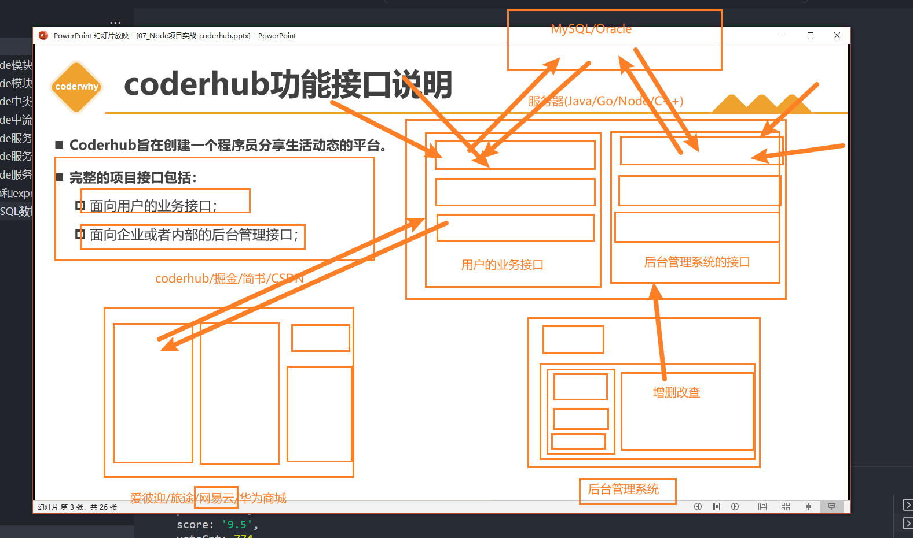

# 一. 项目介绍和搭建

---

## 1. coderhub 功能接口说明

- `Coderhub` 旨在创建一个程序员分享生活动态的平台

  

- 完整的项目接口包括：

  - 面向用户的业务接口
  - 面向企业或者内部的后台管理接口

- 课堂上完成的功能如下：

  1. 用户管理系统
  2. 内容管理系统
  3. 内容评论管理
  4. 内容标签管理
  5. 文件管理系统
  6. 其他功能其实都是非常相似的

## 2. 项目的搭建

- 功能一：目录结构的划分：
  - 按照功能模块划分
  - 按照业务模块划分
  
- 功能二：应用配置信息写到环境变量
  - 编写 `.env` 文件
  
  - 通过 `dotenv` 库加载 `env` 文件配置的变量
  
    ```shell
    npm i dotenv
    ```
  
    ```js
    const dotenv = require('dotenv')
    
    // 可以配置path，但是默认会加载当前项目下面的根目录的.env文件
    dotenv.config()
    ```
  
- 功能三：创建和启动服务器

  - 基于 `koa` 创建 `app`
  - 启动服务器


# 二. 注册接口的逻辑

---

## 1. 用户注册接口

- 用户注册接口编写流程：
  - 注册用户路由 `router` 编写
  - 处理函数的控制器 `controller` 编写
  - 操作数据库的 `service` 编写
- 数据库连接操作：mysql2
  - 创建数据库连接
  - 测试数据库连接是否成功
- 注册用户校验
  - 用户名或密码不能为空
  - 用户名没有被注册过
- 密码加密存储

## 2. 错误统一处理

- 封装错误处理函数：
- `App` 监听错误事件：


# 三. 登录用户的凭证

---

## 1. 用户登录接口

- 用户登录接口编写流程：
  - 授权router的编写
  - 处理函数的controller编写
- 验证的中间件：
  - 账号和密码是否为空
  - 用户名是否存在
  - 校验密码是否一致
- 登录成功返回凭证：
  - cookie+session
  - Token令牌

## 2. 为什么需要登录凭证呢？

- `web` 开发中，我们使用最多的协议是 `http`，但是 `http` 是一个无状态的协议
  - 无状态的协议？什么叫做无状态协议呢？
- 举个例子：
- 我们登录了一个网站 www.coderhub.com;
- 登录的时候我们需要输入用户名和密码：比如用户名coderwhy，密码：Coderwhy666.;
- 登录成功之后，我们要以coderwhy的身份去访问其他的数据和资源，还是通过http请求去访问
  - coderhub的服务器会问：你谁呀？
  - coderwhy说：我是coderwhy呀，刚刚登录过呀；
  - coderhub：怎么证明你刚刚登录过呀？
  - coderwhy说：这。。。，http没有告诉你吗？
  - coderhub：http的每次请求对我来说都是一个单独的请求，和之前请求过什么没有关系
- 看到了吧？这就是http的无状态，也就是服务器不知道你上一步做了什么，我们必须得有一个办法可以证明我们登录过


# 四. 发表动态和评论

---


# 五. 动态的标签接口

---


# 六. 图片上传和存储

---


