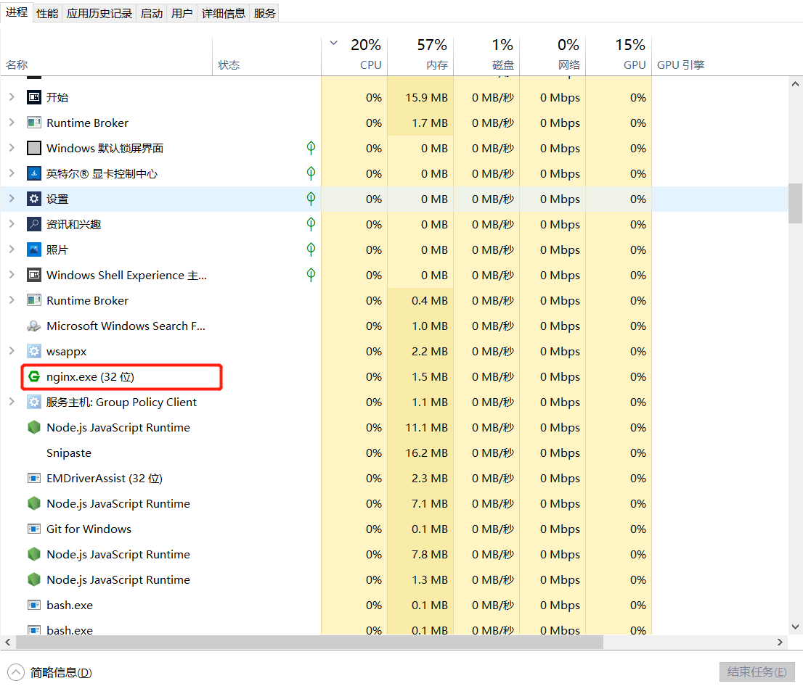

## 1. 什么是跨域？

- 要想理解跨域，要先理解浏览器的同源策略：
  - 同源策略是一个重要的安全策略，它用于限制一个 `origin` 的文档或者它加载的脚本如何能与另一个源的资源进行交互。它能帮助阻隔恶意文档，减少可能被攻击的媒介
  - 如果两个 `URL` 的 `protocol`、`port`  (如果有指定的话) 和 `host` 都相同的话，则这两个 `URL` 是*同源*
  - 这个方案也被称为“协议/主机/端口元组”，或者直接是“元组”
- 事实上跨域的产生和前端分离的发展有很大的关系：
  - 早期的服务器端渲染的时候，是没有跨域的问题的
  - 但是随着前后端的分离，目前前端开发的代码和服务器开发的 `API` 接口往往是分离的，甚至部署在不同的服务器上的
- 这个时候我们就会发现，访问 静态资源服务器 和 `API` 接口服务器 很有可能不是同一个服务器或者不是同一个端口
  - 浏览器发现静态资源和 `API` 接口（`XHR`、`Fetch`）请求不是来自同一个地方时（同源策略），就产生了跨域
- 所以，在静态资源服务器和 `API` 服务器（其他资源类同）是同一台服务器时，是没有跨域问题的
- 前端我们学习了很多服务器开发的知识，接下来，我们就可以演示一下跨域产生和不产生的项目部署区别了

## 2. 跨域的解决方案总结

- 那么跨域问题如何解决呢？
  - 所以跨域的解决方案几乎都和服务器有关系，单独的前端基本解决不了跨域（虽然网上也能看到各种方案，但是实际开发基本不会使用）
  - 你说：不对丫，我明明和配置前端的 `webpack` 就可以解决跨域问题了
  - **`webpack` 配置解决跨域的本质也是在 `webpack-server` 的服务器中配置了代理**
- **跨域常见的解决方案**：
  - 方案一：静态资源和 `API` 服务器部署在同一个服务器中
  - 方案二：服务器开启 `CORS`， 即跨域资源共享
  - 方案三：`node` 代理服务器（`webpack-dev-server` 中就是它）
  - 方案四：`Nginx` 反向代理（本质上是 `nginx` 服务器开启 `CORS`）
- 不常见的方案：
  - `jsonp`：现在很少使用了（曾经流行过一段时间）
  - `postMessage`：有兴趣了解一下吧
  - `websocket`：为了解决跨域，所有的接口都变成 `socket` 通信？
  - …..

## 3. 静态资源 和 后端接口 部署在同一个服务器中

- 前端开发阶段不适用，静态资源一般都还没部署到服务器上


## 4. 跨源资源共享（CORS）

- `CORS`（`Cross-Origin Resource Sharing`，跨源资源共享）：

  - 它是一种基于 `http` `header`(标头) 的机制
  - 该机制通过**允许服务器通过设置一些 `http` 标头来让除了服务器自己以外的其它源（域、协议和端口），也能被浏览器允许这些源访问加载服务器上的资源**
  - 是一个系统，它**由一系列传输的 [HTTP 标头](https://developer.mozilla.org/zh-CN/docs/Glossary/HTTP_header) 组成，这些 `HTTP` 标头决定浏览器是否阻止前端 `js` 代码获取跨源请求的响应**
  - 同源安全策略 默认阻止“跨源”获取资源。但是 `CORS` 给了 `web` 服务器这样的权限，即**服务器可以选择，允许跨源请求访问到它们的资源**

- 浏览器将 `CORS` 请求分成两类：简单请求 和 非简单请求

- 只要同时满足以下两大条件，就属于简单请求（不满足就属于非简单请求，了解即可）

- 请求方法是以下是三种方法之一：

  - `HEAD`
  - `GET`
  - `POST`

- `HTTP` 的头信息不超出以下几种字段：

  - `Accept`
  - `Accept-Language`
  - `Content-Language`
  - `Last-Event-ID`
  - `Content-Type`：只限于三个值 `application/x-www-form-urlencoded`、`multipart/form-data`、`text/plain`

- 服务器开启 `CORS` 机制，通过中间件来设置对应 `http` 响应标头

  ```js
  // Koa
  app.use(async (ctx, next) => {
    ctx.set('Access-Control-Allow-Origin', '*') // 单独只设置这一项，在chrome中测试也是欧克的，兼容起见，介意下面这些标头也都设置上
    ctx.set('Access-Control-Allow-Headers', 'Accept, AcceptEncoding, Connection, Host, Origin')
    ctx.set('Access-Control-Allow-Credentials', true)
    ctx.set('Access-Control-Allow-Methods', 'PUT, POST, GET, DELETE, PATCH, OPTIONS')
    if (ctx.method === 'OPTIONS') {
      ctx.status = 204
    } else {
      await next()
    }
  })
  ```
  
  ```js
  // express
  app.use((req, res, next) => {
    res.set('Access-Control-Allow-Origin', '*')
    // res.set('Access-Control-Allow-Headers', 'Accept, AcceptEncoding, Connection, Host, Origin')
    // res.set('Access-Control-Allow-Methods', 'PUT, POST, GET, DELETE, PATCH, OPTIONS')
    next()
  })
  ```


## 5. Node 代理服务器

- `Node` 代理服务器是平时开发阶段中，前端配置最多的一种方案
- 方式一：静态资源和代理服务器部署在同一个源下
- 方式二：代理服务器开启 `CORS`


- 接口服务器


- `webpack-dev-server` 的本质也是通过开启本地代理服务器去转发到接口服务器上，也是基于 `http-proxy-middleware` 库实现
- https://webpack.docschina.org/configuration/dev-server/#devserverproxy

## 6. Nginx 反向代理

- 公司一般采用方案是开发阶段配置 `proxy`，发布阶段配置 `nginx`

- 而不是说直接服务器开启 `CORS` 机制一劳永逸，因为相对来说不太安全

- `nginx` 可以开启一些安全认证

- 下载 `Nginx` 地址：https://nginx.org/en/download.html

  

- 点击 `nginx.exe` 文件即可启动

  

- 检测 `nginx` 是否开启

  - 方式一：任务管理器中查看 `nginx` 进程是否开启

    

  - 方式二：访问 `localhost:80`，是否显示 `nginx` 欢迎页

    

- **配置 `nginx` 反向代理（本质上是 `nginx` 服务器开启 `cors`）**

  ```nginx
  # conf/nginx.conf
  
  # 修改location
  location / {
      # root   html;
      # index  50x.html 50x.htm;
      # 简单请求
      add_header Access-Control-Allow-Origin *;
      # 非简单请求需要开启下面标头字段
      add_header Access-Control-Allow-Headers "Accept, 		AcceptEncoding, Connection, Host, Origin";
      add_header Access-Control-Allow-Credentials true;
      add_header Access-Control-Allow-Methods "PUT, POST, GET, DELETE, PATCH";
      if ($request_method = "OPTIONS") {
        return 204;
      }
  
      proxy_pass http://localhost:8000;
  }
  ```

- 修改 `nginx` 配置之后，需要重启 `nginx` （下面示例基于 `windows` 环境）

  - 方式一：任务管理器中结束对应的 `nginx` 进程，之后打开 `nginx`

  - 方式二：在 `nginx` 文件目录中打开 `git bash` 执行如下命令即可

    ```bash
    ./nginx.exe -s reload 
    ```

    

  - 如果是 `cmd`，不需要加 `./`：

    ```shell
    nginx.exe -s reload
    ```

    

- 补充，这里遇到一个报错：`nginx` 未开启，执行 `nginx` 重启命令报错

  

  ```bash
  nginx: [error] OpenEvent("Global\ngx_reload_14772") failed (2: The system cannot find the file specified)
  ```

- 解决：
  - 出现这个错误就是你的 `nginx` 关掉了，没有打开，需再次点击 `nginx.exe` 运行，一闪而过后，在 `cmd` 控制台下，再次输入 `nginx.exe -s reload`，结果成功
  - 如果是 `git bash` 的话，需输入 `./nginx.exe -s reload` 才行


## 7. 浏览器地址栏中为什么可以不借助Web API直接发送GET请求

解释：

在Web开发中，跨域问题通常指的是浏览器的同源策略（Same-Origin Policy）限制了来自不同源的文档或脚本如何与当前网站的资源进行交互。"源"通常由协议、域名和端口共同决定。

然而，浏览器的同源策略主要影响的是JavaScript中的Web API，特别是那些可以读取或修改页面内容的API，例如`XMLHttpRequest`和`fetch`。这些API在进行跨域请求时，如果没有适当的跨域资源共享（CORS）策略，浏览器会阻止请求或阻止响应数据被读取。

对于GET请求来说，如果使用浏览器直接访问URL（例如在地址栏输入URL或通过书签访问），浏览器并不会执行JavaScript中的API，因此不会触发同源策略的限制。用户可以直接访问和查看响应的内容，不论请求的源是什么。

但是，如果你在JavaScript中使用`XMLHttpRequest`或`fetch`发起GET请求，并且请求的目标地址与当前页面的源不同，那么就会受同源策略的限制。除非服务器端设置了适当的CORS头部，允许跨域请求，否则浏览器会阻止JavaScript代码访问响应数据。

总的来说，**浏览器直接访问URL不会触发同源策略，是因为这种操作不涉及JavaScript的Web API，而是由浏览器直接处理。而JavaScript发起的跨域请求则需要服务器端的CORS支持来绕过浏览器的同源策略**。


## 8. 那为什么POST等其他请求不能直接在地址栏中发送呢

解释：

在浏览器中，地址栏（也称为URL栏）主要用于输入URL来导航到网页。地址栏只能发送GET请求，因为URL的格式和设计本质上是用于传输少量数据，并且是只读的，这意味着它不适用于发送大量数据或执行修改服务器状态的操作。

POST请求与GET请求有几个关键的区别：

1. 数据传输方式：GET请求将数据附加在URL的末尾，而POST请求将数据放在请求的主体（body）中。URL的长度通常受到限制，这限制了通过GET请求发送的数据量。

2. 数据类型：GET请求通常只发送URL编码的数据，而POST请求可以发送任意类型的数据，包括二进制数据。

3. 安全性：GET请求由于数据在URL中可见，因此安全性较低。POST请求由于数据在请求体中，相对更安全。

4. 目的：GET请求通常用于请求数据，而POST请求通常用于提交数据，比如表单提交。

5. 幂等性：GET请求是幂等的，意味着多次执行相同的GET请求，其结果应该是相同的，不会引起服务器状态的变化。而POST请求不是幂等的，它可能会改变服务器的状态。

由于POST请求需要发送数据到请求体中，并且可能需要处理更复杂的逻辑和数据，因此通常需要使用表单或JavaScript中的API（如`XMLHttpRequest`或`fetch`）来发送。浏览器的地址栏不支持直接发送POST请求，因为它没有提供一种方法来指定请求体中的数据。

在实际应用中，如果你需要在浏览器中测试POST请求，你可以使用浏览器的开发者工具或专门的API测试工具，如Postman，这些工具允许你配置POST请求的请求头、请求体和其他相关设置。


## 9. 地址栏设计之初 就只是用于输入网址和简单的查询参数

是的，浏览器的地址栏（URL栏）仅支持发送GET请求，并且只允许将数据附加在URL的查询字符串中。这是**因为地址栏的设计初衷是用于输入网址和简单的查询参数，而不是用于复杂的数据传输或执行数据提交操作**。

对于POST请求以及其他类型的HTTP请求（如PUT、DELETE等），它们通常需要通过以下几种方式来发送：

1. HTML表单：在HTML页面中，可以使用`<form>`标签定义表单，并设置其`method`属性为"POST"来发送POST请求。用户填写表单并提交后，浏览器会将表单数据作为请求体发送到服务器。

2. JavaScript API：通过JavaScript的`XMLHttpRequest`对象或现代的`fetch` API，可以在网页中动态发送POST请求。这些API允许开发者指定请求方法、请求头、请求体等，适用于复杂的数据交互。

3. 第三方工具：如Postman、Curl等，这些工具允许用户配置和发送各种类型的HTTP请求，包括POST请求，并且可以方便地查看请求和响应的详细信息。

4. 浏览器插件或扩展：有些浏览器插件或扩展提供了发送非GET请求的功能，允许用户在浏览器中直接操作。

因此，POST请求以及其他HTTP请求不是浏览器地址栏不支持，而是因为它们需要更复杂的交互方式，这些方式超出了地址栏的基本功能范围。


## 相关文章

- [社区讨论帖子](https://www.v2ex.com/t/1056504?p=1)


