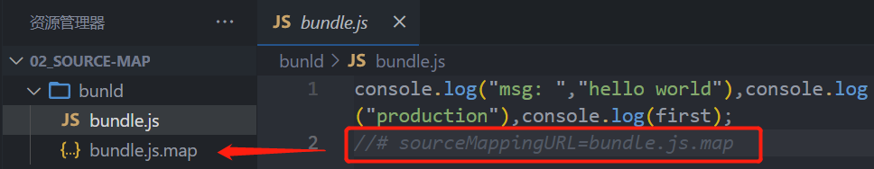
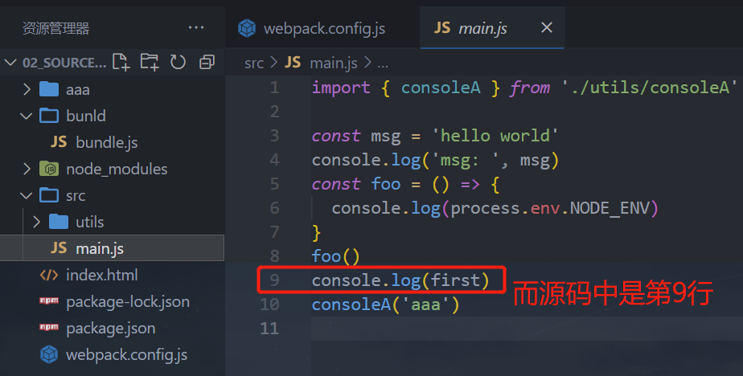

# 一. webpack 基本配置回顾

---

## 1. Webpack 到底是什么呢？

- 我们先来看一下官方的解释：

  webpack is a *static module bundler* for modern JavaScript applications.

- `webpack` 是一个用于现代 `JavaScript` 应用程序的静态的模块化打包工具

  

- 我们来对上面的解释进行拆解：

  - 打包 `bundler`：`webpack` 可以将帮助我们进行打包，所以它是一个打包工具
  - 静态的 `static`：这样表述的原因是我们最终可以将代码打包成最终的静态资源（部署到静态服务器）
  - 模块化 `module`：`webpack` 默认支持各种模块化开发，`ES Module`、`CommonJS`、`AMD` 等
  - 现代的 `modern`：我们前面说过，正是因为现代前端开发面临各种各样的问题，才催生了 `webpack` 这样的工具的出现和发展

- 前面我们已经学习了 `webpack` 的基础知识，这里简单做一个回顾

## 2. webpack 基本打包回顾

- **`Loader` 是 用于特定的模块类型进行转换**
- **`Plugin` 可以用于执行更加广泛的任务，比如打包优化、资源管理、环境变量注入等**


# 二. webpack 的 mode

---

## 1. Mode 配置

- **`Mode` 配置选项，可以告知 `webpack` 使用相应模式的内置优化**：

  - 默认值是 `production`（什么都不设置的情况下）
  - 可选值有：`none` | `development` | `production`

- 这几个选项有什么样的区别呢：

  | 选项          | 描述                                                         |
  | :------------ | :----------------------------------------------------------- |
  | `development` | 会将 `DefinePlugin` 中 `process.env.NODE_ENV` 的值设置为 `development`. 为模块和 `chunk` 启用有效的名 |
  | `production`  | 会将 `DefinePlugin` 中 `process.env.NODE_ENV` 的值设置为 `production`。为模块和 `chunk` 启用确定性的混淆名称，`FlagDependencyUsagePlugin`，`FlagIncludedChunksPlugin`，`ModuleConcatenationPlugin`，`NoEmitOnErrorsPlugin` 和 `TerserPlugin` 。 |
  | `none`        | 不使用任何默认优化选项                                       |

## 2. Mode 配置代表更多


# 三. webpack 模块化原理

---

## 1. Webpack 的模块化

- `Webpack` 打包的代码，允许我们使用各种各样的模块化，但是最常用的是 `CommonJS`、`ES Module`
  - 那么它是如何帮助我们实现了代码中支持模块化呢？
- 我们来研究一下它的原理，包括如下原理：
  - `CommonJS` 模块化实现原理
  - `ES Module` 实现原理
  - `CommonJS` 加载 `ES Module` 的原理
  - `ES Module` 加载 `CommonJS` 的原理
- 这里不再给出代码，查看课堂代码的注释解析


# 四. 认识 source-map（源映射）

---

## 1. 认识 source-map

- 我们的代码通常运行在浏览器上时，代码是经过打包压缩的：
  - 也就是真实跑在浏览器上的代码，和我们编写的代码其实是有差异的
  - 比如 `ES6` 的代码可能被转换成 `ES5`
  - 比如对应的代码行号、列号在经过编译后肯定会不一致
  - 比如代码进行丑化压缩时，会将编码名称等修改
  - 比如我们使用了 `ts` 等方式编写的代码，最终转换成 `js`
- 但是，当代码报错需要调试时（`debug`），调试转换后的代码是很困难的
  - 但是我们能保证代码不出错吗？不可能。
- 那么如何可以**调试这种转换后不一致的代码**呢？答案就是 `source-map`
  - **`source-map` 可以帮助你从已转换的代码，映射到原始的源文件**
  - 使浏览器可以重构原始源并在调试器中显示重建的原始源

## 2. 如何使用 source-map

- 如何可以使用 `source-map` 呢？两个步骤：

  - 第一步：根据源文件，生成 `source-map` 文件，`webpack` 在打包时，可以通过配置生成 `source-map`

    - `devtool` 选项控制是否以及如何生成源映射（`source-map`）

    

  - 第二步：在转换后的代码，最后添加一个注释，它指向 `sourcemap`

    

- **浏览器会根据我们的注释，查找相应的 `source-map`，并且根据 `source-map` 还原我们的代码（注意是还原，而非下载），方便进行调试**

- 在 `Chrome` 中，我们可以按照如下的方式打开 `source-map` （默认是开启的）：

  


# 五. source-map 解析

---

## 1. 分析 source-map

- 最初 `source-map` 生成的文件大小是原始文件的10倍，第二版减少了约50%，第三版又减少了50%，所以目前一个133kb的文件，最终的 `source-map` 的大小大概在300kb
- 目前的 `source-map` 长什么样子呢？
  - `version`：当前使用的版本，也就是最新的第三版
  - `sources`：从哪些文件转换过来的 `source-map` 和打包的代码（最初始的文件）
  - `names`：转换前的变量和属性名称（如果使用的是 `development` 模式，就不会保留转换前的名称，因为打包之后的文件中本身就有初始的名称）
  - `mappings`：`source-map` 用来和源文件映射的信息（比如位置信息等），一串 `base64 VLQ`（`veriable-length quantity` 可变长度值）编码
  - `file`：打包后的文件（浏览器加载的文件）
  - `sourceContent`：转换前的具体代码信息（和 `sources` 是对应的关系）
  - `sourceRoot`：所有的 `sources` 相对的根目录

## 2. source-map 文件


## 3. 生成 source-map

- 如何在使用 `webpack` 打包的时候，生成对应的 `source-map` 呢

  - `webpack` 为我们提供了非常多的选项（目前是26个），来处理 `source-map`

  - https://webpack.docschina.org/configuration/devtool/

    

  - 选择不同的值，生成的 `source-map` 会稍微有差异，打包的过程也会有性能的差异，可以根据不同的情况进行选择

  - 不同的值会明显影响到构建 `build` 和 重新构建 `rebuild` 的速度

- **下面几个值不会生成 `source-map`**

  - **`false`：不使用 `source-map`**，也就是没有任何和 `source-map` 相关的内容（布尔值，非字符串）

  - **`none`：`production` 模式下的默认值**，不生成 `source-map`（不能主动设置为 `none`）

  - **`eval`：`development` 模式下的默认值**，不生成 `source-map`

    - 但是它会在 `eval` 执行的代码中，添加 `//# sourceURL=xxxxxx`

    - 它会被浏览器在执行时解析，并且在调试面板中生成对应的一些文件目录，方便我们调试代码

      

## 4. eval 的效果

- 会通过注释让浏览器在执行时，解析还原源文件，但是还原的源文件，跟初始的源文件位置信息方面不精确





# 六. devtool 常见值

---

`devtool` 选项控制是否以及如何生成源映射（`source-map`）

## 1. source-map

- `source-map`：

  - 生成一个独立的 `source-map` 文件，并且在 `bundle` 文件中有一个注释，指向 `source-map` 文件

- `bundle` 文件中有如下的注释：

  - 浏览器的开发工具会根据这个注释找到 `source-map` 文件，并且解析还原初始文件，而非下载

    //# 

    

## 2. eval-source-map

- `eval-source-map`：会生成 `sourcemap`，但是 `source-map` 是以 `DataUrl` 添加到 `eval` 函数的后面


## 3. inline-source-map

- `inline-source-map`：会生成 `sourcemap`，但是 `source-map` 是以 `DataUrl` 添加到 `bundle` 文件的后面


## 4. cheap-source-map

- `cheap-source-map`：

  - 会生成 `sourcemap`，但是会更加高效一些（`cheap` 低开销），因为它没有生成列映射（`Column Mapping`）
  - 因为在开发中，我们只需要行信息通常就可以定位到错误了

  

  

- **`cheap-source-map`，只会告诉错误出现在哪一行，但不会告诉具体出现在该行的第几个字符**

## 5. cheap-module-source-map

- `cheap-module-source-map`：

  - 会生成 `sourcemap`，类似于 `cheap-source-map`，但是对源自 `loader` 的 `sourcemap` 处理会更好（不会去除空格，对于报错信息，精确还原源文件的报错位置）
  - 这里有一个很模糊的概念：对源自 `loader` 的 `sourcemap` 处理会更好，官方也没有给出很好的解释
  - 其实是如果 `loader` 对我们的源码进行了特殊的处理，比如 `babel`

- 如果我们这里使用了 `babel-loader`

  - 可以先按照如下的 `babel` 配置演练

    ```js
    rules: [
      {
        test: /\.js$/,
        use: {
          loader: 'babel-loader',
          options: {
            presets: {
              ['@babel/preset-env', {targets: 'defaults'}]
            }
          }
        }
      }
    ]
    ```

## 6. cheap-source-map 和 cheap-module-source-map 的区别


- `cheap-source-map`：会去除空格
- `cheap-module-source-map`：不会去除空格，对于报错信息，精确还原源文件的报错位置

## 7. hidden-source-map

- `hidden-source-map`：

  - 会生成 `sourcemap`，但是不会对 `source-map` 文件进行引用

  - 相当于删除了打包文件中对 `sourcemap` 的引用注释

    ```js
    // 被删除掉的
    //# sourceMappingURL=bundle.js.map
    ```

- 如果我们手动添加进来，那么 `sourcemap` 就会生效了

## 8. nosources-source-map

- `nosources-source-map`：

  - 会生成 `sourcemap`，但是生成的 `sourcemap` 只有错误信息的提示，不会生成源代码文件

- 正确的错误提示：

  

- 点击错误提示，无法查看源码：

  

## 9. 多个值的组合

- 事实上，`webpack` 提供给我们的26个值，是可以进行多组合的

- 组合的规则如下：

  - `inline- | hidden- | eval`：这三个值不能同时存在多个，只能存在一个

  - `nosources`：可选值

  - `cheap` 可选值，并且可以跟随 `module` 的值

    ```js
    [inline-|hidden-|eval-][nosources-][cheap-[module-]]source-map
    ```

- 那么在开发中，最佳的实践是什么呢？

  - 开发阶段：推荐使用 `source-map` 或者 `cheap-module-source-map`
    - 这分别是 `vue` 和 `react` 使用的值，可以获取调试信息，方便快速开发
  - 测试阶段：推荐使用 `source-map` 或者 `cheap-module-source-map`
    - 测试阶段我们也希望在浏览器下看到正确的错误提示
  - 发布阶段：`false`、缺省值（不写）

- **开发或测试阶段，推荐使用 `source-map` 或 `cheap-module-source-map`（更精确的还原源文件）**

- **发布阶段，使用 `false` 或不设置值**


