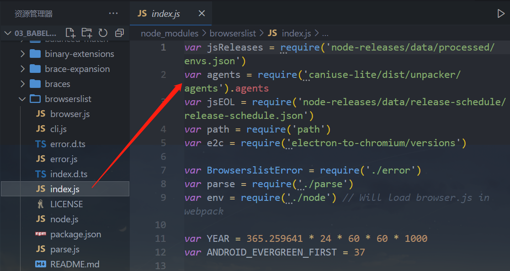

# 一. Babel 命令行执行 

---

## 1. 为什么需要 babel

- 事实上，在开发中我们很少直接去接触 `babel`，但是 `babel` 对于前端开发来说，目前是不可缺少的一部分：

  - 开发中，我们想要使用 `ES6+` 的语法，想要使用 `TS`，开发 `React` 项目，它们都是离不开 `Babel` 的
  - 所以，学习 `Babel` 对于我们理解代码从编写到线上的转变过程至关重要
  - 了解真相，你才能获得真知的自由！

- 那么，`Babel` 到底是什么呢？

  - `Babel` 是一个工具链，主要用于旧浏览器或者环境中将 `ES6+` 代码转换为向后兼容版本的 `js` 代码

  - 包括：语法转换、源代码转换、`Polyfill` 实现目标环境缺少的功能等

    

## 2. Babel 命令行使用

- `babel` 本身可以作为一个独立的工具（和 `postcss` 一样），不和 `webpack` 等构建工具配置来单独使用

- 如果我们希望在命令行尝试使用 `babel`，需要安装如下库：

  - **`@babel/core`：`babel` 的核心代码，必须安装**

  - **`@babel/cli`：可以让我们在命令行使用 `babe`**

    ```bash
    # 生产环境不需要使用
    npm i @babel/core @babel/cli -D
    ```

- 使用 `babel` 来处理我们的源代码：

  - `src`：是源文件的目录

  - `--out-dir`：指定要输出的文件夹 `dist`

    ```bash
    npx babel src --out-dir dist
    ```

## 3. 插件的使用

- 但是`babel` 默认是不会帮助我们对代码做一个真正的转化，只是将代码输出到其他的文件中，所以对于转化我们需要借助一些插件

- 比如我们需要转换箭头函数，那么我们就可以使用箭头函数转换相关的插件：

  ```bash
  npm i @babel/plugin-transform-arrow-functions -D
  ```

  ```bash
  npx babel src --out-dir dist --plugins=@babel/plugin-transform-arrow-functions
  ```

- 查看转换后的结果：我们会发现 `const` 并没有转成 `var`

  - 这是因为 `plugin-transform-arrow-functions`，并没有提供这样的功能
  - 我们需要使用 `plugin-transform-block-scoping` 来完成这样的功能

  ```bash
  npm i @babel/plugin-transform-block-scoping -D
  ```

  ```bash
  npx babel src --out-dir dist --plugins=@babel/plugin-transform-block-scoping,@babel/plugin-transform-arrow-functions
  ```

  - 多个插件以逗号作为分割

## 4. Babel 的预设 preset

- 但是如果要转换的内容过多，一个个设置是比较麻烦的，我们可以使用预设（`preset`）：

  - 后面我们再具体来讲预设代表的含义

- 安装 `@babel/preset-env` 预设：

  ```bash
  npm i @babel/preset-env -D
  ```

- 执行如下命令：

  ```bash
  npx babel src --out-dir dist --presets=@babel/preset-env
  ```

## 5. webpack 中配置 babel

### babel-loader

- 在实际开发中，我们通常会在构建工具中通过配置 `babel` 来对其进行使用的，比如在 `webpack`中

- 那么我们就需要去安装相关的依赖：

  - 如果之前已经安装了 `@babel/core`，那么这里不需要再次安装

    ```bash
    npm i babel-loader @babel/core
    ```

  - 我们可以设置一个规则，在加载 `js` 文件时，使用我们的 `babel`：

    ```js
    // webpack.config.js
    const path = require('path')
    module.exports = {
      mode: 'development',
      devtool: false,
      entry: './src/index.js',
      output: {
        path: path.resolve(__dirname, './build'),
        filename: 'bundle.js',
        clean: true,
      },
      module: {
        rules: [
          {
            test: /\.js$/, // 也可以写成: /\.m?js$/
    				loader: 'babel-loader'
            },
          },
        ],
      },
    }
    ```

### 指定使用的插件

- 我们必须指定使用的插件才会生效

  ```js
  const path = require('path')
  module.exports = {
    mode: 'development',
    devtool: false,
    entry: './src/index.js',
    output: {
      path: path.resolve(__dirname, './build'),
      filename: 'bundle.js',
      clean: true,
    },
    module: {
      rules: [
        {
          test: /\.js$/,
          use: {
            loader: 'babel-loader',
            options: {
              // 单独配置
              plugins: [
                '@babel/plugin-transform-arrow-functions',
                '@babel/plugin-transform-block-scoping',
              ],
            },
          },
        },
      ],
    },
  }
  
  ```

### babel-preset

- 如果我们一个个去安装使用插件，那么需要手动来管理大量的 `babel` 插件，我们可以直接给 `webpack` 提供一个 `preset`，`webpack` 会根据我们的预设来加载对应的插件列表，并且将其传递给 `babel`

- 比如常见的预设有三个：

  - `env`
  - `react`
  - `TypeScript`

- 安装 `@babel/preset-env`：

  ```bash
  npm i @babel/preset-env -D
  ```

  ```js
  const path = require('path')
  module.exports = {
    mode: 'development',
    devtool: false,
    entry: './src/index.js',
    output: {
      path: path.resolve(__dirname, './build'),
      filename: 'bundle.js',
      clean: true,
    },
    module: {
      rules: [
        {
          test: /\.js$/,
          use: {
            loader: 'babel-loader',
            options: {
              // 直接配置预设
              presets: ['@babel/preset-env'],
            },
          },
        },
      ],
    },
  }
  
  ```


# 二. Babel 的底层原理 

---

## 1. Babel 的底层原理

- `babel` 是如何做到将我们的一段代码（`ES6`、`TS`、`React`）转成另外一段代码（`ES5`）的呢？
  - 从一种源代码（原生语言）转换成另一种源代码（目标语言），这是什么的工作呢？
  - 就是**编译器**，事实上我们可以将 `babel` 看成就是一个编译器
  - `Babel` 编译器的作用就是将我们的源代码，转换成浏览器可以直接识别的另外一段源代码
- `Babel` 也拥有编译器的工作流程：
  -  解析阶段（`Parsing`）
  - 转换阶段（`Transformation`）
  - 生成阶段（`Code Generation`）

- 超级微型编译器：https://github.com/jamiebuilds/the-super-tiny-compiler

## 2. babel 编译器执行原理

- `Babel` 的执行阶段

  

- 当然，这只是一个简化版的编译器工具流程，在每个阶段又会有自己具体的工作：

  


# 三. 浏览器兼容性配置 

---

## 1. 浏览器兼容性

- 我们来思考一个问题：开发中，浏览器的兼容性问题，我们应该如何去解决和处理？

  - 当然这个问题很笼统，这里说的兼容性问题不是指屏幕大小的变化适配
  - 这里指的兼容性是针对不同的浏览器支持的特性：比如 `css` 特性、`js` 语法之间的兼容性

- 我们知道市面上有大量的浏览器：

  - 有 `Chrome`、`Safari`、`IE`、`Edge`、`Chrome for Android`、`UC Browser`、`QQ Browser` 等等
  - 它们的市场占率是多少？我们要不要兼容它们呢？

- 其实在很多的脚手架配置中，都能看到类似于这样的配置信息：

  - 这里的百分之一，就是指市场占有率

    ```
    > 1%
    last 2 versions
    not dead
    ```

## 2. 浏览器市场占有率

- 但是在哪里可以查询到浏览器的市场占有率呢？
  - 这个最好用的网站，也是我们工具通常会查询的一个网站就是 `caniuse`
  - https://caniuse.com/usage-table


## 3. 认识 browserslist 工具

- 但是有一个问题，我们如何可以在 `css` 兼容性和 `js` 兼容性下共享我们配置的兼容性条件呢？
  - 就是当我们设置了一个条件： > 1%
  - 我们表达的意思是 `css` 要兼容市场占有率大于1%的浏览器，`js` 也要兼容市场占有率大于1%的浏览器
  - 如果我们是通过工具来达到这种兼容性的，比如 `postcss-preset-env`、`babel`、`autoprefixer` 等
- 如何可以让他们共享我们的配置呢？
  - 这个问题的答案就是 `Browserslist`
- `Browserslist` 是什么？`Browserslist` 是一个在不同的前端工具之间，共享目标浏览器和 `Node.js` 版本的配置：
  - `Autoprefixer`
  - `Babel`
  - `postcss-preset-env`
  - `eslint-plugin-compat`
  - `stylelint-no-unsupported-browser-features`
  - `postcss-normalize`
  - `obsolete-webpack-plugin`

## 4. 浏览器查询过程

- 我们可以编写类似于这样的配置：

  ```
  > 1%
  last 2 versions
  not dead
  ```

- 那么之后，这些工具会根据我们的配置来获取相关的浏览器信息，以方便决定是否需要进行兼容性的支持：

  - **条件查询使用的是 `caniuse-lite` 的工具，这个工具的数据来自于 `caniuse` 的网站上**

    

## 5. Browserslist 编写规则一：

- 那么在开发中，我们可以编写的条件都有哪些呢？（加粗部分是最常用的）
- `defaults`：`Browserslist` 的默认浏览器（`> 0.5%, last 2 versions, Firefox ESR, not dead`）
- `5%`：通过全局使用情况统计信息选择的浏览器版本。 `>=`，`<` 和 `<=` 工作过
  - `> 5% in US`：使用美国使用情况统计信息。它接受两个字母的国家/地区代码
  - `5% in alt-AS`：使用亚洲地区使用情况统计信息。有关所有区域代码的列表，请参见 `caniuse-lite/data/regions`
  - `5% in my stats`：使用自定义用法数据
  - `> 5% in browserslist-config-mycompany stats`：使用 来自的自定义使用情况数据 `browserslist-config-mycompany/browserslist-stats.json`
  - `cover 99.5%`：提供覆盖率的最受欢迎的浏览器
  - `cover 99.5% in US`：与上述相同，但国家/地区代码由两个字母组成
  - `cover 99.5% in my stats`：使用自定义用法数据
- `dead`：24个月内没有官方支持或更新的浏览器。现在是 `IE 10`，`IE_Mob 11`，`BlackBerry 10`，`BlackBerry 7`，`Samsung 4` 和 `OperaMobile 12.1`
- `last 2 versions`：每个浏览器的最后2个版本
  - `last 2 Chrome versions`：最近2个版本的 `Chrome` 浏览器
  - `last 2 major versions` 或 `last 2 iOS major versions`：最近2个主要版本的所有次要/补丁版本

## 6. Browserslist 编写规则二：

- `node 10` 和 `node 10.4`：选择最新的 `Node.js10.x.x` 或 `10.4.x` 版本
  - `current node`：`Browserslist` 现在使用的 `Node.js` 版本
  - `maintained node versions`：所有 `Node.js` 版本，仍由 `Node.js Foundation` 维护
- `iOS 7`：直接使用 `iOS` 浏览器版本 `7`
  - `Firefox > 20`：`Firefox` 的版本高于 `20 >=`，`<` 并且 `<=` 也可以使用。它也可以与 `Node.js` 一起使用
  - `ie 6-8`：选择一个包含范围的版本
  - `Firefox ESR`：最新的 `[Firefox ESR]` 版本
  - `PhantomJS 2.1` 和 `PhantomJS 1.9`：选择类似于 `PhantomJS` 运行时的 `Safari` 版本
- `extends browserslist-config-mycompany`：从 `browserslist-config-mycompanynpm` 包中查询
- `supports es6-module`：支持特定功能的浏览器
  - `es6-module` 这是“can i use” 页面 `feat` 的 `URL` 上的参数。有关所有可用功能的列表，请参见`caniuse-lite/data/features`
- `browserslist config`：在 `Browserslist` 配置中定义的浏览器。在差异服务中很有用，可用于修改用户的配置，例如 `browserslist config and supports es6-module`
- `since 2015` 或 `last 2 years`：自2015年以来发布的所有版本（since 2015-03 以及 since 2015-03-10）
- `unreleased versions` 或 `unreleased Chrome versions`：`Alpha` 和 `Beta` 版本
- `not ie <= 8`：排除先前查询选择的浏览器

## 7. 命令行使用 browserslist

- 我们可以直接通过命令来查询某些条件所匹配到的浏览器：

  ```bash
  npx browserslist ">1%, last 2 version, not dead"
  ```

  

## 8. 配置 browserslist

- 我们如何可以配置 `browserslist` 呢？两种方案：

- 方案一：**在 `package.json` 中配置**

  ```json
  {
    // ...
    "browserslist": [
      "last 2 version",
      "not dead",
      "> 0.2%"
    ]
  }
  ```

- 方案二：**单独的一个配置文件 `.browserslistrc` 文件**

  ```.browserslistrc
  > 0.1%
  last 2 version
  not dead
  ```

## 9. 默认配置和条件关系

- 如果没有配置，那么也会有一个默认配置：

  

- 我们编写了多个条件之后，多个条件之间是什么关系呢？

  

## 10. 设置目标浏览器 browserslist

- 我们最终打包的 `js` 代码，是需要跑在目标浏览器上的，那么如何告知 `babel` 我们的目标浏览器呢？

  - `browserslist` 工具
  - `target` 属性

- 之前我们已经使用了 `browserslist` 工具，我们可以对比一下不同的配置，打包的区别：

  

## 11. 设置目标浏览器 targets

- 我们也可以通过 `targets` 来进行配置：

  ```js
  // webpack.config.js
  
  module: {
    rules: [
      {
        test: /\.js$/,
        use: {
          loader: 'babel-loader',
          options: {
            // 1.单独配置
            // plugins: [
            //   '@babel/plugin-transform-arrow-functions',
            //   '@babel/plugin-transform-block-scoping',
            // ],
            // 2.直接配置预设
            // presets: ['@babel/preset-env'],
            presets: [
              [
                '@babel/preset-env',
                {
                  // targets的配置会覆盖.browserslistrc的配置
                  // .broswerslistrc中的配置对于多个前端工具之间都是可以共享浏览器兼容性配置的，如：postcss/babel
                  // 而这里的targets的配置只会针对babel工具起作用
                  targets: '> 5%',
                },
              ],
            ],
          },
        },
      },
    ],
  },
  ```

- 那么，如果 `browserslist` 工具和 `target` 属性两个同时配置了，哪一个会生效呢？

  - 配置的 `targets` 属性会覆盖 `browserslist`
  - 但是在开发中，更推荐通过 `browserslist` 来配置，因为类似于 `postcss` 工具，也会使用 `browserslist`，进行统一浏览器的适配

## 12. Stage-X 的 preset

- 要了解 `Stage-X`，我们需要先了解一下 `TC39` 的组织：
  - `TC39` 是指技术委员会（Technical Committee）第 39 号
  - 它是 `ECMA` 的一部分，`ECMA` 是 “`ECMAScript`” 规范下的 `JavaScript` 语言标准化的机构
  - `ECMAScript` 规范定义了 `JavaScript` 如何一步一步的进化、发展
- `TC39` 遵循的原则是：分阶段加入不同的语言特性，新流程涉及四个不同的 `Stage`
  - `Stage 0`：strawman（稻草人），任何尚未提交作为正式提案的讨论、想法变更或者补充都被认为是第 0 阶段的"稻草人"
  - `Stage 1`：proposal（提议），提案已经被正式化，并期望解决此问题，还需要观察与其他提案的相互影响
  - `Stage 2`：draft（草稿），Stage 2的提案应提供规范初稿、草稿。此时，语言的实现者开始观察 runtime 的具体实现是否合理
  - `Stage 3`：candidate（候补），Stage 3 提案是建议的候选提案。在这个高级阶段，规范的编辑人员和评审人员必须在最终规范上签字。Stage 3 的提案不会有太大的改变，在对外发布之前只是修正一些问题
  - `Stage 4`：finished（完成），进入 Stage 4 的提案将包含在 `ECMAScript` 的下一个修订版中

## 13. Babel 的 Stage-X 设置

- 在 `babel7` 之前（比如 `babel6` 中），我们会经常看到这种设置方式：

  ```js
  module.exports = {
    // ...
    "preset": ["stage-0"]
  }
  ```

  - 它表达的含义是使用对应的 `babel-preset-stage-x` 预设
  - 但是从 `babel7` 开始，已经不建议使用了，建议使用 `preset-env` 来设置


# 四. babel 的配置文件 

---

- 像之前一样，我们可以将 `babel` 的配置信息放到一个独立的文件中，`babel` 给我们提供了两种配置文件的编写：

  - `babel.config.json`（或者 `.js`，`.cjs`，`.mjs`）文件
  - `.babelrc.json`（或者`.babelrc`，`.js`，`.cjs`，`.mjs`）文件

- 可以将 `webpack` 配置中的 `babel-loader` 的 `options` 选项的配置省略，从而写入 `babel.config.js` 中

  

  

- 它们两个有什么区别呢？目前很多的项目都采用了多包管理的方式（`babel` 本身、`element-plus`、`umi` 等）

  - `.babelrc.json`：早期使用较多的配置方式，但是对于配置 `Monorepos` 项目是比较麻烦的
  - `babel.config.json (babel 7)`：可以直接作用于 `Monorepos` 项目的子包，更加推荐

  > 补充：
  >
  > - `Monorepos` 项目：一个项目，多个子包


# 五. babel 和 polyfill 

---

## 1. 认识 polyfill

- `Polyfill` 是什么呢？
  - 翻译：一种用于衣物、床具等的聚酯填充材料, 使这些物品更加温暖舒适
  - 理解：更像是应该填充物（垫片），一个补丁，可以帮助我们更好的使用 `js`
- 为什么时候会用到 `polyfill` 呢？
  - 比如我们使用了一些语法特性（例如：`Promise`、`Generator` 、`Symbol` 等以及实例方法例如 `Array.prototype.includes` 等）
  - 但是某些浏览器压根不认识这些特性，必然会报错
  - 我们可以使用 `polyfill` 来填充或者说打一个**补丁**，那么就会包含该特性了

## 2. 使用 polyfill

- `babel 7.4.0 `之前，可以使用 `@babel/polyfill` 的包，但是该包现在已经不推荐使用了：

  

- `babel 7.4.0` 之后，可以通过单独引入 `core-js` 和` regenerator-runtime` 来完成 `polyfill` 的使用：

  ```bash
  npm i core-js regenerator-runtime --save
  ```

## 3. 配置 babel.config.js

- 我们需要在 `babel.config.js` 文件中进行配置，给 `preset-env` 配置一些属性：

  - `useBuiltIns`：设置 `polyfill` 的使用规则
  - `corejs`：设置 `corejs` 的版本，目前使用较多的是 `3.x` 的版本
    - 另外 `corejs` 可以设置是否对提议阶段的特性进行支持
    - 设置 `proposals` 属性为 `true` 即可

  

## 4. useBuiltIns 属性设置

- `useBuiltIns` 属性有三个常见的值

- 第一个值：`false`

  - 打包后的文件不使用 `polyfill` 来进行适配
  - 并且这个时候是不需要设置 `corejs` 属性的

- 第二个值：`usage`

  - 会根据源代码中出现的语言特性，自动检测所需要的 `polyfill`
  - 这样可以确保最终包里的 `polyfill` 数量的最小化，打包的包相对会小一些
  - 可以设置 `corejs` 属性来确定使用的 `corejs` 的版本

- 第三个值：`entry`

  - 如果我们依赖的某一个库本身使用了某些 `polyfill` 的特性，但是因为我们使用的是 `usage`，所以之后用户浏览器可能会报错

  - 所以，如果你担心出现这种情况，可以使用 `entry`

  - 并且需要在入口文件中引入如下两个包

    ```js
    import 'core-js/stable'
    import 'regenerator-runtime/runtime'
    ```

  - 这样做会根据 `browserslist` 目标导入所有的 `polyfill`，但是对应的包也会变大

# 六. React和TS解析

---


