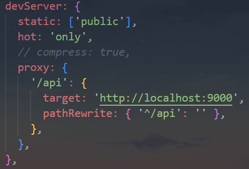

# 一. 本地服务器 server

---

## 1. 为什么要搭建本地服务器

- 目前我们开发的代码，为了运行需要有两个操作：
  - 操作一：`npm run build`，编译相关的代码
  - 操作二：通过 `live server` 或者直接通过浏览器，打开 `index.html` 代码，查看效果
- 这个过程经常操作会影响我们的开发效率，我们希望可以做到，当文件发生变化时，可以自动的完成 编译 和 展示
- 为了完成自动编译，`webpack` 提供了几种可选的方式：
  - `webpack watch mode`
  - `webpack-dev-server`（常用）
  - `webpack-dev-middleware`

## 2. webpack-dev-server

- 上面的方式可以监听到文件的变化，但是事实上它本身是没有自动刷新浏览器的功能的：

  - 当然，目前我们可以在 `VSCode` 中使用 `live-server` 来完成这样的功能
  - 但是，我们希望在不使用 `live-server` 的情况下，可以具备 `live reloading`（实时重新加载）的功能

- 安装 `webpack-dev-server`

  ```bash
  npm i webpack-dev-server -D
  ```

- 修改配置文件，启动时加上 `serve` 参数：

  

- `webpack-dev-server` 在编译之后不会写入到任何输出文件，而是将 `bundle` 文件保留在内存中：

  - 事实上 `webpack-dev-server` 使用了一个库叫 `memfs`（`memory-fs` `webpack` 自己写的），将打包之后的文件放入到内存中，并不是放入到文件中，所以就不需要经过读取本地文件，再放入到内存中这一过程，性能会更好


# 二. server 的静态资源

---

## 1. devServer 的 static

- `devServer` 中 `static` 对于我们直接访问打包后的资源其实并没有太大的作用，它的主要作用是如果我们打包后的资源，又依赖于其他的一些资源，那么就需要指定从哪里来查找这个内容：

  - 比如在 `index.html` 中，我们需要依赖一个 `a.js` 文件，这个文件我们存放在 `public` 文件中

  - 在 `index.html` 中，我们应该如何去引入这个文件呢？

    - 比如代码是这样的：

      ```html
      <script src="./public/a.js"></script>
      ```

    - 但是这样打包后浏览器是无法通过相对路径去找到这个文件夹的

    - 所以代码是这样的：

      ```html
      <script src="./a.js"></script>
      ```

    - 但是我们如何让它去查找到这个文件的存在呢？ 设置 `static` 即可

      

  - `webpack` 中默认就是 `public` 文件夹


# 三. server 的其他配置

---

## 1. hotOnly、host 配置

- `hotOnly` 是当代码编译失败时，是否刷新整个页面：

  - 默认情况下当代码编译失败修复后，会重新刷新整个页面

  - 如果不希望重新刷新整个页面，可以设置 `hot` 为 `only`

    

- `host` 设置主机地址：

  - 默认值是 `localhost`

  - 如果你想**让你的服务器可以被外部访问**，像这样指定：

    ```js
    // webpack.config.js
    
    module.exports = {
      //...
      devServer: {
        host: '0.0.0.0',
      },
    };
    ```

- `localhost` 和 `0.0.0.0` 的区别：

  - `localhost`：本质上是一个域名，通常情况下会被解析成 `127.0.0.1`
  - `127.0.0.1`：回环地址(`Loop Back Address`)，表达的意思其实是我们主机自己发出去的包，直接被自己接收
    - 正常的数据库包经常 应用层 - 传输层 - 网络层 - 数据链路层 - 物理层
    - 而回环地址，是在网络层直接就被获取到了，是不会经常数据链路层和物理层的
    - 比如我们监听 `127.0.0.1` 时，在同一个网段下的主机中，通过 `ip` 地址是不能访问的
  - `0.0.0.0`：监听 `IPV4` 上所有的地址，再根据端口找到不同的应用程序
    - 比如我们监听 `0.0.0.0` 时，在同一个网段下的主机中，通过 `ip` 地址是可以访问的

## 2. port、open、compress

- `port` 设置监听的端口，默认情况下是 `8080`

- `open` 是否打开浏览器：
  - 默认值是 `false`，设置为 `true` 会打开浏览器
  - 也可以设置为类似于 `Google Chrome` 等值
  
- `compress` 是否为静态文件开启 `gzip compression`：
  - 默认值是 `false`，可以设置为 `true`
  
    


# 四. server 的 proxy 代理

---

- `proxy` 是我们开发中非常常用的一个配置选项，它的目的设置代理来解决跨域访问的问题：

  - 比如我们的一个 `api` 请求是 `http://localhost:9000`，但是本地启动服务器的域名是 `http://localhost:8080`，这个时候发送网络请求就会出现跨域的问题
  - 那么我们可以将请求先发送到一个代理服务器，代理服务器和 `API` 服务器没有跨域的问题，就可以解决我们的跨域问题了

- 我们可以进行如下的设置：

  - `target`：表示的是代理到的目标地址，比如 `/api/moment` 会被代理到 `http://localhost:9000/api/moment`

  - `pathRewrite`：默认情况下，我们的 `/api` 也会被写入到 `URL` 中，如果希望删除，可以使用 `pathRewrite`

  - `changeOrigin`：它表示是否更新代理后请求的 `headers` 中 `host` 地址

    


# 五. changeOrigin 作用

---

- 这个 `changeOrigin` 官方说的非常模糊，通过查看源码发现其实是要修改代理请求中的 `headers` 中的 `host` 属性：

  - 因为真实的请求，其实是需要通过 `http://localhost:9000` 来请求 `api` 接口的
  - 但是因为使用了代理，默认情况下值是 `http://localhost:8080`
  - 所以接口服务器那边接收到的 `headers` 中的 `host` 其实是 `localhost:8080`
  - 如果服务器那边有对 `host` 做校验，那么需要修改，可以将 `changeOrigin` 设置为 `true` 即可，这样服务器那边接收的也是 `localhost:9000`

  


# 六. historyApiFallback

---

- `historyApiFallback` 是开发中一个非常常见的属性，它主要的作用是解决 `SPA` 页面在路由跳转之后，进行页面刷新时，返回 `404`的错误
- `boolean` 值：默认是 `false`
  - 如果设置为 `true`，那么在刷新时，返回 `404` 错误时，会自动返回  `index.html` 的内容
- `object` 类型的值，可以配置 `rewrites` 属性：
  - 可以配置 `from` 来匹配路径，决定要跳转到哪一个页面
- 事实上 `devServer` 中实现 `historyApiFallback` 功能是通过 `connect-history-api-fallback` 库的：
  - 可以查看 `connect-history-api-fallback` 文档 https://github.com/bripkens/connect-history-api-fallback


