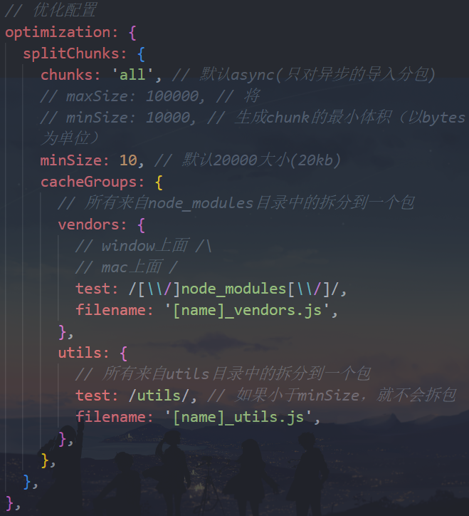

# 一. webpack 多入口依赖

---

## 1. webpack 的性能优化分类

- `webpack` 作为前端目前使用最广泛的打包工具，在面试中也是经常会被问到的
- 比较常见的面试题包括：
  - 可以配置哪些属性来进行 `webpack` 性能优化？
  - 前端有哪些常见的性能优化？（问到前端性能优化时，除了其他常见的，也完全可以从 `webpack` 来回答）
- `webpack` 的性能优化较多，我们可以对其进行分类：
  - 优化一：**打包后的结果，上线时的性能优化**（如分包处理、减小包体积、`CDN` 服务器等）
    - 分包处理：如 `react` / `vue` 路由懒加载使用 `import` 函数动态导入
    - 减小包体积：代码进行压缩，代码丑化，删除注释空格等
    - 删除无用的代码：`tree shaking`
    - `CDN` 服务器
  - 优化二：**优化打包速度，开发或者构建时优化打包速度**（如 `exclude`、`cache-loader` 等）
- 大多数情况下，我们会更加侧重于优化一，这对于线上的产品影响更大
- 在大多数情况下 `webpack` 都帮我们做好了该有的性能优化：
  - 比如配置 `mode` 为 `production` 或者 `development` 时，默认 `webpack` 的配置信息
  - 但是我们也可以针对性的进行专门的项目优化

## 2. 性能优化 - 代码分离

- 代码分离（`Code Splitting`）是 `webpack` 一个非常重要的特性：

  - 它主要的目的是将代码分离到不同的 `bundle` 中，之后我们可以按需加载，或者并行加载这些文件
  - 比如默认情况下，所有的 `js` 代码（业务代码、第三方依赖、暂时没有用到的模块）在首页全部都加载，就会影响首页的加载速度
  - 代码分离可以分出更小的 `bundle`，以及控制资源加载优先级，提供代码的加载性能

- **`Webpack` 中常用的代码分离有三种**：
  - 入口起点：使用 `entry` 配置手动分离代码
  - 防止重复：使用 `Entry Dependencies` 或者 `SplitChunksPlugin` 去重和分离代码
  - 动态导入：通过模块的内联函数调用来分离代码


## 3. 多入口起点

- 入口起点的含义非常简单，就是配置多入口：
  - 比如配置一个 `index.js` 和 `main.js` 的入口
  
  - 它们分别有自己的代码逻辑
  
    

## 4. Entry Dependencies(入口依赖)

- 假如我们的 `index.js` 和 `main.js` 两个入口都有依赖两个库：`lodash`、`axios`
  - 如果我们单纯的进行入口分离，那么打包后的两个 `bunlde` 都有会有一份 `lodash` 和 `axios` 的源码
  
  - 事实上我们可以对他们进行共享
  
    


# 二. webpack 的动态导入

---

## 1. 动态导入(dynamic import)

- 另外一个代码拆分的方式是动态导入时，`webpack` 提供了两种实现动态导入的方式：
  - 第一种，使用 `ECMAScript` 中的 `import()` 语法来完成，也是目前推荐的方式
  - 第二种，使用 `webpack` 遗留的 `require.ensure`，目前已经不推荐使用
- 比如我们有一个模块 `bar.js`：
  - 该模块我们希望在代码运行过程中来加载它（比如判断一个条件成立时加载）
  - 因为我们并不确定这个模块中的代码一定会用到，所以最好拆分成一个独立的 `js` 文件
  - 这样可以保证不用到该内容时，浏览器不需要加载和处理该文件的 `js` 代码
  - 这个时候我们就可以使用动态导入

> 注意：
>
> - 在 `webpack` 中，通过动态导入获取到一个对象
>
> - **对于动态导入的模块所导出的默认内容，在该对象的 `default` 属性中**
>
>   ```js
>   // about.js
>   const _name = 'aaa'
>   export default _name
>   ```
>
>   ```js
>   import('./router/about').then((res) => {
>     console.log(res.default) // aaa
>   })
>   ```

## 2. 动态导入的文件命名

- 动态导入的文件命名：

  - 因为动态导入通常是一定会打包成独立的文件的，所以并不会在 `cacheGroups` 中进行配置

  - 那么它的命名我们通常会在 `output` 中，通过 `chunkFilename` 属性来命名

    

- 但是，你会发现默认情况下我们获取到的 `[name]` 是和 `id` 的名称保持一致的

  - 如果我们希望修改 `name` 的值，可以通过 `magic comments`（魔法注释）的方式

    

    

## 3. 代码的懒加载

- 动态 `import` 使用最多的一个场景是懒加载（比如路由懒加载）：

  - 封装一个 `component.js`，返回一个 `component` 对象

  - 我们可以在一个按钮点击时，加载这个对象

    

    


# 三. SplitChunkPlugin

---

## 1. SplitChunks

- 另外一种分包的模式是 `splitChunk`，它底层是使用 `SplitChunksPlugin` 来实现的：

  - 因为该插件 `webpack` 目前已经默认安装和集成，所以我们并不需要单独安装该插件
  - 只需要提供 `SplitChunksPlugin` 相关的配置信息即可

- `Webpack` 提供了 `SplitChunksPlugin` 默认的配置，我们也可以手动来修改它的配置：

  - 比如默认配置中，`chunks` 仅仅针对于异步请求，我们可以设置为 `initial` 或者 `all`

    

- 这样我们代码中导入的第三方包，都会被分包

## 2. SplitChunks 自定义配置解析

- `Chunks`：

  - 默认值是 `async`
  - 另一个值是 `initial`，表示对通过的代码进行处理
  - `all` 表示对同步和异步代码都进行处理

- `minSize`：

  - 拆分包的大小，至少为 `minSize`（以 `bytes` 为单位）
  - 如果一个包拆分出来达不到 `minSize`，那么这个包就不会拆分

- `maxSize`：

  - 将大于 `maxSize` 的包，尝试拆分为不小于 `minSize` 的包（不一定会全拆分为小于 `maxSize` 的包，因为有些情况可能拆不了）
  - `maxSize` 只是一个提示，当模块大于 `maxSize` 或者拆分不符合 `minSize` 时可能会被违反

- `cacheGroups` 缓存组：

  - 用于对拆分的包就行分组，比如一个 `lodash` 在拆分之后，并不会立即打包，而是会等到有没有其他符合规则的包一起来打包
  - `test` 属性：匹配符合规则的包
  - `name` 属性：拆分包的 `name` 属性
  - `filename` 属性：拆分包的名称，可以自己使用 `placeholder` 属性

  


# 四. 其他的一些优化配置

## 1. 解决注释的单独提取

- `webpack` 在 `production` 模式下进行分包时，默认会对包中的版权声明相关的注释进行单独提取（如果没有，就不会单独提取）

  

- 这个包提取是由另一个插件默认配置的原因，默认为 `true`：提取注释

  

## 2. optimization.chunkIds 配置

- `optimization.chunkIds` 配置用于告知 `webpack` 模块的 `id` 采用什么算法生成
- 有三个比较常见的值：
  - `natural`：按照数字的顺序使用 `id`
  - `named`：`development` 下的默认值，一个可读的名称的 `id`
  - `deterministic`：确定性的，在不同的编译中**不变**的短数字 `id`
    - 在 `webpack4` 中是没有这个值的，那个时候如果使用 `natural`，那么在一些编译发生变化时，就会有问题：比如一些涉及到变化的包需要重新打包，必然会影响打包时的性能速度，而且可能包名的数字顺序也发生变化，从而在重新部署到线上环境中，用户浏览器之前缓存的文件，也可能无法重复利用（文件名发生变化）
- 最佳实践：
  - 开发过程中，我们推荐使用 `named`
  - 打包过程中，我们推荐使用 `deterministic`


# 五. prefetch 和 preload

---


# 六. CDN 加速服务器配置

---


# 七. CSS样式的单独提取

---


