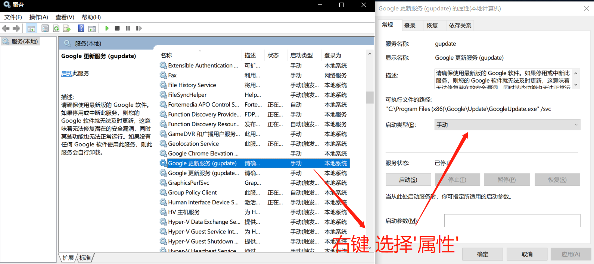

## 前言

- 更新 `Chrome` 浏览器，结果出现了 检查更新时出错：无法启动更新检查（错误代码为 `4: 0x80070005 — system level`）的错误

## 原因

- 这个错误的的原因是 `Chrome` 更新服务被禁用了，需要调整为手动启动即可

## 解决

- 快捷键 `Win R` 输入：`services.msc`，找到 “`Google` 更新服务 (`gupdatem`)”、“`Google` 更新服务 ( `gupdate` )”服务，改为手动即可，再去更新 `Chrome` 即可

  

