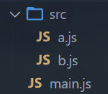
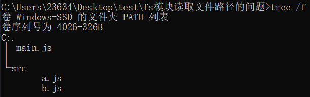
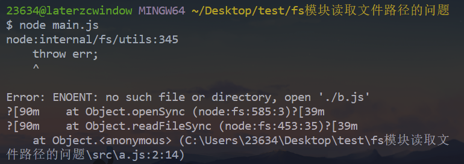
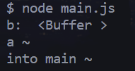
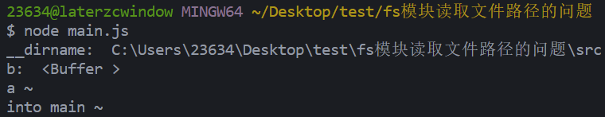

# 前言

- 直接上 `demo` 吧

- 文件目录结构如图：

  

  ```js
  // main.js
  require('./src/a.js')
  console.log('into main ~')
  ```

  ```js
  // a.js
  const fs = require('fs')
  const b = fs.readFileSync('./b.js')
  console.log('b: ', b)
  console.log('a ~')
  ```

  ```js
  // b.js 什么都没有
  ```

- 执行 `main.js`

  ```bash
  node main.js
  ```

- 执行结果：

  

- 说没有这样的文件或目录


# 原因

- 其实就是 `node` 中的 `fs` 模块在读取文件时，`path` 参数如果是字符串，会当成相对路径去查找，而默认情况下，`fs` 模块读取文件的相对路径跟 `node` 程序的启动路径有关系
- 前面我们是通过 `node main.js` 启动的 `node` 程序
- 从而在 `a` 模块中执行 `fs.readFileSync('./b.js')` 时，`fs` 模块就会以启动 `node` 程序的路径为基准的，而不是以当前文件的路径为基准
- 最终也就导致找不到 `b.js` 


# 解决

- 方式一（不太推荐，消耗一定心智）：

  - 以 `node` 程序启动路径为基准去写入相对路径

    ```js
    // a.js
    - const b = fs.readFileSync('./b.js')
    // 改成node程序启动路径为基准写入：
    + const b = fs.readFileSync('./src/b.js')
    ```

    

- 方式二（推荐）：

  - 使用 `path.resolve()` 方法将当前文件所处目录与相对路径解析为绝对路径

    ```js
    // a.js
    const fs = require('fs')
    const path = require('path')
    console.log('__dirname: ', __dirname) // 当前文件所处目录
    const b = fs.readFileSync(path.resolve(__dirname, './b.js'))
    console.log('b: ', b)
    console.log('a ~')
    ```

    


