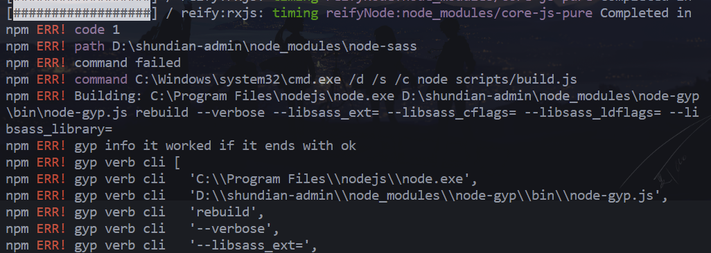
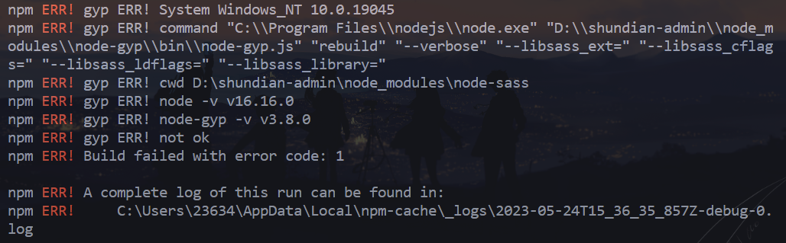
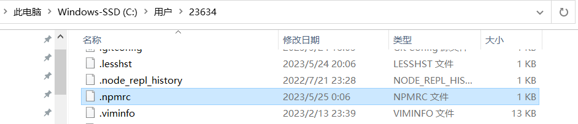
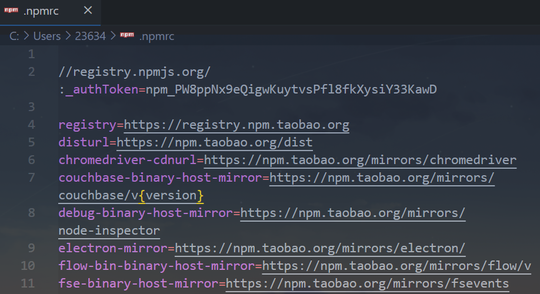

# 前言

- `npm install` 项目依赖的时候报错：

  

  

- 在 `ERR` 信息的最顶部，找到了这样的一条关键信息，现在已经可以断定是在导入 `node-sass` 这个依赖时出现的问题

  ```bash
  npm ERR! path D:\shundian-admin\node_modules\node-sass
  npm ERR! command failed
  ```


# 原因

1. `nodejs` 与 `sass` 版本可能不匹配
2. `node` 可能无法下载 `sass` 依赖


# 解决

- `node` 无法下载 `node-sass` 依赖：

  - 根据 `node-sass` 官方提供的配置命令：

    ```bash
    # https://github.com/sass/node-sass#install-from-mirror-in-china
    npm install -g mirror-config-china --registry=https://registry.npmmirror.com
    ```

  - 执行如上命令之后，会自动修改全局的 `.npmrc` 中的配置会自动加很多配置

    

    

  - 项目内也可单独设置，新增 `.npmrc` 文件，将上面的命令加进去即可

- `nodejs` 与 `node-sass` 版本不匹配：

  - 以下是 `node-sass` 的最低和最高支持的版本的快速指南：

  - https://github.com/sass/node-sass#node-version-support-policy

    | NodeJS  | Supported node-sass version 支持的节点 sass 版本 | Node Module |
    | ------- | ------------------------------------------------ | ----------- |
    | Node 20 | 9.0+                                             | 115         |
    | Node 19 | 8.0+                                             | 111         |
    | Node 18 | 8.0+                                             | 108         |
    | Node 17 | 7.0+, <8.0                                       | 102         |
    | Node 16 | 6.0+                                             | 93          |
    | Node 15 | 5.0+, <7.0                                       | 88          |
    | Node 14 | 4.14+, <9.0                                      | 83          |
    | Node 13 | 4.13+, <5.0                                      | 79          |
    | Node 12 | 4.12+, <8.0                                      | 72          |
    | Node 11 | 4.10+, <5.0                                      | 67          |
    | Node 10 | 4.9+, <6.0                                       | 64          |
    | Node 8  | 4.5.3+, <5.0                                     | 57          |
    | Node <8 | <5.0                                             | <57         |

- 根据项目中的 `node-sass` 的版本，切换到对应的 `node` 版本，又或者根据 `node` 版本去修改 `package.json` 中对应的 `sass` 版本，这个会不会引起项目其他依赖的兼容问题，自己根据实际情况决定
- 切换 `node` 版本，可以通过 `github` 上有提供一个 `nvm-windows` 工具
- https://github.com/coreybutler/nvm-windows

# 相关

- https://tree.moe/deal-with-gyp-err-caused-by-node-sass/