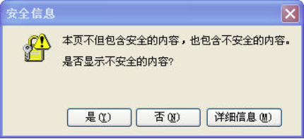

# 关于URL中协议的省略

---

在 `Google` `HTML/CSS` 代码风格指南，其中第一条说道，`HTML` 和 `CSS` 代码中引用的图片、媒体、`CSS` 和 `JS` 文件中的 `URL` 都可以去掉协议部分（`http:` 和 `https:`），比如

```html
<script src="http://www.google-analytics.com/ga.js" type="text/javascript"></script>
<script src="https://www.google-analytics.com/ga.js" type="text/javascript"></script>
都可以换成：
<script src="//www.google-analytics.com/ga.js" type="text/javascript"></script>
```

只要是使用 `http`、`https` 这两种协议都可以省略。原因是可以节省一点文件体积（当然只是那么一点点），另外一个原因 `Google` 说是可以解决混合内容的问题。起初我对这个第二点不是很了解，所以特意搜索了下。最后从 Paul Irish 的一篇文章找到答案，链接在文后。文章是两三年前写的，老外研究问题总是比我们要早啊

以 `//` 开头的叫做相对 `URL`（protocol-relative URL），相关的标准可以看 [RFC 3986 Section 4.2](http://tools.ietf.org/html/rfc3986#section-4.2)，内容不是一般的长估计大家也没耐心去看吧。总之概括为：**浏览器遇到相对 `URL`，则会根据当前的网页协议，自动在 `//` 前面加上相同的协议**。如当前网页是 `http` 访问，那么所有的相对引用 `//` 都会变成`http://`。`https` 同理。如果你在本地查看，协议就会变成 `file://`

所以，如果省略协议，就需要保证引用的外部资源也采用和网页相同的协议，或者保证资源可以同时通过 `http` 和 `https` 访问。经过 `StackOverflow` 网友测试，这种用法几乎所有的浏览器都能支持，只有在  `IE7/8` 下会有一点小问题，就是通过相对 `URL` 引用的 `CSS` 文件（无论 `<link>` 或 `@import`）会被下载两遍。所以对性能有一点影响

至于 `Google` 提到的混合内容问题，其实是指 `IE` 有时会弹出的一个警告框：



这个框想必大家也都见过。通常是在浏览 `https` 网页的时候出现，原因是网页里引用了 `http` 协议的外部资源，由于 `http` 被认为是不安全的，`IE` 才会给出提示。如果引用的时候写成相对 `URL`，浏览器就会自动采用 `https` 协议下载，这样就解决了问题。

所以，我们平时写代码还是可以放心使用相对 `URL` 的，写博客的大概很少开 `https`，当然做项目的就例外了。如果你引用的资源里有 `https` 协议的就特别处理一下，或者只要 `http` 也能访问到资源就可以。我看了下国内的站点这么用的还不多，有一次看到百度音乐这么用过。不过 `Google` 很多站点都已经是这样的写法了

参考资料：

- 原文：http://pandacafe.net/post/231?ygtgju=qbmhu2

- http://paulirish.com/2010/the-protocol-relative-url/
- http://stackoverflow.com/questions/4831741/can-i-change-all-my-http-links-to-just