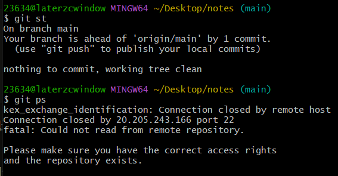

# 前言

- 在一次正常的推代码到 `github` 过程中遇到如下问题：

  


# 原因

- 猜测在这次推代码之前我有将仓库从私有变成公共导致的


# 解决

- 您可以执行以下两个步骤来解决

- 步骤一：删除本地`C:/Users/23634/.ssh/id_rsa`文件和 `id_rsa.pub` 文件，重新生成 `keygen`，粘贴到 `GitHub` 中的 `SSH keys`：

  ```bash
  ssh-keygen -t rsa -C "youremail@xxx.com"
  ```

  - 打开 `C:/Users/23634/.ssh/id_rsa.pub `并复制内容
  - 转到 `github` 中的 `SSH Keys` 并创建一个新的 `SSH keys` 粘贴内容并保存

  - 测试重新推代码
  - 显示 `Hi username! You've successfully authenticated, but GitHub does not provide shell access.` 没问题
  - 如果还有 `Connection closed by 20.205.243.166 port 22`，则执行步骤二

- 步骤二：添加配置

  - 创建/修改 `C:/Users/23634/.ssh/config` 文件，添加以下代码：

    ```js
    Host github.com
        HostName ssh.github.com
        User git
        Port 443
    ```

  - 如果超时，请使用 `VPN` 全局重试


原文：https://stackoverflow.com/questions/74469777/git-pull-encounters-kex-exchange-identification-connection-closed-by-remote-hos

