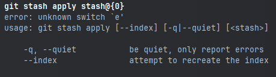

# 前言

在powershell命令行窗口中，使用git stash apply stash@{0} 报错：error: unknown switch 'e'




# 原因

`@{}` 在powershell终端中是哈希表文本语法


# 解决

使用引号包裹 `@{}`

```powershell
git stash apply "stash@{0}" 
# 或
git stash apply stash"@{0}"
```


# 相关资料

https://learn.microsoft.com/zh-cn/powershell/module/microsoft.powershell.core/about/about_operators?view=powershell-7.4#hash-table-literal-syntax-

https://learn.microsoft.com/zh-cn/powershell/module/microsoft.powershell.core/about/about_hash_tables?view=powershell-7.4