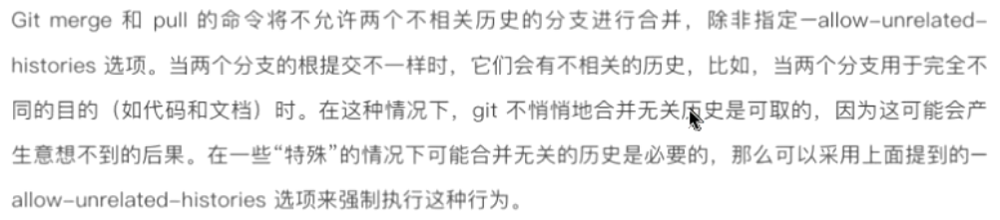
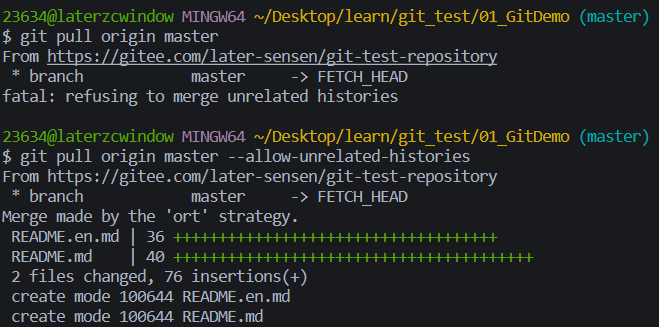

- `git2.9`版本之后出现的东西

  

- 以下是一些您可能会遇到致命错误的情况: 拒绝在`Git`中合并不相关的历史错误。
  
  - 您有一个本地存储库，其中包含提交，并尝试从现有的远程存储库提取。由于历史不同，`Git`不知道如何继续。因此会出现错误消息。
  
  - 你的`.git`目录损坏了
  
  - 当你的分支位于不同的`HEAD`位置时
  
    

- 我们可以通过允许不相关的合并来解决这个错误。我们可以通过向`pull`请求添加`——allow-unrelated-histories`标志来做到这一点

- 如下所示

```js
    git pull origin master --allow-unrelated-histories
```

