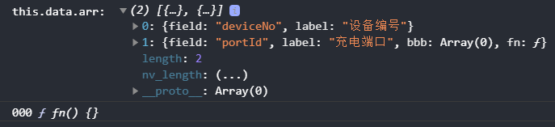
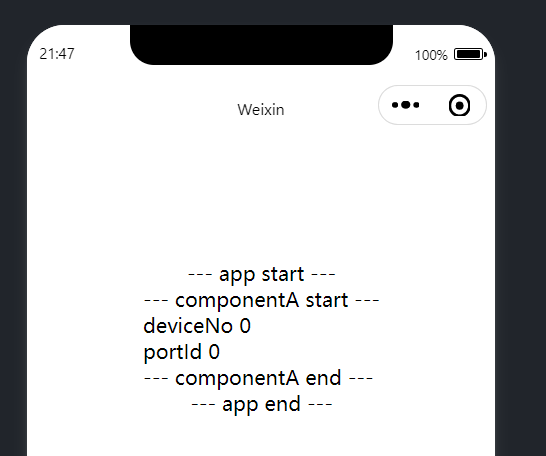

# 前言

---

直接上 `demo`：

```html
<!--pages/index/index.wxml-->
<view class="container">
  --- app start ---
  <componentA arr="{{arr}}"></componentA>
  --- app end ---
</view>
```

```js
<!--pages/index/index.js-->
Page({
  data: {
    arr: [
      { field: 'deviceNo', label: '设备编号' },
      { field: 'portId', label: '充电端口', fn: () => { }, bbb: [] },
    ],
  },
})
```

```html
<!--components/componentA/componentA.wxml-->
--- componentA start ---
<view wx:for="{{arr}}" wx:key="field">
  {{item.field}}
  {{item.fn ? 1 : 0}}
</view>
--- componentA end ---
```

```js
// components/componentA/componentA.js
Component({
  properties: {
    arr: {
      type: Array,
      value: []
    },
  },
  pageLifetimes: {
    show() {
      console.warn('this.data.arr: ', this.data.arr)
      this.data.arr.forEach(i => {
        if (i.fn) {
          console.log('000', i.fn)
        }
      })
    }
  }
})
```





- 相关文章：https://developers.weixin.qq.com/community/develop/doc/000a629b75c918f9e537c988b57000


