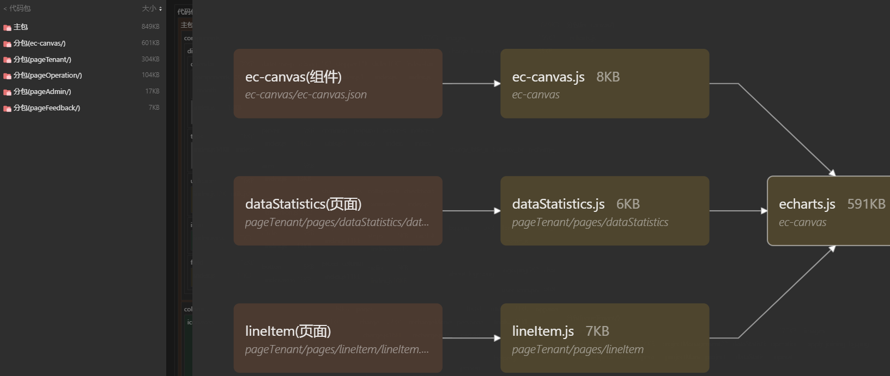
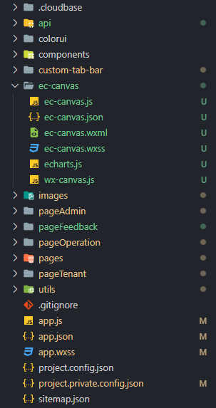

# 前言

- 为什么需要分包？
  - 某些业务场景下，小程序有些页面只有特定的用户才能访问，而普通用户是无法访问的，又或者某些页面用户访问到的可能性很小，这时候就需要对这些页面进行一个分包，只在用户使用时才进行加载
- 何为分包，主包？
  - 在构建小程序分包项目时，构建会输出一个或多个分包。每个使用分包小程序必定含有一个主包
  - 所谓的主包，即放置默认启动页面/TabBar 页面，以及一些所有分包都需用到公共资源/JS 脚本；而分包则是根据开发者的配置进行划分
- 何为分包加载？
  - 某些情况下，开发者需要将小程序划分成不同的子包，在构建时打包成不同的分包，用户在使用时按需进行加载
  - 在小程序启动时，默认会下载主包并启动主包内页面，当用户进入分包内某个页面时，客户端会把对应分包下载下来，下载完成后再进行展示
- 目前小程序分包大小有以下限制：
  - 整个小程序所有分包大小不超过 20M
  - 单个分包/主包大小不能超过 2M
- 对小程序进行分包，可以优化小程序首次启动的下载时间，以及在多团队共同开发时可以更好的解耦协作
- 修改前：项目主包 `1.4M` 大小，`echarts` 目录文件就占 `600k`，但 `echarts` 文件却未在主包中使用，被 `pageTenant` 分包中的文件所使用，但是因为 `echarts` 文件存在 `components` 文件中，从而被归入主包中
- 修改后：`echarts` 目录文件从 `components` 文件中提取出来作为一个分包，项目主包文件降至 `800k`，`echarts` 分包只在用户进入 `pageTenant` 分包某个页面时，才会被下载下来，`echarts` 目录文件通过官网的 `echarts` 在线定制，包大小从 `590k` 降低至 `510k` 



# 1. 项目结构



# 2. app.json 配置

```json
{
  "pages": [
    "pages/index/index",
     // ...
  ],
  "subpackages": [
    {
      "root": "pageTenant",
      "pages": [
        "pages/applyJoining/applyJoining",
         // ...
      ]
    },
    {
      "root": "pageOperation",
      "pages": [
        "pages/addAdmin/addAdmin",
         // ...
      ]
    },
    {
      "root": "pageAdmin",
      "pages": [
        "pages/admin/admin",
         // ...
      ]
    },
    {
      "root": "pageFeedback",
      "pages": [
        "pages/feedback/feedback"
      ]
    },
    {
      "root": "ec-canvas", // echarts分包配置
      "pages": []
    }
  ],
  "window": {
    "backgroundTextStyle": "light",
    "navigationBarBackgroundColor": "#fff",
    "navigationBarTitleText": "多丫充电",
    "navigationBarTextStyle": "white"
  },
  "networkTimeout": {
    "request": 20000,
    "connectSocket": 20000,
    "uploadFile": 20000,
    "downloadFile": 20000
  },
  "tabBar": {
    "custom": true,
    "color": "#333333",
    "selectedColor": "#FFC54E",
    "backgroundColor": "#F6F6F6",
    "list": [
      {
        "pagePath": "pages/index/index",
        "text": "首页",
        "iconPath": "images/ic_home_unselect.png",
        "selectedIconPath": "images/ic_home_select.png"
      },
      {
        "pagePath": "pages/personalCenter/personalCenter",
        "text": "我的",
        "iconPath": "images/ic_my_unselect.png",
        "selectedIconPath": "images/ic_my_select.png"
      }
    ]
  },
  "useExtendedLib": {
    "weui": true
  },
  "resolveAlias": {
    "@/*": "/*"
  },
  "sitemapLocation": "sitemap.json"
}
```

# 3. 其它分包页面使用echarts

- 分包页面的 `xxx.json` 配置

  ```json
  {
    "usingComponents": {
       // ...
      "ec-canvas": "/ec-canvas/ec-canvas"
    },
    "componentPlaceholder": {
      "ec-canvas": "view"
    }
  }
  ```

- 分包页面的 `xxx.wxml`

  ```html
  <ec-canvas id="mychart-dom-line" canvas-id="mychart-line" ec="{{ ec }}"></ec-canvas>
  ```

- 分包页面的 `xxx.js`

  ```js
  let echarts = null
  require('@/ec-canvas/echarts.js', module => echarts = module) // 分包异步化，从而可以在a分包访问b分包的文件模块
  // ...
  page({
    // ...
  })
  ```

# 4. 为什么在 Vue 中使用 ECharts 时图表显示异常？

- 如果你使用的是 `Vue3`，请避免使用 `reactive` 及 `ref`
- 如果你使用的是 `Vue2`，请避免在 `data` 函数中声明 `ECharts` 的对象实例或使用 `Vue.observable` API
- 上述均会导致 `ECharts` 的对象实例被代理成为响应式对象，影响 `ECharts` 对内部属性的访问，可能会导致图表无法正确显示等一系列意外问题，且会由于深度监听而极大地降低图表展示性能
- 解决方案为：使用普通变量声明 `ECharts` 对象实例，或使用 `shallowRef` / `shallowReactive` / `markRaw` 等 API 防止 `ECharts` 对象实例被代理

- https://echarts.apache.org/zh/faq.html#ask-questions

# 相关文档资料

- 在微信小程序中使用 ECharts：https://echarts.apache.org/handbook/zh/how-to/cross-platform/wechat-app/
- 在微信小程序中使用 Apache ECharts：https://github.com/ecomfe/echarts-for-weixin/tree/master
- 使用分包：https://developers.weixin.qq.com/miniprogram/dev/framework/subpackages/basic.html
- 分包异步化：https://developers.weixin.qq.com/miniprogram/dev/framework/subpackages/async.html
- echarts在线定制：https://echarts.apache.org/zh/builder.html
- https://developers.weixin.qq.com/community/business/doc/000e42962b47a8bc4bad380bd5b80d
- https://juejin.cn/post/6844903613890854925
- https://juejin.cn/post/6931230680898600968#comment


