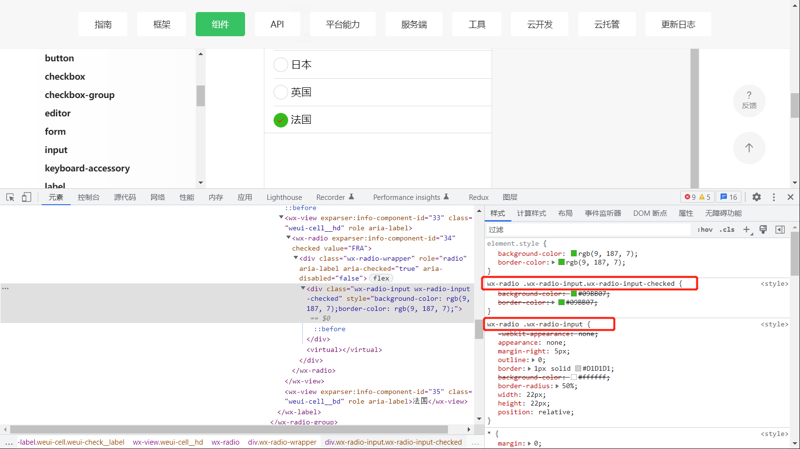

# 微信小程序内置组件radio修改大小

---

## 前言

- 修改`radio`内置组件的大小样式，发现通过设置`css`样式不能达到修改圆圈大小的效果，查阅官方文档，没有发现相关资料，查询社区，全是上来就是修改某些选择器（一开始不知道从何而来的），后经查阅相关网上资料，以及实践得出解决方案如下

## 解决方案

- 通过修改`.wx-radio-input`这个类名可以改变圆圈的大小

  ```css
  /* 未选中的样式 */
  radio .wx-radio-input {
  	box-sizing: border-box !important;
  	margin: 0 !important;
  	padding: 0 !important;
  	width: 32rpx !important;
  	height: 32rpx !important;
  }
  
  /* 选中后 背景及勾 的样式 */
  radio .wx-radio-input.wx-radio-input-checked{
  	border-color: #F0302F !important;
  	background: #F0302F !important;
  }
  
  radio .wx-radio-input.wx-radio-input-checked:before {
    font: normal normal normal 14px/1 "weui";
    content: "\EA08";
  	color: #fff;
    font-size: 18px;
    position: absolute;
    top: 50%;
    left: 50%;
    transform: translate(-50%, -48%) scale(0.73);
    -webkit-transform: translate(-50%, -48%) scale(0.73);
  }
  ```

- 这些类名怎么来的？

- 官方网页文档中有在线示例，打开控制台找到对应组件就能看到了

  

## 相关资料

- 获取小程序各个组件的默认样式：https://blog.csdn.net/Robin_star_/article/details/83269955
- 小程序更改`checkbox`和`radio`默认样式：https://developers.weixin.qq.com/community/develop/doc/0002c84233032862c6f6bb13256404