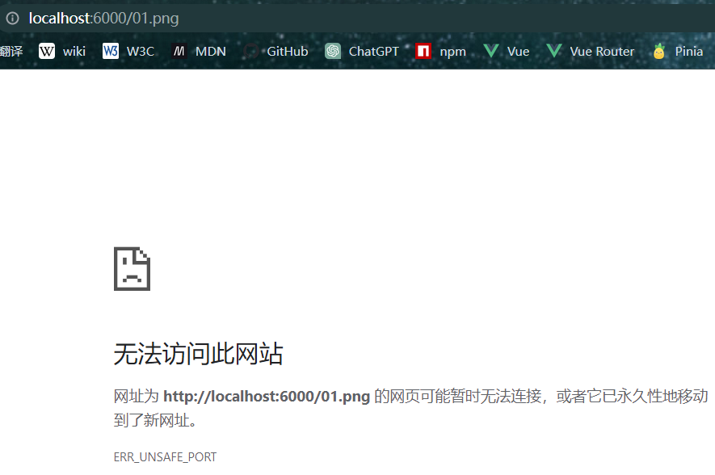

## 前言

- 在测试 `koa` 中部署静态资源时，监听的服务端口为 `6000`，在 `google` 浏览器中使用`localhost:6000`去访问某张图片时，浏览器报 `ERR_UNSAFE_PORT` 错误（其他一些浏览器也是如此），使用 `postman` 测试无问题，浏览器报错信息如下：



- 代码如下：

  ```js
  const Koa = require('koa')
  const static = require('koa-static')
  
  const app = new Koa()
  
  app.use(static('./uploads')) // 图片 01.png 在 uploads 文件夹下
  
  app.listen(6000, () => {
    console.log('koa server running~')
  })
  ```


## 原因

- 出现 `ERR_UNSAFE_PORT` 的原因，是因为浏览器为了安全考虑，会阻止一些端口访问，一般包含如下端口：

  ```js
  1,      // tcpmux
  7,      // echo
  9,      // discard
  11,     // systat
  13,     // daytime
  15,     // netstat
  17,     // qotd
  19,     // chargen
  20,     // ftp data
  21,     // ftp access
  22,     // ssh
  23,     // telnet
  25,     // smtp
  37,     // time
  42,     // name
  43,     // nicname
  53,     // domain
  69,     // tftp
  77,     // priv-rjs
  79,     // finger
  87,     // ttylink
  95,     // supdup
  101,    // hostriame
  102,    // iso-tsap
  103,    // gppitnp
  104,    // acr-nema
  109,    // pop2
  110,    // pop3
  111,    // sunrpc
  113,    // auth
  115,    // sftp
  117,    // uucp-path
  119,    // nntp
  123,    // NTP
  135,    // loc-srv /epmap
  137,    // netbios
  139,    // netbios
  143,    // imap2
  161,    // snmp
  179,    // BGP
  389,    // ldap
  427,    // SLP (Also used by Apple Filing Protocol)
  465,    // smtp+ssl
  512,    // print / exec
  513,    // login
  514,    // shell
  515,    // printer
  526,    // tempo
  530,    // courier
  531,    // chat
  532,    // netnews
  540,    // uucp
  548,    // AFP (Apple Filing Protocol)
  554,    // rtsp
  556,    // remotefs
  563,    // nntp+ssl
  587,    // smtp (rfc6409)
  601,    // syslog-conn (rfc3195)
  636,    // ldap+ssl
  993,    // ldap+ssl
  995,    // pop3+ssl
  1719,   // h323gatestat
  1720,   // h323hostcall
  1723,   // pptp
  2049,   // nfs
  3659,   // apple-sasl / PasswordServer
  4045,   // lockd
  5060,   // sip
  5061,   // sips
  6000,   // X11
  6566,   // sane-port
  6665,   // Alternate IRC [Apple addition]
  6666,   // Alternate IRC [Apple addition]
  6667,   // Standard IRC [Apple addition]
  6668,   // Alternate IRC [Apple addition]
  6669,   // Alternate IRC [Apple addition]
  6697,   // IRC + TLS
  10080,  // Amanda
  ```
  
  
  
  

## 解决

- 方式一（推荐）
  - 直接改网站监听的端口就行了，不要使用受限制的端口即可

- 方式二（不推荐）
  - 手动修改浏览器的默认安全端口限制


