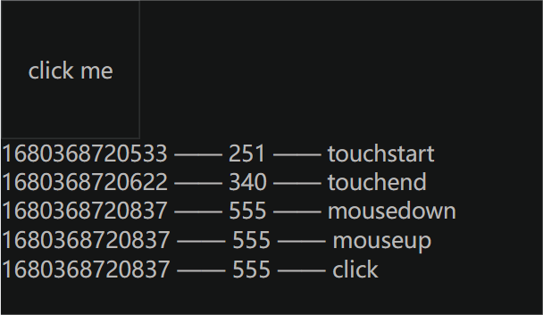

# 前言

- `pc` 端鼠标事件：

  - `click` 鼠标点击
  - `mousedown` 鼠标按下
  - `mousemove` 鼠标移动
  - `mouseup` 鼠标抬起

- 移动端触屏事件：

  - `touchstart` 触摸开始
  - `touchmove` 触摸移动
  - `touchend` 触摸结束

- 测试案例：

  ```html
  <!DOCTYPE html>
  <html lang="zh-CN">
  <head>
    <meta charset="UTF-8">
    <!-- <meta http-equiv="X-UA-Compatible" content="IE=edge"> -->
    <!-- <meta name="viewport" content="width=device-width, initial-scale=1.0"> -->
    <title>Document</title>
    <style>
  		html, body {
        width: 100%;
        height: 100%;
  			margin: 0;
  			padding: 0;
        font-size: 32px;
  		}
  		.box {
        width: 200px;
  			height: 200px;
  			line-height: 200px;
  			text-align: center;
  			border: 2px solid #ccc;
  		}
  	</style>
  </head>
  <body>
  	<div class="box">click me</div>
  	<script>
  		var startTime = +new Date()
  
  		function printInfo(e) {
  			var div = document.createElement("div")
  			div.innerHTML = `${+new Date()} —— ${+new Date() - startTime} —— ${e.type}`
  			document.body.appendChild(div)
  		};
  		
  		var box = document.querySelector('.box')
  		box.addEventListener('mousedown', printInfo) // 鼠标按下
  		box.addEventListener('click', printInfo) // 鼠标点击
  		box.addEventListener('mouseup', printInfo) // 鼠标抬起
  		box.addEventListener('touchstart', printInfo) // 触屏开始
  		box.addEventListener('touchend', printInfo) // 触屏结束
  	</script>
  </body>
  </html>
  ```

  - 测试结果：

    - `chrome devtool`：移动端中 `click` 事件触发有 `300ms` 延迟

      

    - 安卓`v12`真机 => 微信`v8.0.33`内置浏览器：无 `300ms` 延迟，推测微信内部有解决问题

      

    - 安卓`v12`真机 => 默认浏览器：有 `300ms` 延迟

      


# 结论

- 事件触发顺序：`touchstart => touchend => mousedown => mouseup => click`
- 移动端 `click` 事件有 `300ms` 延迟，微信安卓版本中内部有处理该延迟问题，微信iOS版本未知待测


# 解决

- 方式一：

  - 设置如下 `meta` 标签 `name` 属性 `viewport` 

    ```html
    <meta name="viewport" content="width=device-width, initial-scale=1.0">
    ```

- 方式二：

  - 封装自定义 `click` 事件，这里以 `jq` 进行封装

    ```js
    var _g.event = 'ontouchstart' in window // `ontouchstart` 移动端特有属性
      ? {start: 'touchstart', move: 'touchmove', end: 'touchend'}
    : {start: 'mousedown', move: 'mousemove', end: 'mouseup'}
    
    $.fn.tap = function(cb) {
      var {start, end} = _g.event
      var isMobile = start == 'touchstart'
      this.on(start, e => {
        var {pageX, pageY} = isMobile 
        ? e.changedTouches[0]
        : e
        this._timeStart = Date.now()
        this._posStart = [pageX, pageY]
        e.preventDefault() // 防止图片拖拽等
      })
      this.on(end, e => {
        var {pageX, pageY} = isMobile 
        ? e.changedTouches[0]
        : e
        var 
        isMove = false, 
            distLimit = 10,
            distX = Math.abs(this._posStart[0] - pageX),
            distY = Math.abs(this._posStart[1] - pageY)
        if (distX > distLimit || distY > distLimit) isMove = true
        if (!isMove && Date.now() - this._timeStart <= 300) cb(e)
        e.preventDefault()
      })
    }
    
    // 使用
    $('.rule-btn').tap(e => {
      console.log('tap', +new Date())
    })
    ```

- 方式三：借助一些第三方库，如 `fastclick` 等

