# 一. Java 知识脉络图

---

## 01. Java 基础全程脉络图


## 02. 本章专题与脉络

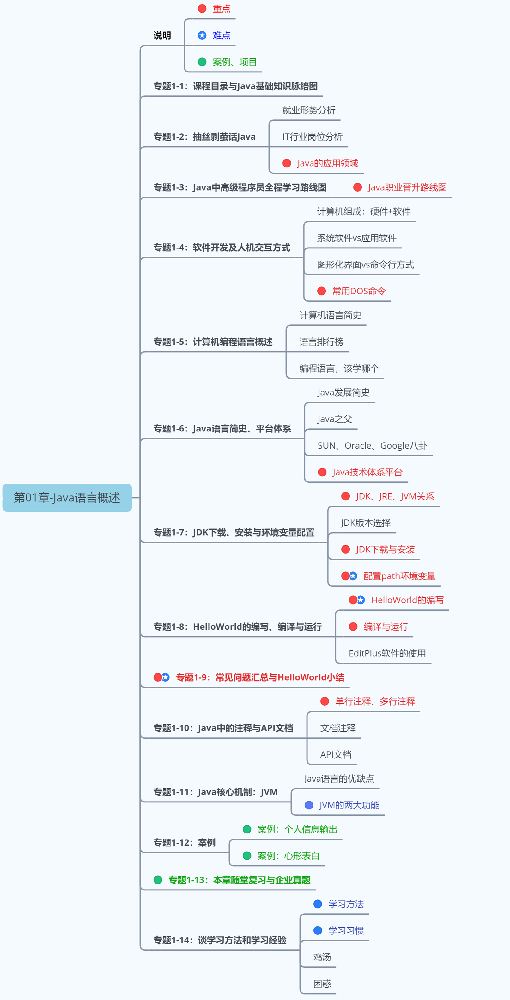


# 二. 抽丝剥茧话 Java

---

## 01. 当前大学生就业形势

- 麦可思研究院 发布了《2022年中国大学生就业报告》，针对2021届毕业生收入较高的本科专业排行榜：

  

- 麦可思研究院 发布过《2021年中国大学生就业报告》，应届本科毕业生就业数量较大的前十位行业类的就业质量：

  

- 报告还对毕业三年后的2017届毕业生所在十大行业进行了统计：

  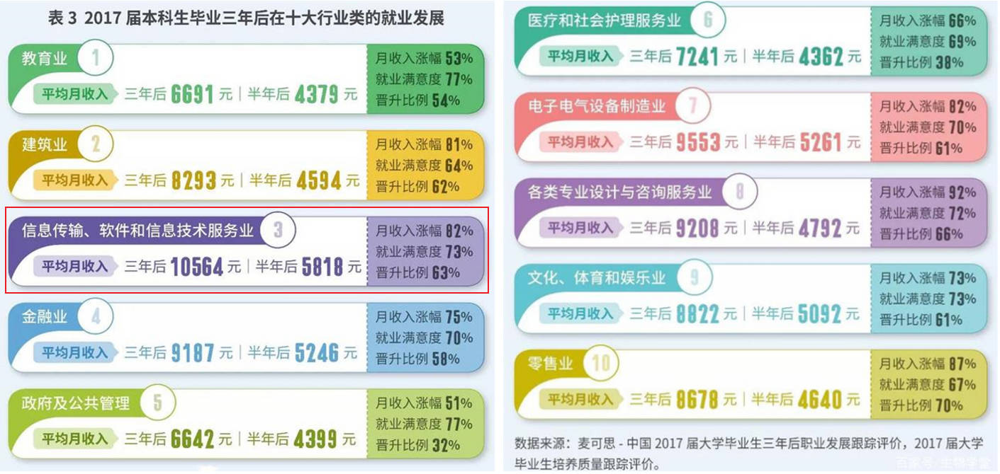

- 从国家统计局发布的2021年全国平均工资来看，不管在城镇非私营单位还是私营单位，IT业均为最高

## 02. IT互联网是否依旧靠谱

- 过去不能代表未来！互联网是否依旧靠谱？！

  

- 2014 年至 2018 年间，我国网民规模从 6.49 亿增长为 8.29 亿，增幅为 `27.5%`。同一时间段，全国移动互联网接入的流量却从 20.6EB 增长到了 711.1EB，增幅达 `3352%`（获取和处理的信息量大幅增加）

- 随着 5G 技术进一步拓宽移动互联网的速度和容量，`产业互联网`将在消费型流量的基础上创造生产型流量，根据报告的预测，至 2024 年，全国移动互联网的接入流量将达到 127663.8EB， `流量规模达到2018年的179.5倍`

- 当下，5G、物联网、人工智能、产业互联网都是国家政策大方向，需要大量`能与机器对话`的中高端人才

## 03. IT行业岗位分析

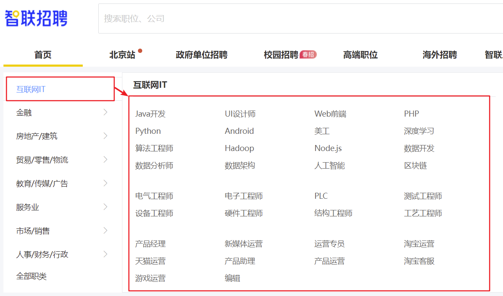

- 软件开发，是进入互联网IT圈最好的选择之一！
  - 起始薪资高、工作环境好、涨薪幅度高、行业更公平


## 04. 软件开发之 Java 开发


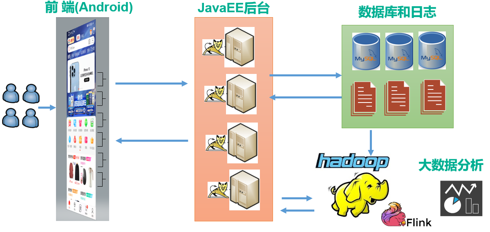

- **移动应用领域（集成 `Android` 平台）**：`Java` 在 `Android` 端是主要开发的语言，占有重要的地位

  

  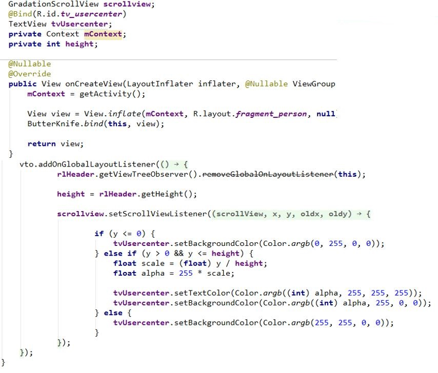

- **企业级应用领域（`JavaEE` 后台）**：用来开发企业级的应用程序，大型网站如淘宝、京东、12306，以及各大物流、银行、金融、社交、医疗、交通、各种 `OA` 系统等都是用 `JavaEE` 技术开发的

  

- **大数据分析、人工智能领域**：流行的大数据框架，如 `Hadoop`、`Flink` 都是用 `Java` 编写的。`Spark` 使用 `Scala` 编写，但可以用 `Java` 开发应用

  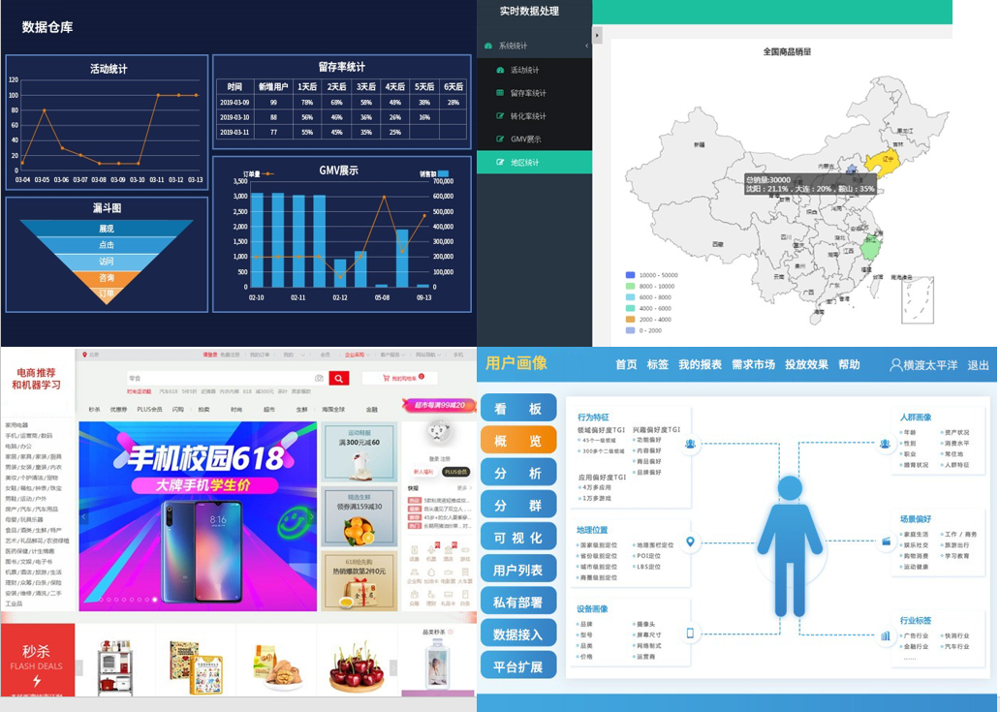

  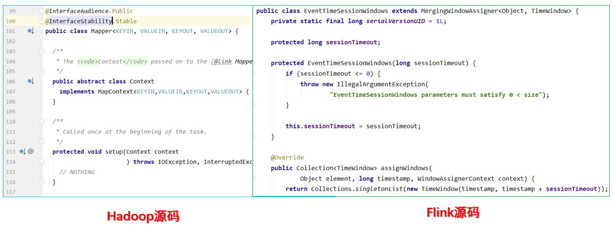

  - `Eversoft` 公司在提到 2022 年 `Java`发展趋势时写道：
    - `Java` 是用于开发大数据项目的最主流的语言。我们可以轻松地预测它也将在之后继续主导大数据！
  
- **游戏领域、桌面应用、嵌入式领域：**很多大型游戏的后台、桌面应用等也是 `Java` 开发的

## 05. 到底多少人在用 Java

- 2020年，根据 IDC 的报告“Java Turns 25”显示，超过 900万 名开发人员（全球专职开发人员中的 `69%`）在使用 `Java` ——比其他任何语言都多。该报告指出，大多数企业业务服务都依靠 `Java` 来实现。

- `Java` 一直是开发人员中最流行的编程语言，被誉为“`宇宙第一语言`”

- 我想告诉大家：
  - “市场的需求比较大，市场的供给比较大”
  - “如果你在 `Java` 领域里持续积累5-7年以上，那么你至少会成为这个行业的一个专家！”

## 06. 八卦一下程序员

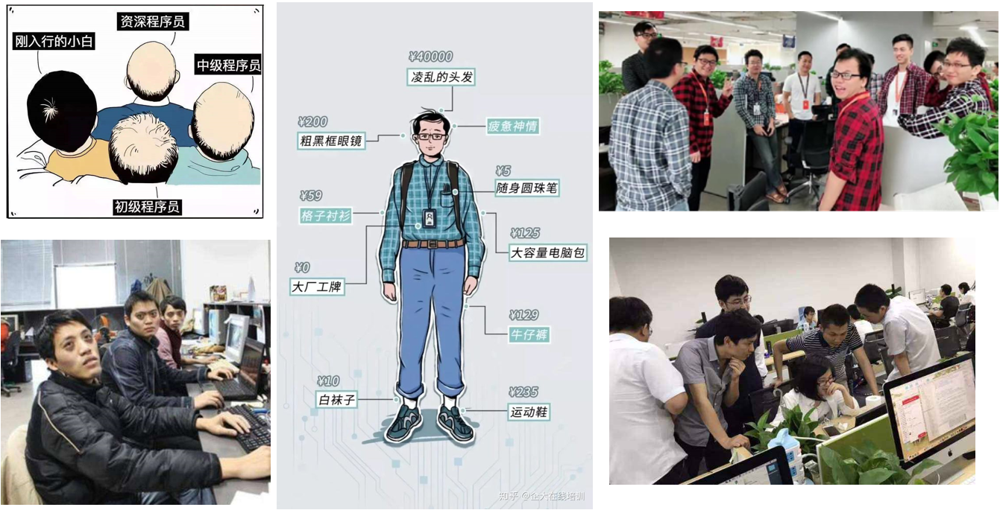

- 还可以是：


## 07. Java 系列课程体系

- 见02_学习路线图之《Java中高级程序员全程学习路线图.xmind》

## 08. Java 职业晋升路线图

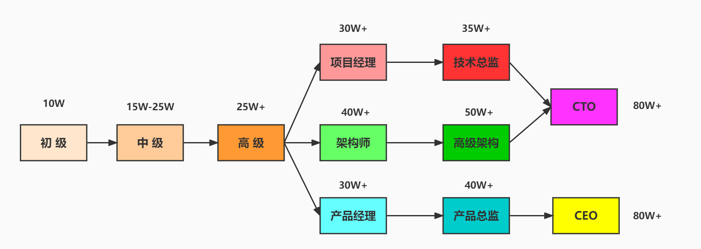

- 薪资数据统计来源：拉勾网


# 三. 计算机的硬件与软件

---

## 01. 计算机组成：硬件 + 软件


## 02. CPU、内存与硬盘

- **CPU（Central Processing Unit，中央处理器）**
  
  - 人靠大脑思考，电脑靠 CPU 来运算、控制
  
- **硬盘（Hard Disk Drive）**
  
  - 计算机最主要的存储设备，容量大，**断电数据不丢失**
  - 正常分类：机械硬盘HDD、固态硬盘SSD 以及 混合硬盘SSHD
  - **固态硬盘在开机速度和程序加载速度远远高于机械硬盘**，缺点就是贵，所有无法完全取代机械硬盘
  
- **内存（Memory）**
  
  - 负责硬盘上的数据与 CPU 之间数据交换处理
  
  - 具体的：保存从硬盘读取的数据，提供给 CPU 使用；保存 CPU 的一些临时执行结果，以便 CPU 下次使用或保存到硬盘
  
  - **断电后数据丢失**
  
    

## 03. 输入设备：键盘输入

- 熟悉指法

  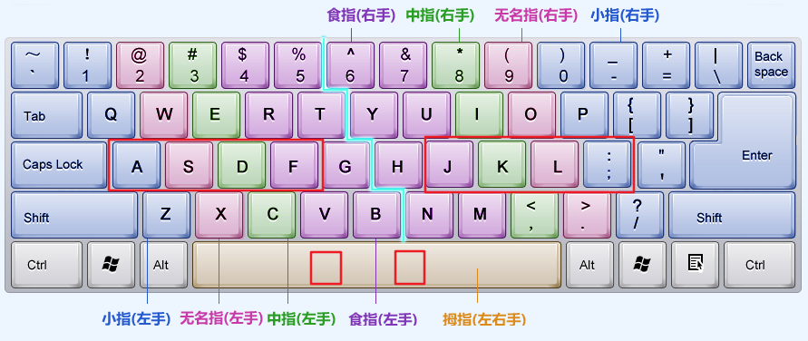

- 不熟悉键盘的小伙伴，可以“金山打字通”走起了。坚决杜绝二指禅！！

  


# 四. 软件相关介绍

---

## 01. 什么是软件

- 软件，即一系列按照特定顺序组织的计算机数据和指令的集合。有**系统软件**和**应用软件**之分
- Pascal之父 Nicklaus Wirth： “Programs = Data Structures + Algorithms”

- 系统软件：

  

- 应用软件：

  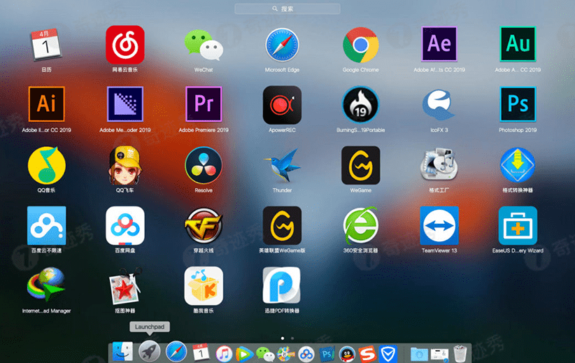

## 02. 人机交互方式

- **图形化界面**（Graphical User Interface，`GUI`），这种方式简单直观，使用者易于接受，容易上手操作

- **命令行方式**（Command Line Interface，`CLI`），需要在控制台输入特定的指令，让计算机完成一些操作。需要记忆一些指令，较为麻烦

## 03. 常用的 DOS 命令

- `DOS`（Disk Operating System，**磁盘操作系统**）是 `Microsoft` 公司在 `Windows` 之前推出的一个操作系统，是单用户、单任务（即只能执行一个任务）的操作系统。现在被 `Windows` 系统取代（集成）

- 对于 `Java` 初学者，学习一些 `DOS` 命令，会非常有帮助


- 进入 `DOS` 操作窗口：


    - 按下 `Windows + R` 键盘，打开运行窗口，输入 `cmd` 回车，进入到 `DOS` 的操作窗口
    
      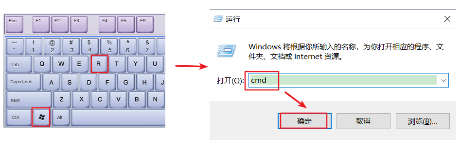


- **常用指令：**

  - 进入和回退

    | 操作                | 说明                                |
    | ------------------- | ----------------------------------- |
    | 盘符名称:           | 盘符切换。如：E:回车，表示切换到E盘 |
    | dir                 | 列出当前目录下的文件以及文件夹      |
    | cd 目录             | 进入指定单级目录                    |
    | cd 目录1\目录2\\... | 进入指定多级目录。cd atguigu\JavaSE |
    | cd ..               | 回退到上一级目录                    |
    | cd \ 或 cd /        | 回退到盘符目录                      |

  - 增、删

    | 操作          | 说明                                                         |
    | ------------- | ------------------------------------------------------------ |
    | md 文件目录名 | 创建指定的文件目录                                           |
    | rd 文件目录名 | 删除指定的文件目录（只能删除空文件夹，若文件目录内有数据，则无法删除） |
    | del 文件名    | 删除指定的文件                                               |

  - 其它

    | 操作                    | 说明               |
    | ----------------------- | ------------------ |
    | cls                     | 清屏               |
    | exit                    | 退出命令提示符窗口 |
    | ←  →                    | 移动光标           |
    | ↑  ↓                    | 调阅历史操作命令   |
    | `Delete` 和 `Backspace` | 删除字符           |


# 五. 计算机编程语言

---

## 01. 计算机语言是什么

- **语言**：是人与人之间用于沟通的一种方式
  - 例如：中国人与中国人用普通话沟通，而中国人要和英国人交流，可以使用英语或普通话
- **计算机编程语言**，就是人与计算机交流的方式
  - 人们可以使用 `编程语言` 对计算机下达 `命令`，让计算机完成人们需要的功能
- 计算机语言有很多种。如：C、C++、Java、Go、JavaScript、Python，Scala 等
- 体会：语言 = 语法 + 逻辑

## 02. 计算机语言简史

* **第一代：机器语言（相当于人类的石器时代）**

  * 1946年2月14日，世界上第一台计算机 ENAC 诞生，使用的是最原始的 **穿孔卡片**

  * 这种卡片上使用的是用 **二进制代码** 表示的语言，与人类语言差别极大，这种语言就称为机器语言

  * 比如一段典型的机器码：

    ```
    1.	0000,0000,000000010000 代表 LOAD A, 16
    2.	0000,0001,000000000001 代表 LOAD B, 1
    3.	0001,0001,000000010000 代表 STORE B, 16
    ```

  * 这种语言本质上是计算机能识别的唯一语言，人类很难理解。可以大胆想象"此时的程序员99.9%都是异类！"

    

* **第二代：汇编语言（相当于人类的青铜&铁器时代）**

  * 使用**英文缩写的助记符**来表示基本的操作，这些助记符构成了汇编语言的基础

  * 比如：`LOAD`、`MOVE` 等，使人更容易使用。因此，汇编语言也称为**符号语言**

  * 优点：能编写高效率的程序

  * 缺点：汇编语言是面向机器的，不同计算机机型特点不同，因此会有不同的汇编语言，彼此之间**不能通用**。程序不易移植，较难调试

    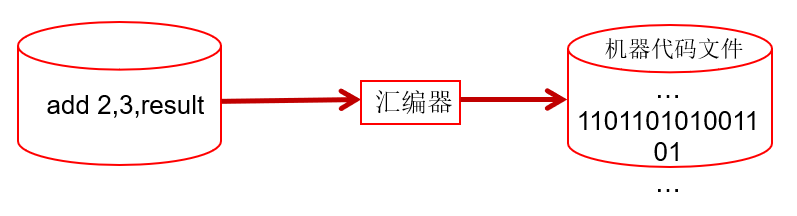

  * 比起机器语言，汇编大大进步了，是机器语言向更高级的语言进化的桥梁

  * 目前仍然应用于工业电子编程领域、软件的加密解密、计算机病毒分析等

* **第三代：高级语言（相当于人类的信息时代）**

  * 高级语言发展于20世纪50年代中叶到70年代，是一种接近于人们使用习惯的程序设计语言

  * 它允许程序员使用**接近日常英语的指令**来编写程序，程序中的符号和算式也与日常用的数学式子差不多，接近于自然语言和数学语言，容易为人们掌握。比如：

    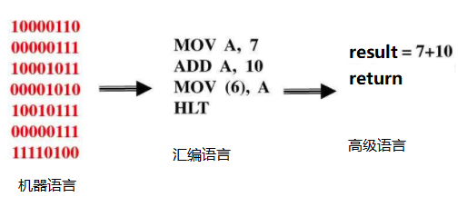

  * 高级语言**独立于机器，有一定的通用性**

  * 计算机不能直接识别和执行用高级语言编写的程序，**需要使用编译器或解释器，转换为机器语言才能被识别和执行**

    

    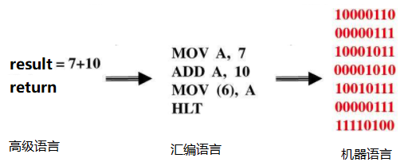

  - 此外，高级语言按照程序设计方法的不同，又分为：**面向过程**的语言、**面向对象**的语言
  - `C`、`Pascal`、`Fortran` 面向过程的语言
  - `C++` 面向过程/面向对象
  - `Java` 跨平台的纯面向对象的语言
  - `C#`、`Python`、`JavaScript`、`Scala`…

* 目前以及可预见的将来，计算机语言仍然处于“第三代高级语言”阶段。但是不管是什么语言，最后都要向机器语言靠近，因为 `CPU` 只认识 `0` 和 `1`

## 03. 计算机语言排行榜

- TIOBE （https://www.tiobe.com/tiobe-index/）是一个流行编程语言排行，每月更新。排名权重基于世界范围内 工程师数量，Google、Bing、Yahoo! 、Wikipedia、Amazon、Youtube和百度这些主流的搜索引擎，也将作为排名权重的参考指标

  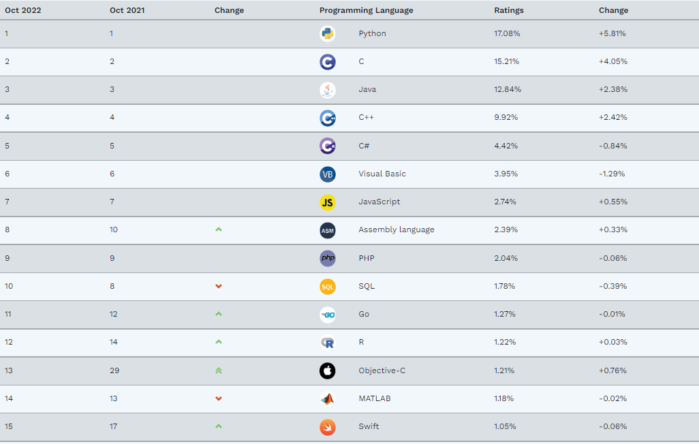

- 计算机语言走势

  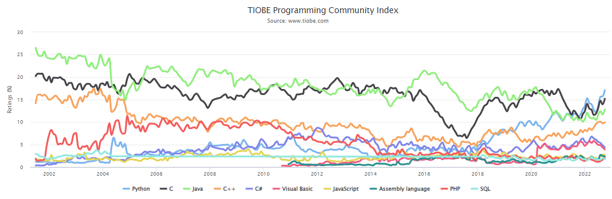

## 04. 编程语言，该学哪个？

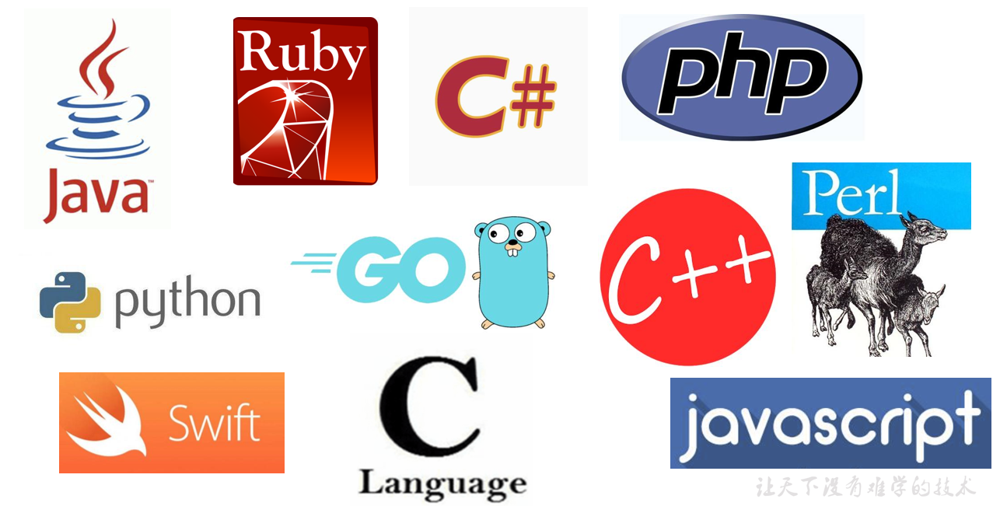

- 网传的编程语言鄙视链：

  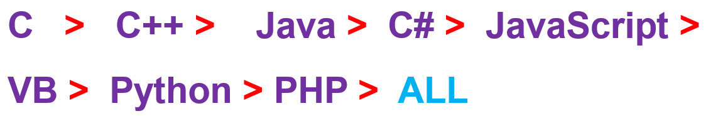

- **C语言：万物之源**
  
  - 诞生于1972年，由AT&T公司旗下贝尔实验室创建完成，用于构建 `Unix` 操作系统
  - 偏向计算机底层操作（操作系统、网络、硬件驱动等）
  - 优势：几乎所有现代编程语言都脱胎于 `C`
  - 劣势：相当陡的学习曲线；不支持面向对象编程


- **C++语言：最复杂最难的语言**
  - 诞生于1983年，作为 `C` 语言的增强方案、升级版本。`C++` 是 `C` 语言的超集，`C` 语言的大部分知识也适用于 `C++`
  - 用途：`windows` 或 `MacOS UI`、`office` 全家桶、主流的浏览器、`Oracle`、`MySQL`、著名的游戏引擎（如星际争霸、魔兽世界）等
  - 优势：很多公司都用 `C++` 开发核心架构，如 Google、腾讯、百度、阿里云等；面向对象性
  - 劣势：体系极为庞大，这是世界目前来说最复杂也是最难的编程语言


- **C# 语言：背靠大树(微软)的语言**
  - 诞生于2000年，一款强大而灵活的编程语言。靠着微软这棵大树，是多年来 `windows` 平台的一门主流编程语言
  - 用途：`windows` 桌面应用开发、`Windows Azure`、游戏开发


- PHP 语言：最好的语言？
  - 诞生于1994年，一款**服务器端脚本语言**。最初表示个人主页（Personal Home Page）
  - `PHP` 语法和 `C` 类似，有很多的模板和框架，简单易懂，也许你可以在短短几天做出 `web app`。它主要用于 `web` 端，快速建站网络开发
  - 劣势：学习门槛太低、其**代码运行速度相对较低**于大部分编程语言党争对手


- **Python：易学的语言**
  - 诞生于1991年，一种面向对象的语言，虽然运行效率不高，但是开发效率非常高
  - 被称为胶水语言，哪里都可以用


- **JavaScript语言：前端为王**
  - 诞生于1995年，网景公司开发完成
  - 是目前所有主流浏览器上唯一支持的脚本语言。在前端开发中，占有不可替代的地位


- **Java语言：需求最多也最不缺人**
  - 创建于1995年，是一种面向对象、基于类的编程语言
  - 可能是目前运用最广的项目语言。代码稳定性超过 `C` 和 `C++`，生产力远超 `C` 和 `C++`。有 `JVM` 在，可以轻松地跨平台
  - 具有强大的开源开发工具，大量的开源共享库
  - 拥有世界上数量最多的程序员，最不缺人


- Go语言：夹缝中生存
  - 现在很受关注，它是取代 `C` 和 `C++` 的另一门有潜力的语言
  - `C` 语言太原始了，`C++` 太复杂了，`Java` 太高级了，所以 `Go` 语言就在这个夹缝中出现了
  - 已成为云计算领域事实上的标准语言，尤其是在`Docker/Kubernetes` 等项目中
  - 语法特别简单，你有了 `C` 和 `C++` 的基础，学习 `Go` 的学习成本基本为零
  - `Go` 社区从 `Java` 社区移植了各种优秀的框架或库


> 总结：
>
> - 程序设计语言有很多种，每种语言都是为了实现某个特定的目的而发明的
> - **没有“最好”的语言，只有在特定场景下相对来说，最适合的语言而已**
> - 如果你掌握了一种编程语言，也会更容易上手其它的编程语言。关键是学习如何使用程序设计方法来解决问题
> - `Talk is cheap，Show me the code`


# 六. Java 语言概述

---

## 01. Java 概述

- 是 **`SUN`**(Stanford University Network，斯坦福大学网络公司 ) **1995年**推出的一门高级编程语言
- 是一种面向 `Internet` 的编程语言。`Java` 一开始富有吸引力是因为 `Java` 程序可以在 `Web` 浏览器中运行
- 这些 `Java` 程序被称为 `Java` 小程序（`applet`），内嵌在 `HTML` 代码中
- 伴随着互联网的迅猛发展，以及 `Java` 技术在 `web` 方面的不断成熟，已经成为 `Web` 应用程序的首选开发语言

## 02. Java 语言简史

- **起步阶段：**

  - 1991年，Sun公司的工程师小组想要设计一种语言，应用在电视机、电话、闹钟、烤面包机等`家用电器的控制和通信`。由于这些设备的`处理能力`和`内存`都很有限，并且不同的厂商会选择不同的中央处理器(CPU)，因此这种语言的关键是`代码短小`、`紧凑`且`与平台无关`（即不能与任何特定的体系结构捆绑在一起）。

  - Gosling团队率先创造了这个语言，并命名为“`Oak`"（起名的原因是因为他非常喜欢自己办公室外的橡树)。后因智能化家电的市场需求没有预期的高，Sun公司放弃了该项计划。

  - 随着20世纪90年代互联网的发展，Sun公司发现该语言在互联网上应用的前景，于是改造了Oak，于1995年5月以Java的名称正式发布（Java是印度尼西亚`爪哇岛`的英文名称，因盛产咖啡而闻名）。

    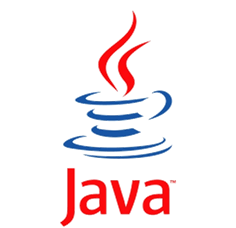

- **发展阶段：**

  |   发行版本    |    发行时间    |                             备注                             |
  | :-----------: | :------------: | :----------------------------------------------------------: |
  |   Java 1.0    |   1996.01.23   |             Sun公司发布了Java的第一个开发工具包              |
  |   Java 1.1    |   1997.02.19   |        JavaOne会议召开，创当时全球同类会议规模之最。         |
  |   Java 1.2    |   1998.12.08   |  Java拆分成：J2SE（标准版）、J2EE（企业版）、J2ME（小型版）  |
  |   Java 1.3    |   2000.05.08   |                                                              |
  |    Java1.4    |   2004.02.06   |                                                              |
  | **Java 5.0**  | **2004.09.30** | **①版本号从1.4直接更新至5.0；②平台更名为JavaSE、JavaEE、JavaME** |
  |   Java 6.0    |   2006.12.11   |               2009.04.20 Oracle宣布收购SUN公司               |
  |               |   2009.04.20   |             Oracle公司收购SUN，交易价格74亿美元              |
  |   Java 7.0    |   2011.07.02   |                                                              |
  | **Java 8.0**  | **2014.03.18** | **此版本是继Java 5.0以来变化最大的版本。是长期支持版本（LTS）** |
  |   Java 9.0    |   2017.09.22   | ①此版本开始，**每半年更新一次**；②**Java 9.0开始不再支持windows 32位系统** |
  |   Java 10.0   |   2018.03.21   |                                                              |
  | **Java 11.0** | **2018.09.25** |    **JDK安装包取消独立JRE安装包，是长期支持版本（LTS）**     |
  |   Java 12.0   |   2019.03.19   |                                                              |
  |      ...      |      ...       |                                                              |
  | **Java17.0**  |  **2021.09**   |     **发布Java 17.0，版本号也称为21.9，是长期支持版本**      |
  |      ...      |      ...       |                                                              |
  |   Java19.0    |    2022.09     |                发布Java19.0，版本号也称为22.9                |


## 03. Java之父


- **詹姆斯·高斯林**(James Gosling)先生以“Java 技术之父”而闻名于世。他是 `Java` 技术的创始人，他亲手设计了 `Java` 语言，并开发了 `Java` 编译器和 `Java` 虚拟机，使 `Java` 成为了世界上最流行的开发语言
- `James Gosling` 于1984 年加入 `Sun` 公司，并一直服务于 `Sun` 公司，直至2010年前后，`Sun` 被 `Oracle` 并购而加入 `Oracle`，担任客户端软件集团的首席技术官，2010年4月从 `Oracle` 离职

## 04. 公司八卦

- **SUN 与 Oracle**

  - `SUN` 是一家极具创新能力的公司，2001年 “9.11”以前，SUN公司市值超过1000亿美元。 但是没能利用Java构建一个强有力、可变现的生态系统，没打好Java这张牌。此后，互联网泡沫破裂，硬件需求大幅减少，它的市值在一个月之内跌幅超过90%。**SUN公司的成长用了20年，而衰落只用了1年！**

    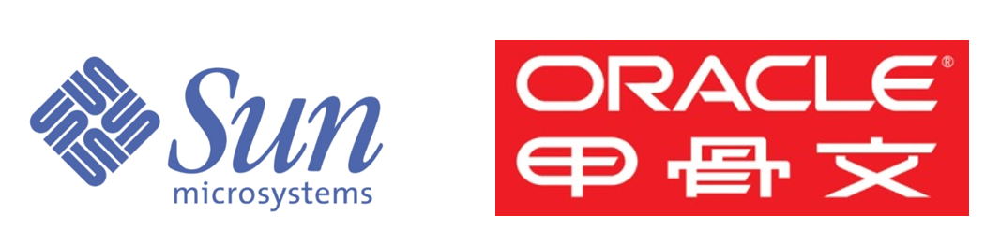


- **Oracle 与 Google**

  - `Google` 和 `Oracle` 的侵权事件：

  - 2010 年 8 月，Oracle 起诉 Google 的 Android 系统侵权，要求赔偿 26 亿美元

    - Oracle认为Google的代码中使用了Java的`37个API`，并且认为Google是故意为之，因为这样做的好处是可以让更多的Java程序员更容易接受Android的代码

    - Oracle认为Android 中有`9行代码`直接抄袭了Java的实现。这9行牛气哄哄的代码都出自一人之手，他就是Java 大牛------`Joshua Bloch`

      ```java
      //Code In OpenJDK / Android ：
      private static void rangeCheck(int arrayLen, int fromIndex, int toIndex) {
        if (fromIndex > toIndex)
          throw new IllegalArgumentException("fromIndex(" + fromIndex +") > toIndex(" + toIndex+")");
        if (fromIndex < 0)
          throw new ArrayIndexOutOfBoundsException(fromIndex);
        if (toIndex > arrayLen)
          throw new 		ArrayIndexOutOfBoundsException(toIndex);
      }
      ```
  
- 2018 年 3 月，美国联邦巡回上诉法院裁决，谷歌侵犯了甲骨文的版权，支付高达88亿美元的赔偿金
  
- 2021 年 4 月，美国最高法院给出了最终裁决：谷歌胜诉，其代码属于“合理使用”的范畴。为期十多年的软件行业“第一版权案”落幕
  
  


## 05. Java 技术体系平台

- **Java SE** (Java Standard Edition)标准版，此版本以前称为 `J2SE`
  
  - 支持**面向桌面级应用开发**（如 `Windows` 下的应用程序）的Java平台，即定位个人计算机的应用开发。
  - 包括用户界面接口 `AWT` 及 `Swing`，网络功能与国际化、图像处理能力以及输入输出支持等。
  
- **Java EE** (Java Enterprise Edition)企业版，版本以前称为 `J2EE`
  
  - 为开发企业环境下的应用程序提供的一套解决方案，即定位 **在服务器端的Web应用开发**
  - JavaEE 是 JavaSE 的**扩展**，增加了用于服务器开发的类库。如：`Servlet` 能够延伸服务器的功能，通过请求-响应的模式来处理客户端的请求；`JSP` 是一种可以将Java程序代码内嵌在网页内的技术。
  
- **Java ME**(Java Micro Edition)小型版，此版本以前称为 `J2ME`
  
  - 支持Java程序**运行在移动终端**（手机、机顶盒）上的平台，即定位在消费性电子产品的应用开发。
  - JavaME是JavaSE的内伸，精简了JavaSE的核心类库，同时也提供自己的扩展类。
  - 增加了适合微小装置的类库：`javax.microedition.io.*`等
  
  

> 注意：
>
> - **`Android` 开发不等同于 `Java ME` 的开发**
> - `java` 目前主要的应用场景：javaEE后台开发、Android客户端开发、大数据的开发


# 七. Java 开发环境搭建

---

## 01. 什么是 JDK、JRE

- **JDK**  (Java Development Kit)：是Java程序**开发工具包**，包含 `JRE` 和开发人员使用的工具
- **JRE ** (Java Runtime Environment) ：是Java程序的**运行时环境，包含 `JVM` 和运行时所需要的核心类库**

- 如下是 Java 8.0 Platform：

  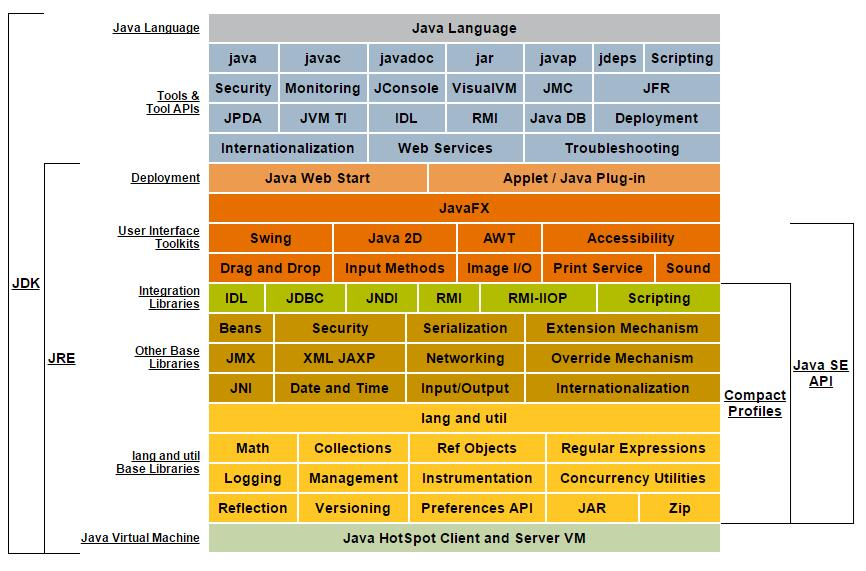

  

> 总结：
>
> - **JDK = JRE + 开发工具集（例如 Javac 编译工具等）**
>
> - **JRE = JVM + Java SE 标准类库**

## 02. JDK 版本选择

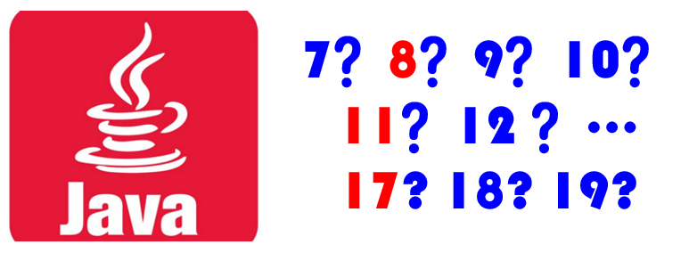

- 自 `Java8` 版本发布以来，其后的每次更新，都会有小伙伴高呼：`Java8 YYDS`！
- 论坛的声音：“你发任你发，我用 `Java8`！”

- 数据说话1：

- JRebel 于2022年4月前后发布了《2022 年Java生态系统状况报告》，报告中提到使用Java11 的占比最多，Java 8 紧随其后，如下图。而此前2020年的报告显示，Java8占比达到了`84.48%`

  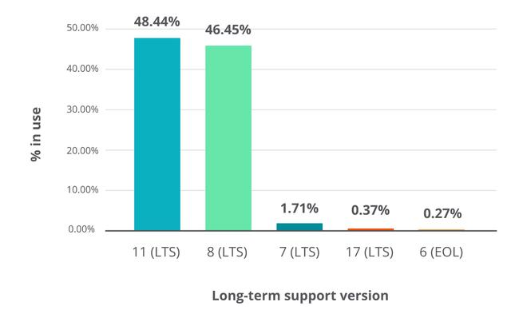

> 我的分析：
>
> - G1 是最受欢迎的 GC 算法， Java11 及更高版本的 G1 收集器是默认的 GC
> - 而 Java8 中并不是，出于对 G1 的喜爱，很多开发者才会选择抛弃 Java8

- 数据说话2：
  - 此外，某美国软件开发商在对近千名专业的 `Java` 开发者调研后，发布的《2022年Java开发者生产力报告》称：八年前发布的 `Java8` 依然是 `Java` 中应用最广泛的版本，占比 `37%`，其次是 `Java11`，占比`29%` 

- 高斯林说话：

  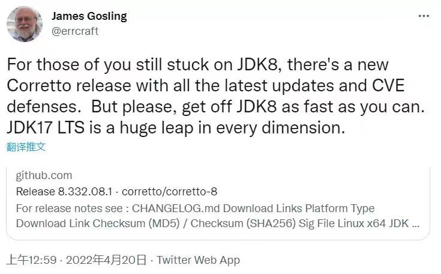

- Spring 框架说话：

  - 在 `Java17` 正式发布之前，Java开发框架 `Spring` 率先在官博宣布，`Spring Framework 6` 和 `Spring Boot 3` 计划在2022年第四季度实现总体可用性的高端基线：
    - `Java17+`（来自 Spring Framework 5.3.x 线中的 Java 8-17）
    - `Jakarta EE 9+`（来自Spring框架5.3.x 线中的 Java EE 7-8）

  - Spring官方说明：https://spring.io/blog/2022/01/20/spring-boot-3-0-0-m1-is-now-available

    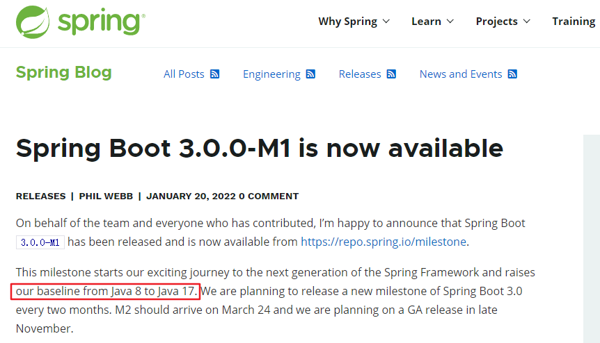

  > 总结：
  >
  > - **springboot3.0是需要用  java17 和 spring6.0 为基础建设**。如果从企业选型最新 springboot3.0 作为架构来说，它搭配 jdk17 肯定是标配了

## 03. JDK 的下载

* 下载网址（Oracle公司官网）：www.oracle.com

* 下载步骤：如图所示，在官网底部选择 Developers 开发者

  

  - 在 Developers 页面中间的技术分类部分，选择 Java，如图所示：

    

  - 进入之后，选择 download，再选择 JavaSE：

    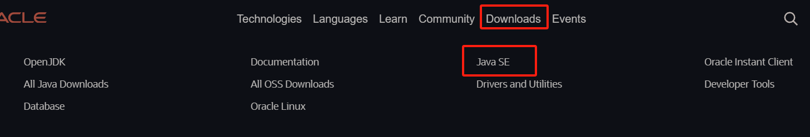

  - 进入之后就是选择安装对应的版本及操作系统，我们这里安装 Jdk17：

    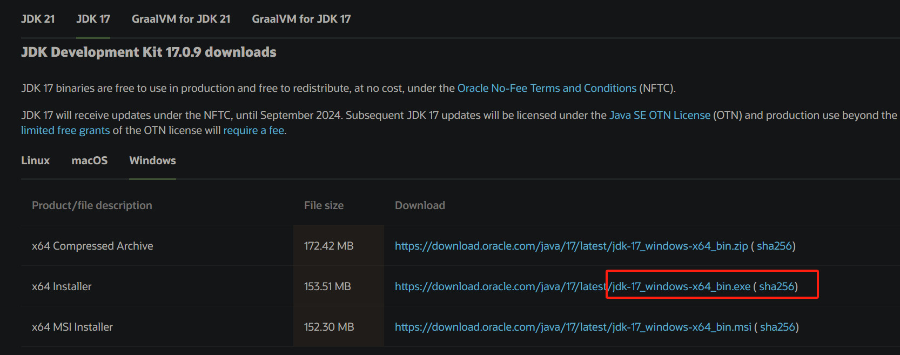

  - 如果需要安装其它版本，可以选择 Java archive：

    

## 04. JDK 的安装

- 安装说明
  - 傻瓜式安装，下一步即可
  - **建议：安装路径不要有中文或者空格等特殊符号**
  - 我们这里会同时安装 JDK8 和 JDK17，并以 JDK17为默认版本进行讲解

* 安装步骤：

  * 双击 `jdk-17_windows-x64_bin.exe` 文件，并单击下一步，如图所示：

    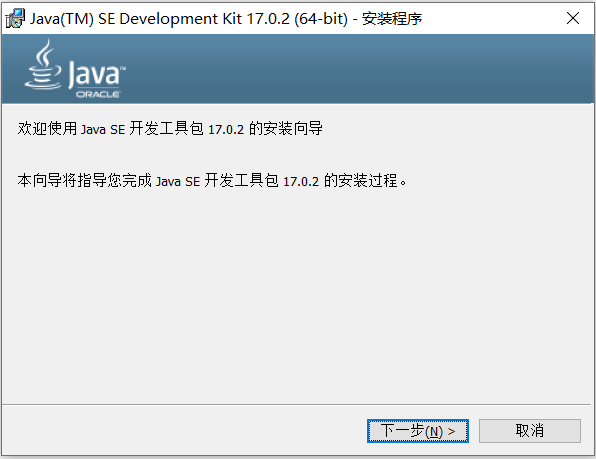

  - 修改安装路径，单击更改，如图所示：

    

  - 将安装路径修改为 `D:\develop_tools\jdk\jdk-17.0.2\`，并单击下一步，如图所示：

    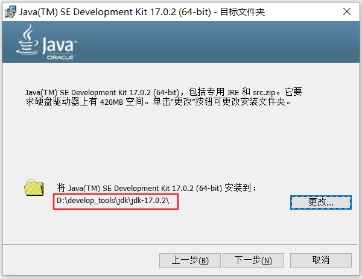

  - 稍后几秒，安装完成，如图所示：

    

## 05. 配置 path 环境变量

### 5.1 理解 path 环境变量

- 什么是 path 环境变量？
  
  - window 操作系统执行命令时，所要搜寻的路径
  
- 为什么配置 path？
  
  - 配置 PATH 是**为了告诉操作系统在哪里可以找到可执行文件**。当你在命令行中输入一个命令时，操作系统会**按照 PATH 变量指定的路径顺序去搜索这个命令对应的可执行文件**。如果没有配置 PATH 或者路径设置不正确，你就需要在执行命令时输入完整的路径，这会变得很不方便。
  
    例如，在 Windows 系统上，如果你将 Python 安装在 `C:\Python39` 目录下，并且将该目录添加到 PATH 变量中，那么无论你在命令行中当前所处的目录是什么，只要你输入 `python` 命令，系统就会找到 `C:\Python39\python.exe` 并执行它，而不需要输入完整的路径。
  
    因此，配置 PATH 可以提高命令行操作的便利性和效率。
  
- 以 JDK 为例演示

  - 我们在 `C:\Users\songhk` 目录下使用 `javac` 命令，结果如下：

    

  - 我们在 `JDK` 的安装目录的 `bin` 目录下使用 `javac` 命令，结果如下：

    

- 我们不可能每次使用 `java.exe`、`javac.exe` 等工具的时候，都进入到 `JDK` 的安装目录下，太麻烦了

- 这时就需要配置 path 环境变量，希望在命令行使用 `javac.exe` 等工具时，任意目录下都可以找到这个工具所在的目录

### 5.2 JDK8 配置方案1：只配置 path

* 步骤：

  * 打开桌面上的计算机，进入后在左侧找到**此电脑**，单击鼠标**右键**，选择**属性**：

    

  - 选择**高级系统设置**：

    

  - 在**高级**选项卡，单击**环境变量**：

    

  - 在**系统变量**中，**选中 `Path` 环境变量**，双击或点击**编辑**：

    

  - 点击新建，填入 `Jdk` 安装目录下 `bin` 文件目录如 `D:\xxx\jdk\jdk1.8.0_271\bin`  ，并将此值 **上移 到变量列表的首位**：

  - 编辑模式1：

    

  - 编辑模式2：（注意，结尾需要有英文模式下的分号;）

    

环境变量配置完成，**重新打开** `DOS` 命令行，在任意目录下输入 `javac` 或 `java` 命令或 `java -version`，运行成功：

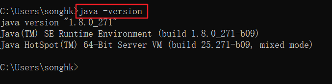

### 5.3 JDK8 配置方案2：配置 JAVA_HOME+path（推荐）

* 步骤：

  * 打开桌面上的计算机，进入后在左侧找到 计算机，单击鼠标右键，选择属性：

    

  - 选择高级系统设置：

    

  - 在高级选项卡，单击环境变量：

    

  - 在系统变量中，单击新建 ，创建新的环境变量：

    

  - 变量名输入 `JAVA_HOME`，变量值输入  `Jdk` 安装目录如 `D:\xxx\jdk\jdk1.8.0_271`，单击确定：

    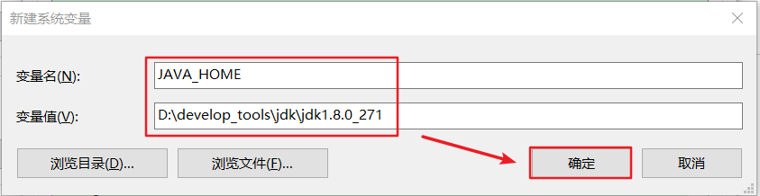

  - 选中 `Path` 环境变量，双击或点击编辑 ：

    

  - 在变量值的最前面，键入 `%JAVA_HOME%\bin`：

    

> 注意：
>
> - 强烈建议将 `%JAVA_HOME%\bin` 声明在 `path` 环境变量中所有变量的最前面！

- 环境变量配置完成，**重启** `DOS` 命令行，在任意目录下输入 `javac` 或 `java` 命令或 `java -version`，运行成功：

  

> 注意：
>
> - 有的书籍、论坛、视频上还提到配置 `classpath`，用于指名 `class` 文件识别的路径
> - 其实是没必要的，反而建议大家如果配置了 `classpath` 环境变量，要删除，对于初学者，反而不友好

**小结如下：**


### 5.3 JDK17 配置方案：自动配置

- 不管大家有没有提前安装 `JDK8` 或其它版本 `JDK`，在我们安装完 `JDK17` 之后，理应按 `JDK8` 的方式配置 `path` 环境变量。但是，我们发现在安装完 `JDK17` 以后，配置环境变量之前，执行 `CMD` 指令：

  

- 竟然成功了！而且是17.0.2版本。因为 **JDK17 在安装之后，自动进行了环境变量的配置**。如下：

  

- 这里建议，将 `JDK17` 安装的路径，设置为 `JAVA_HOME`，并将 `%JAVA_HOME%\bin` 上移到首位

  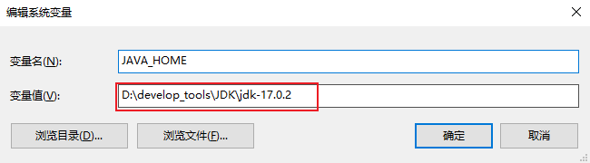

  

> 思考：如果你仍然希望在 `JDK8` 下开发 `Java` 程序？如何做呢？


# 八. 开发体验：HelloWorld

---

- JDK 安装完毕，我们就可以开发第一个 Java 程序了，习惯性的称为：HelloWorld。

## 01. 开发步骤

- Java 程序开发三步骤：**编写**、**编译**、**运行**

  - 将 Java 代码编写到扩展名为 `.java` 的源文件中
  - 通过 `javac.exe` 命令对该 **java 文件**进行**编译**，**生成**一个或多个**字节码文件**

  - 通过 `java.exe` 命令对**生成的 class 文件**进行**运行**

  

## 02. 编写

1. 在 `D:\JavaSE\chapter01` 目录下新建文本文件，完整的文件名修改为 `HelloWorld.java`，其中文件名为 HelloWorld，后缀名必须为 `.java`

   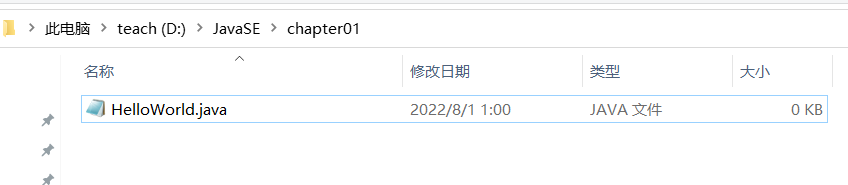

2. 用记事本或 `editplus` 等文本编辑器打开（虽然记事本也可以，但是没有关键字颜色标识，不利于初学者学习）

3. 在文件中输入如下代码，并且保存：

   ```java
   class HelloChina {
     public static void main(String[] args) {
       System.out.println("hello world");
     }
   }
   ```

- 友情提示1：每个字母和符号必须与示例代码一模一样，包括大小写在内
- 友情提示2：

- 或


- 第一个 HelloWord 源程序就编写完成了，但是这个文件是程序员编写的，JVM 是看不懂的，也就不能运行
- 因此我们必须将编写好的 **Java 源文件** 编译成 **JVM 可以看懂**的**字节码文件** ，也就是 **.class 文件**

## 03. 编译

- 在 DOS 命令行中，进入 `D:\JavaSE\chapter01` 目录，**使用 javac 命令进行编译**


- 使用文件资源管理器打开 `D:\JavaSE\chapter01` 目录，然后在地址栏输入 cmd

  

- 命令：

  ```shell
  javac Java源文件名.后缀名java
  ```

- 举例：

  ```shell
  javac HelloWorld.java
  ```

  

- 编译成功后，命令行没有任何提示

- 打开 `D:\JavaSE\chapter01` 目录，发现产生了一个新的文件 `HelloChina.class`，该文件就是编译后的文件，是 Java 的**可运行文件**，称为**字节码文件**，有了字节码文件，就可以运行程序了


## 04. 运行

- 在 DOS 命令行中，在字节码文件目录下，**使用 java 命令进行运行**


- 命令：

  ```shell
  java 主类名字
  ```

- **主类**是指**包含 main 方法的类**，**main 方法是 Java 程序的入口**：

  ```java
  public static void main(String[] args){}
  ```

- 举例：

  ```shell
  # 正确示范：
  java HelloChina
  
  # 错误演示：
  java HelloChina.class
  ```

  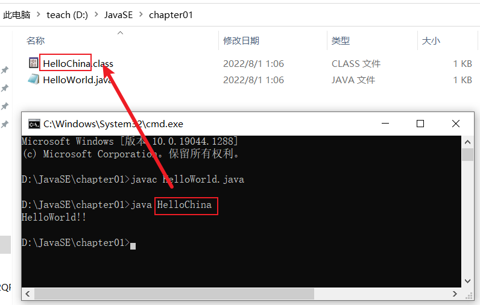

> 总结：
>
> - java 程序编写和执行的过程：
>   1. 编写。将  java 代码编写在 .java 结尾的源文件中
>
>      ```java
>      class HelloWorld {
>        public static void main(String[] args) { 
>          // 固定格式: public static void main
>        }
>      }
>      ```
>
>      
>   
>   2. 编译。使用 javac.exe 对 .java 结尾的**源文件进行编译操作**
>   
>      ```shell
>      javac 源文件名.java
>      ```
>   
>      
>   
>   3. 运行。使用 java.exe 对**编译后生成**的**字节码文件**，**进行解释运行**
>   
>      ```shell
>      java 字节码文件名
>      ```
>
> 注意：
>
> - 每行执行语句结尾须加分号 `;`


# 九. Java 开发工具

---

## 01. 都有哪些开发Java的工具

- 级别一：文本开发工具

  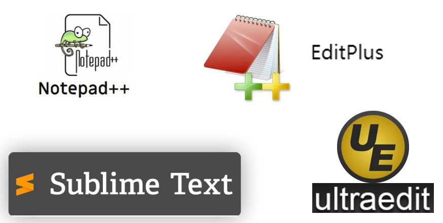

- 级别二：集成开发环境（Integrated Development Environment，IDE）

  - 把代码编写，编译，执行，调试等多种功能综合到一起的开发工具

    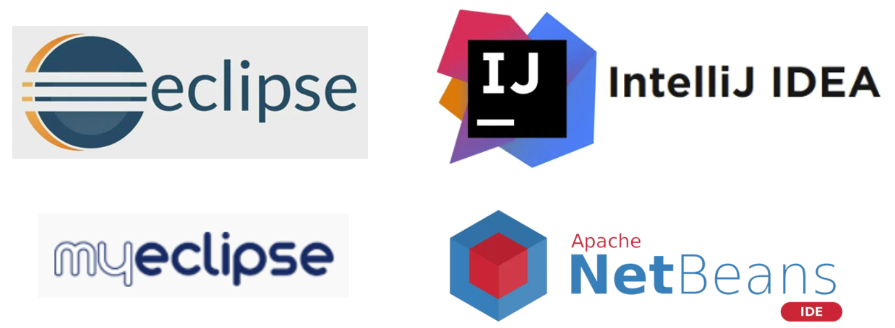


## 02. 如何选择

- 前期我们先使用文本开发工具，培养代码感，利于公司笔、面试


- 后期我们使用 IDE，提供更强大的功能支持


# 十. 常见问题：编译运行路径、字符编码

---

## 01. 拼写问题

*   单词拼写问题

   ```java
   // 正确
   class、String、System、main
     
   // 错误
   Class、string、system、mian
   ```

*   Java 语言是一门**严格区分大小写**的语言

* 	标点符号使用问题
   * **不能用中文符号，英文半角的标点符号**
   * 括号问题，成对出现

## 02. 编译、运行路径问题

- 举例1：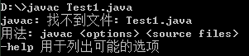

  - 源文件名不存在或写错

  - 当前路径错误

  - 后缀名隐藏问题


- 举例2：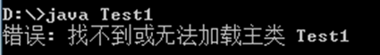

  - 类文件名写错，尤其文件名与类名不一致时，要小心

  - 类文件不在当前路径下，或者不在 `classpath` 指定路径下


## 03. 语法问题

- 举例1：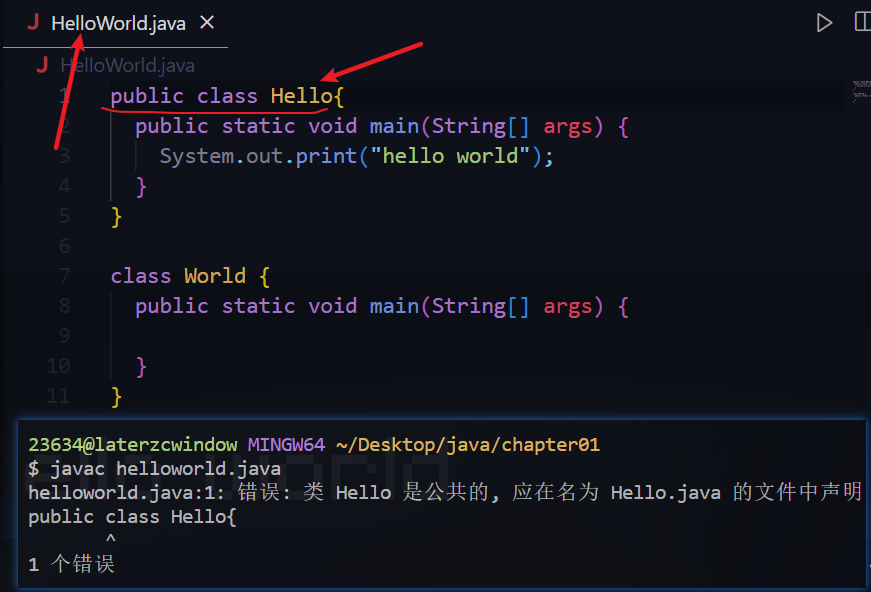
  - **声明为 public 的类必须与文件名一致，否则编译失败**

- 举例2：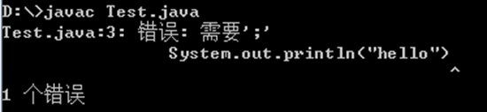

  - 编译失败，注意错误出现的行数，再到源代码中指定位置改错


## 04. 字符编码问题

- 当 DOS 命令行窗口的字符编码与 `.java` 源文件的字符编码不一致，如何解决？

  

- 解决方案一：

  - 在 `Notepad++` 等编辑器中，修改源文件的字符编码：

    

  - 在 `EditPlus` 中可以将 Java 源文件另存为 `ANSI` 编码方式（中文操作系统下即为 `GBK` 字符集）

    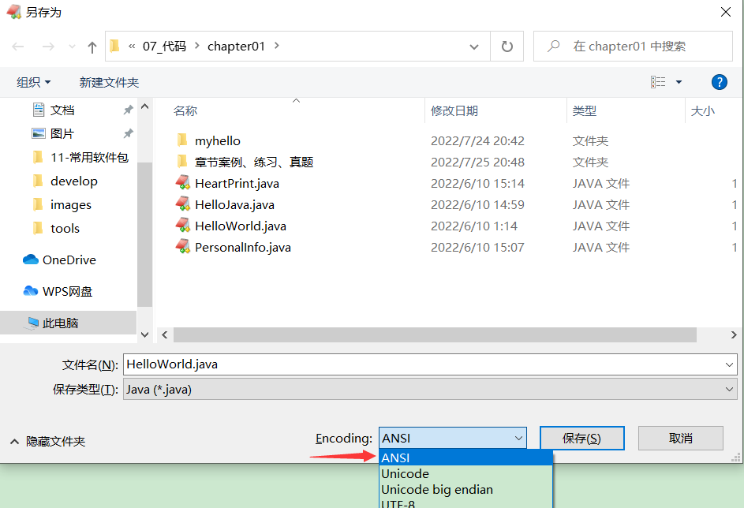


- 解决方案二：

  ```cmd
  # 在使用 javac 命令时，可以指定源文件的字符编码
  javac -encoding utf-8 demo01.java # demo01为文件名
  ```
  
  > 总结：
  >
  > - 在 win10 系统中，由于我们设置的**区域是中国大陆**，所以**系统默认的编码格式是简体中文的 GBK 编码**，在 Windows 中常用于处理中文字符。所以导致在使用 javac 编译文件时**出现中文乱码**的原因
  >
  >   
  >
  > - 在 Windows 系统上，你可以通过命令行**查看系统的默认编码格式**
  >
  >   ```shell
  >   chcp # 显示当前的命令行编码
  >   ```
  >
  >   - 常见的 UTF-8 编码对应的代码页是 65001。如果你看到代码页是 65001，那么当前的命令行编码就是 UTF-8
  >   - 936 对应的是 简体中文的 GBK 编码
  >
  > - **最终解决**
  >
  >   - 前面两种方式都不提倡，不可能每次保存时还去修改编码格式，也不可能将编辑器的保存格式修改，这样会导致别的文件编码格式有问题
  >   - 在全局配置中设置 javac 编译器的字符编码为 UTF-8，使用 JAVA_TOOL_OPTIONS 环境变量
  >   - 在 Windows 上，按照以下步骤进行设置：
  >     - **打开系统环境变量设置：**
  >       - 右键点击此电脑/我的电脑 -> 属性 -> 高级系统设置 -> 环境变量
  >     - **创建 `JAVA_TOOL_OPTIONS` 环境变量：**
  >       - 在“系统变量”部分点击“新建”
  >       - 变量名输入 `JAVA_TOOL_OPTIONS`
  >       - 变量值设置为 `-Dfile.encoding=UTF-8`
  >     - **点击“确定”保存设置**
  >     - **重启命令提示符或其他编译器：** 为了让变更生效，**关闭并重新打开**命令提示符或其他编译器
  >   - 这样设置后，javac 编译器应该默认使用 UTF-8 字符编码进行编译。任何通过 javac 编译的文件都会使用 UTF-8 编码进行处
  >
  > - 测试结果：
  >
  >   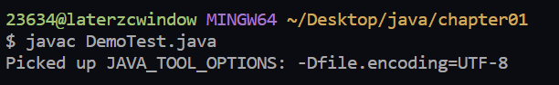
  >
  >   - `Picked up JAVA_TOOL_OPTIONS: -Dfile.encoding=UTF-8` 意思是：
  > - 这个信息是 `Java` 运行时环境（JRE）或者开发工具（JDK）在启动时检测到了一个名为 `JAVA_TOOL_OPTIONS` 的环境变量，并且发现它设置了一个属性 `-Dfile.encoding=UTF-8`
  >     - `-Dfile.encoding=UTF-8` 表示设置了一个系统属性，告诉 `Java` 使用 `UTF-8` 编码来处理文件
  >     
  > - 当你设置 `JAVA_TOOL_OPTIONS` 环境变量并赋予它 `-Dfile.encoding=UTF-8` 这个值后，`Java` 运行时会读取这个环境变量并在启动时应用这个属性。这意味着任何使用 `Java` 编程语言进行的文件读写、字符编码等操作都会使用 `UTF-8` 这种编码方式

## 05. 建议

- 注意缩进!
  - 一定要有缩进。缩进就像人得体的衣着一样！

  - 只要遇到 `{}` 就缩进，缩进的快捷键 `tab` 键

- 必要的空格

  - 变量类型、变量、赋值符号、变量值之间填充相应空格，更美观。比如： `int num = 10`


# 十一. HelloWorld 小结

---

## 01. Java 程序的结构与格式

- 结构：

  ```java
  类{
    方法{
      语句;
    }
  }
  ```

- 格式：
  - 每一级缩进一个 `Tab` 键
  - `{}` 的左半部分在行尾，右半部分单独一行，与和它成对的"{"的行首对齐

## 02. Java 程序的入口

- Java 程序的入口是 **main** 方法：

  ```java
  public static void main(String[] args){}
  ```

## 03. 两种常见的输出语句

- 换行输出语句：输出内容，完毕后进行**换行**，格式如下：

  ```java
  System.out.println("输出内容");
  ```

- 直接输出语句：输出内容，完毕后不做任何处理，格式如下

  ```java
  System.out.print("输出内容");
  ```

> 注意：
>
> - 换行输出语句，括号内可以什么都不写，只做换行处理
>
>
> - 直接输出语句，**print()括号内什么都不写的话，编译报错**

## 04. 源文件名与类名

- 源文件名是否必须与类名一致？public 呢？

  - 如果这个类不是 public，那么源文件名可以和类名不一致。但是不便于代码维护


  - **如果某个类用 public 修饰，那么源文件名必须与该类名一致。否则编译报错**

    

  - 我们建议大家，不管是否是 `public`，都与源文件名保持一致，而且**一个源文件尽量只写一个类**，目的是为了好维护

- 一个源文件中是否可以有多个类？public 呢？

  - **一个源文件中可以有多个类，编译后会生成多个 `.class` 字节码文件**

    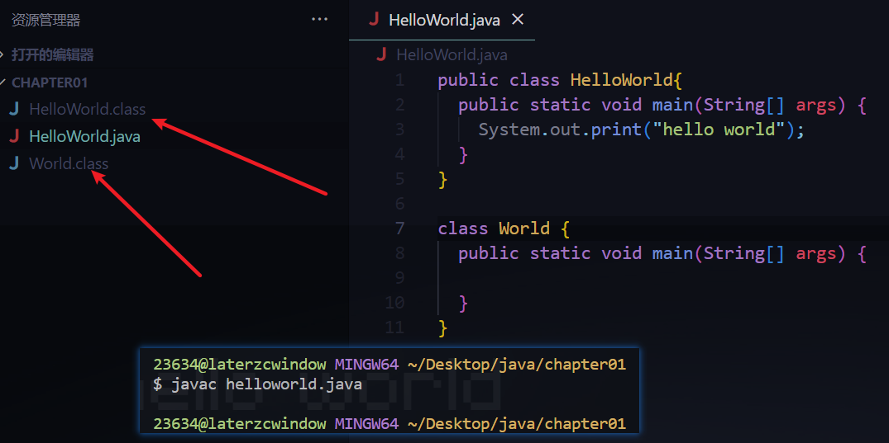

  - 但是**一个源文件只能有一个 `public` 的类**

    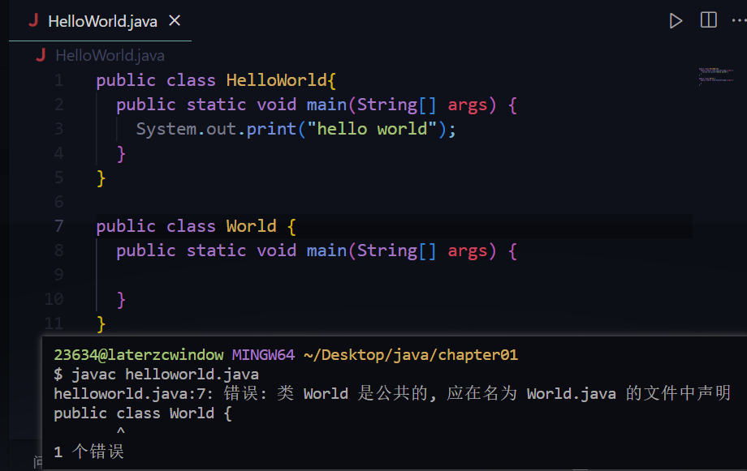

> 总结：
>
> - **一个 java 源文件中可以有多个类**，但是最多**只能声明一个 public 类**
>
>   
>
> - **public 类的类名与源文件名，二者必须一致**


# 十二. 注释(comment)

---


- 什么是注释？

  - 源文件中用于解释、说明程序的文字就是注释

- 注释是一个程序员必须要具有的良好编程习惯。实际开发中，程序员可以先将自己的**思想**通过注释整理出来，再用代码去体现

  > 程序员最讨厌两件事：
  >
  > - 一件是自己写代码被要求加注释
  >
  >
  > - 另一件是接手别人代码，发现没有注释

- 不加注释的危害

  

- `Java` 中的注释类型：

  - 单行注释

    ```java
    //	注释文字
    ```

  - 多行注释

    ```java
    /* 
    	注释文字1
    	注释文字2
    	注释文字3
    */
    ```

  - 文档注释 (Java特有)

    ```java
    /**
    	@author	指定java程序的作者
    	@version	指定源文件的版本
    */ 
    ```

- 注释的作用

  - 它提升了程序的可阅读性（不加注释的危害性，见图）
  - 调试程序的重要方法

- **具体使用1：单行注释、多行注释**

  - 对于单行和多行注释，被注释的文字，不会不会出现在字节码文件中，进而不会被 `JVM`（`java` 虚拟机）解释执行

  - 多行注释里面不允许有多行注释嵌套

  - 一个段子

    ```java
    A：嘿 //是什么意思啊？
    B：嘿.
    A：呃 我问你//是什么意思？
    B：问吧.
    A：我刚才不是问了么？
    B：啊？
    A：你再看看记录...
    B：看完了.
    A：......所以//是啥？
    B：所以什么？
    A：你存心耍我呢吧？
    B：没有啊 你想问什么？
    ……
    不断循环之后，A一气之下和B绝交，自己苦学程序。
    N年之后，A终于修成正果，回想起B，又把聊天记录翻出来看，这时，他突然发现B没有耍他……
    而他自己也不知道当年他问B的究竟是什么问题……
    ```

- **具体使用2：文档注释（Java特有）**

  - **文档注释**内容可以被 **`JDK` 提供的工具 `javadoc` 所解析**，**生成一套**以网页文件形式体现的该程序的**说明文档**

  - 操作方式，如：

    ```bash
    javadoc -d mydoc -author -version HelloWorld.java
    ```
    
    

- 案例：

  ```java
  //单行注释
  /*
  多行注释
  */
  /**
  文档注释演示。这是我的第一个Java程序！^_^
  @author songhk
  @version 1.0
  */
  public class HelloWorld{
  
    /**
  	Java程序的入口
  	@param args main方法的命令参数
  	*/
    public static void main(String[] args){
      System.out.println("hello");
    }
  }
  ```


# 十三. Java API 文档

- `API` （`Application Programming Interface`，应用程序编程接口）是 `Java` 提供的基本编程接口

- `Java` 语言提供了大量的基础类，因此 `Oracle` 也为这些基础类提供了相应的说明文档，用于告诉开发者如何使用这些类，以及这些类里包含的方法。大多数 `Java` 书籍中的类的介绍都要参照它来完成，它是编程者经常查阅的资料

- `Java` `API`文档，即为 `JDK` 使用说明书、帮助文档。类似于：

  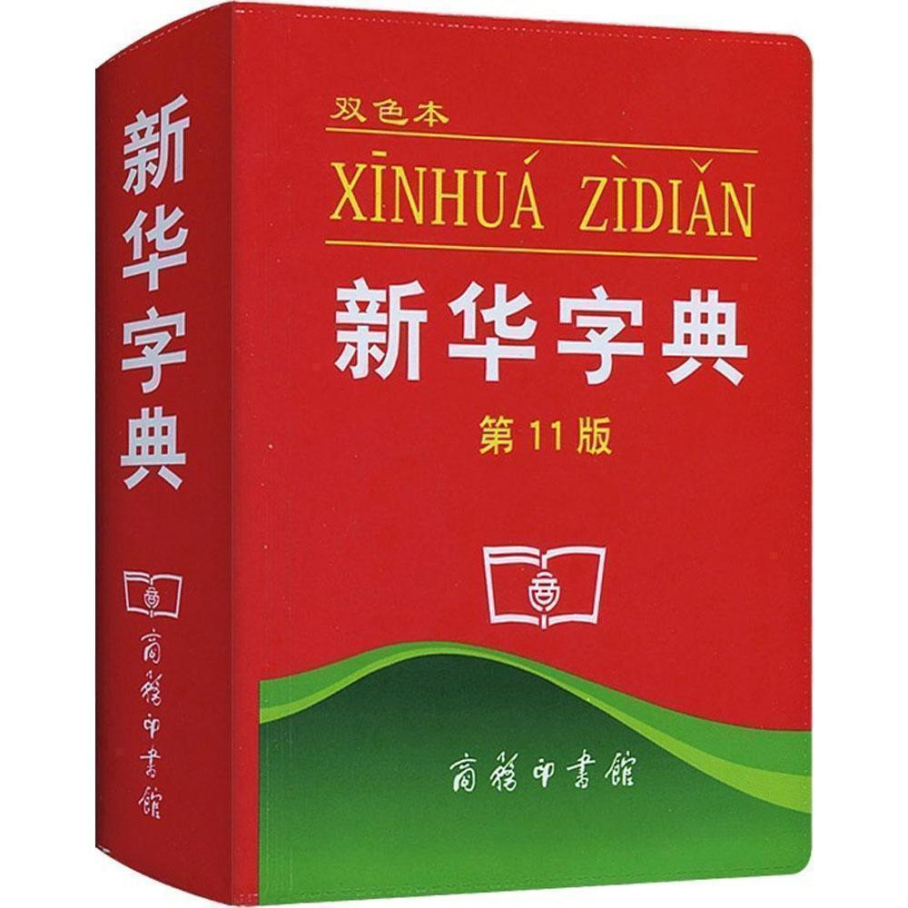

- 下载 `API` 文档：
  - 在线看：https://docs.oracle.com/en/java/javase/17/docs/api/index.html
  - 离线下载：https://www.oracle.com/java/technologies/javase-jdk17-doc-downloads.html


# 十四. Java 运行环境：JVM

---

## 01. Java 语言的优缺点

- `Java` 确实是从 `C` 语言和 `C++` 语言继承了许多成份，甚至可以将 `Java` 看成是类 `C` 语言发展和衍生的产物。“青出于蓝，而胜于蓝”。

### 优点

**跨平台性：**这是 `Java` 的核心优势。`Java` 在最初设计时就很注重移植和跨平台性。比如：`Java` 的 `int` 永远都是 `32` 位。不像 `C++` 可能是16，32，可能是根据编译器厂商规定的变化

* 通过 `Java` 语言编写的应用程序在不同的系统平台上都可以运行。“`Write once , Run Anywhere`”。
* 原理：只要在需要运行 `java` 应用程序的操作系统上，先**安装一个 `Java` 虚拟机** (JVM ，`J`ava `V`irtual `M`achine) 即可。由 `JVM` 来负责 `Java` 程序在该系统中的运行

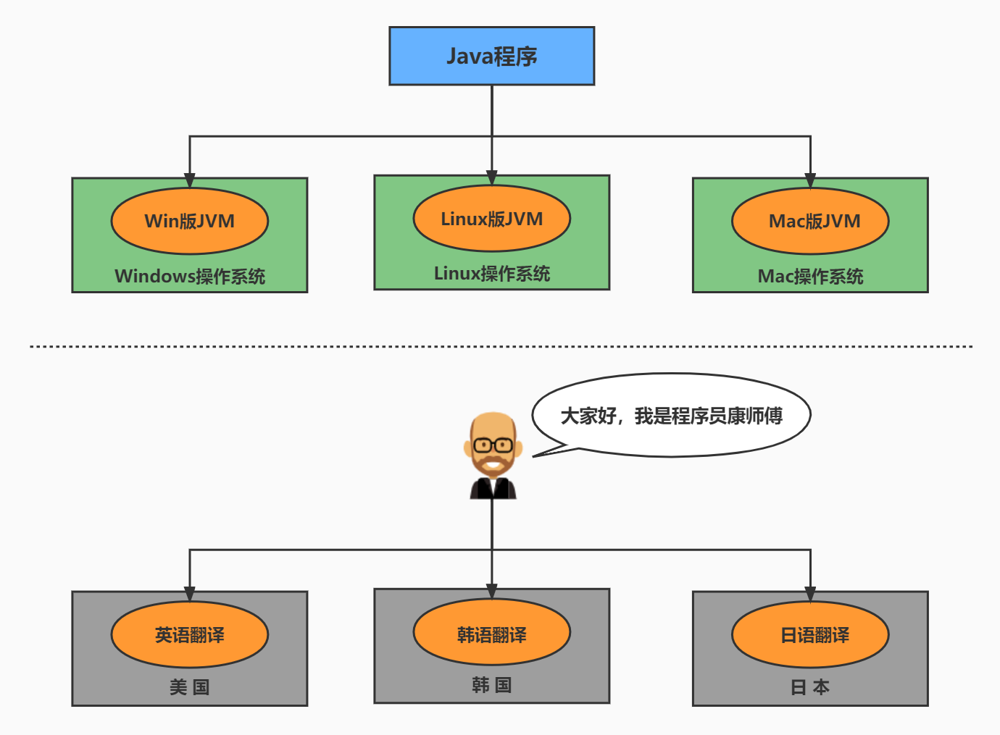


* **面向对象性：**

  - 面向对象是一种程序设计技术，非常适合大型软件的设计和开发。面向对象编程支持封装、继承、多态等特性，让程序更好达到高内聚，低耦合的标准
* **健壮性：**
  * 吸收了 `C/C++` 语言的优点，但去掉了其影响程序健壮性的部分（如指针、内存的申请与释放等），提供了一个相对安全的内存管理和访问机制

* **安全性高：**
  - `Java` 适合于网络/分布式环境，需要提供一个安全机制以防恶意代码的攻击
  - 如：`安全防范机制`（`ClassLoader` 类加载器），可以分配不同的命名空间以防替代本地的同名类、字节代码检查
* **简单性：**
  - `Java` 就是 `C++` 语法的简化版，我们也可以将 `Java` 称之为“`C++--`”
  - 比如：头文件，指针运算，结构，联合，操作符重载，虚基类等
* **高性能：**
  - `Java` 最初发展阶段，总是被人诟病“`性能低`”；客观上，高级语言运行效率总是低于低级语言的，这个无法避免
  - `Java` 语言本身发展中通过**虚拟机的优化**提升了**几十倍运行效率**。比如，通过 `JIT(JUST IN TIME)` **即时编译**技术提高运行效率
    - `JIT`：热点代码编译成机器代码，后续使用直接使用之前编译后的机器代码
  - `Java` 低性能的短腿，已经被完全解决了。业界发展上，我们也看到很多 `C++` 应用转到 `Java` 开发，很多 `C++` 程序员转型为 `Java` 程序员

### 缺点

- 语法过于复杂、严谨，对程序员的约束比较多，与 `python`、`php` 等相比入门较难。但是一旦学会了，就业岗位需求量大，而且薪资待遇节节攀升
- 一般适用于大型网站开发，整个架构会比较重，对于初创公司开发和维护人员的成本比较高（即薪资高），选择用 `Java` 语言开发网站或应用系统的需要一定的经济实力
- 并非适用于所有领域。比如，`Objective C`、`Swift` 在 `iOS` 设备上就有着无可取代的地位。浏览器中的处理几乎完全由 `JS` 掌控。`Windows` 程序通常都用 `C++` 或 `C#` 编写。`Java` 在服务器端编程和跨平台客户端应用领域则很有优势

## 02. JVM 功能说明

- **JVM**（Java Virtual Machine ，Java虚拟机）：是一个**虚拟的计算机**，是 `Java` 程序的**运行环境**

- `JVM` 具有指令集并使用不同的存储区域，负责执行指令，管理数据、内存、寄存器

  

### 功能一：实现 Java 程序的跨平台性

- 我们编写的 `Java` 代码，都运行在 `JVM` 之上，正是因为有了 `JVM`，才使得 `Java` 程序具备了跨平台性

  

- 使用 `JVM` 前后对比：

  

### 功能二：自动内存管理(内存分配、内存回收)

- `Java` 程序在运行过程中，涉及到运算的 数据的分配、存储等都由 `JVM` 来完成
- `Java` 消除了程序员回收无用内存空间的职责。提供了一种系统级线程跟踪存储空间的分配情况，在内存空间达到相应阈值时，检查并释放可被释放的存储器空间
- `GC` 的自动回收，提高了内存空间的利用效率，也提高了编程人员的效率，很大程度上减少了因为没有释放空间而导致的内存泄漏

> - 内存溢出：内存超出内存最大容量
> - 内存泄露：  无用的内存占用


# 十五. 章节案例

---

- 案例1：个人信息输出

  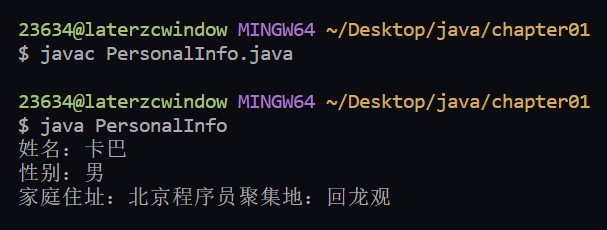

  ```java
  class Exercise1{
  	public static void main(String[] args){
  		System.out.println("姓名：康师傅");
  		System.out.println("性别：男");
  		System.out.println("家庭住址：北京程序员聚集地：回龙观");
  	}
  }
  ```

- 案例2：输出：心形 

  - 结合 `\n`(换行)，`\t`(制表符)，空格等在控制台打印出如下图所示的效果

    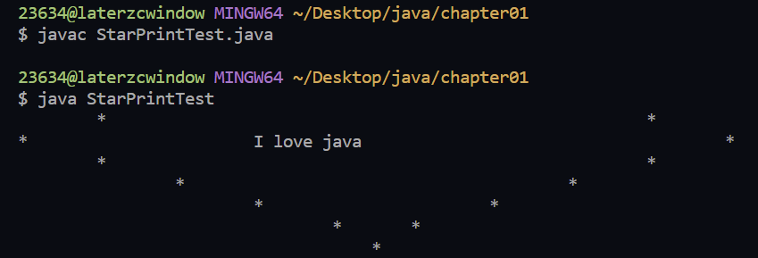 

- 方式一：

  ```java
  public class StarPrintTest {
    public static void main(String[] args) {
      System.out.print("\t");
  		System.out.print("*");
  		System.out.print("\t");
  		System.out.print("\t");
  		System.out.print("\t");
  		System.out.print("\t");
  		System.out.print("\t");
  		System.out.print("\t");
  		System.out.print("\t");
  		
  		System.out.println("*");
  
  		
  		System.out.print("*");
  		System.out.print("\t");
  		//System.out.print("\t");
  		System.out.print("\t");
  		System.out.print("\t");
  		System.out.print("I love java");
  		System.out.print("\t");
  		System.out.print("\t");
  		System.out.print("\t");
  		System.out.print("\t");
  		System.out.print("\t");
  		System.out.println("*");
  
  		
  		System.out.print("\t");
  		System.out.print("*");
  		System.out.print("\t");
  		System.out.print("\t");
  		System.out.print("\t");
  		System.out.print("\t");
  		System.out.print("\t");
  		System.out.print("\t");
  		System.out.print("\t");
  		
  		System.out.println("*");
  
  		
  		System.out.print("\t");
  		System.out.print("\t");
  		System.out.print("*");
  		System.out.print("\t");
  		System.out.print("\t");
  		System.out.print("\t");
  		System.out.print("\t");
  		System.out.print("\t");
  		
  		System.out.println("*");
  
  		
  		System.out.print("\t");
  		System.out.print("\t");
  		System.out.print("\t");
  		System.out.print("*");
  		System.out.print("\t");
  		System.out.print("\t");
  		System.out.print("\t");
  		
  		System.out.println("*");
  		
  		
  		System.out.print("\t");
  		System.out.print("\t");
  		System.out.print("\t");
  		System.out.print("\t");
  		System.out.print("*");
  		System.out.print("\t");
  		
  		System.out.println("*");
  
  		
  		System.out.print("\t");
  		System.out.print("\t");
  		System.out.print("\t");
  		System.out.print("\t");
  		System.out.print("    ");
  		System.out.print("*");
    }
  }
  ```

- 方式二：

  ```java
  public class StarPrintTest {
    public static void main(String[] args) {
      System.out.print("\t"+"*"+"\t\t\t\t\t\t\t\t\t\t\t\t"+"*"+"\t"+"\n");
  		System.out.print("*"+"\t\t"+"*"+"\t\t\t\t"+"I love Java"+"\t\t\t\t"+"*"+"\t\t\t"+"*"+"\n");
  		System.out.print("\t"+"*"+"\t\t\t\t\t\t\t\t\t\t\t\t"+"*"+"\t"+"\n");
  		System.out.print("\t\t"+"*"+"\t\t\t\t\t\t\t\t\t\t"+"*"+"\t\t"+"\n");
  		System.out.print("\t\t\t"+"*"+"\t\t\t\t\t\t\t\t"+"*"+"\t"+"\n");
  		System.out.print("\t\t\t\t"+"*"+"\t\t\t\t\t\t"+"*"+""+"\t"+"\n");
  		System.out.print("\t\t\t\t\t"+"*"+"\t\t\t\t"+"*"+""+"\t\t"+"\n");
  		System.out.print("\t\t\t\t\t\t"+"*"+"\t\t"+"*"+""+"\t\t"+"\n");
  		System.out.print("\t\t\t\t\t\t\t"+"*"+"\n");
    }
  }
  ```


