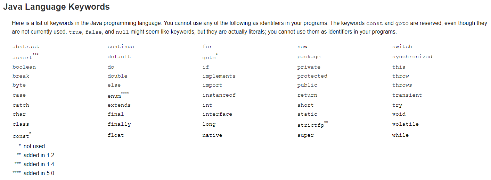
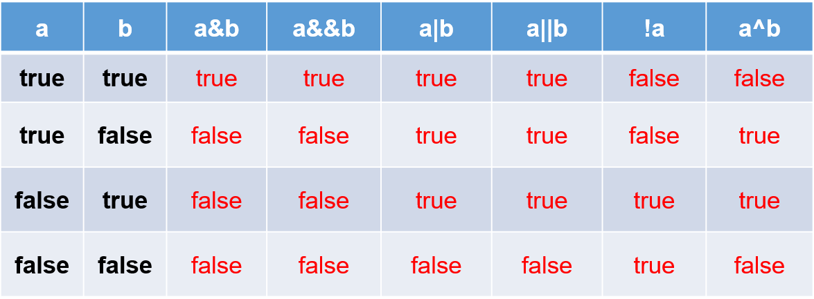
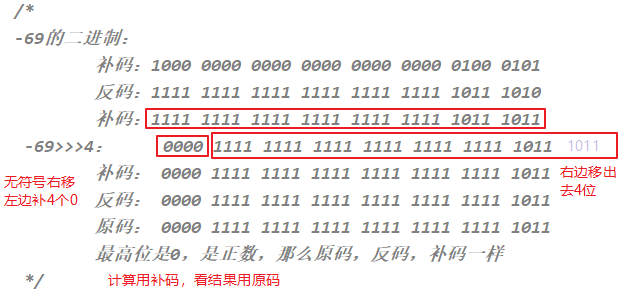

本章专题与脉络


# 一. 关键字（keyword）

---

- 定义：被 Java 语言**赋予了特殊含义，用做专门用途的字符串**（或单词）
  - `HelloWorld` 案例中，出现的关键字有 `class`、`public `、 `static` 、  `void`  等，这些单词已经被 Java 定义好了
  
- 特点：**全部关键字都是小写字母**

- 关键字比较多，不需要死记硬背，学到哪里记到哪里即可

- 官方地址： https://docs.oracle.com/javase/tutorial/java/nutsandbolts/_keywords.html

  

>  说明：
>
>  - 关键字一共`50个`，其中 `const` 和 `goto` 是保留字(reserved word)
>  - `true`，`false`，`null` 不在其中，它们看起来像关键字，其实是字面量，表示特殊的布尔值和空值


# 二. 标识符( identifier)

- Java 中**变量、方法、类等要素命名时使用的字符序列，称为标识符**
  - 技巧：凡是自己可以起名字的地方都叫标识符

- **标识符的命名规则**（必须遵守的硬性规定）：

  - 由26个英文字母大小写，0-9 ，_或 $ 组成 

  - 不可以以数字开头

    ```java
    // 解析器在遇到一个以数字开头的字符串时，会难以区分它是一个数字常量还是一个标识符
    // 如果允许数字开头，则如下的声明编译就可以通过：
    int 123L = 12;
    // 进而，如下的声明中l的值到底是常量值123？还是变量123L呢？ 出现歧义了
    long l = 123L;
    ```

  - 不可以使用关键字和保留字，但能包含关键字和保留字

  - 严格区分大小写，长度无限制

  - 标识符不能包含空格

  ```java
  // 练习：miles、Test、a++、 --a、4#R、$4、 #44、apps、class、public、int、x、y、radius
  ```

- **标识符的命名规范**（建议遵守的软性要求，否则工作时容易被鄙视）:

  ```
  > 包名：多单词组成时所有字母都小写：xxxyyyzzz。
    例如：java.lang、com.atguigu.bean
    
  > 类名、接口名：多单词组成时，所有单词的首字母大写：XxxYyyZzz
    例如：HelloWorld，String，System等
    
  > 变量名、方法名：多单词组成时，第一个单词首字母小写，第二个单词开始每个单词首字母大写：xxxYyyZzz
    例如：age,name,bookName,main,binarySearch,getName
    
  > 常量名：所有字母都大写。多单词时每个单词用下划线连接：XXX_YYY_ZZZ
    例如：MAX_VALUE,PI,DEFAULT_CAPACITY
  ```

> 注意：
>
> - 在起名字时，为了提高阅读性，要尽量有意义，“见名知意”
> - 更多细节详见《代码整洁之道_关于标识符.txt》《阿里巴巴Java开发手册-1.7.1-黄山版》


# 三. 变量声明和赋值

---

## 01. 为什么需要变量


- 一花一世界，如果把一个程序看做一个世界或一个社会的话，那么变量就是程序世界的花花草草、万事万物
- 即：变量是程序中不可或缺的组成单位，最基本的存储单元


## 02. 初识变量

- java中变量的概念：

  - 内存中的一个存储区域，该区域的数据可以在同一类型范围内不断变化

  - 变量的构成包含三个要素：数据类型、变量名、存储的值

  - Java 中变量声明的格式：**数据类型 变量名 = 变量值**

    

- 变量的作用：用于在内存中保存数据

- 使用变量注意：

  - Java 中每个变量必须先声明，后使用
  - 使用变量名来访问这块区域的数据
  - 变量的作用域：其定义所在的一对 `{ }` 内
  - 变量只有在其 作用域 内才有效。出了作用域，变量不可以再被调用
  - 同一个作用域内，不能定义重名的变量

## 03. Java 中变量的数据类型

- Java中变量的数据类型分为两大类：

  - **基本数据类型**：整数、浮点数、字符、布尔
    - 共八类：`byte`、`short`、`int`、`long`、`float`、`double`、`char`、`boolean`
  
  
    - **引用数据类型**：数组、 类、接口、枚举(enum)、注解(annotation)、记录(record)
  
      
  

## 04. 变量的声明和赋值

- 在 Java 中，变量的声明和赋值是定义和初始化变量的两个关键步骤。下面详细解释一下：

  - 变量声明：

    - **在 Java 中，声明变量意味着告诉编译器 变量的名称和类型**。语法如下：

      ```java
      type variableName; // 声明变量
      ```

    - 示例：

      ```java
      int age; // 声明一个名为age的整型变量
      double price; // 声明一个名为price的双精度浮点型变量
      ```

  - 变量赋值：

    - 变量赋值是指给变量赋予初始值。在 Java 中，变量可以在声明时或者之后的任何时候赋值。语法如下：

      ```java
      variableName = value; // 给变量赋值 
      ```

    - 示例：

      ```java
      age = 25; // 将值25赋给age变量
      price = 19.99; // 将值19.99赋给price变量
      ```

  - 声明并赋值：

    - 在 Java 中，可以在声明变量的同时给变量赋初值：

      ```java
      type variableName = value; // 声明并赋值
      ```

    - 示例：

      ```java
      int age = 25; // 声明一个名为age的整型变量并赋值为25
      double price = 19.99; // 声明一个名为price的双精度浮点型变量并赋值为19.99
      ```

  - 变量初始化：

    - 变量初始化是指在声明时给变量一个初始值。在 Java 中，所有的变量在使用之前必须被初始化。如果在声明时没有给变量一个初始值，变量将会被赋予默认值。

    - 示例：

      ```java
      int quantity; // 声明一个名为quantity的整型变量，但未初始化，默认值为0
      double discount = 0.1; // 声明一个名为discount的双精度浮点型变量并赋值为0.1
      ```

  > 注意事项：
  >
  > 1. 变量名必须符合命名规范。
  >
  > 2. 声明和初始化变量是 `Java` 编程中的基本步骤。
  >
  > 3. 在使用变量之前，确保它们被正确地声明和初始化。
  >
  > 4. `Java` 是一种强类型语言，变量一旦声明了类型，就只能存储相应类型的值。
  >
  > 5. **赋值时要确保被赋的值类型与变量类型兼容**。
  >
  >    
  >
  > - 变量声明和赋值是编写 `Java` 程序时最基本也是最常见的操作之一。这些操作允许程序员有效地管理数据并对其进行操作。

- 格式：数据类型  变量名

  ```java
  // 例如：
  // 存储一个整数类型的年龄
  int age; 
  
  // 存储一个小数类型的体重
  double weight;
  
  // 存储一个单字符类型的性别 
  char gender;
  
  // 存储一个布尔类型的婚姻状态
  boolean marry;
  
  // 使用引用数据类型，存储一个字符串类型的姓名
  String name;
  
  //声明多个同类型的变量
  int a,b,c; //表示a,b,c三个变量都是int类型
  ```
  
  > 注意事项：
  >
  > - 变量的数据类型可以是基本数据类型，也可以是引用数据类型
  > - 同一个作用域内，不能重复声明同名变量

- 给变量赋值，就是把“值”存到该变量代表的内存空间中。同时，给变量赋的值类型必须与变量声明的类型一致或兼容


- 举例1：可以使用合适类型的 常量值 给已经声明的变量赋值

  ```java
  age = 18;
  weight = 109;
  gender = '女';
  ```

- 举例2：可以使用其他 变量 或 表达式 给变量赋值

  ```java
  int m = 1;
  int n = m;
          
  int x = 1;
  int y = 2;
  int z = 2 * x + y;
  ```

- 变量可以反复赋值

  ```java
  //先声明，后初始化
  char gender;
  gender = '女';
  
  //给变量重新赋值，修改gender变量的值
  gender = '男';
  System.out.println("gender = " + gender);//gender = 男
  ```

- 也可以将变量的声明和赋值一并执行

  ```java
  boolean isBeauty = true;
  String name = "迪丽热巴";
  ```

- 内存结构如图：

  


# 四. 基本数据类型介绍

---

- **在 Java 中，有八种基本数据类型**，分别分为两组：
  
  - 第一组：原始数据类型（Primitive Data Types）
    - **整数类型（Integral Types）**：
    
      | 关键字      | bit  | 取值范围         | 描述                                                     |
      | ----------- | ---- | ---------------- | -------------------------------------------------------- |
      | byte        | 8    | -128~127         | 通常用于节省内存或处理二进制数据                         |
      | short       | 16   | -32,768~32,767   | 在内存空间和整数范围之间取得平衡时使用                   |
      | int（默认） | 32   | -2^31 ~ 2^31 - 1 | 最常用的整数类型                                         |
      | long        | 64   | -2^63~2^63 - 1   | 对于需要大整数范围的情况使用，以及在需要更高精度或范围时 |
    
    - **浮点类型（Floating-Point Types）**：
    
      | 关键字         | bit  | 取值范围          | 描述                                                         |
      | -------------- | ---- | ----------------- | ------------------------------------------------------------ |
      | float          | 32   | 1.4e-45~3.4e+38   | 单精度浮点数，在需要节省内存空间的情况下使用，但精度相对较低 |
      | double（默认） | 64   | 4.9e-324~1.8e+308 | 双精度浮点数，通常是默认的浮点数类型，提供更高的精度和范围。 |
    
    - **字符类型（Character Type）**：
    
      | 关键字 | bit  | 取值范围               | 描述                                           |
      | ------ | ---- | ---------------------- | ---------------------------------------------- |
      | char   | 16   | 0-65535（Unicode字符） | 用于表示单个字符，可以存储各种语言的字符和符号 |
    
  - 第二组：其他基本数据类型
    - **布尔类型（Boolean Type）**
    
       | 关键字  | bit  | 取值范围    | 描述                             |
       | ------- | ---- | ----------- | -------------------------------- |
       | boolean | 8    | true、false | 表示真或假的逻辑类型，只有两个值 |
    
  - 这些基本数据类型在 Java 中被用于存储不同类型的数据，并在变量、表达式以及方法中使用；
  
  - 每种类型都有其特定的范围和用途，**选择适当的数据类型有助于有效地管理内存和确保数据的正确性**；

## 01. 整数类型：byte、short、int、long


- **Java 各整数类型有固定的表数范围 和字段长度**，不受具体操作系统的影响，以保证 Java 程序的可移植性

  

- **定义 `long` 类型的变量，赋值时需要以"`l`"或"`L`"作为后缀**

  ```java
  long a = 124343L; // 值的后缀需为 'l' 或 'L'
  ```

- Java 程序中定义整型变量时，通常声明为 int 型，除非不足以表示较大的数，才使用 long

- **Java 的整型常量默认为 int 型**

> 补充：
>
> - 在Java中，**所有的整数类型都是有符号的**。
>
> - 计算机存储单位
>
>   - **字节（Byte）：**是计算机用于计量存储容量的基本单位，**一个字节等于 8 bit**
>   - **位（bit）：**是数据存储的最小单位。二进制数系统中，每个0或1就是一个位，叫做 `bit`（比特），其中 8 `bit` 就称为一个字节(Byte)
>
> - 转换关系：
>
>   ```java
>   8 bit = 1 Byte
>         1024 Byte = 1 kB
>   1024 KB = 1 MB
>         1024 MB = 1 GB
>   1024 GB = 1 TB
>         ...
>   ```

## 02. 浮点类型：float、double

- 与整数类型类似，**Java 浮点类型也有固定的表数范围 和字段长度**，不受具体操作系统的影响

  

- 浮点型常量有两种表示形式：
  - 十进制数形式。如：5.12       512.0f        .512   (必须有小数点）
  - 科学计数法形式。如：5.12e2      512E2     100E-2
  
- float：单精度，尾数可以精确到7位有效数字。很多情况下，精度很难满足需求

- double：双精度，精度是 float 的两倍。通常采用此类型

- **定义 float 类型的变量，赋值时需要以"`f`"或"`F`"作为后缀**

  ```java
  float num1 = 1.23f;
  ```

- **Java 的浮点型常量默认为 `double` 型**

- 关于浮点型精度的说明

  - 并不是所有的小数都能可以精确的用二进制浮点数表示。二进制浮点数不能精确的表示0.1、0.01、0.001这样10的负次幂


  - 浮点类型 float、double 的数据不适合在不容许舍入误差的金融计算领域


  - 如果**需要精确数字计算或保留指定位数的精度，需要使用 `BigDecimal` 类**

    ```java
    //测试1：（解释见章末企业真题：为什么0.1 + 0.2不等于0.3）
    System.out.println(0.1 + 0.2);//0.30000000000000004
    
    //测试2：
    float f1 = 1233123123f;
    float f2 = f1 + 1;
    System.out.println(f1); // 1.2331231E9
    System.out.println(f2); // 1.2331231E9
    System.out.println(f1 == f2); // true 
    
    // 为什么出现这种情况，因为超出取值范围了，超出部分被自动截取了
    // 我们把值改到类型取值范围以内，就不会出现这种情况
    float f3 = 12331231f;
    float f4 = f3 + 1;
    System.out.println(f3); // 1.2331231E7
    System.out.println(f4); // 1.2331232E7
    System.out.println(f3 == f4); // false
    ```


- 应用举例

  - 案例1：定义圆周率并赋值为3.14，现有3个圆的半径分别为1.2、2.5、6，求它们的面积

    ```java
    public class Exercise1 {
      public static void main(String[] args) {
        double PI = 3.14; //圆周率
    
        double radius1 = 1.2;
        double radius2 = 2.5;
        int radius3 = 6;
    
        System.out.println("第1个圆的面积：" + PI * radius1 * radius1);
        System.out.println("第2个圆的面积：" + PI * radius2 * radius2);
        System.out.println("第3个圆的面积：" + PI * radius3 * radius3);
      }
    }
    ```
  
  
    - 案例2：小明要到美国旅游，可是那里的温度是以华氏度为单位记录的，它需要一个程序将华氏温度（80度）转换为摄氏度，并以华氏度和摄氏度为单位分别显示该温度
  
      ```
      转换公式：℃ = (℉ - 32) / 1.8
      ```
  
      ```java
      public class Exercise2 {
        public static void main(String[] args) {
          double hua = 80;
          double she = (hua-32)/1.8;
          System.out.println("华氏度" + hua+"℉转为摄氏度是" +she+"℃");
        }
      }
      ```
  

## 03. 字符类型：char

- char 类型数据用来表示通常意义上“字符”（占2字节）

- **Java 中的所有字符都使用Unicode编码**，故一个字符可以存储一个字母，一个汉字，或其他书面语的一个字符

- 字符型变量的表现四种形式： 
  
  - **形式一**：**使用单引号 `''` 括起来的单个字符**
  
    - **内部必须有且只能有一个字符**。
    - 补充：在Java中，单引号 `''` 用来表示字符，但 `'-------'` 包含了多个字符，因此会导致编译错误。如果你想要打印字符串 `"-------"`，应该使用双引号 `""`。
  
    ```java
    // 例如
    char c1 = 'a';
    char c2 = '中';
    char c3 = '9';
    
    // 不允许的，编译报错
    char c4 = 'ab'; // error：unclosed character literal（未闭合的字符文字）
    char c5 = ''; // error: empty character literal（空的字符文字）
    ```
  
  - **形式二**：直接使用 Unicode 值来表示字符型常量：‘`\uXXXX`’。
  
    - 其中 `\u` 表示这是一个Unicode字符。
    - 其中 `XXXX` 代表一个四位的十六进制整数，代表字符的Unicode码点。
  
    ```java
    public class UnicodeExample {
      public static void main(String[] args) {
        // 使用Unicode表示字符
        char a = '\u0041'; // 'A'
        char b = '\u0042'; // 'B'
        char c = '\u0043'; // 'C'
    
        System.out.println(a); // 输出: A
        System.out.println(b); // 输出: B
        System.out.println(c); // 输出: C
    
        // 使用Unicode表示中文字符
        char hanzi = '\u4E2D'; // '中'
        System.out.println(hanzi); // 输出: 中
    
        // 使用Unicode表示特殊符号
        char smiley = '\u263A'; // '☺'
        System.out.println(smiley); // 输出: ☺
      }
    }
    ```
  
  - **形式三**：Java 中还允许使用转义字符 `\` 来将其后的字符转变为特殊字符型常量
  
    ```java
    char c1 = '\n'; // \n 表示换行符
    ```
  
    | 转义字符 |           说明           | Unicode表示方式 |
    | :------: | :----------------------: | :-------------: |
    |   `\n`   |  换行符（**n**ewline）   |     \u000a      |
    |   `\t`   |     制表符(**t**ab)      |     \u0009      |
    |   `\"`   |          双引号          |     \u0022      |
    |   `\'`   |          单引号          |     \u0027      |
    |   `\\`   |          反斜线          |     \u005c      |
    |   `\b`   | 退格符（**b**ackspace ） |     \u0008      |
    |   `\r`   |   回车符（**r**eturn）   |     \u000d      |
  
  - **形式四**：使用具体字符对应的数值（如：ASCII码）
  
    ```java
    char c11 = 97; 
    System.out.print(c11); // a 
    // 在Unicode编码中，小写字母'a'对应的十进制值是97
    ```
  
    - char 类型是可进行运算的。因为它都对应有Unicode码，可以看做是一个数值
  
    - **char 类型在 Java 中不仅可以表示字符，还可以被当作整数进行数学运算**。这是因为每个字符在 Unicode 编码中都有一个对应的整数值，因此在 Java 中，char 类型可以被直接用于数值计算。
  
    - 理解 char 类型可进行运算的几个关键点：
  
      1. 字符对应的 Unicode 值：
  
         - 每个 char 类型的字符都有一个对应的 Unicode 码点（一个整数）。
         - 例如，小写字母 a 对应的 Unicode 值是 97。
  
      2. 字符作为整数：
  
         - **在计算机内部，字符实际上被存储为整数**。
  
         - 因此，char 类型变量可以参与数值运算，例如加减乘除。
  
      3. 数值运算示例：
  
         - 可以对字符进行加减操作，从而得到新的字符。
  
    - 示例代码：
  
      ```java
      public class CharArithmeticExample {
        public static void main(String[] args) {
          char charA = 'a'; // 字符 'a'，其 Unicode 值为 97
          char charB = 'b'; // 字符 'b'，其 Unicode 值为 98
      
          // 将字符作为整数进行运算
          int difference = charB - charA; // 计算 'b' 和 'a' 之间的差值
      
          System.out.println("Difference between 'b' and 'a': " + difference); // 输出: 1
      
          // 对字符进行加减操作
          char nextChar = (char) (charA + 1); // 'a' + 1 得到 'b'
      
          System.out.println("Next character after 'a': " + nextChar); // 输出: b
      
          // 示例：循环打印字母表
          for (char ch = 'a'; ch <= 'z'; ch++) {
            System.out.print(ch + " ");
          }
          // 输出: a b c d e f g h i j k l m n o p q r s t u v w x y z
        }
      }
      ```
  
    - 解释：
  
      1. 计算字符之间的差值：
  
         ```java
         // 计算 'b' 和 'a' 之间的差值
         int difference = charB - charA; 
         ```
  
         - `charB` 是 `'b'`，其 Unicode 值为 `98`。
         - `charA` 是 `'a'`，其 Unicode 值为 `97`。
         - 差值 `difference` 为 `98 - 97 = 1`。
  
      2. 字符的加法运算：
  
         ```java
         // 'a' + 1 得到 'b'
         char nextChar = (char) (charA + 1); 
         ```
  
         - `charA` 是 `'a'`，其 Unicode 值为 `97`。
         - 加 `1` 后变为 `98`，对应的字符是 `'b'`。
  
      3. 循环打印字母表：
  
         ```java
         for (char ch = 'a'; ch <= 'z'; ch++) {
           System.out.print(ch + " ");
         }
         ```
  
         - 该循环从 `'a'`（Unicode 值 `97`）开始，每次循环加 `1`，直到 `'z'`（Unicode 值 `122`）。
  
    - 通过这些示例，可以清晰地看到 char 类型在 Java 中不仅可以表示字符，还可以像整数一样进行各种数学运算。
  
  > 补充：
  >
  > 1. 在Java中，char类型用于表示单个字符。char是一个 16 位的 Unicode字符，它能够表示的字符范围是从 `\u0000`（即 `0`）到 `\uffff`（即 `65535`）。在 Java中，**char类型使用单引号''来表示字符字面值**。
  >
  >    
  >
  > 2. **字符字面值：** 单引号括起来的内容是字符字面值。例如，`'A'` 是一个字符字面值，表示字符 'A'。
  >
  >    
  >
  > 3. **Unicode 转义序列：** 你也可以使用Unicode转义序列来表示字符。例如，`'\u03A9'` 表示希腊字母大写 Omega。
  >
  >    
  >
  > 4. **字符是整数类型：** char类型实际上是一个整数类型，因此它可以进行数学运算。例如，`'A' + 1` 将得到字符 `'B'` 的Unicode值，因为它其实是 `65 + 1 = 66`。
  >
  >    
  >
  > 5. **字符长度为 2 字节：** 在Java中，char类型**占用 2 个字节**（16 位），因此能够表示较广泛的字符范围，包括Unicode字符集中的字
  >
  >    ```java
  >    char grade = 'B'; // 声明一个名为 grade 的字符变量并初始化为字符 'B'
  >    char omega = '\u03A9'; // 使用 Unicode 值初始化字符变量为希腊字母大写 Omega
  >          
  >    System.out.println(grade); // 输出字符 'B'
  >    System.out.println(omega); // 输出希腊字母大写 Omega
  >    System.out.println('A' + 1); // 输出字符 'B' 的 Unicode 值
  >    ```
  >
  > - char 类型在Java中用于表示单个字符，它在处理文本、编码以及表示字符时非常有用。需要注意的是，虽然char类型实际上是一个整数类型，但在使用时通常被用于表示字符。

## 04 布尔类型：boolean

- boolean 类型用来判断逻辑条件，一般用于流程控制语句中：
  
  - if 条件控制语句                  
  - while 循环控制语句
  - for 循环控制语句
  - do-while 循环控制语句 
  
- boolean 类型数据只有两个值：true、false。
  
  - **不可以使用 `0` 或 `非0` 的整数替代 `false` 和 `true`，这点和 C 、js 不同**
  
    ```java
    boolean isFlag = true;
    
    if (isFlag) {
      // true分支
    } else {
      // false分支
    }
    ```
  
  >补充：
  >
  >- Java 虚拟机中没有任何供 boolean 值专用的字节码指令
  >- Java 语言表达所操作的 boolean 值，在编译之后都使用 java 虚拟机中的 int 数据类型来代替：
  >  - true 用 1 表示，false 用 0 表示 ——《java虚拟机规范 8版》

## 05. 数据类型的自动转换和范围检查

- 示例一：

  ```java
  int i = 'A';
  ```

  - 这里是将字符赋值给整型变量。`A` 是一个字符字面值，当赋值给 `int` 类型时，会自动将字符的 `Unicode` 编码值赋给 `i`。

- 示例二：

  ```java
  double d = 10;
  ```

  - 整数常量 `10` 会自动升级为 `double` 类型。在 `Java` 中，整数常量默认被视为 `int`，但可以自动转换为更高精度的数据类型。

- 示例三：

  ```java
  long num = 1234567;
  ```

  - 这里整数常量 `1234567` 在 `long` 范围内，因此编译和运行都可以通过。这是因为整数常量默认被视为 `int`，但是在赋值给 `long` 类型时，会进行自动类型转换。

- 示例四：

  ```java
  byte bigB = 130;
  ```

  - 这里出现错误，因为 `130` 超出了 `byte` 类型的范围。编译器会报告整数常量超出 `byte` 类型的取值范围，需要进行强制转换或修改为在 `byte` 类型范围内的值。

- 示例五：

  ```java
  long bigNum = 12345678912L;
  ```

  - 这里的整数常量超出了 `int` 范围，因此需要添加后缀 `L` 表示为 `long` 类型的常量。如果不添加 `L` 后缀，编译器将会报错，因为超出了 `int` 的表示范围。


# 五. 基本数据类型变量间运算规则

---

- 在 Java 程序中，不同的基本数据类型变量的值，经常需要进行相互转换（ 只有7种，**boolean 类型除外**）
  - 布尔类型与其他基本数据类型的转换是不允许的，因为布尔类型只有两个值：true和false，与其他数据类型无法直接转换。


- 转换的方式有两种：自动类型提升 和 强制类型转换


## 01. 自动类型提升（隐式类型转换）

- 在 Java 中，自动类型提升是指：**当一个数值类型被赋值给一个更大范围的数值类型变量时，Java 会自动将较小范围的类型值转换为另一种更大范围的类型值，以便避免数据丢失。**
- 这通常发生在以下场景：
  1. **表达式计算时**，当不同类型的数据一起参与运算时。
  2. **变量赋值时**，当一个较小范围的类型值赋给一个较大范围的类型变量时。

- 变量声明和赋值中的隐式类型转换：

  - 当你声明一个变量并赋值时，如果赋值的值类型比变量类型的范围小或相同，Java 会自动进行类型提升。

  - 例如，将一个 int 类型的值赋值给一个 double 类型的变量时，int 类型的值会自动转换为 double 类型。这种转换是隐式的，不需要显式的类型转换操作符。

    ```java
    double d1 = 12; // 12 (int) 自动提升为 12.0 (double)
    ```

    - 12 是一个整数字面量，默认情况下是 int 类型。
    - d1 是 double 类型。
    - 由于 double 类型可以表示更大的范围且精度更高，Java 自动将 int 类型的 12 转换为 double 类型的 12.0。
    - 在这种情况下，赋值操作中的类型转换确实属于自动类型提升。

- 这个过程是自动的，因此称为自动类型提升。没有数据丢失，因为所有 int 类型的值都可以被精确表示为 double 类型。

- **基本数据类型的转换规则**如图所示：

  

- 这种类型提升发生在以下两种情况下：

  1. 整数类型的自动提升：

     - 规则：

       - **在整数运算中，byte、short、char 会被隐式提升为 `int` 类型**。

       - 当表达式中包含不同精度的整数类型时，低精度的类型会自动提升为int，然后进行运算。

       - 为什么要这样设计呢？

         - 首先，将较低精度的整数类型（如byte、short、char）隐式提升为int类型，可以避免在运算过程中发生数据溢出。如果将两个较小的整数类型直接相加，可能会导致溢出，因为它们的范围有限。通过将它们隐式提升为int类型，可以确保运算过程中不会发生溢出。

           其次，将较低精度的整数类型自动提升为int类型，可以提高代码的可读性。如果在表达式中直接使用较小的整数类型，可能会使代码难以理解，并且容易产生错误。通过将它们自动提升为int类型，可以使代码更清晰明了，减少错误发生的可能性。

           因此，这种设计有助于提高代码的稳定性和可读性，避免了一些常见的错误。

     - 示例：

       ```java
       byte b = 5;
       short s = 10;
       // 错误示范：
       short res1 = b + s; // error: incompatible types: possible lossy conversion from int to byte（错误:不兼容的类型:从int到byte可能有损转换）
       // 正确示范：
       int res2 = b + s; // 自动将 byte 和 short 提升为 int 进行相加
       ```

  2. 浮点类型的自动提升：

     - 规则：

       - **在浮点数运算中，float 会被隐式提升为 `double` 类型**。
       - 当表达式中包含不同精度的浮点数类型时，float 类型会自动提升为 double，然后进行运算。

     - 示例：

       ```java
       float f = 3.5f;
       double d = 8.2;
       double result = f * d; // 自动将 float 提升为 double 进行相乘
       ```

  - 示例一：当把存储范围小的值（常量值、变量的值、表达式计算的结果值）赋值给了存储范围大的变量时

    ```java
    int i = 'A'; // char自动升级为int，其实就是把字符的编码值赋值给i变量了
    
    double d = 10; // int自动升级为double
    
    long num = 1234567; // 右边的整数常量值如果在int范围呢，编译和运行都可以通过，这里涉及到数据类型转换
    
    byte bigB = 130; // 错误：右边的整数常量值超过byte范围（-128-127）
    
    long bigNum = 12345678912L; // 右边的整数常量值如果超过int范围，必须加L，显式表示long类型。否则编译不通过
    ```

  - 示例二：当存储范围小的数据类型与存储范围大的数据类型变量一起混合运算时，会按照其中最大的类型运算

    ```java
    int i = 1;
    byte b = 1;
    double d = 1.0;
    
    double sum = i + b + d; // 混合运算，升级为double
    ```

  - 示例三：当 byte、short、char 数据类型的变量进行算术运算时，按照 int 类型处理

    ```java
    byte b1 = 1;
    byte b2 = 2;
    byte b3 = b1 + b2; // 编译报错，b1 + b2自动升级为int
    
    char c1 = '0';
    char c2 = 'A';
    int i = c1 + c2; // 至少需要使用int类型来接收
    System.out.println(c1 + c2); // 113 
    ```

  > 注意事项：
  >
  > 1. 自动类型提升可能会导致数据精度提高，但在某些情况下也可能导致数据类型超出范围而产生错误结果。
  >
  >    - 低精度 也可指 存储空间/取值范围小，高同理；
  >
  >    - 并非指占用的内存空间的大小，而是指数据的表示范围大小；
  >
  >    - 举个例子：
  >
  >      - 假设我们有两种数据类型 A 和 B，它们分别占用相同大小的内存空间，但是类型 A 可以表示的取值范围更大，那么我们可以说类型 A 的精度更高，即使它们占用的内存空间相同。
  >      - 因此，尽管在很多情况下精度和内存空间的大小是相关的，但它们并不完全等价。这样做的目的：以确保表达式的结果具有足够的精度，同时防止数据丢失或溢出。
  >
  >    - 例如，**将一个 long 类型的值赋给 float 可能会导致精度损失**。
  >
  >      ```java
  >      int i1 = 10;
  >      int i2 = i1;
  >      long l1 = i1;
  >      System.out.println(i1); // 10
  >      System.out.println(i2); // 10
  >      System.out.println(l1); // 10
  >      float f1 = l1;
  >      byte b1 = i1; // error: incompatible types: possible lossy conversion from int to byte（错误:不兼容的类型:从int到byte可能有损转换）
  >          
  >      // 为什么long到float可以，而int到byte就不行呢?
  >      // 解释：
  >      // 虽然long类型确实占用了更多的字节（8个字节）比float类型（4个字节）要大，但float类型的表示方式使得它可以表示更大的范围和更高的精度，即使它的字节数较少。float类型使用IEEE 754标准来表示浮点数，这种表示方式允许它表示一定范围内的整数值。
  >          
  >      // 由于 float 类型使用指数来表示数值范围，所以它可以表示非常大的数（大约 3.4E38），也可以表示非常小的数（大约 1.4E-45）。然而，精度受限于尾数部分的位数（23 位），这意味着它不能精确表示所有的整数，尤其是非常大的整数。
  >          
  >      // long 类型的表示范围虽然没有 float 那么大，但它可以精确表示 -2^63 到 2^63-1 之间的所有整数。float 类型只能精确表示有限的整数范围内的值，大于这个范围的整数会被近似表示，可能导致精度丢失。
  >      ```
  >
  >      示例：
  >
  >      ```java
  >      // 假设我们有一个 long 类型的值 1234567890123456789L：
  >      long l = 1234567890123456789L;
  >      float f = l;
  >      System.out.println(f);
  >          
  >      // 在这个例子中，将 long 类型的值转换为 float 类型时，由于 float 的尾数部分只能精确表示 23 位二进制位，这个值将被近似表示，可能变成类似 1.2345679E18。这里的精度丢失是因为 float 无法精确表示超过 23 位的有效位数。
  >      ```
  >
  > 2. 在使用自动类型提升时，开发者需要确保结果在目标类型的合理范围内，并注意可能的精度损失。
  >
  >    - 总体而言，自动类型提升有助于在混合使用不同类型的数据时，提供一定的灵活性和方便性，同时也需要注意避免潜在的精度损失或数据溢出的问题。

## 02. 强制（显式）类型转换

- 将 3.14 赋值到 int 类型变量会发生什么？产生编译失败，肯定无法赋值

  ```java
  int i = 3.14; // 编译报错
  ```

  - 想要赋值成功，只有通过强制类型转换，将 double 类型强制转换成 int 类型才能赋值
  - 自动类型提升是 Java 自动执行的，而**强制类型转换是自动类型提升的逆运算，需要手动执行**

- 强制类型转换：通常指**显式地将一种数据类型的值 转换为另一种数据类型**，例如通过类型转换操作符 `(type)`。这种转换可能会导致精度损失或数据截断，需要开发者明确表示其意图。

  ```java
  int i = (int) 12.34; // 12.34 (double) 显式转换为 12 (int)
  ```

- 这种转换通常用于处理数据类型不匹配的情况，例如，将一个更大范围的数据类型转换为较小范围的数据类型或将一个浮点数类型转换为整数类型。强制类型转换可以通过**显式地使用括号和目标数据类型来实现**。

  - 语法

    ```java
    targetType variableName = (targetType) valueToBeConverted;
    ```

  - 示例：

    ```java
    double d = 10.6;
    int i = (int) d; // 强制将 double 类型转换为 int 类型
    ```

  - 强制类型转换的特点：

    1. **可能导致精度丢失：** 当将一个较大范围的数据类型转换为一个较小范围的数据类型时，可能会导致精度损失。
       - 例如，将 double 类型的值转换为 int 类型可能会导致小数部分被截断。
    2. **可能导致数据溢出：** 如果将一个超出目标数据类型表示范围的值强制转换为目标类型，可能会导致数据溢出。
       - 例如，将一个很大的整数转换为 byte 类型，超出 byte 类型的范围。
    3. **适用于数值类型之间的转换：** 强制类型转换通常用于数值类型之间的转换，例如整数类型之间、浮点数和整数之间的转换。

    > 注意事项：
    >
    > 1. 强制类型转换可能会导致数据丢失和溢出，需要谨慎使用。
    > 2. 在执行强制类型转换之前，确保转换的数据在目标类型的合理范围内，以避免溢出或数据丢失。
    > 3. 对于小数类型到整数类型的转换，小数部分会被直接截断，不会进行四舍五入。
    > 4. 对于超出目标类型范围的值，强制转换可能会导致不可预测的结果。
    >
    > 
    >
    > - 总体来说，强制类型转换在某些情况下是必要的，但需要开发人员注意数据范围和精度，以避免数据丢失和溢出。建议尽量避免频繁使用强制类型转换，而是考虑代码设计来避免类型不匹配的情况。

- 示例一：当把存储范围大的值（常量值、变量的值、表达式计算的结果值）强制转换为存储范围小的变量时，可能会造成精度损失或溢出

  ```java
  int i = 3.14; // 错误: 不兼容的类型: 从double转换到int可能会有损失
  int i = (int) 3.14; // 不报错，但会有损失精度
  System.out.println(i1); // 3
  
  double d = 1.2;
  int num = d; // 错误: 不兼容的类型: 从double转换到int可能会有损失
  int num = (int) d; // 不报错，但会有损失精度
  System.out.print(num); // 1
  
  int i = 200; 
  byte b = i; // 错误: 不兼容的类型: 从int转换到byte可能会有损失
  byte b = (byte) i; // 不报错，但可能有损失精度
  ```

- 示例二：当某个值想要提升数据类型时，也可以使用强制类型转换。但是这种情况的强制类型转换是没有风险的，通常省略

  ```java
  int i = 1;
  int j = 2;
  double bigger = (double)(i/j);
  
  int i1 = 1;
  float f1 = i1;
  ```

- 示例三：**声明 long 类型变量时，有些情况下可以省略后缀L/l**。因为整数类型常量默认为 int 类型，而 int 类型能自动转换为 long 类型，而 float 必须加上后缀，因为浮点类型常量默认为 double 类型，但 float 类型不能自动转换为 double 类型。

  ```java
  long l1 = 123L;
  long l2 = 123; // 如何理解呢？ 此时可以看做是int类型的123类型转换为long类型
  
  long l3 = 123123123123; // 报错，因为123123123123超出了int的范围
  long l4 = 123123123123L; // 所以加上L明确告诉编译器是long类型
  
  float f1 = 12.3; // 错误: 不兼容的类型: 从double转换到float可能会有损失
  // 因为java中浮点类型常量默认为double类型，所以12.3看做是double，不能自动转换为float类型
  float f2 = 12.3F;
  float f3 = (float)12.3;
  ```

- 练习：判断是否能通过编译

  ```java
  short s = 5;
  s = s - 1; // 编译报错，错误:不兼容的类型:从int到short的可能有损转换
  s = (short)(s - 1); // 使用强制类型转换，编译通过
  
  
  byte b = 3;
  b = b + 3; // 编译报错，错误:不兼容的类型:从int到short的可能有损转换
  b = (byte)(b + 3); // 使用强制类型转换，编译通过
  
  
  // 编译通过
  char c = 'a';
  int i = 5;
  float f = .314F;
  double d = c + i + f;
  
  
  byte b = 5;
  short s = 3;
  short t = s + b; // 编译报错，错误:不兼容的类型:从int到short的可能有损转换
  short t = (short)(s + b); // 使用强制类型转换，编译通过
  ```

- 问：为什么标识符的声明规则里要求不能数字开头？

  ```java
  // 如果允许数字开头，则如下的声明编译就可以通过：
  int 123L = 12;
  // 进而，如下的声明中l的值到底是123？还是变量123L对应的取值12呢？ 出现歧义了
  long l = 123L;
  ```


## 03. 基本数据类型与 String 的运算

- 字符串类型：String

  - String 不是基本数据类型，属于**引用数据类型**

  - **使用一对双引号 `""` 来表示一个字符串，内部可以包含0个、1个或 多个字符**。

  - 声明方式与基本数据类型类似。例如：
  
    ```java
    String str = “尚硅谷”;
    ```


- 运算规则

  1. 任意八种基本数据类型的数据与 String 类型**只能进行连接 `+` 运算**，且结果一定也是 String 类型。

     ```java
     System.out.println("" + 1 + 2); // 12
     
     int num = 10;
     boolean b1 = true;
     String s1 = "abc";
     
     String s2 = s1 + num + b1;
     System.out.println(s2); // abc10true
     
     String s3 = num + b1 + s1; // 编译不通过，错误:二元操作符“+”的操作数类型错误，因为int类型不能与boolean运算
     String s4 = num + (b1 + s1);//编译通过
     System.err.println(s4); // 10trueabc
     ```

  2. `String` 类型不能通过强制类型 `(type)` 转换为其他的类型

     ```java
     String str = "123";
     // int num = (int)str; // 编译不通过，错误：不兼容的类型，String不能转换为int
     
     int num = Integer.parseInt(str); // 正确的，后面才能讲到，借助包装类的方法才能转
     System.err.println(num); // 123
     ```

- 案例与练习

  - 案例：公安局身份登记


  - 要求填写自己的姓名、年龄、性别、体重、婚姻状况（已婚用 true 表示，单身用 false 表示）、联系方式等等。

    ```java
    public class Info {
      public static void main(String[] args) {
        String name = "李白";
        int age = 24;
        char gender = '男';
        double weight = 136.7;
        boolean isMarried = false;
        long phoneNumber = 15266668787L; // 不推荐
        String phoneNumber = "15266668787"; // 推荐，从运算角度来看，电话号码是作为一个单独的个体，不能被运算
        // 086-xxx、021-xxx等带地区编号的前缀'-'也不能被当作整型
    
        System.out.println("姓名：" + name);
        System.out.println("年龄：" + age);
        System.out.println("性别：" + gender);
        System.out.println("体重：" + weight);
        System.out.println("婚否：" + isMarried);
        System.out.println("电话：" + phoneNumber);
        //或者
        System.out.println("name = " + name + ",age = " + age + "，gender = " + 
                           gender + ",weight = " + weight + ",isMarried = " + isMarried +
                           ",phoneNumber = " + phoneNumber);
      }
    }
    ```

  - 练习1：

    ```java
    String str1 = 4;                       // 错误:不兼容类型:int不能转换为String
    String str2 = 3.5f + "";               // 正确
    System.out.println(str2);              // 3.5
    System.out .println(3+4+"Hello!");     // 7Hello!
    System.out.println("Hello!"+3+4);      // Hello!34
    System.out.println('a'+1+"Hello!");    // 98Hello! 分析：'a' 表示字符 'a' 的字面值，它在内存中以 Unicode 编码表示，对应着整数值 97（根据 ASCII 表）。在表达式中，如果你对字符 'a' 进行数学运算，比如 'a' + 1，Java 会将字符 'a' 转换成对应的 Unicode 编码值 97，然后进行数学运算，最后的结果是 98。
    System.out.println("Hello"+'a'+1);     // Helloa1
    ```

  - 练习2：

    ```java
    System.out.println("*    *");				    // *    *
    System.out.println("*\t*");					    // *       *
    System.out.println("*" + "\t" + "*");		// *       *
    System.out.println('*' + "\t" + "*");		// *       *
    System.out.println('*' + '\t' + "*");		// 51*
    System.out.println('*' + "\t" + '*');		// *       *
    System.out.println("*" + '\t' + '*');		// *       *
    System.out.println('*' + '\t' + '*');		// 93
    ```


# 六. 计算机底层如何存储数据

---

- 计算机世界中只有二进制，所以计算机中存储和运算的`所有数据` 都要转为 `二进制`。包括数字、字符、图片、声音、视频等。

  

- 世界上有10种人 ，认识和不认识二进制的。


## 01. 进制的分类

- **十进制（decimal）**
  
  - 数字组成：0-9
  - 进位规则：满十进一
  
- **二进制**（binary，**以 `0b` 或 `0B` 开头**）
  
  - 数字组成：0-1
  - 进位规则：满二进一
  
- **八进制**（octal，**以数字 `0` 开头表示**）
  
  - 数字组成：0-7
  - 进位规则：满八进一
  
- **十六进制**（**以 `0x` 或 `0X` 开头表示**）
  
  - 数字组成：0-9，a-f，此处的 a-f 不区分大小写
  - 进位规则：满十六进一
- 打印时为了方便我们查看，其他进制统一转换成十进制

- 代码演示：

  ```java
  public class BinaryTest {
    public static void main(String[] args) {
      int num1 = 103; // 十进制
      System.err.println(num1); // 103
      
      int num2 = 0B10; // 二进制
      System.err.println(num2); // 2，
      
      int num3 = 023; // 八进制
      System.err.println(num3); // 19
      
      int num4 = 0x23aA; // 十六进制
      System.err.println(num4); // 9130
    }
  }
  ```

## 02. 进制的换算举例

| 十进制 | 二进制 | 八进制 | 十六进制 |
| ------ | ------ | ------ | -------- |
| 0      | 0      | 0      | 0        |
| 1      | 1      | 1      | 1        |
| 2      | 10     | 2      | 2        |
| 3      | 11     | 3      | 3        |
| 4      | 100    | 4      | 4        |
| 5      | 101    | 5      | 5        |
| 6      | 110    | 6      | 6        |
| 7      | 111    | 7      | 7        |
| 8      | 1000   | 10     | 8        |
| 9      | 1001   | 11     | 9        |
| 10     | 1010   | 12     | a或A     |
| 11     | 1011   | 13     | b或B     |
| 12     | 1100   | 14     | c或C     |
| 13     | 1101   | 15     | d或D     |
| 14     | 1110   | 16     | e或E     |
| 15     | 1111   | 17     | f或F     |
| 16     | 10000  | 20     | 10       |

## 03. 二进制的由来

- 二进制，是计算技术中广泛采用的一种数制，由德国数理哲学大师`莱布尼茨`于1679年发明。


- 二进制数据是用 `0` 和 `1` 两个数码来表示的数。它的基数为2，**进位规则是“`逢二进一`”**。


- 二进制广泛应用于我们生活的方方面面。比如，广泛使用的摩尔斯电码（Morse Code），它由两种基本信号组成：短促的点信号“`·`”，读“`滴`”；保持一定时间的长信号“`—`”，读“`嗒`”。然后，组成了26个字母，从而拼写出相应的单词。

  

- 记忆技巧：

  

- 我们偶尔会看到的：SOS，即为：

  

## 04. 原码、反码、补码

- 二进制如何表示整数？

- 整数的二进制表示方法有三种：原码、反码和补码。

- 换句话说：**原码、反码和补码**指的是**整数的二进制表示方式**。

- 二进制序列中，**最⾼位**是被当做**符号位**，**剩余**的都是**数值位**。

- **计算机底层对于数据的存储使用二进制 `补码` 形式存储**。

  - 正数：符号位是0

  - 负数：符号位是1

    ```java
    // a是整型类型的，a是占4个字节位的（32bit）
    // 32bit的内存存储空间中，数值10的二进制为：0000 0000 0000 0000 0000 0000 0000 1010
    int a = 10; 
    
    // b也是整型类型的，占4个字节位
    // 32bit的内存存储空间中，数值-10的二进制为：1000 0000 0000 0000 0000 0000 0000 1010
    int b = -10; 
    ```


- 规 定
  - 正数的补码与反码、原码一样，称为`三码合一`
  
    ```java
    int a = 10;
    // 正整数a的值的原码、反码和补码都相同，即：
    // 0000 0000 0000 0000 0000 0000 0000 1010
    ```
  
  - 负数的补码与反码、原码不一样：
    - 负数的`原码`：把十进制转为二进制，然后最高位设置为1
    
    - 负数的`反码`：在原码的基础上，最高位（符号位）不变，其余位取反（0变1,1变0）
    
    - 负数的`补码`：反码+1
    
      ```java
      // 示例：
      int b = -10;
      
      // 负整数的原码：
      // 直接将数值按照正负数的形式翻译成⼆进制得到的就是原码。
      // 1000 0000 0000 0000 0000 0000 0000 1010
      
      // 负整数的反码：
      // 将原码的符号位不变，其他位依次按位取反就可以得到反码。
      // 1111 1111 1111 1111 1111 1111 1111 0101
      
      // 负整数的补码：
      // 反码+1就得到补码。
      // 1111 1111 1111 1111 1111 1111 1111 0110
      ```
    
    - 负整数的补码 =>原码有两种方式：
    
      1. 可以先-1得到反码，再取反（符号位不变）得到原码
      2. 先取反（符号位不变），再+1直接得到原码（更直观常用的方式）
    
      > - **整数在内存中存放的是补码**。为什么呢？
      >
      >   - 在计算机系统中，数值⼀律⽤补码来表⽰和存储。原因在于，使⽤补码，可以将符号位和数值位统⼀处理；同时，加法和减法也可以统⼀处理（CPU只有加法器）此外，补码与原码相互转换，其运算过程是相同的，不需要额外的硬件电路。
      >
      >     ```c
      >     int a = 1 - 1; // 1 + (-1)
      >     // 1. 如果用原码计算，存在问题
      >     // 0000 0000 0000 0000 0000 00000 0000 0001：1的原码
      >     // 1000 0000 0000 0000 0000 00000 0000 0001：-1的原码
      >     // 如果使用原码相加，结果如下；
      >     // 1000 0000 0000 0000 0000 00000 0000 0010：-2？？？错的
      >         
      >     // 使用补码计算就正确了
      >     // 0000 0000 0000 0000 0000 00000 0000 0001：1的补码
      >     // 1111 1111 1111 1111 1111 1111 1111 1111：-1的补码
      >     // 如果使用补码相加，结果如下；
      >     // 1 0000 0000 0000 0000 0000 00000 0000 0000：进1，最终第33位上得1
      >     // 根据结果得知：变成33位了，而int a 是4个字节，为32位，必然就存不下了
      >     // 存不下了，多出的第33位就会被截断，最终存储的结果为：
      >     // 0000 0000 0000 0000 0000 00000 0000 0000：0（结果正确）
      >         
      >     // 所以根据示例得出为什么整数在内存中存放使用的是补码，而不是原码了。
      >     ```
    
    
    > **即使计算过程是按照补码进行的，最终打印出来的结果是按照原码来解释的。**


## 05. 二进制转十进制

二进制转十进制：权相加法

其实10进制的123表⽰的值是⼀百⼆⼗三，为什么是这个值呢？其实10进制的每⼀位是有权重的，10进制的数字从右向左是个位、⼗位、百位....，分别每⼀位的权重是10^0、10^1、10^2... 

如下图：


2进制和10进制是类似的，只不过2进制的每⼀位的权重，从右向左是：2^0、2^1、2^2 ... 

如果是2进制的1101，该怎么理解呢？


针对于byte数据举例来说：


- 例如：byte类型（1个字节，8位）

  25 ==> 原码  0001 1001 ==> 反码  0001 1001 -->补码  0001 1001

  -25 ==>原码  1001 1001 ==> 反码1110 0110 ==>补码 1110 0111

```java
整数：
正数：25   00000000 00000000 000000000 00011001（原码）
正数：25   00000000 00000000 000000000 00011001（反码）
正数：25   00000000 00000000 000000000 00011001（补码）

负数：-25  10000000 00000000 000000000 00011001（原码）
负数：-25  11111111 11111111 111111111 11100110（反码）
负数：-25  11111111 11111111 111111111 11100111（补码）
```

一个字节可以存储的整数范围是多少？

```java
// 1个字节：8位
// 无符号位整数：0~255
// 有符号整数：-128~127
0000 0001  ~  0111 111 ==> 1~127
1000 0001 ~ 1111 1111 ==> -127 ~ -1
0000 0000 ==>0
1000 0000 ==> -128（特殊规定）=-127-1
```

## 06. 十进制转二进制

十进制转二进制：**除2取余的逆**


## 07. 二进制与八进制、十六进制间的转换

**二进制转八进制**


8进制的数字每⼀位是0~7的，0~7的数字，各⾃写成2进制，最多有3个2进制位就⾜够了，⽐如7的⼆进制是111，所以在2进制转8进制数的时候，从2进制序列中右边低位开始向左每3个2进制位会换算⼀个8进制位，剩余不够3个2进制位的直接换算。

如：2进制的 01101011，换成8进制：0153，**0开头的数字，会被当做8进制**。


**二进制转十六进制**


16进制的数字每⼀位是0~9,a ~f 的，0~9,a ~f的数字，各⾃写成2进制，最多有4个2进制位就⾜够了，⽐如 f 的⼆进制是1111，所以在2进制转16进制数的时候，从2进制序列中右边低位开始向左每4个2进制位会换算⼀个16进制位，剩余不够4个⼆进制位的直接换算。

如：2进制的01101011，换成16进制：0x6b，**16进制表示的时候前⾯加0x**


**八进制、十六进制转二进制**


## 08. 各进制间的转换


**练习：**

```
1.将以下十进制数转换为十六进制和二进制
123  256  87  62


2.将以下十六进制数转换为十进制和二进制
0x123   0x25F  0x38  0x62
```


# 七. 运算符（Operator）（掌握）

---

运算符是一种特殊的符号，用以表示数据的运算、赋值和比较等。

运算符的分类：

- 按照功能分为：算术运算符、赋值运算符、比较(或关系)运算符、逻辑运算符、位运算符、条件运算符、Lambda运算符

|           分类            |                        运算符                        |
| :-----------------------: | :--------------------------------------------------: |
|        算术运算符         |                +、-、*、/、%、++、--                 |
|        赋值运算符         | =、+=、-=、*=、/=、%=、>>=、<<=、>>>=、&=、\|=、^=等 |
| 比较(或关系)运算符（6个） |                 >、>=、<、<=、==、!=                 |
|        逻辑运算符         |                &、\|、^、!、&&、\|\|                 |
|      位运算符（7个）      |               &、\|、^、~、<<、>>、>>>               |
|        条件运算符         |               (条件表达式)?结果1:结果2               |
|       Lambda运算符        |                  ->（第18章时讲解）                  |

* 按照操作数个数分为：
  * 一元运算符（单目运算符）、二元运算符（双目运算符）、三元运算符 （三目运算符）


|           分类            |                  运算符                  |
| :-----------------------: | :--------------------------------------: |
| 一元运算符（单目运算符）  |    正号（+）、负号（-）、++、--、!、~    |
| 二元运算符（双目运算符）  | 除了一元和三元运算符剩下的都是二元运算符 |
| 三元运算符 （三目运算符） |         (条件表达式)?结果1:结果2         |

### 01. 算术运算符

#### 基本语法


举例1：加减乘除模

```java
public class ArithmeticTest1 {
  public static void main(String[] args) {
    int a = 3;
    int b = 4;

    System.out.println(a + b);// 7
    System.out.println(a - b);// -1
    System.out.println(a * b);// 12
    System.out.println(a / b);// 计算机结果是0，为什么不是0.75呢？
    System.out.println(a % b);// 3

    //结果与被模数符号相同
    System.out.println(5%2);//1
    System.out.println(5%-2);//1
    System.out.println(-5%2);//-1
    System.out.println(-5%-2);//-1		
    //商*除数 + 余数 = 被除数
    //5%-2  ==>商是-2，余数时1    (-2)*(-2)+1 = 5
    //-5%2  ==>商是-2，余数是-1   (-2)*2+(-1) = -4-1=-5
  }
}
```

举例2：“+”号的两种用法

* 第一种：对于`+`两边都是数值的话，`+`就是加法的意思
* 第二种：对于`+`两边至少有一边是字符串的话，`+`就是拼接的意思

```java
public class ArithmeticTest2 {
	public static void main(String[] args) {
		// 字符串类型的变量基本使用
		// 数据类型 变量名称 = 数据值;
		String str1 = "Hello";
		System.out.println(str1); // Hello
		
		System.out.println("Hello" + "World"); // HelloWorld
		
		String str2 = "Java";
		// String + int --> String
		System.out.println(str2 + 520); // Java520
		// String + int + int
		// String		+ int
		// String
		System.out.println(str2 + 5 + 20); // Java520
	}
}
```

举例3：自加自减运算

理解：`++`  运算，表示`自增1`。同理，`--` 运算，表示`自减1`，用法与++ 一致。

> 注意：
>
> - 自增或自减运算不会改变数据类型
>
>   ```java
>   // 方式一：
>   byte b1 = 10;
>   b1 = b1 + 1; // 报错：不兼容的类型:从int到byte的可能有损转换
>   
>   // 方式二：
>   b1++; // 允许，可以看作是等价于：b1 = (byte)(b1 + 1);
>   ```
>
>   

1、单独使用

* 变量在单独运算的时候，变量`前++`和变量`后++`，是没有区别的。
* 变量`前++`   ：例如 `++a` 。
* 变量`后++`   ：例如 `a++` 。

```java
public class ArithmeticTest3 {
	public static void main(String[] args) {
		// 定义一个int类型的变量a
		int a = 3;
		//++a;
		a++;
        // 无论是变量前++还是变量后++，结果都是4
		System.out.println(a);
	}
}
```

2、复合使用

* 和`其他变量放在一起使用`或者和`输出语句放在一起使用`，`前++`和`后++`就产生了不同。

- 变量`前++` ：变量先自增1，然后再运算。
- 变量`后++` ：变量先运算，然后再自增1。

```java
public class ArithmeticTest4 {
	public static void main(String[] args) {
		// 其他变量放在一起使用
		int x = 3;
		//int y = ++x; // y的值是4，x的值是4，
		int y = x++; // y的值是3，x的值是4
		
		System.out.println(x);
		System.out.println(y);
		System.out.println("==========");
        
		// 和输出语句一起
		int z = 5;
		//System.out.println(++z);// 输出结果是6，z的值也是6
		System.out.println(z++);// 输出结果是5，z的值是6
		System.out.println(z);
        
	} 
}
```

#### 案例与练习

**案例1：**

```
随意给出一个整数，打印显示它的个位数，十位数，百位数的值。
格式如下：
数字xxx的情况如下：
个位数：
十位数：
百位数：

例如：
数字153的情况如下：
个位数：3
十位数：5
百位数：1

```

```java
/**
 * @author 尚硅谷-宋红康
 * @create 12:20
 */
class ArithmeticExer1 {
	public static void main(String[] args) {
		
		int num = 187;
		
		int bai = num / 100;
		int shi = num % 100 / 10;//int shi = num / 10 % 10;
		int ge = num % 10;
		
		System.out.println("百位为：" + bai);
		System.out.println("十位为：" + shi);
		System.out.println("个位为：" + ge);

	}
}
```

拓展：获取一个四位数的个位，十位，百位，千位

```java
/**
 * @author 尚硅谷-宋红康
 * @create 12:39
 */
public class ArithmeticExer01 {
  public static void main (String [] args) {
    //1.定义一个变量，赋值为一个四位数整数，例如1234
    int num = 1234;

    //2.通过运算操作求出个位，十位，百位，千位
    int ge = num % 10;
    int shi = num /10 % 10;
    int bai = num /100 % 10;
    int qian = num / 1000 % 10;

    System.out.println("个位上的数字是：" + ge);
    System.out.println("十位上的数字是：" + shi);
    System.out.println("百位上的数字是：" + bai);
    System.out.println("千位上的数字是：" + qian);
  }
}
```

**案例2：**为抵抗洪水，战士连续作战89小时，编程计算共多少天零多少小时？

```java
/**
 * @author 尚硅谷-宋红康
 * @create 17:47
 */
public class ArithmeticExer2 {
  public static void main(String[] args){
    int hours = 89;
    int day = hours / 24;
    int hour = hours % 24;
    System.out.println("为抵抗洪水，战士连续作战89小时：");
    System.out.println(hours + "是" + day + "天" + hour +"小时");
  }
}
```

练习1：算术运算符：自加、自减

```java
public class ArithmeticExer3{
    public static void main(String[] args){
        int i1 = 10;
        int i2 = 20;
        int i = i1++;
        System.out.print("i="+i); //
        System.out.println("i1="+i1);//
        i = ++i1;
        System.out.print("i="+i);//
        System.out.println("i1="+i1);//
        i = i2--;
        System.out.print("i="+i);//
        System.out.println("i2="+i2);//
        i = --i2;
        System.out.print("i="+i);//
        System.out.println("i2="+i2);//
    }
}
```

练习2：

```java
System.out.println("5+5=" + 5 + 5); //打印结果是？ 5+5=55 ?
```

练习3：

```java
byte bb1 = 127;
bb1++;
System.out.println("bb1 = " + bb1);//-128
```

练习4：

```java
int i = 1;
int j = i++ + ++i * i++;
System.out.println("j = " + j);
```

练习5：（企业真题）写出下列程序的输出结果

```java
int i = 2;
int j = i++;
System.out.println(j);

int m = 2;
m = m++; //(1)先取b的值“2”放操作数栈 (2)m再自增,m=3 (3)再把操作数栈中的"2"赋值给m,m=2
System.out.println(m);
```

### 02. 赋值运算符

#### 基本语法

- 符号：= 
  - 当“=”两侧数据类型不一致时，可以使用自动类型转换或使用强制类型转换原则进行处理。
  - 支持`连续赋值`。

- 扩展赋值运算符： +=、 -=、*=、 /=、%=

  > 注意：
  >
  > - 扩展赋值运算符不会改变数据类型
  >
  >   ```java
  >   int i1 = 10;
  >   // 方式一：
  >   i1 = i1 + 0.1; // 报错：不兼容的类型:从double到int的可能有损转换
  >   // 方式二：
  >   i1 += 0.1; // 允许，可以看作是等价于：i1 = (double)(i1+0.1);
  >   System.out.print(i1);
  >   ```
  
  | 赋值运算符 |                           符号解释                           |
  | :--------: | :----------------------------------------------------------: |
  |    `+=`    | 将符号`左边的值`和`右边的值`进行`相加`操作，最后将结果`赋值给左边的变量` |
  |    `-=`    | 将符号`左边的值`和`右边的值`进行`相减`操作，最后将结果`赋值给左边的变量` |
  |    `*=`    | 将符号`左边的值`和`右边的值`进行`相乘`操作，最后将结果`赋值给左边的变量` |
  |    `/=`    | 将符号`左边的值`和`右边的值`进行`相除`操作，最后将结果`赋值给左边的变量` |
  |    `%=`    | 将符号`左边的值`和`右边的值`进行`取余`操作，最后将结果`赋值给左边的变量` |


```java
public class SetValueTest1 {
	public static void main(String[] args) {
		int i1 = 10;
		long l1 = i1; //自动类型转换

		byte bb1 = (byte)i1; //强制类型转换

		int i2 = i1;

		//连续赋值的测试
		//以前的写法
		int a1 = 10;
		int b1 = 10;
		
		//连续赋值的写法
		int a2,b2;
		a2 = b2 = 10;
		
		int a3 = 10,b3 = 20;

		//举例说明+=  -=  *=  /=   %=  
		int m1 = 10;
		m1 += 5; //类似于 m1 = m1 + 5的操作，但不等同于。
		System.out.println(m1);//15
		
		//练习1：开发中，如何实现一个变量+2的操作呢？
		// += 的操作不会改变变量本身的数据类型。其他拓展的运算符也如此。
		//写法1：推荐
		short s1 = 10;
		s1 += 2; //编译通过，因为在得到int类型的结果后，JVM自动完成一步强制类型转换，将int类型强转成short
		System.out.println(s1);//12
		//写法2：
		short s2 = 10;
		//s2 = s2 + 2;//编译报错，因为将int类型的结果赋值给short类型的变量s时，可能损失精度
		s2 = (short)(s2 + 2);
		System.out.println(s2);


		//练习2：开发中，如何实现一个变量+1的操作呢？
		//写法1：推荐
		int num1 = 10;
		num1++;
		System.out.println(num1);

		//写法2：
		int num2 = 10;
		num2 += 1;
		System.out.println(num2);

		//写法3：
		int num3 = 10;
		num3 = num3 + 1;
		System.out.println(num3);

	}
}
```

#### 练习

练习1：

```java
short s = 3; 
s = s+2;  //① 编译报错
s += 2;   //② 正常执行

//①和②有什么区别？ 

```

练习2：

```java
int i = 1;
i *= 0.1;
System.out.println(i);//0
i++;
System.out.println(i);//1

```

练习3：

```java
int m = 2;
int n = 3;
n *= m++; 	//n = n * m++;
System.out.println("m=" + m);//3
System.out.println("n=" + n);//6

```

练习4：

```java
int n = 10;
n += (n++) + (++n);  //n = n + (n++) + (++n)
System.out.println(n);//32

```

练习5：你有几种办法实现变量值减1？变量值减2呢？

```java
/**
 * @author 尚硅谷-宋红康
 * @create 16:55
 */
public class MinusTest {
  public static void main(String[] args) {
    //练习①：变量值减1
    short s = 10;
    //方式1：
    //s = (short)(s - 1);
    //方式2：推荐
    s--; //或者 --s
    //方式3：
    s -= 1;

    //练习②：变量值减2
    short s1 = 10;
    //方式1：
    //s1 = (short)(s1 - 2);
    //方式2：推荐
    s1 -= 2;
  }
}
```

### 03. 比较(关系)运算符


- 比较运算符的结果都是boolean型，也就是要么是true，要么是false。
- \>   <   >=  <= ：只适用于基本数据类型
- ==   != ：适用于基本数据类型和引用数据类型
- 比较运算符“`==`”不能误写成“`=`” 

举例：

```java
class CompareTest {
	public static void main(String[] args) {
		int i1 = 10;
		int i2 = 20;
		
		System.out.println(i1 == i2);//false
		System.out.println(i1 != i2);//true
		System.out.println(i1 >= i2);//false


		int m = 10;
		int n = 20;
		System.out.println(m == n);//false
		System.out.println(m = n);//20

		boolean b1 = false;
		boolean b2 = true;
		System.out.println(b1 == b2);//false
		System.out.println(b1 = b2);//true
	}
}
```

思考：

```java
boolean b1 = false;
//区分好==和=的区别。
if(b1 == true)  //if(b1 = true)
	System.out.println("结果为真");
else
	System.out.println("结果为假");

```

### 7.4 逻辑运算符

#### 7.4.1 基本语法



- 逻辑运算符，操作的都是boolean类型的变量或常量，而且运算得结果也是boolean类型的值。

- 运算符说明：
  - & 和 &&：表示"且"关系，当符号左右两边布尔值都是true时，结果才能为true。否则，为false。
  - | 和 || ：表示"或"关系，当符号两边布尔值有一边为true时，结果为true。当两边都为false时，结果为false
  - ! ：表示"非"关系，当变量布尔值为true时，结果为false。当变量布尔值为false时，结果为true。
  - ^ ：当符号左右两边布尔值不同时，结果为true。当两边布尔值相同时，结果为false。
    - 理解：`异或，追求的是“异”！`

- 逻辑运算符用于连接布尔型表达式，在Java中不可以写成 3 < x < 6，应该写成x > 3 & x < 6 。


- **区分“&”和“&&”：**
  
  - 相同点：如果符号左边是true，则二者都执行符号右边的操作
  
  - 不同点：& ： 如果符号左边是false,则继续执行符号右边的操作
  
  ​                     && ：如果符号左边是false,则不再继续执行符号右边的操作
  
  - 建议：开发中，推荐使用 && 
  
- **区分“|”和“||”：**


  - 相同点：如果符号左边是false，则二者都执行符号右边的操作

  - 不同点：| ： 如果符号左边是true，则继续执行符号右边的操作

    ​               || ：如果符号左边是true，则不再继续执行符号右边的操作

  - 建议：开发中，推荐使用 ||

 代码举例：

```java
public class LoginTest {
	public static void main(String[] args) {
		int a = 3;
		int b = 4;
		int c = 5;

		// & 与，且；有false则false
		System.out.println((a > b) & (a > c)); 
		System.out.println((a > b) & (a < c)); 
		System.out.println((a < b) & (a > c)); 
		System.out.println((a < b) & (a < c)); 
		System.out.println("===============");
		// | 或；有true则true
		System.out.println((a > b) | (a > c)); 
		System.out.println((a > b) | (a < c)); 
		System.out.println((a < b) | (a > c));
		System.out.println((a < b) | (a < c));
		System.out.println("===============");
		// ^ 异或；相同为false，不同为true
		System.out.println((a > b) ^ (a > c));
		System.out.println((a > b) ^ (a < c)); 
		System.out.println((a < b) ^ (a > c)); 
		System.out.println((a < b) ^ (a < c)); 
		System.out.println("===============");
		// ! 非；非false则true，非true则false
		System.out.println(!false);
		System.out.println(!true);
        
        //&和&&的区别
        System.out.println((a > b) & (a++ > c)); 
        System.out.println("a = " + a);
        System.out.println((a > b) && (a++ > c)); 
        System.out.println("a = " + a);
        System.out.println((a == b) && (a++ > c)); 
        System.out.println("a = " + a);
        
        //|和||的区别
        System.out.println((a > b) | (a++ > c)); 
        System.out.println("a = " + a);
        System.out.println((a > b) || (a++ > c)); 
        System.out.println("a = " + a);
        System.out.println((a == b) || (a++ > c)); 
        System.out.println("a = " + a);
	}
}
```

#### 7.4.2 案例与练习

**案例：**

```
1. 定义类 CompareLogicExer
2. 定义 main方法
3. 定义一个int类型变量a,变量b,都赋值为20
4. 定义boolean类型变量bo1 , 判断++a 是否被3整除,并且a++ 是否被7整除,将结果赋值给bo1
5. 输出a的值,bo1的值
6. 定义boolean类型变量bo2 , 判断b++ 是否被3整除,并且++b 是否被7整除,将结果赋值给bo2
7. 输出b的值,bo2的值
```

```java
/**
 * @author 尚硅谷-宋红康
 * @create 12:42
 */
public class CompareLogicExer {
    public static void main(String[] args){
        int a = 20;
        int b = 20;
        boolean bo1 = ((++a % 3) == 0) && ((a++ % 7) == 0);
        System.out.println("bo1的值：" + bo1);
        System.out.println("a的值：" + a);
        System.out.println("----------------------------");
        
        boolean bo2 = ((b++ % 3) == 0) && ((++b % 7) == 0); 
        System.out.println("bo2的值：" + bo2);
        System.out.println("b的值：" + b);
    }
}
```

**练习1：**区分 & 和 && 

```java
int x = 1;
int y = 1;

if(x++ == 2 & ++y == 2){
	x = 7;
}
System.out.println("x=" + x + ",y=" + y);

```

```java
int x = 1,y = 1;

if(x++ == 2 && ++y == 2){
	x =7;
}
System.out.println("x="+x+",y="+y);

```

**练习2：**区分 | 和 ||

```java
int x = 1,y = 1;

if(x++==1 | ++y==1){
	x =7;
}
System.out.println("x="+x+",y="+y);

```

```java
int x = 1,y = 1;

if(x++==1 || ++y==1){
	x =7;
}
System.out.println("x="+x+",y="+y);

```

**练习3：**程序输出

```java
class  Test  {
	public static void main (String []  args)  {
		boolean x = true;
        boolean y = false;
        short z = 42;
        
        if ((z++ == 42) && (y = true)) {
            z++;
        }
        if ((x = false) || (++z == 45)) {
            z++;
        }

        System.out.println("z=" + z);
	}
}
```

```java
//结果为：
//z= 46
```

### 7.5 位运算符（难点、非重点）

#### 7.5.1 基本语法


- 位运算符的运算过程都是基于二进制的补码运算

**（1）左移：<<**

运算规则：在一定范围内，数据每向左移动一位，相当于原数据*2。（正数、负数都适用）

【注意】当左移的位数n超过该数据类型的总位数时，相当于左移（n-总位数）位

```java
3<<4  类似于  3*2的4次幂 => 3*16 => 48
```


```java
-3<<4  类似于  -3*2的4次幂 => -3*16 => -48
```


**（2）右移：>>**

运算规则：在一定范围内，数据每向右移动一位，相当于原数据/2。（正数、负数都适用）

【注意】如果不能整除，`向下取整`。

```java
69>>4  类似于  69/2的4次 = 69/16 =4
```


```
-69>>4  类似于  -69/2的4次 = -69/16 = -5
```


**（3）无符号右移：>>>**

运算规则：往右移动后，左边空出来的位直接补0。（正数、负数都适用）

```
69>>>4  类似于  69/2的4次 = 69/16 =4
```


```
-69>>>4   结果：268435451
```



**（4）按位与：&**

运算规则：对应位都是1才为1，否则为0。

- 1 & 1 结果为1

- 1 & 0 结果为0

- 0 & 1 结果为0


- 0 & 0 结果为0


```java
9 & 7 = 1
```


```java
-9 & 7 = 7
```


**（5）按位或：|**

运算规则：对应位只要有1即为1，否则为0。

- 1 | 1 结果为1

- 1 | 0 结果为1

- 0 | 1 结果为1

- 0 & 0 结果为0


```java
9 | 7  //结果： 15
```


```java
-9 | 7 //结果： -9
```


**（6）按位异或：^**

运算规则：对应位一个为1一个为0，才为1，否则为0。

- 1 ^ 1 结果为0

- 1 ^ 0 结果为1

- 0 ^ 1 结果为1


- 0 ^ 0 结果为0


```java
9 ^ 7  //结果为14
```


```java
-9 ^ 7 //结果为-16
```


**（7）按位取反：~**

运算规则：对应位为1，则结果为0；对应位为0，则结果为1。

- ~0就是1  

- ~1就是0

```java
~9  //结果：-10
```


```java
~-9  //结果：8
```


#### 7.5.2 举例

**举例1：**


**举例2：体会 m = k ^ n = (m ^ n) ^ n**


#### 7.5.3 案例

**案例1：**高效的方式计算2 * 8的值（经典面试题）

```
答案：2 << 3 、  8  << 1
```

**案例2：**如何交换两个int型变量的值？String呢？

```java
/**
 * @author 尚硅谷-宋红康
 * @create 16:58
 */
public class BitExer {
    public static void main(String[] args) {
        int m = 10;
		int n = 5;

		System.out.println("m = " + m + ", n = " + n);

		//（推荐）实现方式1：优点：容易理解，适用于不同数据类型    缺点：需要额外定义变量
		//int temp = m;
		//m = n;
		//n = temp;

		//实现方式2：优点：没有额外定义变量    缺点：可能超出int的范围；只能适用于数值类型
		//m = m + n; //15 = 10 + 5
		//n = m - n;//10 = 15 - 5
		//m = m - n;//5 = 15 - 10
	
		//实现方式3：优点：没有额外定义变量    缺点：不易理解；只能适用于数值类型
		m = m ^ n; 
		n = m ^ n; //(m ^ n) ^ n
		m = m ^ n;

		System.out.println("m = " + m + ", n = " + n);
    }
}
```

### 7.6 条件运算符

#### 7.6.1 基本语法

- 条件运算符格式：

```java
(条件表达式)? 表达式1:表达式2
```

- 说明：条件表达式是boolean类型的结果，根据boolean的值选择表达式1或表达式2

  

- 如果运算后的结果赋给新的变量，要求表达式1和表达式2为同种或兼容的类型

```java
public static void main(String[] args) {
    int i = (1==2 ? 100 : 200);
    System.out.println(i);//200
    
    boolean marry = false;
	System.out.println(marry ? "已婚" : "未婚"  );
    
    double d1 = (m1 > m2)? 1 : 2.0;
	System.out.println(d1);
    
    int num = 12;
    System.out.println(num > 0? true : "num非正数");
}
```

#### 7.6.2 案例

**案例1：**获取两个数中的较大值

```java
/**
 * @author 尚硅谷-宋红康
 * @create 12:40
 */
public class ConditionExer1 {
    public static void main(String[] args) {
        //获取两个数的较大值
        int m1 = 10;
        int m2 = 20;

        int max1 = (m1 > m2)? m1 : m2;
        System.out.println("m1和m2中的较大值为" + max1);
    }
}
```

**案例2：**获取三个数中的最大值

```java
/**
 * @author 尚硅谷-宋红康
 * @create 12:43
 */
public class ConditionExer2 {
    public static void main(String[] args) {
        int n1 = 23;
        int n2 = 13;
        int n3 = 33;
        //写法1：
        int tempMax = (n1 > n2)? n1:n2;
        int finalMax = (tempMax > n3)? tempMax : n3;
        System.out.println("三个数中最大值为：" + finalMax);

        //写法2：不推荐，可读性差
        int finalMax1 = (((n1 > n2)? n1:n2) > n3)? ((n1 > n2)? n1:n2) : n3;
        System.out.println("三个数中最大值为：" + finalMax1);
    }
}
```

**案例3：**今天是周2，10天以后是周几？

要求：控制台输出"今天是周2，10天以后是周x"。

```java
/**
 * @author 尚硅谷-宋红康
 * @create 12:46
 */
public class ConditionExer3 {

    public static void main(String[] args) {
        int week = 2;
        week += 10;
        week %= 7;
        System.out.println("今天是周2,10天以后是周" + (week == 0 ? "日" : week));
    }

}
```

#### 7.6.3 与if-else的转换关系

- 凡是可以使用条件运算符的地方，都可以改写为if-else结构。反之，不成立。


- 开发中，如果既可以使用条件运算符，又可以使用if-else，推荐使用条件运算符。因为执行效率稍高。

```java
//if-else实现获取两个数的较大值

int i1 = 10;
int i2 = 20;

int max;//声明变量max，用于记录i1和i2的较大值

if(i1 > i2){
    max = i1;
}else{
    max = i2;
}

System.out.println(max);
```


### 7.7 运算符优先级

运算符有不同的优先级，所谓优先级就是在表达式运算中的运算符顺序。

上一行中的运算符总是优先于下一行的。

| 优先级 |    运算符说明    |             Java运算符             |
| ------ | :--------------: | :--------------------------------: |
| 1      |       括号       |          `()`、`[]`、`{}`          |
| 2      |      正负号      |              `+`、`-`              |
| 3      |    单元运算符    |       `++`、`--`、`~`、`！`        |
| 4      | 乘法、除法、求余 |           `*`、`/`、`%`            |
| 5      |    加法、减法    |              `+`、`-`              |
| 6      |    移位运算符    |         `<<`、`>>`、`>>>`          |
| 7      |    关系运算符    | `<`、`<=`、`>=`、`>`、`instanceof` |
| 8      |    等价运算符    |             `==`、`!=`             |
| 9      |      按位与      |                `&`                 |
| 10     |     按位异或     |                `^`                 |
| 11     |      按位或      |                `|`                 |
| 12     |      条件与      |                `&&`                |
| 13     |      条件或      |                `||`                |
| 14     |    三元运算符    |               `? :`                |
| 15     |    赋值运算符    | `=`、`+=`、`-=`、`*=`、`/=`、`%=`  |
| 16     |   位赋值运算符   |  `&=`、`|=`、`<<=`、`>>=`、`>>>=`  |

> 开发建议：
>
> 1. 不要过多的依赖运算的优先级来控制表达式的执行顺序，这样可读性太差，尽量`使用()来控制`表达式的执行顺序。
> 2. 不要把一个表达式写得过于复杂，如果一个表达式过于复杂，则把它`分成几步`来完成。例如：
>  ​ (num1 + num2) * 2 > num3 && num2 > num3 ? num3 : num1 + num2;

# 八. 【拓展】关于字符集

### 8.1 字符集

- **编码与解码**

计算机中储存的信息都是用`二进制数`表示的，而我们在屏幕上看到的数字、英文、标点符号、汉字等字符是二进制数转换之后的结果。按照某种规则，将字符存储到计算机中，称为`编码` 。反之，将存储在计算机中的二进制数按照某种规则解析显示出来，称为`解码` 。

- **字符编码（Character Encoding）** : 就是一套自然语言的字符与二进制数之间的对应规则。

- **字符集**：也叫编码表。是一个系统支持的所有字符的集合，包括各国家文字、标点符号、图形符号、数字等。

### 8.2 ASCII码

- ASCII码（American Standard Code for Information Interchange，美国信息交换标准代码）：上个世纪60年代，美国制定了一套字符编码，对`英语字符`与二进制位之间的关系，做了统一规定。这被称为ASCII码。
- ASCII码用于显示现代英语，主要包括控制字符（回车键、退格、换行键等）和可显示字符（英文大小写字符、阿拉伯数字和西文符号）。
- 基本的ASCII字符集，使用7位（bits）表示一个字符（最前面的1位统一规定为0），共`128个`字符。比如：空格“SPACE”是32（二进制00100000），大写的字母A是65（二进制01000001）。
- 缺点：不能表示所有字符。


### 8.3 ISO-8859-1字符集

* 拉丁码表，别名Latin-1，用于显示欧洲使用的语言，包括荷兰语、德语、意大利语、葡萄牙语等
* ISO-8859-1使用单字节编码，兼容ASCII编码。

### 8.4 GBxxx字符集

* GB就是国标的意思，是为了`显示中文`而设计的一套字符集。
* **GB2312**：简体中文码表。一个小于127的字符的意义与原来相同，即向下兼容ASCII码。但两个大于127的字符连在一起时，就表示一个汉字，这样大约可以组合了包含`7000多个简体汉字`，此外数学符号、罗马希腊的字母、日文的假名们都编进去了，这就是常说的"全角"字符，而原来在127号以下的那些符号就叫"半角"字符了。
* **GBK**：最常用的中文码表。是在GB2312标准基础上的扩展规范，使用了`双字节`编码方案，共收录了`21003个`汉字，完全兼容GB2312标准，同时支持`繁体汉字`以及日韩汉字等。
* **GB18030**：最新的中文码表。收录汉字`70244个`，采用`多字节`编码，每个字可以由1个、2个或4个字节组成。支持中国国内少数民族的文字，同时支持繁体汉字以及日韩汉字等。

### 8.5 Unicode码

- Unicode编码为表达`任意语言的任意字符`而设计，也称为统一码、标准万国码。Unicode 将世界上所有的文字用`2个字节`统一进行编码，为每个字符设定唯一的二进制编码，以满足跨语言、跨平台进行文本处理的要求。

- Unicode 的缺点：这里有三个问题：
  - 第一，英文字母只用一个字节表示就够了，如果用更多的字节存储是`极大的浪费`。
  - 第二，如何才能`区别Unicode和ASCII`？计算机怎么知道两个字节表示一个符号，而不是分别表示两个符号呢？
  - 第三，如果和GBK等双字节编码方式一样，用最高位是1或0表示两个字节和一个字节，就少了很多值无法用于表示字符，`不够表示所有字符`。
- Unicode在很长一段时间内无法推广，直到互联网的出现，为解决Unicode如何在网络上传输的问题，于是面向传输的众多 UTF（UCS Transfer Format）标准出现。具体来说，有三种编码方案，UTF-8、UTF-16和UTF-32。

### 8.6 UTF-8

* Unicode是字符集，UTF-8、UTF-16、UTF-32是三种`将数字转换到程序数据`的编码方案。顾名思义，UTF-8就是每次8个位传输数据，而UTF-16就是每次16个位。其中，UTF-8 是在互联网上`使用最广`的一种 Unicode 的实现方式。
* 互联网工程工作小组（IETF）要求所有互联网协议都必须支持UTF-8编码。所以，我们开发Web应用，也要使用UTF-8编码。UTF-8 是一种`变长的编码方式`。它可以使用 1-4 个字节表示一个符号它使用一至四个字节为每个字符编码，编码规则：
  1. 128个US-ASCII字符，只需一个字节编码。
  2. 拉丁文等字符，需要二个字节编码。 
  3. 大部分常用字（含中文），使用三个字节编码。
  4. 其他极少使用的Unicode辅助字符，使用四字节编码。


- 举例

Unicode符号范围  | UTF-8编码方式

```
(十六进制)           | （二进制）

————————————————————|—–—–—–—–—–—–—–—–—–—–—–—–—–—–

0000 0000-0000 007F | 0xxxxxxx（兼容原来的ASCII）

0000 0080-0000 07FF | 110xxxxx 10xxxxxx

0000 0800-0000 FFFF | 1110xxxx 10xxxxxx 10xxxxxx

0001 0000-0010 FFFF | 11110xxx 10xxxxxx 10xxxxxx 10xxxxxx
```


### 8.7 小结


> 注意：在中文操作系统上，ANSI（美国国家标准学会、AMERICAN NATIONAL STANDARDS INSTITUTE: ANSI）编码即为GBK；在英文操作系统上，ANSI编码即为ISO-8859-1。


