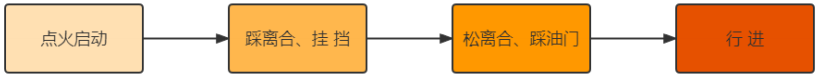
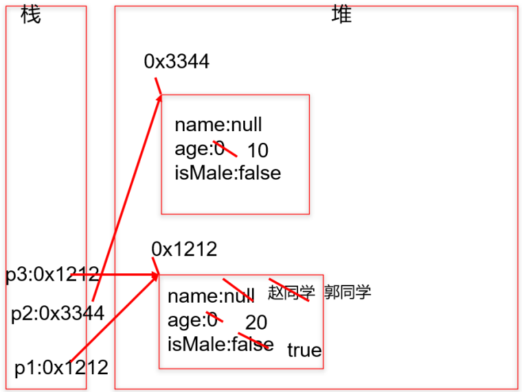
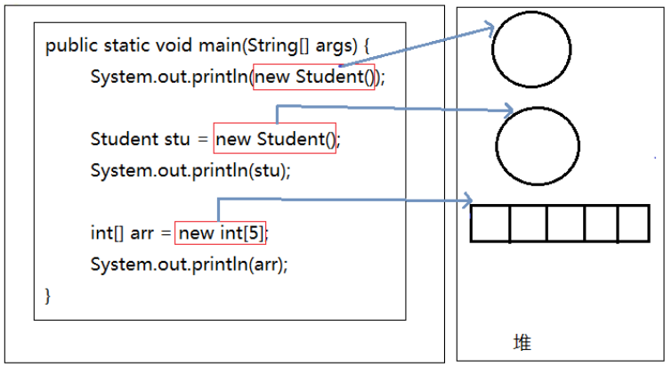
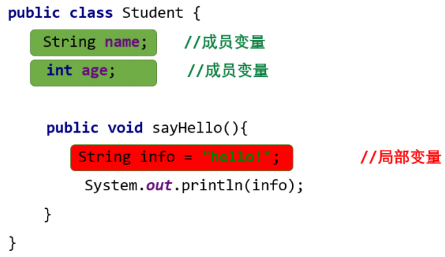
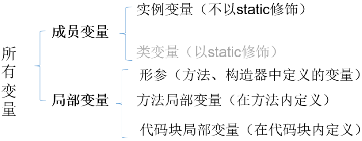
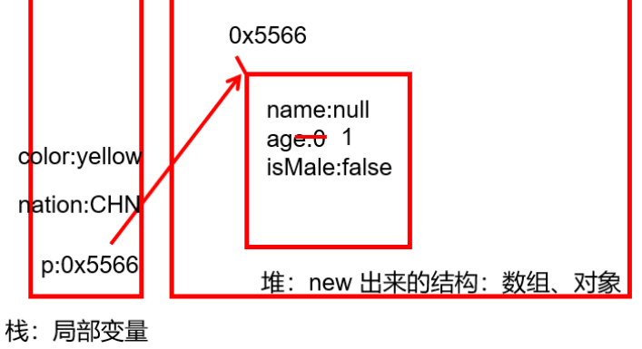

#  本章专题与脉络


学习面向对象内容的三条主线

- Java类及类的成员：（重点）属性、方法、构造器；（熟悉）代码块、内部类
- 面向对象的特征：封装、继承、多态、（抽象）
- 其他关键字的使用：this、super、package、import、static、final、interface、abstract等


# 一. 面向对象编程概述

---

## 01. 程序设计的思路

面向对象，是软件开发中的一类**编程风格、开发范式**。除了面向对象 ，还有面向过程 、 指令式编程和函数式编程 。在所有的编程范式中，我们接触最多的还是面向过程和面向对象两种。

> 类比：史书类型
>
> - 纪传体：以人物传记为中心，“本纪”叙述帝王，“世家”记叙王侯封国和特殊人物，“列传”记叙民间人物。
> - 编年体：按年、月、日顺序编写。
> - 国别体：是一部分国记事的历史散文，分载多国历史

早期先有面向过程思想，随着软件规模的扩大，问题复杂性的提高，面向过程的 弊端 越来越明显，出现了面向对象思想并成为目前主流的方式。

1. **面向过程**的程序设计思想（Process-Oriented Programming），简称**POP**

   - 关注的焦点是 过程 ：过程就是操作数据的步骤。如果某个过程的实现代码重复出现，那么就可以把这个过程抽取为一个 函数 。这样就可以大大简化冗余代码，便于维护。

   - 典型的语言：C语言

   - 代码结构：以 函数 为组织单位。是一种“ 执行者思维 ”，适合解决简单问题。扩展能力差、后期维护难度较大。

2. **面向对象**的程序设计思想（ Object Oriented Programming），简称**OOP**

   - 关注的焦点是 类 ：在计算机程序设计过程中，参照现实中事物，将事物的属性特征、行为特征抽象出来，用类来表示。

   - 典型的语言：Java、C#、C++、Python、Ruby和PHP等

   - 代码结构：以类为组织单位。每种事物都具备自己的 属性 和 行为/功能 。

   - 是一种“ 设计者思维 ”，适合解决复杂问题。代码扩展性强、可维护性高。

## 02. 由实际问题考虑如何设计程序

思考1：如何开车？

面向过程思想思考问题时，我们首先思考“ 怎么按步骤实现？ ”并将步骤对应成方法，一步一步，最终完成。 这个适合 简单任务 ，不需要 过多协作 的情况。针对如何开车，可以列出步骤：



面向过程适合简单、不需要协作的事务，重点关注如何执行。

思考2：如何造车？

造车太复杂，需要 很多协作 才能完成。此时我们思考的是“ 车怎么设计？ ”，而不是“怎么按特定步骤造车的问题”。这就是思维方式的转变，前者就是面向对象思想。所以，面向对象(Oriented-Object)思想更契合人的思维模式。

用面向对象思想思考“如何设计车”：


自然地，我们就会从“车由什么组成”开始思考。发现，车由如下结构组成：


我们找轮胎厂完成制造轮胎的步骤，发动机厂完成制造发动机的步骤，...；这样，大家可以同时进行车的制造，最终进行组装，大大提高了效率。但是，具体到轮胎厂的一个流水线操作，仍然是有步骤的，

还是离不开面向过程思维！

因此，**面向对象可以帮助我们从宏观上把握、从整体上分析整个系统。** 但是，具体到实现部分的微观操作（就是一个个方法），仍然需要面向过程的思路去处理。

>注意：
>
>- 面向过程和面向对象是相辅相成的。面向对象离不开面向过程！

类比举例1：


当需求单一，或者简单时，我们一步步去操作没问题，并且效率也挺高。

可随着需求的更改，功能的增多，发现需要面对每一个步骤很麻烦了，这时就开始思索，能不能把这些步骤和功能进行封装，封装时根据不同的功能，进行不同的封装，功能类似的封装在一起。这样结构就清晰了很多。用的时候，找到对应的类就可以了。这就是面向对象的思想。

类比举例2：人把大象装进冰箱

- 面向过程

  >1.打开冰箱
  >
  >2.把大象装进冰箱
  >
  >3.把冰箱门关住

- 面向对象

  ```
  人{
    打开（冰箱）{
    	冰箱.开门();
    }
    操作(大象){
    	大象.进入(冰箱);
    }
    关闭(冰箱){
    	冰箱.关门();
    }
  }
  
  冰箱{
    开门(){ }
    关门(){ }
  }
  
  大象{
  	进入(冰箱){ }
  }
  ```

  练习：抽象出下面系统中的“类”及其关系

  

## 03. 如何掌握这种思想？


# 二. Java语言的基本元素：类和对象

---

## 01. 引入

人认识世界，其实就是面向对象的。比如，我们认识一下美人鱼（都没见过）


经过“仔细学习”，发现美人鱼通常具备一些特征：

- 女孩
- 有鱼尾
- 美丽

这个总结的过程，其实是 抽象化 的过程。抽象出来的美人鱼的特征，可以归纳为一个 美人鱼类 。而图片中的都是这个类呈现出来的 具体的对象 。

## 02. 类和对象概述

类(Class) 和 对象(Object) 是面向对象的核心概念。

1. 什么是类
   - **类**：对一系列具有相同特征的事物的抽象描述，是抽象的 、概念上的定义。
2. 什么是对象
   - **对象**：实际存在的该类事物的 每个个体 ，是具体的 ，因而也称为 实例(instance) 。


可以理解为： 类 => 抽象概念的人 ； 对象 => 实实在在的某个人


3. 类与对象的关系错误理解

   > 曰：“白马非马，可乎？”
   >
   > 曰：“可。”
   >
   > 曰：“何哉？”
   >
   > 曰：“马者，所以命形也。白者，所以命色也。命色者，非命形也，故曰白马非马。”

## 03. 类的成员概述

> 面向对象程序设计的重点是 类的设计
>
> 类的设计，其实就是 类的成员的设计

- 现实世界的生物体，大到鲸鱼，小到蚂蚁，都是由最基本的细胞构成的。同理，Java代码世界是由诸多个不同功能的 类 构成的。

  

- 现实生物世界中的细胞又是由什么构成的呢？细胞核、细胞质、…

Java中用类class来描述事物也是如此。类，是一组相关 属性 和 行为 的集合，这也是类最基本的两个成员。

- 属性：该类事物的状态信息。对应类中的 成员变量
  - 成员变量 <=> 属性 <=> Field
- 行为：该类事物要做什么操作，或者基于事物的状态能做什么。对应类中的 成员方法
  - (成员)方法 <=> 函数 <=> Method


- 举例：

  

## 04. 面向对象完成功能的三步骤

步骤1：类的定义

- 类的定义使用关键字：class。格式如下：

  ```java
  [修饰符] class 类名{
    属性声明;
    方法声明;
  }
  ```

- 举例1：

  ```java
  public class Person {
    // 声明属性age
    int age;
    
    // 声明方法eat
    public void eat() {
      System.out.println("吃饭...");
    }
  }
  ```

- 举例2：

  ```java
  public class Dog{
    // 声明属性
    String type; // 种类
    String nickName; // 昵称
    String hostName; // 主人名称
  
    // 声明方法
    public void eat() { // 吃东西
      System.out.println("狗狗进食");
    }
  }
  
  
  public class Person{
    String name;
    char gender;
    Dog dog;
    // 喂宠物
    public void feed(){
      dog.eat();
    }
  }
  ```

步骤2：对象的创建


- 创建对象，使用关键字：new

- 创建对象语法：

  ```java
  // 方式1：给创建的对象命名
  // 把创建的对象用一个引用数据类型的变量保存起来，这样就可以反复使用这个对象了
  类名 对象名 = new 类名();
  
  // 方式2：
  new 类名() // 也称为匿名对象
  ```

- 举例：

  ```java
  class PersonTest {
    public static void main(String[] args) {
      Person p1 = new Person(); // 创建Person类的对象
      Dog d1 = new Dog(); // 创建Dog类的对象
    }
  }
  ```

步骤3：对象调用属性或方法

- 对象是类的一个**实例**，必然具备该类事物的属性和行为（即方法）。
- 使用" 对象名.属性 " 或 " 对象名.方法 "的方式访问对象成员（包括属性和方法）

举例1：

```java
// 声明Animal类
public class Animal { // 动物类
  public int legs;
  public void eat() {
    System.out.println("Eating.");
  }
  public void move() {
    System.out.println("Move.");
  }
}


// 声明测试类
public class AnimalTest {
  public static void main(String args[]) {
    // 创建对象
    Animal xb = new Animal();
    xb.legs = 4; // 访问属性
    System.out.println(xb.legs);
    xb.eat(); // 访问方法
    xb.move(); // 访问方法
  }
}
```

图示理解：


举例2：针对前面步骤1的举例2：类的实例化（创建类的对象）

```java
public class Game{
  public static void main(String[] args) {
    Person p = new Person();
    // 通过Person对象调用属性
    p.name = "康师傅";
    p.gender = '男';
    p.dog = new Dog(); // 给Person对象的dog属性赋值
    // 给Person对象的dog属性的type、nickname属性赋值
    p.dog.type = "柯基犬";
    p.dog.nickName = "小白";
    // 通过Person对象调用方法
    p.feed();
  }
}
```

## 05. 匿名对象(anonymous object)

- 我们也可以不定义对象的句柄，而直接调用这个对象的方法。这样的对象叫做匿名对象。
  - 如：new Person().shout();
- 使用情况
  - 如果一个对象只需要进行一次方法调用，那么就可以使用匿名对象。
  - 我们经常将匿名对象作为实参传递给一个方法调用。


# 三. 对象的内存解析

---

## 01. JVM内存结构划分

HotSpot Java虚拟机的架构图如下。其中我们主要关心的是运行时数据区部分（Runtime Data Area）。


其中：

堆（Heap） ：此内存区域的唯一目的就是存放对象实例，几乎所有的对象实例都在这里分配内存。这一点在Java虚拟机规范中的描述是：所有的对象实例以及数组都要在堆上分配。

栈（Stack） ：是指虚拟机栈。虚拟机栈用于存储局部变量等。局部变量表存放了编译期可知长度的各种基本数据类型（boolean、byte、char、short、int、float、long、double）、对象引用（reference类型，它不等同于对象本身，是对象在堆内存的首地址）。 方法执行完，自动释放。

方法区（Method Area） ：用于存储已被虚拟机加载的类信息、常量、静态变量、即时编译器编译后的代码等数据。

## 02. 对象内存解析

举例：

```java
class Person { //类：人
  String name;
  int age;
  boolean isMale;
}

public class PersonTest { //测试类
  public static void main(String[] args) {
    Person p1 = new Person();
    p1.name = "赵同学";
    p1.age = 20;
    p1.isMale = true;
    Person p2 = new Person();
    p2.age = 10;
    Person p3 = p1;
    p3.name = "郭同学";
  }
}
```

内存解析图：



> 说明：
>
> - 堆：凡是new出来的结构(对象、数组)都放在堆空间中。
> - 对象的属性存放在堆空间中。
> - 创建一个类的多个对象（比如p1、p2），则每个对象都拥有当前类的一套"副本"（即属性）。当通过一个对象修改其属性时，不会影响其它对象此属性的值。
> - 当声明一个新的变量使用现有的对象进行赋值时（比如p3 = p1），此时并没有在堆空间中创建新的对象。而是两个变量共同指向了堆空间中同一个对象。当通过一个对象修改属性时，会影响另外一个对象对此属性的调用。

面试题：对象名中存储的是什么呢

答：对象地址

```java
public class StudentTest{
  public static void main(String[] args){
    System.out.println(new Student()); // Student@7852e922
    Student stu = new Student();
    System.out.println(stu); // Student@4e25154f
    int[] arr = new int[5];
    System.out.println(arr); // [I@70dea4e
  }
}
```

直接打印对象名和数组名都是显示“类型@对象的hashCode值"，所以说类、数组都是引用数据类型，引用数据类型的变量中存储的是对象的地址，或者说指向堆中对象的首地址。



## 03. 练习

根据代码，画出内存图

```java
class Car {
  String color = "red";
  int num = 4;
  void show() {
    System.out.println("color=" + color + ",num=" + num);
  }
}

class CarTest {
  public static void main(String[] args) {
    Car c1 = new Car(); // 建立对象c1
    Car c2 = new Car(); // 建立对象c2
    c1.color = "blue"; // 对对象的属性进行修改
    c1.show(); // 使用对象的方法
    c2.show();
  }
}
```


# 四. 类的成员之一：成员变量field

---

## 01. 如何声明成员变量

- 语法格式：

  ```java
  [修饰符1] class 类名 {
  	[修饰符2] 数据类型 成员变量名 [= 初始化值];
  }
  ```

- 说明：

  - 位置要求：必须在类中，方法外
  - 修饰符2（暂不考虑）
    - 常用的权限修饰符有：private、protected、public、缺省(不写权限修饰符)
    - 其他修饰符：static、final
  - 数据类型
    - 任何基本数据类型(如int、Boolean)或任何引用数据类型
  - 成员变量名
    - 属于标识符，符合命名规则和规范即可。
  - 初始化值
    - 根据情况，可以显式赋值；也可以不赋值，使用默认值

- 示例：

  ```java
  public class Person {
    private int age; // 声明private变量 age
    public String name = "Lina"; // 声明public变量 name
  }
  ```

## 02. 成员变量 vs 局部变量

1. 变量的分类：成员变量与局部变量

   - 在方法体外，类体内声明的变量称为成员变量。
   - 在方法体内部等位置声明的变量称为局部变量。

   

   

> 其中，static可以将成员变量分为两大类，静态变量和非静态变量。其中静态变量又称为类变量，
>
> 非静态变量又称为实例变量或者属性。接下来先学习实例变量。

2. 成员变量 与 局部变量 的对比

   - 相同点
     - 变量声明的格式相同： 数据类型 变量名 = 初始化值
     - 变量必须先声明、后初始化、再使用。
     - 变量都有其对应的作用域。只在其作用域内是有效的
   - 不同点
     - 声明位置和方式
       1. 实例变量：在类中方法外
       2. 局部变量：在方法体{}中或方法的形参列表、代码块中
     - 在内存中存储的位置不同
       1. 实例变量：堆
       2. 局部变量：栈
     - 生命周期
       1. 实例变量：和对象的生命周期一样，随着对象的创建而存在，随着对象被GC回收而消亡， 而且每一个对象的实例变量是独立的。 
       2. 局部变量：和方法调用的生命周期一样，每一次方法被调用而在存在，随着方法执行的结束而消亡， 而且每一次方法调用都是独立。
     - 作用域
       1. 实例变量：通过对象就可以使用，本类中直接调用，其他类中“对象.实例变量”
       2. 局部变量：出了作用域就不能使用
     - 修饰符（后面来讲）
       1. 实例变量：public、protected、private、final、volatile、transient等
       2. 局部变量：final
     - 默认值
       1. 实例变量：有默认值
       2. 局部变量：没有，必须手动初始化。其中的形参比较特殊，靠实参给它初始化。

3. 对象属性的默认初始化赋值

   当一个对象被创建时，会对其中各种类型的成员变量自动进行初始化赋值。

   | 成员变量类型 | 初始值             |
   | ------------ | ------------------ |
   | byte         | 0                  |
   | short        | 0                  |
   | int          | 0                  |
   | long         | 0L                 |
   | float        | 0.0F               |
   | double       | 0.0                |
   | char         | 0 或写为：'\u0000' |
   | boolean      | false              |
   | 引用类型     | null               |

4. 举例

   ```java
   class Person { // 人类
     // 1.属性
     String name; // 姓名
     int age = 1; // 年龄
     boolean isMale; // 是否是男性
     public void show(String nation) {
       // nation:局部变量
       String color; // color:局部变量
       color = "yellow";
     }
   }
   
   // 测试类
   class PersonTest {
     public static void main(String[] args) {
       Person p = new Person();
       p.show("CHN");
     }
   }
   ```

   


