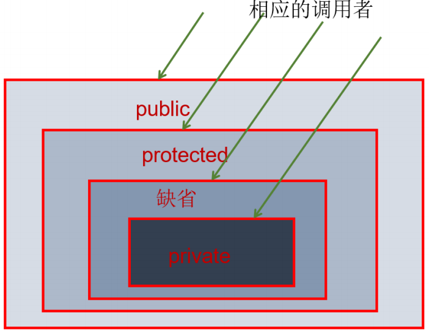
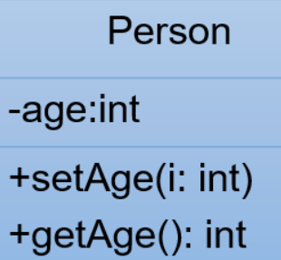
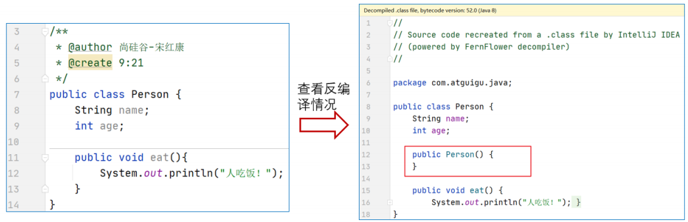
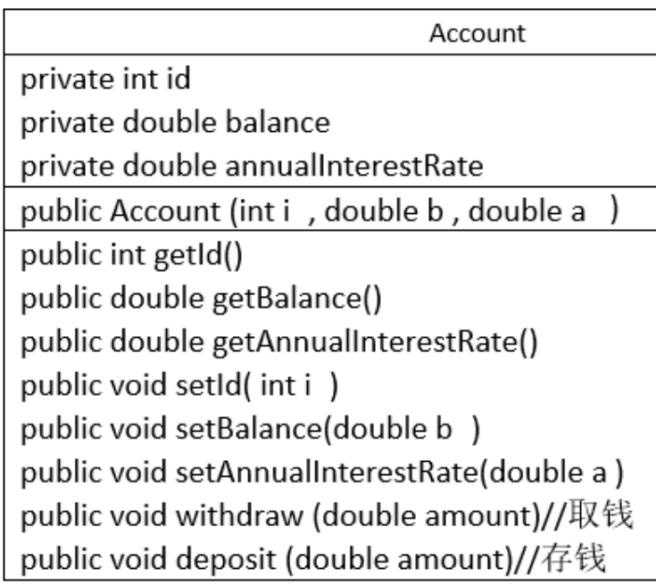
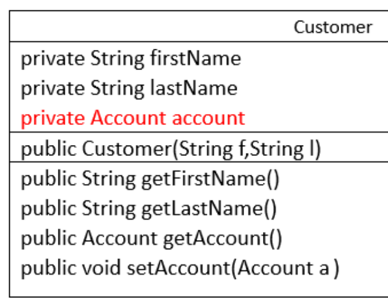
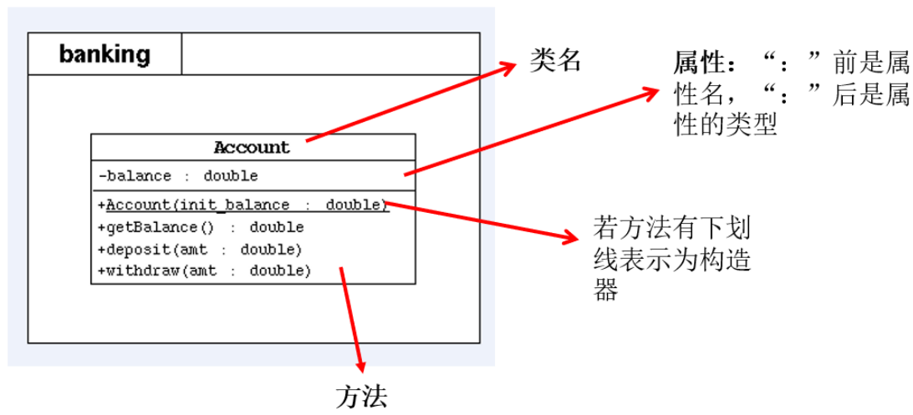
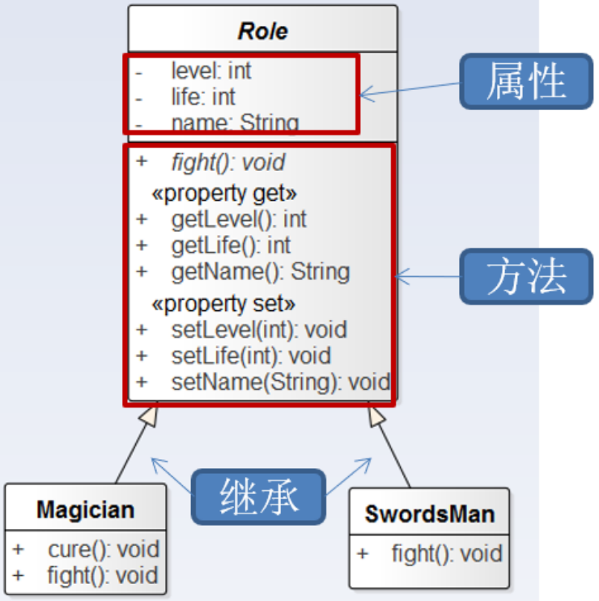

# 一. 面向对象特征一：封装性

---

## 01. 为什么需要封装？

- 我要用洗衣机，只需要按一下开关和洗涤模式就可以了。有必要了解洗衣机内部的结构吗？有必要碰电动机吗？
- 我要开车，我不需要懂离合、油门、制动等原理和维修也可以驾驶。
- 客观世界里每一个事物的内部信息都隐藏在其内部，外界无法直接操作和修改，只能通过指定的方式进行访问和修改。

随着我们系统越来越复杂，类会越来越多，那么类之间的访问边界必须把握好，面向对象的开发原则要遵循“ 高内聚、低耦合 ”。

> 高内聚、低耦合是软件工程中的概念，也是UNIX 操作系统设计的经典原则。
>
> 内聚，指一个模块内各个元素彼此结合的紧密程度；耦合指一个软件结构内不同模块之间互连程度的度量。内聚意味着重用和独立，耦合意味着多米诺效应牵一发动全身。

而“高内聚，低耦合”的体现之一：

- 高内聚：类的内部数据操作细节自己完成，不允许外部干涉。
- 低耦合：仅暴露少量的方法给外部使用，尽量方便外部调用。

## 02. 何为封装性？

所谓封装，就是把客观事物封装成抽象概念的类，并且类可以把自己的数据和方法只向可信的类或者对象开放，向没必要开放的类或者对象隐藏信息。

**通俗的讲，把该隐藏的隐藏起来，该暴露的暴露出来。这就是封装性的设计思想。**

## 03. Java如何实现数据封装

- 实现封装就是控制类或成员的可见性范围。这就需要依赖访问控制修饰符，也称为权限修饰符来控制。

- 权限修饰符： public 、 protected 、 缺省 、 private 。具体访问范围如下：

  | 修饰符    | 本类内部 | 本包内 | 其他包的子类 | 其他包非子类 |
  | --------- | -------- | ------ | ------------ | ------------ |
  | private   | 允许     | 不允许 | 不允许       | 不允许       |
  | 缺省      | 允许     | 允许   | 不允许       | 不允许       |
  | protected | 允许     | 允许   | 允许         | 不允许       |
  | public    | 允许     | 允许   | 允许         | 允许         |

  - 具体修饰的结构：
    - 类：只能使用public、缺省
    - 成员变量、成员方法、构造器、成员内部类：public、protected、缺省、private

  

## 04. 封装性的体现

1.  成员变量/属性私有化

   概述：**私有化类的成员变量，提供公共的get和set方法，对外暴露获取和修改属性的功能**。

   实现步骤：

   - 使用private修饰成员变量

     ```java
     private 数据类型 变量名;
     ```

     代码如下：

     ```java
     public class Person {
       private String name;
       private int age;
       private boolean marry;
     }
     ```


   - 提供 getXxx 方法 / setXxx 方法，可以访问成员变量，代码如下：

     ```java
     public class Person {
       private String name;
       private int age;
       private boolean marry;
     
       public void setName(String n) {
         name = n;
       }
       public String getName() {
         return name;
       }
       public void setAge(int a) {
         age = a;
       }
       public int getAge() {
         return age;
       }
       public void setMarry(boolean m){
         marry = m;
       }
       public boolean isMarry(){
         return marry;
       }
     }
     ```

   - 测试：

     ```java
     public class PersonTest {
       public static void main(String[] args) {
         Person p = new Person();
         // 实例变量私有化，跨类是无法直接使用的
         /* 
         	p.name = "张三";
         	p.age = 23;
         	p.marry = true;
         */
         p.setName("张三");
         System.out.println("p.name = " + p.getName());
         p.setAge(23);
         System.out.println("p.age = " + p.getAge());
         p.setMarry(true);
         System.out.println("p.marry = " + p.isMarry());
       }
     }
     ```

   - **成员变量封装的好处：**
     - 让使用者只能通过事先预定的方法来访问数据，从而可以在该方法里面加入控制逻辑，限制对成员变量的不合理访问。还可以进行数据检查，从而有利于保证对象信息的完整性。
     - 便于修改，提高代码的可维护性。主要说的是隐藏的部分，在内部修改了，如果其对外可以的访问方式不变的话，外部根本感觉不到它的修改。例如：Java8=>Java9，String从char[]转为byte[]内部实现，而对外的方法不变，我们使用者根本感觉不到它内部的修改。

2.  私有化方法

    ```java
    // 自定义的操作数组的工具类
    public class ArrayUtil {
      // 求int型数组的最大值
      public int max(int[] arr) {
        int maxValue = arr[0];
        for(int i = 1;i < arr.length;i++){
          if(maxValue < arr[i]){
            maxValue = arr[i];
          }
        }
        return maxValue;
      }
      // 求int型数组的最小值
      public int min(int[] arr){
        int minValue = arr[0];
        for(int i = 1;i < arr.length;i++){
          if(minValue > arr[i]){
            minValue = arr[i];
          }
        }
        return minValue;
      }
      // 求int型数组的总和
      public int sum(int[] arr) {
        int sum = 0;
        for(int i = 0;i < arr.length;i++){
          sum += arr[i];
        }
        return sum;
      }
      // 求int型数组的元素的平均值
      public int avg(int[] arr) {
        int sumValue = sum(arr);
        return sumValue / arr.length;
      }
      // 创建一系列重载的上述方法
      // public double max(double[] arr){}
      // public float max(float[] arr){}
      // public byte max(byte[] arr){}
    
      // 遍历数组
      public void print(int[] arr) {
        for(int i = 0;i < arr.length;i++){
          System.out.print(arr[i] + " ");
        }
        System.out.println();
      }
      // 复制数组arr
      public int[] copy(int[] arr) {
        int[] arr1 = new int[arr.length];
        for(int i = 0;i < arr.length;i++){
          arr1[i] = arr[i];
        }
        return arr1;
      }
      // 反转数组
      public void reverse(int[] arr) {
        for(int i = 0,j = arr.length - 1;i < j;i++,j--){
          int temp = arr[i];
          arr[i] = arr[j];
          arr[j] = temp;
        }
      }
      /**
      *
      * @Description 数组的排序
      * @param arr
      * @param desc 指明排序的方式。 ascend:升序 descend:降序
      */
      public void sort(int[] arr,String desc) {
        if ("ascend".equals(desc)) {
          for (int i = 0; i < arr.length - 1; i++) {
            for (int j = 0; j < arr.length - 1 - i; j++) 				{
              if (arr[j] > arr[j + 1]) {
                swap(arr,j,j+1);
              }
            }
          }
        }
        else if ("descend".equals(desc)) {
          for (int i = 0; i < arr.length - 1; i++) {
            for (int j = 0; j < arr.length - 1 - i; j++){
              if (arr[j] < arr[j + 1]) {
                swap(arr,j,j+1);
              }
            }
          }
        }else{
          System.out.println("您输入的排序方式有误！");
        }
      }
      private void swap(int[] arr,int i,int j){
        int temp = arr[i];
        arr[i] = arr[j];
        arr[j] = temp;
      }
      
      /**
      * @Description 查找指定的value值在arr数组中出现的位置
      * @param arr
      * @param value
      * @return 返回value值出现的位置 或 -1：未找到
      */
      public int getValue(int[] arr, int value) {
        //方法：线性查找
        for(int i = 0;i < arr.length;i++){
          if(value == arr[i]){
            return i;
          }
        }
        return - 1;
      }
    }
    ```

> 注意：
>
> - 开发中，一般成员实例变量都习惯使用private修饰，再提供相应的public权限的get/set方法访问。
> - 对于final的实例变量，不提供set()方法。（后面final关键字的时候讲）
> - 对于static final的成员变量，习惯上使用public修饰。

## 05. 练习

1. 创建程序：在其中定义两个类：Person和PersonTest类。定义如下：用setAge()设置人的合法年龄(0~130)，用getAge()返回人的年龄。在PersonTest类中实例化Person类的对象b，调用setAge()和getAge()方法，体会Java的封装性。

   

2. 自定义图书类。设定属性包括：书名bookName，作者author，出版社名publisher，价格price；方法包括：相应属性的get/set方法，图书信息介绍等。


# 二. 类的成员之三：构造器constructor

---

我们new完对象时，所有成员变量都是默认值，如果我们需要赋别的值，需要挨个为它们再赋值，太麻烦了。我们能不能在new对象时，直接为当前对象的某个或所有成员变量直接赋值呢？

可以，Java给我们提供了 构造器（Constructor) ，也称为 构造方法 。

## 01. 构造器的作用

new对象，并在new对象的时候为实例变量赋值。

举例：`Person p = new Person(“Peter”,15);`

解释：如同我们规定每个“人”一出生就必须先洗澡，我们就可以在“人”的构造器中加入完成“洗澡”的程序代码，于是每个“人”一出生就会自动完成“洗澡”，程序就不必再在每个人刚出生时一个一个地告诉他们要“洗澡”了。

## 02. 构造器的语法格式

```java
[修饰符] class 类名{
  [修饰符] 构造器名(){
    // 实例初始化代码
  }
  [修饰符] 构造器名(参数列表){
    // 实例初始化代码
  }
}
```

说明：

1.  **构造器名必须与它所在的类名必须相同**。
2. 它没有返回值，所以不需要返回值类型，也不需要void。
3. 构造器的修饰符只能是权限修饰符，不能被其他任何修饰。比如，不能被static、final、synchronized、abstract、native修饰，不能有return语句返回值。

代码如下：

```java
public class Student {
  private String name;
  private int age;
  // 无参构造
  public Student() {}
  // 有参构造
  public Student(String n,int a) {
    name = n;
    age = a;
  }
  public String getName() {
    return name;
  }
  public void setName(String n) {
    name = n;
  }
  public int getAge() {
    return age;
  }
  public void setAge(int a) {
    age = a;
  }
  public String getInfo(){
    return "姓名：" + name +"，年龄：" + age;
  }
}
```

## 03. 使用说明

- 当我们没有显式的声明类中的构造器时，系统会默认提供一个无参的构造器并且该构造器的修饰符默认与类的修饰符相同

  

- 当我们显式的定义类的构造器以后，系统就不再提供默认的无参的构造器了。
- 在类中，至少会存在一个构造器。
- **构造器是可以重载的**。

## 04. 练习

1. 编写两个类，TriAngle和TriAngleTest，其中TriAngle类中声明私有的底边长base和高height，同时声明公共方法访问私有变量。此外，提供类必要的构造器。另一个类中使用这些公共方法，计算三角形的面积。

   ```java
   public class TriAngle {
     private double base;
     private double height;
     
     public double getBase() {
       return base;
     }
     public setBase(double b) {
       base = b;
     }
     public double getHeight() {
       return height;
     }
     public double setHeight(double h) {
       height = h;
     }
     public TriAngle() {}
     public double findArea() {
       return base * height / 2;
     }
   }
   
   public class TriAngleTest {
     public static void main(String[] args) {
       TriAngle t1 = new TriAngle();
       t1.setHeight(2.2);
       t1.setBase(2.3);
       System.out.println("面积：" + t1.findArea());
     }
   }
   ```

2. 定义Student类,有4个属性： String name; int age; String school; String major;
   - 定义Student类的3个构造器:
     - 第一个构造器Student(String n, int a)设置类的name和age属性；
     - 第二个构造器Student(String n, int a, String s)设置类的name, age 和school属性；
     - 第三个构造器Student(String n, int a, String s, String m)设置类的name, age ,school和major属性；
   - 在main方法中分别调用不同的构造器创建的对象，并输出其属性值。

3. 写一个名为Account的类模拟账户。
   - 该类的属性和方法如下图所示。该类包括的属性：账号id，余额balance，年利annualInterestRate。
   - 包含的方法：访问器方法（getter和setter方法），取款方法withdraw()，存款方法deposit()。

​	**提示：**在提款方法withdraw中，需要判断用户余额是否能够满足提款数额的要求，如果不能，应给出提示。

```java
public class Account {
  private int id; // 帐号
  private double balance; // 余额
  private double annualInterestRate; // 年利率

  public Account(int i, double b, double a) {
    id = i;
    balance = b;
    annualInterestRate = a;
  }
  public int getId() {
    return id;
  }
  public void setId(int id) {
    id = id;
  }
  public double getBalance() {
    return balance;
  }
  public void setBalance(double balance) {
    balance = balance;
  }
  public double getAnnualInterestRate() {
    return annualInterestRate;
  }
  public void setAnnualInterestRate(double annualInterestRate) {
    annualInterestRate = annualInterestRate;
  }
  public Account withdraw(double amount) {
    System.out.println("取款金额：" + amount);
    if (amount <= balance) {
      balance -= amount;
      System.out.println("取款成功，余额为：" + balance);
    } else {
      System.out.println("余额不足，取款失败");
    }
    return this;
  }
  public Account deposit(double amount) {
    if (amount > 0) {
      System.out.println("存款金额：" + amount);
      balance += amount;
      System.out.println("存款成功，余额为：" + balance);
    } else {
      System.out.println("存款失败");
    }
    return this;
  }
}
```

创建Customer类。

- 声明三个私有对象属性：firstName、lastName和account。 b. 声明一个公有构造器，这个构造器带有两个代表对象属性的参数（f和l）。
- 声明两个公有存取器来访问该对象属性，方法getFirstName和getLastName返回相应的属性。 
- 声明setAccount 方法来对account属性赋值。 e. 声明getAccount 方法以获取account属性。



```java
public class Customer {
  private String firstName;
  private String lastName;
  private Account account;

  public Customer(String firstName, String lastName) {
    firstName = firstName;
    lastName = lastName;
  }
  public String getFirstName() {
    return firstName;
  }
  public String getLastName() {
    return lastName;
  }
  public void setAccount(Account a) {
    account = a;
  }
  public Account getAccount() {
    return account;
  }
}
```

写一个测试程序。

- 创建一个Customer ，名字叫 Jane Smith, 他有一个账号为1000，余额为2000元，年利率为 1.23％ 的账户。
- 对Jane Smith操作。 存入 100 元，再取出960元。再取出2000元。 打印出Jane Smith 的基本信息。

```java
public class CustomerTest {
  public static void main(String[] args) {
    Account account = new Account(1000, 2000, 1.23);
    Customer customer = new Customer("Smith", "Jones");

    customer.setAccount(account);
    customer.getAccount().deposit(100).withdraw(960).withdraw(2000);
    System.out.println("Customer [Smith, Jane] has a account: id is " + customer.getAccount().getId() + ", annualInterestRate is " + customer.getAccount().getAnnualInterestRate() +"％, balance\n" +
                       "is " + customer.getAccount().getBalance());
  }
}
```


# 三. 阶段性知识补充

---

## 01. 类中属性赋值过程

1. 、在类的属性中，可以有哪些位置给属性赋值？
   - 默认初始化
   - 显式初始化
   - 构造器中初始化
   - 通过 `对象.属性` 或 `对象.方法` 的方式，给属性赋值
2. 这些位置执行的先后顺序是怎样？
   - 顺序：① - ② - ③ - ④
   - 上述中的①、②、③在对象初始化创建过程中，只执行一次。
   - ④ 是在对象创建后执行的，可以根据需求多次执行。

## 02. JavaBean

- JavaBean是Java编程语言中的一种**可重用**的软件**组件**，通常用于封装多个对象和操作这些对象的方法。

  - 好比你做了一个扳手，这个扳手会在很多地方被拿去用。这个扳手也提供多种功能(你可以拿这个扳手扳、锤、撬等等)，而这个扳手就是一个组件。

- **所谓JavaBean，是指符合如下标准的Java类：**

  - 类是公共的
  - 有一个无参的公共的构造器
  - 有属性，且有对应的get、set方法

- 用户可以使用JavaBean将功能、处理、值、数据库访问和其他任何可以用Java代码创造的对象进行打包，并且其他的开发者可以通过内部的JSP页面、Servlet、其他JavaBean、applet程序或者应用来使用这些对象。用户可以认为JavaBean提供了一种随时随地的复制和粘贴的功能，而不用关心任何改变。

- 《Think in Java》中提到，JavaBean最初是为Java GUI的可视化编程实现的。你拖动IDE构建工具创建一个GUI 组件（如多选框），其实是工具给你创建Java类，并提供将类的属性暴露出来给你修改调整，将事件监听器暴露出来。

- 示例

  ```java
  public class JavaBean {
    private String name; // 属性一般定义为private
    private int age;
    
    public JavaBean() { }
    
    public int getAge() {
      return age;
    }
    public void setAge(int a) {
      age = a;
    }
    public String getName() {
      return name;
    }
    public void setName(String n) {
      name = n;
    }
  }
  ```

## 03. UML类图

- UML（Unified Modeling Language，统一建模语言），用来描述软件模型和架构的图形化语言。

- 常用的UML工具软件有 PowerDesinger 、 Rose 和 Enterprise Architect 。

- UML工具软件不仅可以绘制软件开发中所需的各种图表，还可以生成对应的源代码。

- 在软件开发中，使用 UML类图 可以更加直观地描述类内部结构（类的属性和操作）以及类之间的关系（如关联、依赖、聚合等）。

  - +表示public类型， -表示private类型，#表示protected类型

  - 方法的写法: 方法的类型(+、-) 方法名(参数名： 参数类型)：返回值类型（没有表示无返回值）

    - 示例：

    ```
    [+/-]methodName(arg01: int): int
    ```

  - 斜体表示抽象方法或类。






# 四. 关键词：this

---

## 01. this是什么？

- 在Java中，this关键字不算难理解，它的作用和其词义很接近。
  - **在实例方法（非static的方法）内部使用时，表示调用该方法的对象**。
  - **在构造器内部使用时，this表示该构造器正在初始化的对象**。
- this可以调用的结构：成员变量、方法和构造器

## 02. 什么时候使用this

1. **实例方法或构造器中使用当前对象的成员**

   - 在实例方法或构造器中，如果使用当前类的成员变量或成员方法可以在其前面添加this，增强程序的可读性。不过，通常我们都习惯省略this。

   - 但是，当形参与成员变量同名时，如果在方法内或构造器内需要使用成员变量，必须添加this来表明该变量是类的成员变量。即：我们可以用this来区分`成员变量`和`局部变量`。比如：

     

   - 另外，使用this访问属性和方法时，如果在本类中未找到，会从父类中查找。这个在继承中会讲到。
   - 举例1：

   ```java
   // 定义Person类
   class Person{		
     private String name;	
     private int age;			
     public Person(String name,int age){	
       this.name = name;   
       this.age = age;  
     }
     public void setName(String name){
       this.name = name;
     }
     public void setAge(int age){
       this.age = age;
     }
     public void getInfo(){	
       System.out.println("姓名：" + name) ;
       this.speak();
     }
     public void speak(){
       System.out.println(“年龄：” + this.age);	
     }
   }
   ```

   - 举例2：

   ```java
   public class Rectangle {
     int length;
     int width;
   
     public int area() {
       return this.length * this.width;
     }
   
     public int perimeter(){
       return 2 * (this.length + this.width);
     }
   
     public void print(char sign) {
       for (int i = 1; i <= this.width; i++) {
         for (int j = 1; j <= this.length; j++) {
           System.out.print(sign);
         }
         System.out.println();
       }
     }
   
     public String getInfo(){
       return "长：" + this.length + "，宽：" + this.width +"，面积：" + this.area() +"，周长：" + this.perimeter();
     }
   }
   ```

   - 测试类：

   ```java
   public class TestRectangle {
     public static void main(String[] args) {
       Rectangle r1 = new Rectangle();
       Rectangle r2 = new Rectangle();
   
       System.out.println("r1对象：" + r1.getInfo());
       System.out.println("r2对象：" + r2.getInfo());
   
       r1.length = 10;
       r1.width = 2;
       System.out.println("r1对象：" + r1.getInfo());
       System.out.println("r2对象：" + r2.getInfo());
   
       r1.print('#');
       System.out.println("---------------------");
       r1.print('&');
   
       System.out.println("---------------------");
       r2.print('#');
       System.out.println("---------------------");
       r2.print('%');
     }
   }
   ```

2. **同一个类中构造器相互调用**

   - this可以作为一个类中构造器相互调用的特殊格式。
     - this()：调用本类的无参构造器
     - this(实参列表)：调用本类的有参构造器

   ```java
   public class Student {
     private String name;
     private int age;
   
     // 无参构造
     public Student() {
       // this("",18);//调用本类有参构造器
     }
   
     // 有参构造
     public Student(String name) {
       this();//调用本类无参构造器
       this.name = name;
     }
     // 有参构造
     public Student(String name,int age){
       this(name);//调用本类中有一个String参数的构造器
       this.age = age;
     }
   
     public String getName() {
       return name;
     }
     public void setName(String name) {
       this.name = name;
     }
     public int getAge() {
       return age;
     }
     public void setAge(int age) {
       this.age = age;
     }
   
     public String getInfo(){
       return "姓名：" + name +"，年龄：" + age;
     }
   }
   ```

   > 注意：
   >
   > - **this调用，必须放在构造器的方法体中的第一行**。
   >   - 推论：在类的一个构造器中，最多只能声明一个"this(参数列表)"
   > - **不能出现递归调用**。比如，调用自身构造器。
   >   - 推论：如果一个类中声明了n个构造器，则最多有 n - 1个构造器中使用了"this(形参列表)"

3. 


